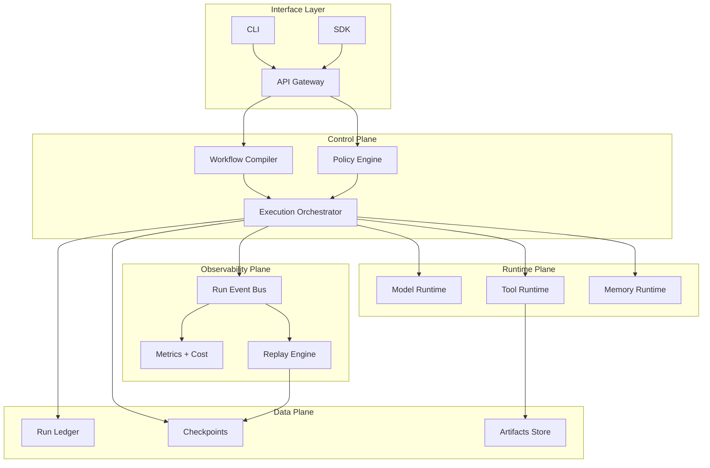
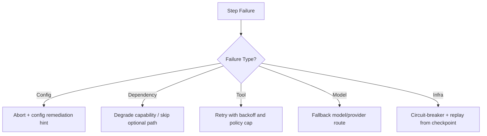
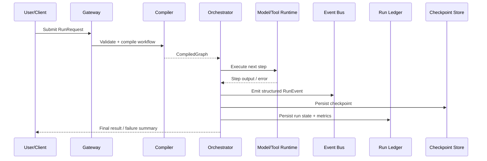
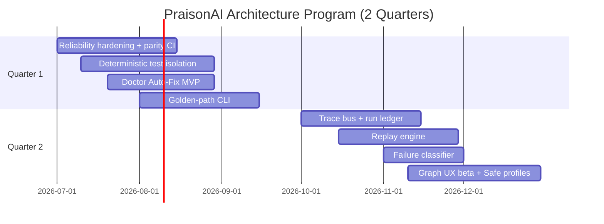

# PraisonAI Architecture

> **Last updated:** 2026-06-24
>
> Strategic architecture document for PraisonAI — a multi-agent AI framework.
> Covers system design, runtime architecture, data contracts, reliability,
> observability, and the 2-quarter road map.

---

## Table of Contents

1. [Executive Summary](#1-executive-summary)
2. [System Overview](#2-system-overview)
3. [Layered Architecture](#3-layered-architecture)
4. [Core Data Contracts](#4-core-data-contracts)
5. [Reliability by Design](#5-reliability-by-design)
6. [Observability & Telemetry](#6-observability--telemetry)
7. [Replay & Checkpointing](#7-replay--checkpointing)
8. [Implementation Roadmap](#8-implementation-roadmap)
9. [Success Metrics](#9-success-metrics)

---

## 1. Executive Summary

PraisonAI is a multi-agent AI framework with broad capability surface across
Python, TypeScript, and Rust SDKs. The framework's core strength is its
feature breadth — agent abstractions, integrations, workflows, and active
release cadence.

The strategic bet for the next two quarters is building a **Reliability + 
Orchestration + Observability** core to unlock adoption and trust:

| Dimension | Current State | Target |
|-----------|--------------|--------|
| Reliability | Cross-platform mismatches, optional dep fragility | Deterministic gating, adapter abstraction, parity CI |
| Determinism | Flaky tests, global state collisions | Isolated test fixtures, traceable tenant IDs |
| Developer UX | Complex onboarding, implicit config | Golden-path CLI, Doctor Auto-Fix |
| Observability | Minimal runtime tracing | Structured event bus, replay engine, failure classifier |

### Design Principles

- **Deterministic by default**, flexible by opt-in
- **Policy-enforced execution boundaries** at every layer
- **Structured events** for all lifecycle transitions
- **Capability isolation** per agent and per tool

---

## 2. System Overview

```text
User/SDK/CLI
  → Workflow Compiler (graph + policy + schemas)
    → Execution Orchestrator (state machine, retries, fallbacks)
      → Tool Runtime (sandbox + approval + capability scope)
      → Model Runtime (provider abstraction + rate/timeout policy)
    → Observability Bus (trace events + metrics + cost)
    → Replay Engine (checkpoint + deterministic re-run)
    → Persistence (session, memory, artifacts, run ledger)
```

### Runtime Components

| Component | Responsibility | Interface |
|-----------|---------------|-----------|
| API/CLI Gateway | Accepts run requests, validates config/profile | `RunRequest`, `RunProfile` |
| Workflow Compiler | Converts YAML/DSL to normalized execution graph | `CompiledGraph` |
| Orchestrator | Executes graph state machine with retries/fallbacks | `ExecutionState`, `StepTransition` |
| Tool Runtime | Runs tools with approval/sandbox policies | `ToolCall`, `ToolResult` |
| Model Runtime | Provider routing, timeout, budget control | `ModelRequest`, `ModelResponse` |
| Observability Bus | Streams structured events + metrics | `RunEvent` schema |
| Replay Engine | Restarts from checkpoint with deterministic inputs | `ReplayRequest` |

### Existing Architecture (Python Core SDK)

The Python core SDK (`praisonaiagents`) is the primary runtime and lives at
`src/praisonai-agents/praisonaiagents/`. Following the protocol-driven design,
core protocols and base classes live here; heavy/optional implementations live
in the `praisonai` wrapper. Key modules:

- `agent/` — Agent base class and mixins (chat, code, realtime, audio, vision,
  handoff, loop detection, etc.)
- `agents/` — Multi-agent orchestration (`agents.py`, autoagents, delegator)
- `llm/` — Model runtime with provider routing, rate limiting, failover,
  error classification (`error_classifier.py`, `failover.py`, `rate_limiter.py`)
- `tools/` — Tool runtime with circuit breaker, approval, retry, health monitor
- `memory/` — Memory runtime (in-memory, SQLite, Mem0/MongoDB adapters)
- `knowledge/` — Knowledge management (indexing, retrieval, chunking, rerank)
- `workflows/` — Workflow engine (YAML/SDK-based orchestration)
- `telemetry/` — Observability, performance monitoring, token tracking
- `escalation/` — Doom-loop detection, loop guard, escalation pipeline
- `skills/` — Skill/capability system
- `mcp/` — MCP protocol support
- `checkpoints/`, `replay/`, `snapshot/` — Checkpointing and replay primitives
- `bus/`, `trace/`, `streaming/` — Event bus, trace context, streaming events
- `policy/`, `sandbox/`, `approval/`, `guardrails/` — Execution-boundary controls
- `ui/a2a/`, `ui/a2ui/`, `ui/agui/` — Agent-to-agent and agent-to-UI protocols

### Multi-SDK Layout

All packages live under `src/`:

- **Python core SDK** — Primary runtime, `praisonaiagents`
  (`src/praisonai-agents/praisonaiagents/`)
- **Python wrapper** — CLI, UI, heavy/optional implementations, `praisonai`
  (`src/praisonai/praisonai/`), including `cli/`, `ui/`, `replay/`,
  `sandbox/`, `observability/`, `gateway/`, `persistence/`
- **TypeScript SDK** — JS/TS runtime (`src/praisonai-ts/`)
- **Rust SDK** — High-performance Rust runtime (`src/praisonai-rust/`)
- **Platform** — Multi-tenant platform services (`src/praisonai-platform/`)

> **CLI** and **UI** are not top-level packages — they live inside the Python
> wrapper at `src/praisonai/praisonai/cli/` and `src/praisonai/praisonai/ui/`.

### Per-Package Architecture

This document is the single source of truth for the **cross-cutting** system
roadmap (reliability, orchestration, observability) which spans all SDKs.
Package-specific details are maintained alongside each package:

| Package | Path | Local reference |
|---------|------|-----------------|
| Python core SDK | `src/praisonai-agents/` | `AGENTS.md`, `README.md` |
| Python wrapper | `src/praisonai/` | `praisonai/README.md` |
| TypeScript SDK | `src/praisonai-ts/` | `AGENTS.md`, `PARITY.md` |
| Rust SDK | `src/praisonai-rust/` | `AGENTS.md`, `PARITY.md` |

---

## 3. Layered Architecture



### Interface Layer

- **CLI** — The `praisonai` command-line entry point
- **SDK** — Python library API (`from praisonai import Agent`)
- **API Gateway** — HTTP/WebSocket REST API (`praisonai api` or `a2a`/`a2ui`)

### Control Plane

- **Workflow Compiler** — Converts YAML workflows and SDK-defined graphs into
  a normalized `CompiledGraph` with adjacency validation and cycle detection.
- **Policy Engine** — Enforces runtime policies (budget, timeout, approval
  gates, capability validation) before and during execution.
- **Execution Orchestrator** — Drives the state machine through graph nodes,
  handling retry, fallback, and failure classification.

### Runtime Plane

- **Model Runtime** — Provider abstraction layer. Routes to OpenAI, Anthropic,
  Gemini, Ollama, DeepSeek, etc. Handles rate limiting, token tracking, and
  automatic failover between providers.
- **Tool Runtime** — Executes tool calls with configurable sandboxing,
  approval gates, retry policies, and capability scope validation.
- **Memory Runtime** — Manages session memory, persistent memory stores,
  and knowledge retrieval across in-memory, SQLite, and MongoDB backends.

### Observability Plane

- **Run Event Bus** — Structured event streaming for all lifecycle transitions
  (START, INPUT, MODEL_CALL, TOOL_CALL, ERROR, RETRY, COMPLETE).
- **Metrics + Cost** — Token counting, cost tracking, and performance metrics.
- **Replay Engine** — Deterministic replay from the last stable checkpoint,
  with state hash verification.

### Data Plane

- **Run Ledger** — Persistent record of all runs with state, metrics, and
  failure classifications.
- **Checkpoints** — Point-in-time snapshots of run state, memory, and
  artifacts for replay and recovery.
- **Artifacts Store** — Tool outputs, generated files, and intermediate
  results.

---

## 4. Core Data Contracts

### RunRequest

```text
RunRequest {
  run_id: UUID,
  workflow_ref: string,
  inputs: object,
  profile: {safe_mode, budget, timeout, approval_policy},
  context: {user_id, workspace_id, env}
}
```

### RunEvent

```text
RunEvent {
  ts: ISO8601,
  run_id: UUID,
  step_id: string,
  type: START | INPUT | MODEL_CALL | TOOL_CALL |
        ERROR | RETRY | COMPLETE,
  payload: object,
  cost: {tokens_in, tokens_out, usd},
  latency_ms: number
}
```

### Checkpoint (Target vNext Schema)

```text
Checkpoint {
  run_id: UUID,
  step_id: string,
  state_hash: string,
  memory_snapshot_ref: string,
  artifact_refs: string[]
}
```

> **Note:** This is a *target* run-based schema. The current Python
> implementation (`praisonaiagents.checkpoints.types.Checkpoint`) is
> git-commit-based: `id` (commit hash), `short_id`, `message`, `timestamp`, and
> change stats (`files_changed`, `insertions`, `deletions`). A migration/mapping
> layer is required before this vNext schema becomes the runtime source of
> truth — `id`/`short_id` map to `run_id`+`step_id`, and `files_changed` stats
> map to `artifact_refs`/`state_hash`.

### Execution Sequence

```text
1) Client submits RunRequest
2) Gateway validates profile + schema
3) Compiler resolves workflow → CompiledGraph
4) Orchestrator starts node execution
5) Node may call Model Runtime or Tool Runtime
6) Every transition emits RunEvent
7) On failure: classifier decides retry/fallback/abort
8) Checkpoint stored after each critical step
9) Final state + artifacts persisted to run ledger
10) Replay can resume from last stable checkpoint
```

---

## 5. Reliability by Design

### Error Taxonomy

All failures are classified into one of five categories for automatic
remediation:

| Category | Description | Default Action |
|----------|-------------|----------------|
| `config` | Invalid configuration or profile | Abort with remediation hint |
| `dependency` | Missing optional module or capability | Degrade / skip optional path |
| `tool` | Tool execution failure | Retry with backoff and policy cap |
| `model` | Model API error or timeout | Fallback to alternate provider/route |
| `infra` | Network or resource exhaustion | Circuit-breaker + replay from checkpoint |



### Hardening Checklist

- **Dependency gates** — Optional modules declared as capabilities;
  unavailable capability results in skip/degrade, not crash.
- **Cross-platform adapters** — OS-specific implementations behind a single
  interface (e.g., file lock adapter for Windows/Linux/macOS).
- **Idempotent fixtures** — Integration tests use unique tenant/workspace IDs
  and guaranteed teardown.
- **Fail-safe output mode** — CLI rendering falls back to ASCII-safe mode on
  encoding mismatch.
- **CI parity matrix** — Run smoke workflows across Windows, Linux, and macOS.

### Deterministic Test Pattern

```python
# Integration test pattern — always use unique, traceable IDs
import uuid
from praisonai import Agent

def test_agent_workflow():
    tenant_id = f"test-{uuid.uuid4().hex[:8]}"
    agent = Agent(name=f"agent-{tenant_id}", ...)
    result = agent.run("task")
    assert result.status == "success"
    # teardown is guaranteed via fixture or context manager
```

---

## 6. Observability & Telemetry

### Current Telemetry Stack

PraisonAI already includes:

- **OpenTelemetry integration** — Manual and auto-instrumentation for
  traces, metrics, and logs.
- **Token tracking** — Per-call and cumulative token/cost tracking.
- **Performance monitoring** — Real-time dashboards and monitoring views.
- **LangTrace integration** — LangTrace provider for tracing.
- **Run outcomes** — Structured `RunOutcome` objects with status, duration,
  token usage, and error classification.

### Planned Enhancements

- **Run Event Bus** — Stream all lifecycle events as structured `RunEvent`
  payloads.
- **Failure classifier** — Automatic failure category detection with
  remediation hints.
- **Run ledger visualization** — Timeline view of runs with step-by-step
  event drill-down.
- **Replay integration** — Checkpoint-based run replay from the
  observability dashboard.

---

## 7. Replay & Checkpointing

### Design



### Current State

- Basic run outcome persistence exists
- Session persistence for bot/multi-turn conversations
- Token and cost tracking per run

### Roadmap

- Full checkpoint creation at configurable step granularity
- State hash verification for deterministic replay
- Replay API endpoint (`POST /runs/{id}/replay`)
- Checkpoint pruning and retention policy

---

## 8. Implementation Roadmap

### Quarter 1: Trust Foundation (Q3 2026)

| Priority | Project | Description | Status |
|----------|---------|-------------|--------|
| P0 | Reliability Core | Cross-platform hardening, optional-dep gating, deterministic fixtures | In progress |
| P0 | Doctor Auto-Fix | Automated environment diagnosis and repairs | Planned |
| P1 | Golden-Path CLI | Single canonical flow: init → run → test → deploy | Planned |
| P1 | CI Parity Matrix | Cross-platform smoke tests in CI pipeline | Planned |

### Quarter 2: Operational Excellence (Q4 2026)

| Priority | Project | Description | Status |
|----------|---------|-------------|--------|
| P1 | Trace + Replay | Run timeline, checkpoint replay, failure classifier | Planned |
| P1 | Failure Classifier | Automatic failure category detection with remediation | Planned |
| P2 | Graph Studio UX | Visual deterministic orchestration editor/inspector | Planned |
| P2 | Safe Production Profiles | Policy presets: guardrails, approvals, cost/time caps | Planned |



---

## 9. Success Metrics

### KPI Targets

| KPI | Target | Primary Workstream |
|-----|--------|-------------------|
| Time-to-first-successful run | 30-40% reduction | Golden-path CLI + Doctor Auto-Fix |
| Cross-platform issue rate | 50% reduction | Reliability Core + adapter layer |
| Incident triage time | 40% reduction | Trace + Replay + failure classifier |
| CI confidence | Flaky test rate <2% | Deterministic tests + fixture isolation |

### Governance

- **Architecture Review Council** — Reviews runtime-contract changes
- **Release Quality Gate** — Platform matrix + deterministic test thresholds
- **Monthly telemetry review** — DX, reliability, adoption trends


---

*This document is a living reference. Update as the architecture evolves.*
