<p align="center">
  <picture>
    <source media="(prefers-color-scheme: dark)" srcset="docs/logo/dark.png" />
    <source media="(prefers-color-scheme: light)" srcset="docs/logo/light.png" />
    
  </picture>
</p>

<!-- mcp-name: io.github.MervinPraison/praisonai -->

<p align="center">
<a href="https://github.com/MervinPraison/PraisonAI"></a>
<a href="https://github.com/MervinPraison/PraisonAI"></a>
<a href="https://github.com/MervinPraison/PraisonAI"></a>
<a href="https://registry.modelcontextprotocol.io/servers/io.github.MervinPraison/praisonai"></a>
</p>

<div align="center">

# Praison AI

<a href="https://trendshift.io/repositories/9130" target="_blank"></a>

</div>

PraisonAI is a production-ready Multi-AI Agents framework with self-reflection, designed to create AI Agents to automate and solve problems ranging from simple tasks to complex challenges. It provides a low-code solution to streamline the building and management of multi-agent LLM systems, emphasising simplicity, customisation, and effective human-agent collaboration.

<div align="center">
  <a href="https://docs.praison.ai">
    <p align="center">
      
    </p>
  </a>
</div>

---

> **Quick Paths:**
> - 🆕 **New here?** → [Quick Start](#-quick-start) *(1 minute to first agent)*
> - 📦 **Installing?** → [Installation](#-installation)
> - 🐍 **Python SDK?** → [Python Examples](#-using-python-code)
> - 🎯 **CLI user?** → [CLI Quick Reference](#cli-quick-reference)
> - 🔧 **Need config?** → [Configuration](#-configuration--integration)
> - 🤝 **Contributing?** → [Development](#-development)

---

## 📑 Table of Contents

<details open>
<summary><strong>Getting Started</strong></summary>

- [🚀 Quick Start](#-quick-start)
- [📦 Installation](#-installation)
- [⚡ Performance](#-performance)

</details>

<details>
<summary><strong>Python SDK</strong></summary>

- [📘 Python Examples](#-using-python-code)
  - [1. Single Agent](#1-single-agent) | [2. Multi Agents](#2-multi-agents) | [3. Planning Mode](#3-agent-with-planning-mode)
  - [4. Deep Research](#4-deep-research-agent) | [5. Query Rewriter](#5-query-rewriter-agent) | [6. Agent Memory](#6-agent-memory-zero-dependencies)
  - [7. Rules & Instructions](#7-rules--instructions) | [8. Auto-Generated Memories](#8-auto-generated-memories) | [9. Agentic Workflows](#9-agentic-workflows)
  - [10. Hooks](#10-hooks) | [11. Shadow Git Checkpoints](#11-shadow-git-checkpoints) | [12. Background Tasks](#12-background-tasks)
  - [13. Policy Engine](#13-policy-engine) | [14. Thinking Budgets](#14-thinking-budgets) | [15. Output Styles](#15-output-styles)
  - [16. Context Compaction](#16-context-compaction) | [17. Field Names Reference](#17-field-names-reference-a-i-g-s) | [18. Extended agents.yaml](#18-extended-agentsyaml-with-workflow-patterns)
  - [19. MCP Protocol](#19-mcp-model-context-protocol) | [20. A2A Protocol](#20-a2a-agent2agent-protocol)
- [🛠️ Custom Tools](#️-custom-tools)

</details>

<details>
<summary><strong>JavaScript SDK</strong></summary>

- [💻 JavaScript Examples](#-using-javascript-code)

</details>

<details>
<summary><strong>CLI Reference</strong></summary>

- [🎯 CLI Overview](#-cli--no-code-interface) | [CLI Quick Reference](#cli-quick-reference)
- [Auto Mode](#auto-mode) | [Interactive Mode](#interactive-mode-cli) | [Deep Research CLI](#deep-research-cli) | [Planning Mode CLI](#planning-mode-cli)
- [Memory CLI](#memory-cli) | [Workflow CLI](#workflow-cli) | [Knowledge CLI](#knowledge-cli) | [Session CLI](#session-cli)
- [Tools CLI](#tools-cli) | [MCP Config CLI](#mcp-config-cli) | [External Agents CLI](#external-agents-cli) | [CLI Features Summary](#cli-features)

</details>

<details>
<summary><strong>Configuration & Features</strong></summary>

- [✨ Key Features](#-key-features) | [🌐 Supported Providers](#-supported-providers)
- [🔧 Configuration & Integration](#-configuration--integration) | [Ollama](#ollama-integration) | [Groq](#groq-integration) | [100+ Models](#100-models-support)
- [📋 Agents Playbook](#-agents-playbook)
- [🔬 Advanced Features](#-advanced-features)

</details>

<details>
<summary><strong>Architecture & Patterns</strong></summary>

- [📊 Process Types & Patterns](#-process-types--patterns)
- [Sequential](#sequential-process) | [Hierarchical](#hierarchical-process) | [Workflow](#workflow-process) | [Agentic Patterns](#agentic-patterns)

</details>

<details>
<summary><strong>Data & Persistence</strong></summary>

- [💾 Persistence (Databases)](#-persistence-databases)
- [📚 Knowledge & Retrieval (RAG)](#-knowledge--retrieval-rag)
- [🔧 Tools Table](#-tools-table)

</details>

<details>
<summary><strong>Learning & Community</strong></summary>

- [🎓 Video Tutorials](#-video-tutorials) | [⭐ Star History](#-star-history)
- [👥 Contributing](#-contributing) | [🔧 Development](#-development) | [❓ FAQ & Troubleshooting](#-faq--troubleshooting)

</details>

---

## ⚡ Performance

PraisonAI Agents is the **fastest AI agent framework** for agent instantiation.

| Framework | Avg Time (μs) | Relative |
|-----------|---------------|----------|
| **PraisonAI** | **3.77** | **1.00x (fastest)** |
| OpenAI Agents SDK | 5.26 | 1.39x |
| Agno | 5.64 | 1.49x |
| PraisonAI (LiteLLM) | 7.56 | 2.00x |
| PydanticAI | 226.94 | 60.16x |
| LangGraph | 4,558.71 | 1,209x |

<details>
<summary>Run benchmarks yourself</summary>

```bash
cd praisonai-agents
python benchmarks/simple_benchmark.py
```

</details>

---

## 🚀 Quick Start

Get started with PraisonAI in under 1 minute:

```bash
# Install
pip install praisonaiagents

# Set API key
export OPENAI_API_KEY=your_key_here

# Create a simple agent
python -c "from praisonaiagents import Agent; Agent(instructions='You are a helpful AI assistant').start('Write a haiku about AI')"
```

> **Next Steps:** [Single Agent Example](#1-single-agent) | [Multi Agents](#2-multi-agents) | [CLI Auto Mode](#auto-mode)

---

## 📦 Installation

### Python SDK

Lightweight package dedicated for coding:

```bash
pip install praisonaiagents
```

For the full framework with CLI support:

```bash
pip install praisonai
```

### JavaScript SDK

```bash
npm install praisonai
```

### Environment Variables

| Variable | Required | Description |
|----------|----------|-------------|
| `OPENAI_API_KEY` | Yes* | OpenAI API key |
| `ANTHROPIC_API_KEY` | No | Anthropic Claude API key |
| `GOOGLE_API_KEY` | No | Google Gemini API key |
| `GROQ_API_KEY` | No | Groq API key |
| `OPENAI_BASE_URL` | No | Custom API endpoint (for Ollama, Groq, etc.) |

> *At least one LLM provider API key is required.

```bash
# Set your API key
export OPENAI_API_KEY=your_key_here

# For Ollama (local models)
export OPENAI_BASE_URL=http://localhost:11434/v1

# For Groq
export OPENAI_API_KEY=your_groq_key
export OPENAI_BASE_URL=https://api.groq.com/openai/v1
```

---

## ✨ Key Features

<details open>
<summary><strong>🤖 Core Agents</strong></summary>

| Feature | Code | Docs |
|---------|:----:|:----:|
| Single Agent | [Example](examples/python/agents/single-agent.py) | [📖](https://docs.praison.ai/agents/single) |
| Multi Agents | [Example](examples/python/general/mini_agents_example.py) | [📖](https://docs.praison.ai/concepts/agents) |
| Auto Agents | [Example](examples/python/general/auto_agents_example.py) | [📖](https://docs.praison.ai/features/autoagents) |
| Self Reflection AI Agents | [Example](examples/python/concepts/self-reflection-details.py) | [📖](https://docs.praison.ai/features/selfreflection) |
| Reasoning AI Agents | [Example](examples/python/concepts/reasoning-extraction.py) | [📖](https://docs.praison.ai/features/reasoning) |
| Multi Modal AI Agents | [Example](examples/python/general/multimodal.py) | [📖](https://docs.praison.ai/features/multimodal) |

</details>

<details>
<summary><strong>🔄 Workflows</strong></summary>

| Feature | Code | Docs |
|---------|:----:|:----:|
| Simple Workflow | [Example](examples/python/workflows/simple_workflow.py) | [📖](https://docs.praison.ai/features/workflows) |
| Workflow with Agents | [Example](examples/python/workflows/workflow_with_agents.py) | [📖](https://docs.praison.ai/features/workflows) |
| Agentic Routing (`route()`) | [Example](examples/python/workflows/workflow_routing.py) | [📖](https://docs.praison.ai/features/routing) |
| Parallel Execution (`parallel()`) | [Example](examples/python/workflows/workflow_parallel.py) | [📖](https://docs.praison.ai/features/parallelisation) |
| Loop over List/CSV (`loop()`) | [Example](examples/python/workflows/workflow_loop_csv.py) | [📖](https://docs.praison.ai/features/repetitive) |
| Evaluator-Optimizer (`repeat()`) | [Example](examples/python/workflows/workflow_repeat.py) | [📖](https://docs.praison.ai/features/evaluator-optimiser) |
| Conditional Steps | [Example](examples/python/workflows/workflow_conditional.py) | [📖](https://docs.praison.ai/features/workflows) |
| Workflow Branching | [Example](examples/python/workflows/workflow_branching.py) | [📖](https://docs.praison.ai/features/workflows) |
| Workflow Early Stop | [Example](examples/python/workflows/workflow_early_stop.py) | [📖](https://docs.praison.ai/features/workflows) |
| Workflow Checkpoints | [Example](examples/python/workflows/workflow_checkpoints.py) | [📖](https://docs.praison.ai/features/workflows) |

</details>

<details>
<summary><strong>💻 Code & Development</strong></summary>

| Feature | Code | Docs |
|---------|:----:|:----:|
| Code Interpreter Agents | [Example](examples/python/agents/code-agent.py) | [📖](https://docs.praison.ai/features/codeagent) |
| AI Code Editing Tools | [Example](examples/python/code/code_editing_example.py) | [📖](https://docs.praison.ai/code/editing) |
| External Agents (All) | [Example](examples/python/code/external_agents_example.py) | [📖](https://docs.praison.ai/code/external-agents) |
| Claude Code CLI | [Example](examples/python/code/claude_code_example.py) | [📖](https://docs.praison.ai/code/claude-code) |
| Gemini CLI | [Example](examples/python/code/gemini_cli_example.py) | [📖](https://docs.praison.ai/code/gemini-cli) |
| Codex CLI | [Example](examples/python/code/codex_cli_example.py) | [📖](https://docs.praison.ai/code/codex-cli) |
| Cursor CLI | [Example](examples/python/code/cursor_cli_example.py) | [📖](https://docs.praison.ai/code/cursor-cli) |

</details>

<details>
<summary><strong>🧠 Memory & Knowledge</strong></summary>

| Feature | Code | Docs |
|---------|:----:|:----:|
| Memory (Short & Long Term) | [Example](examples/python/general/memory_example.py) | [📖](https://docs.praison.ai/concepts/memory) |
| File-Based Memory | [Example](examples/python/general/memory_example.py) | [📖](https://docs.praison.ai/concepts/memory) |
| Claude Memory Tool | [Example](#claude-memory-tool-cli) | [📖](https://docs.praison.ai/features/claude-memory-tool) |
| Add Custom Knowledge | [Example](examples/python/concepts/knowledge-agents.py) | [📖](https://docs.praison.ai/features/knowledge) |
| RAG Agents | [Example](examples/python/concepts/rag-agents.py) | [📖](https://docs.praison.ai/features/rag) |
| Chat with PDF Agents | [Example](examples/python/concepts/chat-with-pdf.py) | [📖](https://docs.praison.ai/features/chat-with-pdf) |
| Data Readers (PDF, DOCX, etc.) | [CLI](#knowledge-cli) | [📖](https://docs.praison.ai/api/praisonai/knowledge-readers-api) |
| Vector Store Selection | [CLI](#knowledge-cli) | [📖](https://docs.praison.ai/api/praisonai/knowledge-vector-store-api) |
| Retrieval Strategies | [CLI](#knowledge-cli) | [📖](https://docs.praison.ai/api/praisonai/knowledge-retrieval-api) |
| Rerankers | [CLI](#knowledge-cli) | [📖](https://docs.praison.ai/api/praisonai/knowledge-reranker-api) |
| Index Types (Vector/Keyword/Hybrid) | [CLI](#knowledge-cli) | [📖](https://docs.praison.ai/api/praisonai/knowledge-index-api) |
| Query Engines (Sub-Question, etc.) | [CLI](#knowledge-cli) | [📖](https://docs.praison.ai/api/praisonai/knowledge-query-engine-api) |

</details>

<details>
<summary><strong>🔬 Research & Intelligence</strong></summary>

| Feature | Code | Docs |
|---------|:----:|:----:|
| Deep Research Agents | [Example](examples/python/agents/research-agent.py) | [📖](https://docs.praison.ai/agents/deep-research) |
| Query Rewriter Agent | [Example](#5-query-rewriter-agent) | [📖](https://docs.praison.ai/agents/query-rewriter) |
| Native Web Search | [Example](examples/python/agents/websearch-agent.py) | [📖](https://docs.praison.ai/agents/websearch) |
| Built-in Search Tools | [Example](examples/python/agents/websearch-agent.py) | [📖](https://docs.praison.ai/tools/tavily) |
| Unified Web Search | [Example](src/praisonai-agents/examples/web_search_example.py) | [📖](https://docs.praison.ai/tools/web-search) |
| Web Fetch (Anthropic) | [Example](#web-search-web-fetch--prompt-caching) | [📖](https://docs.praison.ai/features/model-capabilities) |

</details>

<details>
<summary><strong>📋 Planning & Execution</strong></summary>

| Feature | Code | Docs |
|---------|:----:|:----:|
| Planning Mode | [Example](examples/python/agents/planning-agent.py) | [📖](https://docs.praison.ai/features/planning-mode) |
| Planning Tools | [Example](#3-agent-with-planning-mode) | [📖](https://docs.praison.ai/features/planning-mode) |
| Planning Reasoning | [Example](#3-agent-with-planning-mode) | [📖](https://docs.praison.ai/features/planning-mode) |
| Prompt Chaining | [Example](examples/python/general/prompt_chaining.py) | [📖](https://docs.praison.ai/features/promptchaining) |
| Evaluator Optimiser | [Example](examples/python/general/evaluator-optimiser.py) | [📖](https://docs.praison.ai/features/evaluator-optimiser) |
| Orchestrator Workers | [Example](examples/python/general/orchestrator-workers.py) | [📖](https://docs.praison.ai/features/orchestrator-worker) |

</details>

<details>
<summary><strong>👥 Specialized Agents</strong></summary>

| Feature | Code | Docs |
|---------|:----:|:----:|
| Data Analyst Agent | [Example](examples/python/agents/data-analyst-agent.py) | [📖](https://docs.praison.ai/agents/data-analyst) |
| Finance Agent | [Example](examples/python/agents/finance-agent.py) | [📖](https://docs.praison.ai/agents/finance) |
| Shopping Agent | [Example](examples/python/agents/shopping-agent.py) | [📖](https://docs.praison.ai/agents/shopping) |
| Recommendation Agent | [Example](examples/python/agents/recommendation-agent.py) | [📖](https://docs.praison.ai/agents/recommendation) |
| Wikipedia Agent | [Example](examples/python/agents/wikipedia-agent.py) | [📖](https://docs.praison.ai/agents/wikipedia) |
| Programming Agent | [Example](examples/python/agents/programming-agent.py) | [📖](https://docs.praison.ai/agents/programming) |
| Math Agents | [Example](examples/python/agents/math-agent.py) | [📖](https://docs.praison.ai/features/mathagent) |
| Markdown Agent | [Example](examples/python/agents/markdown-agent.py) | [📖](https://docs.praison.ai/agents/markdown) |
| Prompt Expander Agent | [Example](#prompt-expansion) | [📖](https://docs.praison.ai/agents/prompt-expander) |

</details>

<details>
<summary><strong>🎨 Media & Multimodal</strong></summary>

| Feature | Code | Docs |
|---------|:----:|:----:|
| Image Generation Agent | [Example](examples/python/image/image-agent.py) | [📖](https://docs.praison.ai/features/image-generation) |
| Image to Text Agent | [Example](examples/python/agents/image-to-text-agent.py) | [📖](https://docs.praison.ai/agents/image-to-text) |
| Video Agent | [Example](examples/python/agents/video-agent.py) | [📖](https://docs.praison.ai/agents/video) |
| Camera Integration | [Example](examples/python/camera/) | [📖](https://docs.praison.ai/features/camera-integration) |

</details>

<details>
<summary><strong>🔌 Protocols & Integration</strong></summary>

| Feature | Code | Docs |
|---------|:----:|:----:|
| MCP Transports | [Example](examples/python/mcp/mcp-transports-overview.py) | [📖](https://docs.praison.ai/mcp/transports) |
| WebSocket MCP | [Example](examples/python/mcp/websocket-mcp.py) | [📖](https://docs.praison.ai/mcp/sse-transport) |
| MCP Security | [Example](examples/python/mcp/mcp-security.py) | [📖](https://docs.praison.ai/mcp/transports) |
| MCP Resumability | [Example](examples/python/mcp/mcp-resumability.py) | [📖](https://docs.praison.ai/mcp/sse-transport) |
| MCP Config Management | [Example](#mcp-config-cli) | [📖](https://docs.praison.ai/docs/cli/mcp) |
| LangChain Integrated Agents | [Example](examples/python/general/langchain_example.py) | [📖](https://docs.praison.ai/features/langchain) |

</details>

<details>
<summary><strong>🛡️ Safety & Control</strong></summary>

| Feature | Code | Docs |
|---------|:----:|:----:|
| Guardrails | [Example](examples/python/guardrails/comprehensive-guardrails-example.py) | [📖](https://docs.praison.ai/features/guardrails) |
| Human Approval | [Example](examples/python/general/human_approval_example.py) | [📖](https://docs.praison.ai/features/approval) |
| Rules & Instructions | [Example](#7-rules--instructions) | [📖](https://docs.praison.ai/features/rules) |

</details>

<details>
<summary><strong>⚙️ Advanced Features</strong></summary>

| Feature | Code | Docs |
|---------|:----:|:----:|
| Async & Parallel Processing | [Example](examples/python/general/async_example.py) | [📖](https://docs.praison.ai/features/async) |
| Parallelisation | [Example](examples/python/general/parallelisation.py) | [📖](https://docs.praison.ai/features/parallelisation) |
| Repetitive Agents | [Example](examples/python/concepts/repetitive-agents.py) | [📖](https://docs.praison.ai/features/repetitive) |
| Agent Handoffs | [Example](examples/python/handoff/handoff_basic.py) | [📖](https://docs.praison.ai/features/handoffs) |
| Stateful Agents | [Example](examples/python/stateful/workflow-state-example.py) | [📖](https://docs.praison.ai/features/stateful-agents) |
| Autonomous Workflow | [Example](examples/python/general/autonomous-agent.py) | [📖](https://docs.praison.ai/features/autonomous-workflow) |
| Structured Output Agents | [Example](examples/python/general/structured_agents_example.py) | [📖](https://docs.praison.ai/features/structured) |
| Model Router | [Example](examples/python/agents/router-agent-cost-optimization.py) | [📖](https://docs.praison.ai/features/model-router) |
| Prompt Caching | [Example](#web-search-web-fetch--prompt-caching) | [📖](https://docs.praison.ai/features/model-capabilities) |
| Fast Context | [Example](examples/context/00_agent_fast_context_basic.py) | [📖](https://docs.praison.ai/features/fast-context) |

</details>

<details>
<summary><strong>🛠️ Tools & Configuration</strong></summary>

| Feature | Code | Docs |
|---------|:----:|:----:|
| 100+ Custom Tools | [Example](examples/python/general/tools_example.py) | [📖](https://docs.praison.ai/tools/tools) |
| YAML Configuration | [Example](examples/cookbooks/yaml/secondary_market_research_agents.yaml) | [📖](https://docs.praison.ai/developers/agents-playbook) |
| 100+ LLM Support | [Example](examples/python/providers/openai/openai_gpt4_example.py) | [📖](https://docs.praison.ai/models) |
| Callback Agents | [Example](examples/python/general/advanced-callback-systems.py) | [📖](https://docs.praison.ai/features/callbacks) |
| Hooks | [Example](#10-hooks) | [📖](https://docs.praison.ai/features/hooks) |
| Middleware System | [Example](examples/middleware/basic_middleware.py) | [📖](https://docs.praison.ai/features/middleware) |
| Configurable Model | [Example](examples/middleware/configurable_model.py) | [📖](https://docs.praison.ai/features/configurable-model) |
| Rate Limiter | [Example](examples/middleware/rate_limiter.py) | [📖](https://docs.praison.ai/features/rate-limiter) |
| Injected Tool State | [Example](examples/middleware/injected_state.py) | [📖](https://docs.praison.ai/features/injected-state) |
| Shadow Git Checkpoints | [Example](#11-shadow-git-checkpoints) | [📖](https://docs.praison.ai/features/checkpoints) |
| Background Tasks | [Example](examples/background/basic_background.py) | [📖](https://docs.praison.ai/features/background-tasks) |
| Policy Engine | [Example](examples/policy/basic_policy.py) | [📖](https://docs.praison.ai/features/policy-engine) |
| Thinking Budgets | [Example](examples/thinking/basic_thinking.py) | [📖](https://docs.praison.ai/features/thinking-budgets) |
| Output Styles | [Example](examples/output/basic_output.py) | [📖](https://docs.praison.ai/features/output-styles) |
| Context Compaction | [Example](examples/compaction/basic_compaction.py) | [📖](https://docs.praison.ai/features/context-compaction) |

</details>

<details>
<summary><strong>📊 Monitoring & Management</strong></summary>

| Feature | Code | Docs |
|---------|:----:|:----:|
| Sessions Management | [Example](examples/python/sessions/comprehensive-session-management.py) | [📖](https://docs.praison.ai/features/sessions) |
| Auto-Save Sessions | [Example](#session-management-python) | [📖](https://docs.praison.ai/docs/cli/session) |
| History in Context | [Example](#session-management-python) | [📖](https://docs.praison.ai/docs/cli/session) |
| Telemetry | [Example](examples/python/telemetry/production-telemetry-example.py) | [📖](https://docs.praison.ai/features/telemetry) |
| Project Docs (.praison/docs/) | [Example](#docs-cli) | [📖](https://docs.praison.ai/docs/cli/docs) |
| AI Commit Messages | [Example](#ai-commit-cli) | [📖](https://docs.praison.ai/docs/cli/commit) |
| @Mentions in Prompts | [Example](#mentions-in-prompts) | [📖](https://docs.praison.ai/docs/cli/mentions) |

</details>

<details>
<summary><strong>🖥️ CLI Features</strong></summary>

| Feature | Code | Docs |
|---------|:----:|:----:|
| Slash Commands | [Example](examples/python/cli/slash_commands_example.py) | [📖](https://docs.praison.ai/docs/cli/slash-commands) |
| Autonomy Modes | [Example](examples/python/cli/autonomy_modes_example.py) | [📖](https://docs.praison.ai/docs/cli/autonomy-modes) |
| Cost Tracking | [Example](examples/python/cli/cost_tracking_example.py) | [📖](https://docs.praison.ai/docs/cli/cost-tracking) |
| Repository Map | [Example](examples/python/cli/repo_map_example.py) | [📖](https://docs.praison.ai/docs/cli/repo-map) |
| Interactive TUI | [Example](examples/python/cli/interactive_tui_example.py) | [📖](https://docs.praison.ai/docs/cli/interactive-tui) |
| Git Integration | [Example](examples/python/cli/git_integration_example.py) | [📖](https://docs.praison.ai/docs/cli/git-integration) |
| Sandbox Execution | [Example](examples/python/cli/sandbox_execution_example.py) | [📖](https://docs.praison.ai/docs/cli/sandbox-execution) |
| CLI Compare | [Example](examples/compare/cli_compare_basic.py) | [📖](https://docs.praison.ai/docs/cli/compare) |
| Profile/Benchmark | [Example](#profile-benchmark) | [📖](https://docs.praison.ai/docs/cli/profile) |
| Auto Mode | [Example](#auto-mode) | [📖](https://docs.praison.ai/docs/cli/auto) |
| Init | [Example](#init) | [📖](https://docs.praison.ai/docs/cli/init) |
| File Input | [Example](#file-input) | [📖](https://docs.praison.ai/docs/cli/file-input) |
| Final Agent | [Example](#final-agent) | [📖](https://docs.praison.ai/docs/cli/final-agent) |
| Max Tokens | [Example](#max-tokens) | [📖](https://docs.praison.ai/docs/cli/max-tokens) |

</details>

<details>
<summary><strong>🧪 Evaluation</strong></summary>

| Feature | Code | Docs |
|---------|:----:|:----:|
| Accuracy Evaluation | [Example](examples/eval/accuracy_example.py) | [📖](https://docs.praison.ai/docs/cli/eval) |
| Performance Evaluation | [Example](examples/eval/performance_example.py) | [📖](https://docs.praison.ai/docs/cli/eval) |
| Reliability Evaluation | [Example](examples/eval/reliability_example.py) | [📖](https://docs.praison.ai/docs/cli/eval) |
| Criteria Evaluation | [Example](examples/eval/criteria_example.py) | [📖](https://docs.praison.ai/docs/cli/eval) |

</details>

<details>
<summary><strong>🎯 Agent Skills</strong></summary>

| Feature | Code | Docs |
|---------|:----:|:----:|
| Skills Management | [Example](examples/skills/basic_skill_usage.py) | [📖](https://docs.praison.ai/features/skills) |
| Custom Skills | [Example](examples/skills/custom_skill_example.py) | [📖](https://docs.praison.ai/features/skills) |

</details>

<details>
<summary><strong>⏰ 24/7 Scheduling</strong></summary>

| Feature | Code | Docs |
|---------|:----:|:----:|
| Agent Scheduler | [Example](examples/python/scheduled_agents/news_checker_live.py) | [📖](https://docs.praison.ai/docs/cli/scheduler) |

</details>

---

## 🌐 Supported Providers

PraisonAI supports 100+ LLM providers through seamless integration:

<details>
<summary><strong>View all 24 providers</strong></summary>

| Provider | Example |
|----------|:-------:|
| OpenAI | [Example](examples/python/providers/openai/openai_gpt4_example.py) |
| Anthropic | [Example](examples/python/providers/anthropic/anthropic_claude_example.py) |
| Google Gemini | [Example](examples/python/providers/google/google_gemini_example.py) |
| Ollama | [Example](examples/python/providers/ollama/ollama-agents.py) |
| Groq | [Example](examples/python/providers/groq/kimi_with_groq_example.py) |
| DeepSeek | [Example](examples/python/providers/deepseek/deepseek_example.py) |
| xAI Grok | [Example](examples/python/providers/xai/xai_grok_example.py) |
| Mistral | [Example](examples/python/providers/mistral/mistral_example.py) |
| Cohere | [Example](examples/python/providers/cohere/cohere_example.py) |
| Perplexity | [Example](examples/python/providers/perplexity/perplexity_example.py) |
| Fireworks | [Example](examples/python/providers/fireworks/fireworks_example.py) |
| Together AI | [Example](examples/python/providers/together/together_ai_example.py) |
| OpenRouter | [Example](examples/python/providers/openrouter/openrouter_example.py) |
| HuggingFace | [Example](examples/python/providers/huggingface/huggingface_example.py) |
| Azure OpenAI | [Example](examples/python/providers/azure/azure_openai_example.py) |
| AWS Bedrock | [Example](examples/python/providers/aws/aws_bedrock_example.py) |
| Google Vertex | [Example](examples/python/providers/vertex/vertex_example.py) |
| Databricks | [Example](examples/python/providers/databricks/databricks_example.py) |
| Cloudflare | [Example](examples/python/providers/cloudflare/cloudflare_example.py) |
| AI21 | [Example](examples/python/providers/ai21/ai21_example.py) |
| Replicate | [Example](examples/python/providers/replicate/replicate_example.py) |
| SageMaker | [Example](examples/python/providers/sagemaker/sagemaker_example.py) |
| Moonshot | [Example](examples/python/providers/moonshot/moonshot_example.py) |
| vLLM | [Example](examples/python/providers/vllm/vllm_example.py) |

</details>

---

## 📘 Using Python Code

### 1. Single Agent

Create app.py file and add the code below:
```python
from praisonaiagents import Agent
agent = Agent(instructions="Your are a helpful AI assistant")
agent.start("Write a movie script about a robot in Mars")
```

Run:
```bash
python app.py
```

### 2. Multi Agents

Create app.py file and add the code below:
```python
from praisonaiagents import Agent, Agents

research_agent = Agent(instructions="Research about AI")
summarise_agent = Agent(instructions="Summarise research agent's findings")
agents = Agents(agents=[research_agent, summarise_agent])
agents.start()
```

Run:
```bash
python app.py
```

### 3. Agent with Planning Mode

Enable planning for any agent - the agent creates a plan, then executes step by step:

```python
from praisonaiagents import Agent

def search_web(query: str) -> str:
    return f"Search results for: {query}"

agent = Agent(
    name="AI Assistant",
    instructions="Research and write about topics",
    planning=True,              # Enable planning mode
    planning_tools=[search_web], # Tools for planning research
    planning_reasoning=True      # Chain-of-thought reasoning
)

result = agent.start("Research AI trends in 2025 and write a summary")
```

**What happens:**
1. 📋 Agent creates a multi-step plan
2. 🚀 Executes each step sequentially
3. 📊 Shows progress with context passing
4. ✅ Returns final result

### 4. Deep Research Agent

Automated research with real-time streaming, web search, and citations using OpenAI or Gemini Deep Research APIs.

```python
from praisonaiagents import DeepResearchAgent

# OpenAI Deep Research
agent = DeepResearchAgent(
    model="o4-mini-deep-research",  # or "o3-deep-research"
    verbose=True
)

result = agent.research("What are the latest AI trends in 2025?")
print(result.report)
print(f"Citations: {len(result.citations)}")
```

```python
# Gemini Deep Research
from praisonaiagents import DeepResearchAgent

agent = DeepResearchAgent(
    model="deep-research-pro",  # Auto-detected as Gemini
    verbose=True
)

result = agent.research("Research quantum computing advances")
print(result.report)
```

**Features:**
- 🔍 Multi-provider support (OpenAI, Gemini, LiteLLM)
- 📡 Real-time streaming with reasoning summaries
- 📚 Structured citations with URLs
- 🛠️ Built-in tools: web search, code interpreter, MCP, file search
- 🔄 Automatic provider detection from model name

### 5. Query Rewriter Agent

Transform user queries to improve RAG retrieval quality using multiple strategies.

```python
from praisonaiagents import QueryRewriterAgent, RewriteStrategy

agent = QueryRewriterAgent(model="gpt-4o-mini")

# Basic - expands abbreviations, adds context
result = agent.rewrite("AI trends")
print(result.primary_query)  # "What are the current trends in Artificial Intelligence?"

# HyDE - generates hypothetical document for semantic matching
result = agent.rewrite("What is quantum computing?", strategy=RewriteStrategy.HYDE)

# Step-back - generates broader context question
result = agent.rewrite("GPT-4 vs Claude 3?", strategy=RewriteStrategy.STEP_BACK)

# Sub-queries - decomposes complex questions
result = agent.rewrite("RAG setup and best embedding models?", strategy=RewriteStrategy.SUB_QUERIES)

# Contextual - resolves references using chat history
result = agent.rewrite("What about cost?", chat_history=[...])
```

**Strategies:**
- **BASIC**: Expand abbreviations, fix typos, add context
- **HYDE**: Generate hypothetical document for semantic matching
- **STEP_BACK**: Generate higher-level concept questions
- **SUB_QUERIES**: Decompose multi-part questions
- **MULTI_QUERY**: Generate multiple paraphrased versions
- **CONTEXTUAL**: Resolve references using conversation history
- **AUTO**: Automatically detect best strategy

### 6. Agent Memory (Zero Dependencies)

Enable persistent memory for agents - works out of the box without any extra packages.

```python
from praisonaiagents import Agent
from praisonaiagents.memory import FileMemory

# Enable memory with a single parameter
agent = Agent(
    name="Personal Assistant",
    instructions="You are a helpful assistant that remembers user preferences.",
    memory=True,  # Enables file-based memory (no extra deps!)
    user_id="user123"  # Isolate memory per user
)

# Memory is automatically injected into conversations
result = agent.start("My name is John and I prefer Python")
# Agent will remember this for future conversations
```

**Memory Types:**
- **Short-term**: Rolling buffer of recent context (auto-expires)
- **Long-term**: Persistent important facts (sorted by importance)
- **Entity**: People, places, organizations with attributes
- **Episodic**: Date-based interaction history

**Advanced Features:**
```python
from praisonaiagents.memory import FileMemory

memory = FileMemory(user_id="user123")

# Session Save/Resume
memory.save_session("project_session", conversation_history=[...])
memory.resume_session("project_session")

# Context Compression
memory.compress(llm_func=lambda p: agent.chat(p), max_items=10)

# Checkpointing
memory.create_checkpoint("before_refactor", include_files=["main.py"])
memory.restore_checkpoint("before_refactor", restore_files=True)

# Slash Commands
memory.handle_command("/memory show")
memory.handle_command("/memory save my_session")
```

**Storage Options:**
| Option | Dependencies | Description |
|--------|-------------|-------------|
| `memory=True` | None | File-based JSON storage (default) |
| `memory="file"` | None | Explicit file-based storage |
| `memory="sqlite"` | Built-in | SQLite with indexing |
| `memory="chromadb"` | chromadb | Vector/semantic search |

### 7. Rules & Instructions

PraisonAI auto-discovers instruction files from your project root and git root:

| File | Description | Priority |
|------|-------------|----------|
| `PRAISON.md` | PraisonAI native instructions | High |
| `PRAISON.local.md` | Local overrides (gitignored) | Higher |
| `CLAUDE.md` | Claude Code memory file | High |
| `CLAUDE.local.md` | Local overrides (gitignored) | Higher |
| `AGENTS.md` | OpenAI Codex CLI instructions | High |
| `GEMINI.md` | Gemini CLI memory file | High |
| `.cursorrules` | Cursor IDE rules | High |
| `.windsurfrules` | Windsurf IDE rules | High |
| `.claude/rules/*.md` | Claude Code modular rules | Medium |
| `.windsurf/rules/*.md` | Windsurf modular rules | Medium |
| `.cursor/rules/*.mdc` | Cursor modular rules | Medium |
| `.praison/rules/*.md` | Workspace rules | Medium |
| `~/.praison/rules/*.md` | Global rules | Low |

```python
from praisonaiagents import Agent

# Agent auto-discovers CLAUDE.md, AGENTS.md, GEMINI.md, etc.
agent = Agent(name="Assistant", instructions="You are helpful.")
# Rules are injected into system prompt automatically
```

**@Import Syntax:**
```markdown
# CLAUDE.md
See @README for project overview
See @docs/architecture.md for system design
@~/.praison/my-preferences.md
```

**Rule File Format (with YAML frontmatter):**
```markdown
---
description: Python coding guidelines
globs: ["**/*.py"]
activation: always  # always, glob, manual, ai_decision
---

# Guidelines
- Use type hints
- Follow PEP 8
```

### 8. Auto-Generated Memories

```python
from praisonaiagents.memory import FileMemory, AutoMemory

memory = FileMemory(user_id="user123")
auto = AutoMemory(memory, enabled=True)

# Automatically extracts and stores memories from conversations
memories = auto.process_interaction(
    "My name is John and I prefer Python for backend work"
)
# Extracts: name="John", preference="Python for backend"
```

### 9. Agentic Workflows

Create powerful multi-agent workflows with the `Workflow` class:

```python
from praisonaiagents import Agent, Workflow

# Create agents
researcher = Agent(
    name="Researcher",
    role="Research Analyst",
    goal="Research topics thoroughly",
    instructions="Provide concise, factual information."
)

writer = Agent(
    name="Writer",
    role="Content Writer", 
    goal="Write engaging content",
    instructions="Write clear, engaging content based on research."
)

# Create workflow with agents as steps
workflow = Workflow(steps=[researcher, writer])

# Run workflow - agents process sequentially
result = workflow.start("What are the benefits of AI agents?")
print(result["output"])
```

**Key Features:**
- **Agent-first** - Pass `Agent` objects directly as workflow steps
- **Pattern helpers** - Use `route()`, `parallel()`, `loop()`, `repeat()`
- **Planning mode** - Enable with `planning=True`
- **Callbacks** - Monitor with `on_step_complete`, `on_workflow_complete`
- **Async execution** - Use `workflow.astart()` for async

### Workflow Patterns (route, parallel, loop, repeat)

```python
from praisonaiagents import Agent, Workflow
from praisonaiagents.workflows import route, parallel, loop, repeat

# 1. ROUTING - Classifier agent routes to specialized agents
classifier = Agent(name="Classifier", instructions="Respond with 'technical' or 'creative'")
tech_agent = Agent(name="TechExpert", role="Technical Expert")
creative_agent = Agent(name="Creative", role="Creative Writer")

workflow = Workflow(steps=[
    classifier,
    route({
        "technical": [tech_agent],
        "creative": [creative_agent]
    })
])

# 2. PARALLEL - Multiple agents work concurrently
market_agent = Agent(name="Market", role="Market Researcher")
competitor_agent = Agent(name="Competitor", role="Competitor Analyst")
aggregator = Agent(name="Aggregator", role="Synthesizer")

workflow = Workflow(steps=[
    parallel([market_agent, competitor_agent]),
    aggregator
])

# 3. LOOP - Agent processes each item
processor = Agent(name="Processor", role="Item Processor")
summarizer = Agent(name="Summarizer", role="Summarizer")

workflow = Workflow(
    steps=[loop(processor, over="items"), summarizer],
    variables={"items": ["AI", "ML", "NLP"]}
)

# 4. REPEAT - Evaluator-Optimizer pattern
generator = Agent(name="Generator", role="Content Generator")
evaluator = Agent(name="Evaluator", instructions="Say 'APPROVED' if good")

workflow = Workflow(steps=[
    generator,
    repeat(evaluator, until=lambda ctx: "approved" in ctx.previous_result.lower(), max_iterations=3)
])

# 5. CALLBACKS
workflow = Workflow(
    steps=[researcher, writer],
    on_step_complete=lambda name, r: print(f"✅ {name} done")
)

# 6. WITH PLANNING & REASONING
workflow = Workflow(
    steps=[researcher, writer],
    planning=True,
    reasoning=True
)

# 7. ASYNC EXECUTION
result = asyncio.run(workflow.astart("input"))

# 8. STATUS TRACKING
workflow.status  # "not_started" | "running" | "completed"
workflow.step_statuses  # {"step1": "completed", "step2": "skipped"}
```

### YAML Workflow Template

```yaml
# .praison/workflows/research.yaml
name: Research Workflow
description: Research and write content with all patterns

agents:
  researcher:
    role: Research Expert
    goal: Find accurate information
    tools: [tavily_search, web_scraper]
  writer:
    role: Content Writer
    goal: Write engaging content
  editor:
    role: Editor
    goal: Polish content

steps:
  # Sequential
  - agent: researcher
    action: Research {{topic}}
    output_variable: research_data

  # Routing
  - name: classifier
    action: Classify content type
    route:
      technical: [tech_handler]
      creative: [creative_handler]
      default: [general_handler]

  # Parallel
  - name: parallel_research
    parallel:
      - agent: researcher
        action: Research market
      - agent: researcher
        action: Research competitors

  # Loop
  - agent: writer
    action: Write about {{item}}
    loop_over: topics
    loop_var: item

  # Repeat (evaluator-optimizer)
  - agent: editor
    action: Review and improve
    repeat:
      until: "quality > 8"
      max_iterations: 3

  # Output to file
  - agent: writer
    action: Write final report
    output_file: output/{{topic}}_report.md

variables:
  topic: AI trends
  topics: [ML, NLP, Vision]

workflow:
  planning: true
  planning_llm: gpt-4o
  memory_config:
    provider: chroma
    persist: true
```

### Loading YAML Workflows

```python
from praisonaiagents.workflows import YAMLWorkflowParser, WorkflowManager

# Option 1: Parse YAML string
parser = YAMLWorkflowParser()
workflow = parser.parse_string(yaml_content)
result = workflow.start("Research AI trends")

# Option 2: Load from file with WorkflowManager
manager = WorkflowManager()
workflow = manager.load_yaml("research_workflow.yaml")
result = workflow.start("Research AI trends")

# Option 3: Execute YAML directly
result = manager.execute_yaml(
    "research_workflow.yaml",
    input_data="Research AI trends",
    variables={"topic": "Machine Learning"}
)
```

### Complete workflow.yaml Reference

```yaml
# workflow.yaml - Full feature reference
name: Complete Workflow
description: Demonstrates all workflow.yaml features
framework: praisonai  # praisonai, crewai, autogen
process: workflow     # sequential, hierarchical, workflow

workflow:
  planning: true
  planning_llm: gpt-4o
  reasoning: true
  verbose: true
  memory_config:
    provider: chroma
    persist: true

variables:
  topic: AI trends
  items: [ML, NLP, Vision]

agents:
  researcher:
    name: Researcher
    role: Research Analyst
    goal: Research topics thoroughly
    instructions: "Provide detailed research findings"
    backstory: "Expert researcher with 10 years experience"  # alias for instructions
    llm: gpt-4o-mini
    function_calling_llm: gpt-4o      # For tool calls
    max_rpm: 10                        # Rate limiting
    max_execution_time: 300            # Timeout in seconds
    reflect_llm: gpt-4o               # For self-reflection
    min_reflect: 1
    max_reflect: 3
    system_template: "You are a helpful assistant"
    tools:
      - tavily_search

  writer:
    name: Writer
    role: Content Writer
    goal: Write clear content
    instructions: "Write engaging content"

steps:
  - name: research_step
    agent: researcher
    action: "Research {{topic}}"
    expected_output: "Comprehensive research report"
    output_file: "output/research.md"
    create_directory: true
    
  - name: writing_step
    agent: writer
    action: "Write article based on research"
    context:                          # Task dependencies
      - research_step
    output_json:                      # Structured output
      type: object
      properties:
        title: { type: string }
        content: { type: string }

callbacks:
  on_workflow_start: log_start
  on_step_complete: log_step
  on_workflow_complete: log_complete
```

### 10. Hooks

Intercept and modify agent behavior at various lifecycle points:

```python
from praisonaiagents.hooks import (
    HookRegistry, HookRunner, HookEvent, HookResult,
    BeforeToolInput
)

# Create a hook registry
registry = HookRegistry()

# Log all tool calls
@registry.on(HookEvent.BEFORE_TOOL)
def log_tools(event_data: BeforeToolInput) -> HookResult:
    print(f"Tool: {event_data.tool_name}")
    return HookResult.allow()

# Block dangerous operations
@registry.on(HookEvent.BEFORE_TOOL)
def security_check(event_data: BeforeToolInput) -> HookResult:
    if "delete" in event_data.tool_name.lower():
        return HookResult.deny("Delete operations blocked")
    return HookResult.allow()

# Execute hooks
runner = HookRunner(registry)
```

**CLI Commands:**
```bash
praisonai hooks list                    # List registered hooks
praisonai hooks test before_tool        # Test hooks for an event
praisonai hooks run "echo test"         # Run a command hook
praisonai hooks validate hooks.json     # Validate configuration
```


### 11. Shadow Git Checkpoints

File-level undo/restore using shadow git:

```python
from praisonaiagents.checkpoints import CheckpointService

service = CheckpointService(workspace_dir="./my_project")
await service.initialize()

# Save checkpoint before changes
result = await service.save("Before refactoring")

# Make changes...

# Restore if needed
await service.restore(result.checkpoint.id)

# View diff
diff = await service.diff()
```

**CLI Commands:**
```bash
praisonai checkpoint save "Before changes"  # Save checkpoint
praisonai checkpoint list                   # List checkpoints
praisonai checkpoint diff                   # Show changes
praisonai checkpoint restore abc123         # Restore to checkpoint
```

**Links:**
- [📖 Coding Docs](https://docs.praison.ai/features/checkpoints)
- [📖 CLI Docs](https://docs.praison.ai/docs/cli/checkpoint)
- [💻 Example](examples/checkpoints/basic_checkpoints.py)

---

### 12. Background Tasks

Run agent tasks asynchronously without blocking:

```python
import asyncio
from praisonaiagents.background import BackgroundRunner, BackgroundConfig

async def main():
    config = BackgroundConfig(max_concurrent_tasks=3)
    runner = BackgroundRunner(config=config)
    
    async def my_task(name: str) -> str:
        await asyncio.sleep(2)
        return f"Task {name} completed"
    
    task = await runner.submit(my_task, args=("example",), name="my_task")
    await task.wait(timeout=10.0)
    print(task.result)

asyncio.run(main())
```

**CLI Commands:**
```bash
praisonai background list          # List running tasks
praisonai background status <id>   # Check task status
praisonai background cancel <id>   # Cancel a task
praisonai background clear         # Clear completed tasks
```

**Links:**
- [📖 Coding Docs](https://docs.praison.ai/features/background-tasks)
- [📖 CLI Docs](https://docs.praison.ai/docs/cli/background)
- [💻 Example](examples/background/basic_background.py)

---

### 13. Policy Engine

Control what agents can and cannot do with policy-based execution:

```python
from praisonaiagents.policy import (
    PolicyEngine, Policy, PolicyRule, PolicyAction
)

engine = PolicyEngine()

policy = Policy(
    name="no_delete",
    rules=[
        PolicyRule(
            action=PolicyAction.DENY,
            resource="tool:delete_*",
            reason="Delete operations blocked"
        )
    ]
)
engine.add_policy(policy)

result = engine.check("tool:delete_file", {})
print(f"Allowed: {result.allowed}")
```

**CLI Commands:**
```bash
praisonai policy list                  # List policies
praisonai policy check "tool:name"     # Check if allowed
praisonai policy init                  # Create template
```

**Links:**
- [📖 Coding Docs](https://docs.praison.ai/features/policy-engine)
- [📖 CLI Docs](https://docs.praison.ai/docs/cli/policy)
- [💻 Example](examples/policy/basic_policy.py)

---

### 14. Thinking Budgets

Configure token budgets for extended thinking:

```python
from praisonaiagents.thinking import ThinkingBudget, ThinkingTracker

# Use predefined levels
budget = ThinkingBudget.high()  # 16,000 tokens

# Track usage
tracker = ThinkingTracker()
session = tracker.start_session(budget_tokens=16000)
tracker.end_session(session, tokens_used=12000)

summary = tracker.get_summary()
print(f"Utilization: {summary['average_utilization']:.1%}")
```

**CLI Commands:**
```bash
praisonai thinking status      # Show current budget
praisonai thinking set high    # Set budget level
praisonai thinking stats       # Show usage statistics
```

**Links:**
- [📖 Coding Docs](https://docs.praison.ai/features/thinking-budgets)
- [📖 CLI Docs](https://docs.praison.ai/docs/cli/thinking)
- [💻 Example](examples/thinking/basic_thinking.py)

---

### 15. Output Styles

Configure how agents format their responses:

```python
from praisonaiagents.output import OutputStyle, OutputFormatter

# Use preset styles
style = OutputStyle.concise()
formatter = OutputFormatter(style)

# Format output
text = "# Hello\n\nThis is **bold** text."
plain = formatter.format(text)
print(plain)
```

**CLI Commands:**
```bash
praisonai output status        # Show current style
praisonai output set concise   # Set output style
```

**Links:**
- [📖 Coding Docs](https://docs.praison.ai/features/output-styles)
- [📖 CLI Docs](https://docs.praison.ai/docs/cli/output-style)
- [💻 Example](examples/output/basic_output.py)

---

### 16. Context Compaction

Automatically manage context window size:

```python
from praisonaiagents.compaction import (
    ContextCompactor, CompactionStrategy
)

compactor = ContextCompactor(
    max_tokens=4000,
    strategy=CompactionStrategy.SLIDING,
    preserve_recent=3
)

messages = [...]  # Your conversation history
compacted, result = compactor.compact(messages)

print(f"Compression: {result.compression_ratio:.1%}")
```

**CLI Commands:**
```bash
praisonai compaction status        # Show settings
praisonai compaction set sliding   # Set strategy
praisonai compaction stats         # Show statistics
```

**Links:**
- [📖 Coding Docs](https://docs.praison.ai/features/context-compaction)
- [📖 CLI Docs](https://docs.praison.ai/docs/cli/compaction)
- [💻 Example](examples/compaction/basic_compaction.py)

---

### 17. Field Names Reference (A-I-G-S)

PraisonAI accepts both old (agents.yaml) and new (workflow.yaml) field names. Use the **canonical names** for new projects:

| Canonical (Recommended) | Alias (Also Works) | Purpose |
|-------------------------|-------------------|---------|
| `agents` | `roles` | Define agent personas |
| `instructions` | `backstory` | Agent behavior/persona |
| `action` | `description` | What the step does |
| `steps` | `tasks` (nested) | Define work items |
| `name` | `topic` | Workflow identifier |

**A-I-G-S Mnemonic** - Easy to remember:
- **A**gents - Who does the work
- **I**nstructions - How they behave  
- **G**oal - What they achieve
- **S**teps - What they do

```yaml
# Quick Reference - Canonical Format
name: My Workflow              # Workflow name (not 'topic')
agents:                        # Define agents (not 'roles')
  my_agent:
    role: Job Title            # Agent's role
    goal: What to achieve      # Agent's goal
    instructions: How to act   # Agent's behavior (not 'backstory')
    
steps:                         # Define steps (not 'tasks')
  - agent: my_agent
    action: What to do         # Step action (not 'description')
```

> **Note:** The parser accepts both old and new names. Run `praisonai workflow validate <file.yaml>` to see suggestions for canonical names.

### 18. Extended agents.yaml with Workflow Patterns

**Feature Parity:** Both `agents.yaml` and `workflow.yaml` now support the same features:
- All workflow patterns (route, parallel, loop, repeat)
- All agent fields (function_calling_llm, max_rpm, max_execution_time, reflect_llm, templates)
- All step fields (expected_output, context, output_json, create_directory, callback)
- Framework support (praisonai, crewai, autogen)
- Process types (sequential, hierarchical, workflow)

You can use advanced workflow patterns directly in agents.yaml by setting `process: workflow`:

```yaml
# agents.yaml with workflow patterns
framework: praisonai
process: workflow  # Enables workflow mode
topic: "Research AI trends"

workflow:
  planning: true
  reasoning: true
  verbose: true

variables:
  topic: AI trends

agents:  # Canonical: use 'agents' instead of 'roles'
  classifier:
    role: Request Classifier
    instructions: "Classify requests into categories"  # Canonical: use 'instructions' instead of 'backstory'
    goal: Classify requests
    
  researcher:
    role: Research Analyst
    instructions: "Expert researcher"  # Canonical: use 'instructions' instead of 'backstory'
    goal: Research topics
    tools:
      - tavily_search

steps:
  # Sequential step
  - agent: classifier
    action: "Classify: {{topic}}"
    
  # Route pattern - decision-based branching
  - name: routing
    route:
      technical: [tech_expert]
      default: [researcher]
      
  # Parallel pattern - concurrent execution
  - name: parallel_research
    parallel:
      - agent: researcher
        action: "Research market trends"
      - agent: researcher
        action: "Research competitors"
        
  # Loop pattern - iterate over items
  - agent: researcher
    action: "Analyze {{item}}"
    loop:
      over: topics
      
  # Repeat pattern - evaluator-optimizer
  - agent: aggregator
    action: "Synthesize findings"
    repeat:
      until: "comprehensive"
      max_iterations: 3
```

Run with the same simple command:
```bash
praisonai agents.yaml
```

### 19. MCP (Model Context Protocol)

PraisonAI supports MCP Protocol Revision 2025-11-25 with multiple transports.

#### MCP Client (Consume MCP Servers)
```python
from praisonaiagents import Agent, MCP

# stdio - Local NPX/Python servers
agent = Agent(tools=MCP("npx @modelcontextprotocol/server-memory"))

# Streamable HTTP - Production servers
agent = Agent(tools=MCP("https://api.example.com/mcp"))

# WebSocket - Real-time bidirectional
agent = Agent(tools=MCP("wss://api.example.com/mcp", auth_token="token"))

# SSE (Legacy) - Backward compatibility
agent = Agent(tools=MCP("http://localhost:8080/sse"))

# With environment variables
agent = Agent(
    tools=MCP(
        command="npx",
        args=["-y", "@modelcontextprotocol/server-brave-search"],
        env={"BRAVE_API_KEY": "your-key"}
    )
)

# Multiple MCP servers + regular functions
def my_custom_tool(query: str) -> str:
    """Custom tool function."""
    return f"Result: {query}"

agent = Agent(
    name="MultiToolAgent",
    instructions="Agent with multiple MCP servers",
    tools=[
        MCP("uvx mcp-server-time"),                    # Time tools
        MCP("npx @modelcontextprotocol/server-memory"), # Memory tools
        my_custom_tool                                  # Regular function
    ]
)
```

#### MCP Server (Expose Tools as MCP Server)

Expose your Python functions as MCP tools for Claude Desktop, Cursor, and other MCP clients:

```python
from praisonaiagents.mcp import ToolsMCPServer

def search_web(query: str, max_results: int = 5) -> dict:
    """Search the web for information."""
    return {"results": [f"Result for {query}"]}

def calculate(expression: str) -> dict:
    """Evaluate a mathematical expression."""
    return {"result": eval(expression)}

# Create and run MCP server
server = ToolsMCPServer(name="my-tools")
server.register_tools([search_web, calculate])
server.run()  # stdio for Claude Desktop
# server.run_sse(host="0.0.0.0", port=8080)  # SSE for web clients
```

#### MCP Features
| Feature | Description |
|---------|-------------|
| Session Management | Automatic Mcp-Session-Id handling |
| Protocol Versioning | Mcp-Protocol-Version header |
| Resumability | SSE stream recovery via Last-Event-ID |
| Security | Origin validation, DNS rebinding prevention |
| WebSocket | Auto-reconnect with exponential backoff |

### 20. A2A (Agent2Agent Protocol)

PraisonAI supports the [A2A Protocol](https://a2a-protocol.org) for agent-to-agent communication, enabling your agents to be discovered and collaborate with other AI agents.

#### A2A Server (Expose Agent as A2A Server)
```python
from praisonaiagents import Agent, A2A
from fastapi import FastAPI

# Create an agent with tools
def search_web(query: str) -> str:
    """Search the web for information."""
    return f"Results for: {query}"

agent = Agent(
    name="Research Assistant",
    role="Research Analyst",
    goal="Help users research topics",
    tools=[search_web]
)

# Expose as A2A Server
a2a = A2A(agent=agent, url="http://localhost:8000/a2a")

app = FastAPI()
app.include_router(a2a.get_router())

# Run: uvicorn app:app --reload
# Agent Card: GET /.well-known/agent.json
# Status: GET /status
```

#### A2A Features
| Feature | Description |
|---------|-------------|
| Agent Card | JSON metadata for agent discovery |
| Skills Extraction | Auto-generate skills from tools |
| Task Management | Stateful task lifecycle |
| Streaming | SSE streaming for real-time updates |

> **Documentation**: [docs.praison.ai/a2a](https://docs.praison.ai/a2a) | **Examples**: [examples/python/a2a](https://github.com/MervinPraison/PraisonAI/tree/main/examples/python/a2a)

---

## 🎯 CLI / No-Code Interface

PraisonAI provides a powerful CLI for no-code automation and quick prototyping.

### CLI Quick Reference

| Category | Commands |
|----------|----------|
| **Execution** | `praisonai`, `--auto`, `--interactive`, `--chat` |
| **Research** | `research`, `--query-rewrite`, `--deep-research` |
| **Planning** | `--planning`, `--planning-tools`, `--planning-reasoning` |
| **Workflows** | `workflow run`, `workflow list`, `workflow auto` |
| **Memory** | `memory show`, `memory add`, `memory search`, `memory clear` |
| **Knowledge** | `knowledge add`, `knowledge query`, `knowledge list` |
| **Sessions** | `session list`, `session resume`, `session delete` |
| **Tools** | `tools list`, `tools info`, `tools search` |
| **MCP** | `mcp list`, `mcp create`, `mcp enable` |
| **Development** | `commit`, `docs`, `checkpoint`, `hooks` |
| **Scheduling** | `schedule start`, `schedule list`, `schedule stop` |

### Auto Mode
```bash
pip install praisonai
export OPENAI_API_KEY=xxxxxxxxxxxxxxxxxxxxxx
praisonai --auto create a movie script about Robots in Mars
```

### Interactive Mode CLI:
```bash
# Start interactive terminal mode (inspired by Gemini CLI, Codex CLI, Claude Code)
praisonai --interactive
praisonai -i

# Features:
# - Streaming responses (no boxes)
# - Built-in tools: read_file, write_file, list_files, execute_command, internet_search
# - Slash commands: /help, /exit, /tools, /clear

# Chat mode - single prompt with interactive style (for testing/scripting)
# Use --chat (or --chat-mode for backward compatibility)
praisonai "list files in current folder" --chat
praisonai "search the web for AI news" --chat
praisonai "read README.md" --chat
```

### Chat UI (Web Interface):
```bash
# Start web-based Chainlit chat interface (requires praisonai[chat])
pip install "praisonai[chat]"
praisonai chat
# Opens browser at http://localhost:8084
```

### Query Rewriting (works with any command):
```bash
# Rewrite query for better results (uses QueryRewriterAgent)
praisonai "AI trends" --query-rewrite

# Rewrite with search tools (agent decides when to search)
praisonai "latest developments" --query-rewrite --rewrite-tools "internet_search"

# Works with any prompt
praisonai "explain quantum computing" --query-rewrite -v
```

### Deep Research CLI:
```bash
# Default: OpenAI (o4-mini-deep-research)
praisonai research "What are the latest AI trends in 2025?"

# Use Gemini
praisonai research --model deep-research-pro "Your research query"

# Rewrite query before research
praisonai research --query-rewrite "AI trends"

# Rewrite with search tools
praisonai research --query-rewrite --rewrite-tools "internet_search" "AI trends"

# Use custom tools from file (gathers context before deep research)
praisonai research --tools tools.py "Your research query"
praisonai research -t my_tools.py "Your research query"

# Use built-in tools by name (comma-separated)
praisonai research --tools "internet_search,wiki_search" "Your query"
praisonai research -t "yfinance,calculator_tools" "Stock analysis query"

# Save output to file (output/research/{query}.md)
praisonai research --save "Your research query"
praisonai research -s "Your research query"

# Combine options
praisonai research --query-rewrite --tools tools.py --save "Your research query"

# Verbose mode (show debug logs)
praisonai research -v "Your research query"
```

### Planning Mode CLI:
```bash
# Enable planning mode - agent creates a plan before execution
praisonai "Research AI trends and write a summary" --planning

# Planning with tools for research
praisonai "Analyze market trends" --planning --planning-tools tools.py

# Planning with chain-of-thought reasoning
praisonai "Complex analysis task" --planning --planning-reasoning

# Auto-approve plans without confirmation
praisonai "Task" --planning --auto-approve-plan
```

### Tool Approval CLI:
```bash
# Auto-approve ALL tool executions (use with caution!)
praisonai "run ls command" --trust

# Auto-approve tools up to a risk level (prompt for higher)
# Levels: low, medium, high, critical
praisonai "write to file" --approve-level high  # Prompts for critical tools only
praisonai "task" --approve-level medium         # Prompts for high and critical

# Default behavior (no flags): prompts for all dangerous tools
praisonai "run shell command"  # Will prompt for approval
```

### Memory CLI:
```bash
# Enable memory for agent (persists across sessions)
praisonai "My name is John" --memory

# Memory with user isolation
praisonai "Remember my preferences" --memory --user-id user123

# Memory management commands
praisonai memory show                      # Show memory statistics
praisonai memory add "User prefers Python" # Add to long-term memory
praisonai memory search "Python"           # Search memories
praisonai memory clear                     # Clear short-term memory
praisonai memory clear all                 # Clear all memory
praisonai memory save my_session           # Save session
praisonai memory resume my_session         # Resume session
praisonai memory sessions                  # List saved sessions
praisonai memory checkpoint                # Create checkpoint
praisonai memory restore <checkpoint_id>   # Restore checkpoint
praisonai memory checkpoints               # List checkpoints
praisonai memory help                      # Show all commands
```

### Rules CLI:
```bash
# List all loaded rules (from PRAISON.md, CLAUDE.md, etc.)
praisonai rules list

# Show specific rule details
praisonai rules show <rule_name>

# Create a new rule
praisonai rules create my_rule "Always use type hints"

# Delete a rule
praisonai rules delete my_rule

# Show rules statistics
praisonai rules stats

# Include manual rules with prompts
praisonai "Task" --include-rules security,testing
```

### Workflow CLI:
```bash
# List available workflows
praisonai workflow list

# Execute a workflow with tools and save output
praisonai workflow run "Research Blog" --tools tavily --save

# Execute with variables
praisonai workflow run deploy --workflow-var environment=staging --workflow-var branch=main

# Execute with planning mode (AI creates sub-steps for each workflow step)
praisonai workflow run "Research Blog" --planning --verbose

# Execute with reasoning mode (chain-of-thought)
praisonai workflow run "Analysis" --reasoning --verbose

# Execute with memory enabled
praisonai workflow run "Research" --memory

# Show workflow details
praisonai workflow show deploy

# Create a new workflow template
praisonai workflow create my_workflow

# Inline workflow (no template file needed)
praisonai "What is AI?" --workflow "Research,Summarize" --save

# Inline workflow with step actions
praisonai "GPT-5" --workflow "Research:Search for info,Write:Write blog" --tools tavily

# Workflow CLI help
praisonai workflow help
```

#### YAML Workflow Files:
```bash
# Run a YAML workflow file
praisonai workflow run research.yaml

# Run with variables
praisonai workflow run research.yaml --var topic="AI trends"

# Validate a YAML workflow
praisonai workflow validate research.yaml

# Create from template (simple, routing, parallel, loop, evaluator-optimizer)
praisonai workflow template routing --output my_workflow.yaml
```

#### Auto-Generate Workflows:
```bash
# Auto-generate a sequential workflow from topic
praisonai workflow auto "Research AI trends"

# Generate parallel workflow (multiple agents work concurrently)
praisonai workflow auto "Research AI trends" --pattern parallel

# Generate routing workflow (classifier routes to specialists)
praisonai workflow auto "Build a chatbot" --pattern routing

# Generate orchestrator-workers workflow (central orchestrator delegates)
praisonai workflow auto "Comprehensive market analysis" --pattern orchestrator-workers

# Generate evaluator-optimizer workflow (iterative refinement)
praisonai workflow auto "Write and refine article" --pattern evaluator-optimizer

# Specify output file
praisonai workflow auto "Build a chatbot" --pattern routing

# Specify output file
praisonai workflow auto "Research AI" --pattern sequential --output my_workflow.yaml
```

**Workflow CLI Options:**
| Flag | Description |
|------|-------------|
| `--workflow-var key=value` | Set workflow variable (can be repeated) |
| `--var key=value` | Set variable for YAML workflows |
| `--pattern <pattern>` | Pattern for auto-generation (sequential, parallel, routing, loop, orchestrator-workers, evaluator-optimizer) |
| `--output <file>` | Output file for auto-generation |
| `--llm <model>` | LLM model (e.g., openai/gpt-4o-mini) |
| `--tools <tools>` | Tools (comma-separated, e.g., tavily) |
| `--planning` | Enable planning mode |
| `--reasoning` | Enable reasoning mode |
| `--memory` | Enable memory |
| `--verbose` | Enable verbose output |
| `--save` | Save output to file |

### Hooks CLI:
```bash
# List configured hooks
praisonai hooks list

# Show hooks statistics
praisonai hooks stats

# Create hooks.json template
praisonai hooks init
```

### Claude Memory Tool CLI:
```bash
# Enable Claude Memory Tool (Anthropic models only)
praisonai "Research and remember findings" --claude-memory --llm anthropic/claude-sonnet-4-20250514
```

### Guardrail CLI:
```bash
# Validate output with LLM guardrail
praisonai "Write code" --guardrail "Ensure code is secure and follows best practices"

# Combine with other flags
praisonai "Generate SQL query" --guardrail "No DROP or DELETE statements" --save
```

### Metrics CLI:
```bash
# Display token usage and cost metrics
praisonai "Analyze this data" --metrics

# Combine with other features
praisonai "Complex task" --metrics --planning
```

### Scheduler CLI:

```bash
praisonai schedule start <name> "task" --interval hourly
praisonai schedule list
praisonai schedule logs <name> [--follow]
praisonai schedule stop <name>
praisonai schedule restart <name>
praisonai schedule delete <name>
praisonai schedule describe <name>
praisonai schedule save <name> [file.yaml]
praisonai schedule "task" --interval hourly  # foreground mode
praisonai schedule agents.yaml  # foreground mode
```

### Image Processing CLI:
```bash
# Process images with vision-based tasks
praisonai "Describe this image" --image path/to/image.png

# Analyze image content
praisonai "What objects are in this photo?" --image photo.jpg --llm openai/gpt-4o
```

### Telemetry CLI:
```bash
# Enable usage monitoring and analytics
praisonai "Task" --telemetry

# Combine with metrics for full observability
praisonai "Complex analysis" --telemetry --metrics
```

### MCP (Model Context Protocol) CLI:
```bash
# Use MCP server tools
praisonai "Search files" --mcp "npx -y @modelcontextprotocol/server-filesystem ."

# MCP with environment variables
praisonai "Search web" --mcp "npx -y @modelcontextprotocol/server-brave-search" --mcp-env "BRAVE_API_KEY=your_key"

# Multiple MCP options
praisonai "Task" --mcp "npx server" --mcp-env "KEY1=value1,KEY2=value2"
```

### Fast Context CLI:
```bash
# Search codebase for relevant context
praisonai "Find authentication code" --fast-context ./src

# Add code context to any task
praisonai "Explain this function" --fast-context /path/to/project
```

### Knowledge CLI:
```bash
# Add documents to knowledge base
praisonai knowledge add document.pdf
praisonai knowledge add ./docs/

# Search knowledge base
praisonai knowledge search "API authentication"

# List indexed documents
praisonai knowledge list

# Clear knowledge base
praisonai knowledge clear

# Show knowledge base info
praisonai knowledge info

# Show all commands
praisonai knowledge help
```

### Session CLI:
```bash
# List all saved sessions
praisonai session list

# Show session details
praisonai session show my-project

# Resume a session (load into memory)
praisonai session resume my-project

# Delete a session
praisonai session delete my-project

# Auto-save session after each run
praisonai "Analyze this code" --auto-save my-project

# Load history from last N sessions into context
praisonai "Continue our discussion" --history 5
```

### Session Management (Python):
```python
from praisonaiagents import Agent

# Auto-save session after each run
agent = Agent(
    name="Assistant",
    memory=True,
    auto_save="my-project"
)

# Load history from past sessions via context management
agent = Agent(
    name="Assistant",
    memory=True,
    context=True,  # Enable context management for history
)
```

### Workflow Checkpoints:
```python
from praisonaiagents.memory.workflows import WorkflowManager

manager = WorkflowManager()

# Save checkpoint after each step
result = manager.execute("deploy", checkpoint="deploy-v1")

# Resume from checkpoint
result = manager.execute("deploy", resume="deploy-v1")

# List/delete checkpoints
manager.list_checkpoints()
manager.delete_checkpoint("deploy-v1")
```

### Tools CLI:
```bash
praisonai tools list
praisonai tools info internet_search
praisonai tools search "web"
praisonai tools doctor
praisonai tools resolve shell_tool
praisonai tools discover
praisonai tools show-sources
praisonai tools show-sources --template ai-video-editor
```

| Command | Example | Docs |
|---------|---------|------|
| `tools list` | [example](examples/tools/) | [docs](https://docs.praison.ai/docs/cli/tools) |
| `tools resolve` | [example](examples/tools/example_tools_resolve.py) | [docs](https://docs.praison.ai/docs/cli/tools-resolve) |
| `tools discover` | [example](examples/tools/example_tools_discover.py) | [docs](https://docs.praison.ai/docs/cli/tools-discover) |
| `tools show-sources` | [example](examples/tools/example_tools_sources.py) | [docs](https://docs.praison.ai/docs/cli/tools-show-sources) |

### Handoff CLI:
```bash
# Enable agent-to-agent task delegation
praisonai "Research and write article" --handoff "researcher,writer,editor"

# Complex multi-agent workflow
praisonai "Analyze data and create report" --handoff "analyst,visualizer,writer"
```

### Auto Memory CLI:
```bash
# Enable automatic memory extraction
praisonai "Learn about user preferences" --auto-memory

# Combine with user isolation
praisonai "Remember my settings" --auto-memory --user-id user123
```

### Todo CLI:
```bash
# Generate todo list from task
praisonai "Plan the project" --todo

# Add a todo item
praisonai todo add "Implement feature X"

# List all todos
praisonai todo list

# Complete a todo
praisonai todo complete 1

# Delete a todo
praisonai todo delete 1

# Clear all todos
praisonai todo clear

# Show all commands
praisonai todo help
```

### Router CLI:
```bash
# Auto-select best model based on task complexity
praisonai "Simple question" --router

# Specify preferred provider
praisonai "Complex analysis" --router --router-provider anthropic

# Router automatically selects:
# - Simple tasks → gpt-4o-mini, claude-3-haiku
# - Complex tasks → gpt-4-turbo, claude-3-opus

# Create workflow with model routing template
praisonai workflow create --template model-routing --output my_workflow.yaml
```

Custom models can be configured in `agents.yaml`. See [Model Router Docs](https://docs.praison.ai/features/model-router) for details.

### Flow Display CLI:
```bash
# Enable visual workflow tracking
praisonai agents.yaml --flow-display

# Combine with other features
praisonai "Multi-step task" --planning --flow-display
```

### Docs CLI:
```bash
# List all project docs
praisonai docs list

# Create a new doc
praisonai docs create project-overview "This project is a Python web app..."

# Show a specific doc
praisonai docs show project-overview

# Delete a doc
praisonai docs delete old-doc

# Show all commands
praisonai docs help
```

### MCP Config CLI:
```bash
# List all MCP configurations
praisonai mcp list

# Create a new MCP config
praisonai mcp create filesystem npx -y @modelcontextprotocol/server-filesystem .

# Show a specific config
praisonai mcp show filesystem

# Enable/disable a config
praisonai mcp enable filesystem
praisonai mcp disable filesystem

# Delete a config
praisonai mcp delete filesystem

# Show all commands
praisonai mcp help
```

### AI Commit CLI:
```bash
# Full auto mode: stage all, security check, commit, and push
praisonai commit -a

# Interactive mode (requires git add first)
praisonai commit

# Interactive with auto-push
praisonai commit --push

# Skip security check (not recommended)
praisonai commit -a --no-verify
```

**Features:**
- 🤖 AI-generated conventional commit messages
- 🔒 Built-in security scanning (API keys, passwords, secrets, sensitive files)
- 📦 Auto-staging with `-a` flag
- 🚀 Auto-push in full auto mode
- ✏️ Edit message before commit in interactive mode

**Security Detection:**
- API keys, secrets, tokens (AWS, GitHub, GitLab, Slack)
- Passwords and private keys
- Sensitive files (`.env`, `id_rsa`, `.pem`, `.key`, etc.)

### Serve CLI (API Server):
```bash
# Start API server for agents defined in YAML
praisonai serve agents.yaml

# With custom port and host
praisonai serve agents.yaml --port 8005 --host 0.0.0.0

# Alternative flag style
praisonai agents.yaml --serve

# The server provides:
# POST /agents          - Run all agents sequentially
# POST /agents/{name}   - Run specific agent (e.g., /agents/researcher)
# GET  /agents/list     - List available agents
```

### n8n Integration CLI:
```bash
# Export workflow to n8n and open in browser
praisonai agents.yaml --n8n

# With custom n8n URL
praisonai agents.yaml --n8n --n8n-url http://localhost:5678

# Set N8N_API_KEY for auto-import
export N8N_API_KEY="your-api-key"
praisonai agents.yaml --n8n
```

### External Agents CLI:

Use external AI coding CLI tools (Claude Code, Gemini CLI, Codex CLI, Cursor CLI) as agent tools:

```bash
# Use Claude Code for coding tasks
praisonai "Refactor the auth module" --external-agent claude

# Use Gemini CLI for code analysis
praisonai "Analyze codebase architecture" --external-agent gemini

# Use OpenAI Codex CLI
praisonai "Fix all bugs in src/" --external-agent codex

# Use Cursor CLI
praisonai "Add comprehensive tests" --external-agent cursor
```

**Python API:**
```python
from praisonai.integrations import (
    ClaudeCodeIntegration,
    GeminiCLIIntegration,
    CodexCLIIntegration,
    CursorCLIIntegration
)

# Create integration
claude = ClaudeCodeIntegration(workspace="/project")

# Execute a coding task
result = await claude.execute("Refactor the auth module")

# Use as agent tool
from praisonai import Agent
tool = claude.as_tool()
agent = Agent(tools=[tool])
```

**Environment Variables:**
```bash
export ANTHROPIC_API_KEY=your-key  # Claude Code
export GEMINI_API_KEY=your-key     # Gemini CLI
export OPENAI_API_KEY=your-key     # Codex CLI
export CURSOR_API_KEY=your-key     # Cursor CLI
```

See [External Agents Documentation](https://docs.praison.ai/code/external-agents) for more details.

### @Mentions in Prompts:
```bash
# Include file content in prompt
praisonai "@file:src/main.py explain this code"

# Include project doc
praisonai "@doc:project-overview help me add a feature"

# Search the web
praisonai "@web:python best practices give me tips"

# Fetch URL content
praisonai "@url:https://docs.python.org summarize this"

# Combine multiple mentions
praisonai "@file:main.py @doc:coding-standards review this code"
```

## Prompt Expansion

Expand short prompts into detailed, actionable prompts:

### CLI Usage
```bash
# Expand a short prompt into detailed prompt
praisonai "write a movie script in 3 lines" --expand-prompt

# With verbose output
praisonai "blog about AI" --expand-prompt -v

# With tools for context gathering
praisonai "latest AI trends" --expand-prompt --expand-tools tools.py

# Combine with query rewrite
praisonai "AI news" --query-rewrite --expand-prompt
```

### Programmatic Usage
```python
from praisonaiagents import PromptExpanderAgent, ExpandStrategy

# Basic usage
agent = PromptExpanderAgent()
result = agent.expand("write a movie script in 3 lines")
print(result.expanded_prompt)

# With specific strategy
result = agent.expand("blog about AI", strategy=ExpandStrategy.DETAILED)

# Available strategies: BASIC, DETAILED, STRUCTURED, CREATIVE, AUTO
```

**Key Difference:**
- `--query-rewrite`: Optimizes queries for search/retrieval (RAG)
- `--expand-prompt`: Expands prompts for detailed task execution

## Web Search, Web Fetch & Prompt Caching

### CLI Usage
```bash
# Web Search - Get real-time information
praisonai "What are the latest AI news today?" --web-search --llm openai/gpt-4o-search-preview

# Web Fetch - Retrieve and analyze URL content (Anthropic only)
praisonai "Summarize https://docs.praison.ai" --web-fetch --llm anthropic/claude-sonnet-4-20250514

# Prompt Caching - Reduce costs for repeated prompts
praisonai "Analyze this document..." --prompt-caching --llm anthropic/claude-sonnet-4-20250514
```

### Programmatic Usage
```python
from praisonaiagents import Agent

# Web Search
agent = Agent(
    instructions="You are a research assistant",
    llm="openai/gpt-4o-search-preview",
    web_search=True
)

# Web Fetch (Anthropic only)
agent = Agent(
    instructions="You are a content analyzer",
    llm="anthropic/claude-sonnet-4-20250514",
    web_fetch=True
)

# Prompt Caching
agent = Agent(
    instructions="You are an AI assistant..." * 50,  # Long system prompt
    llm="anthropic/claude-sonnet-4-20250514",
    prompt_caching=True
)
```

**Supported Providers:**
| Feature | Providers |
|---------|----------|
| Web Search | OpenAI, Gemini, Anthropic, xAI, Perplexity |
| Web Fetch | Anthropic |
| Prompt Caching | OpenAI (auto), Anthropic, Bedrock, Deepseek |

## CLI Features

| Feature | Docs |
|---------|:----:|
| 🔄 Query Rewrite - RAG optimization | [📖](https://docs.praison.ai/docs/cli/query-rewrite) |
| 🔬 Deep Research - Automated research | [📖](https://docs.praison.ai/docs/cli/deep-research) |
| 📋 Planning - Step-by-step execution | [📖](https://docs.praison.ai/docs/cli/planning) |
| 💾 Memory - Persistent agent memory | [📖](https://docs.praison.ai/docs/cli/memory) |
| 📜 Rules - Auto-discovered instructions | [📖](https://docs.praison.ai/docs/cli/rules) |
| 🔄 Workflow - Multi-step workflows | [📖](https://docs.praison.ai/docs/cli/workflow) |
| 🪝 Hooks - Event-driven actions | [📖](https://docs.praison.ai/docs/cli/hooks) |
| 🧠 Claude Memory - Anthropic memory tool | [📖](https://docs.praison.ai/docs/cli/claude-memory) |
| 🛡️ Guardrail - Output validation | [📖](https://docs.praison.ai/docs/cli/guardrail) |
| 📊 Metrics - Token usage tracking | [📖](https://docs.praison.ai/docs/cli/metrics) |
| 🖼️ Image - Vision processing | [📖](https://docs.praison.ai/docs/cli/image) |
| 📡 Telemetry - Usage monitoring | [📖](https://docs.praison.ai/docs/cli/telemetry) |
| 🔌 MCP - Model Context Protocol | [📖](https://docs.praison.ai/docs/cli/mcp) |
| ⚡ Fast Context - Codebase search | [📖](https://docs.praison.ai/docs/cli/fast-context) |
| 📚 Knowledge - RAG management | [📖](https://docs.praison.ai/docs/cli/knowledge) |
| 💬 Session - Conversation management | [📖](https://docs.praison.ai/docs/cli/session) |
| 🔧 Tools - Tool discovery | [📖](https://docs.praison.ai/docs/cli/tools) |
| 🤝 Handoff - Agent delegation | [📖](https://docs.praison.ai/docs/cli/handoff) |
| 🧠 Auto Memory - Memory extraction | [📖](https://docs.praison.ai/docs/cli/auto-memory) |
| 📋 Todo - Task management | [📖](https://docs.praison.ai/docs/cli/todo) |
| 🎯 Router - Smart model selection | [📖](https://docs.praison.ai/docs/cli/router) |
| 📈 Flow Display - Visual workflow | [📖](https://docs.praison.ai/docs/cli/flow-display) |
| ✨ Prompt Expansion - Detailed prompts | [📖](https://docs.praison.ai/docs/cli/prompt-expansion) |
| 🌐 Web Search - Real-time search | [📖](https://docs.praison.ai/docs/cli/web-search) |
| 📥 Web Fetch - URL content retrieval | [📖](https://docs.praison.ai/docs/cli/web-fetch) |
| 💾 Prompt Caching - Cost reduction | [📖](https://docs.praison.ai/docs/cli/prompt-caching) |
| 📦 Template Catalog - Browse & discover templates | [📖](https://docs.praison.ai/docs/cli/template-catalog) |

### Template Catalog CLI

| Command | Description |
|---------|-------------|
| `praisonai templates browse` | Open template catalog in browser |
| `praisonai templates browse --print` | Print catalog URL only |
| `praisonai templates validate` | Validate template YAML files |
| `praisonai templates validate --source <dir>` | Validate specific directory |
| `praisonai templates validate --strict` | Strict validation mode |
| `praisonai templates validate --json` | JSON output format |
| `praisonai templates catalog build` | Build catalog locally |
| `praisonai templates catalog build --out <dir>` | Build to specific directory |
| `praisonai templates catalog sync` | Sync template sources |
| `praisonai templates catalog sync --source <name>` | Sync specific source |

**Examples:** [examples/catalog/](examples/catalog/) | **Docs:** [Code](https://docs.praison.ai/docs/cli/template-catalog-code) | [CLI](https://docs.praison.ai/docs/cli/template-catalog)

---

## 💻 Using JavaScript Code

```bash
npm install praisonai
export OPENAI_API_KEY=xxxxxxxxxxxxxxxxxxxxxx
```

```javascript
const { Agent } = require('praisonai');
const agent = new Agent({ instructions: 'You are a helpful AI assistant' });
agent.start('Write a movie script about a robot in Mars');
```


---

## ⭐ Star History

[](https://docs.praison.ai)

---

## 📊 Process Types & Patterns

<details>
<summary><strong>View architecture diagrams and workflow patterns</strong></summary>

### AI Agents Flow

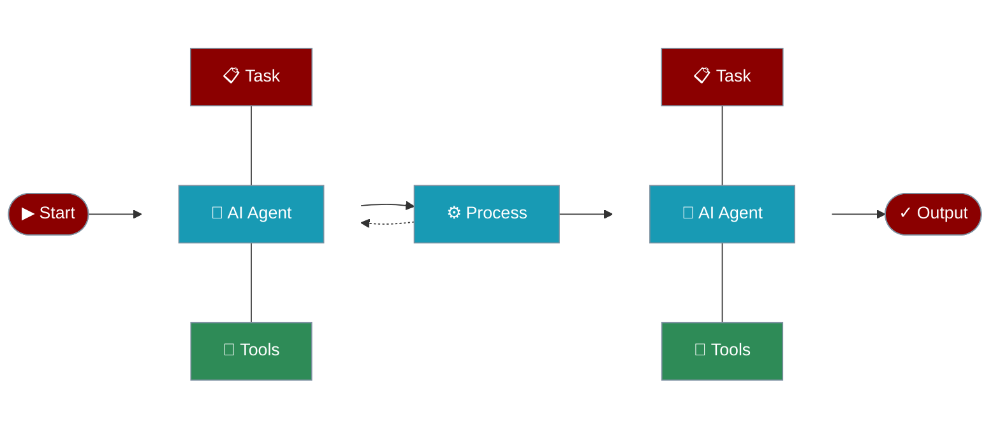

## AI Agents with Tools

Create AI agents that can use tools to interact with external systems and perform actions.

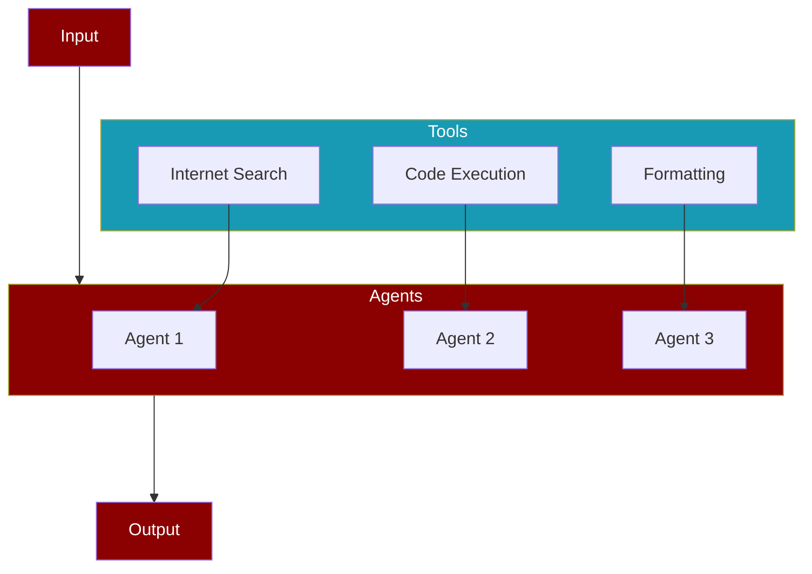

## AI Agents with Memory

Create AI agents with memory capabilities for maintaining context and information across tasks.

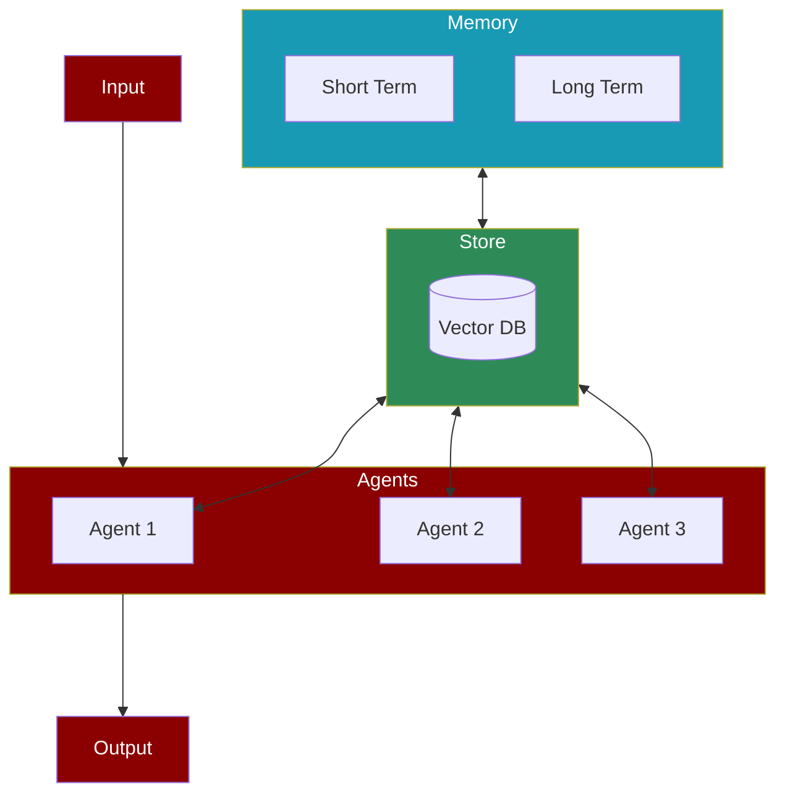

## AI Agents with Different Processes

### Sequential Process

The simplest form of task execution where tasks are performed one after another.

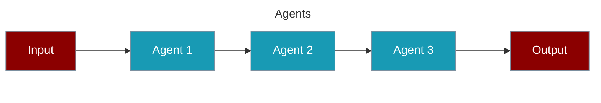

### Hierarchical Process

Uses a manager agent to coordinate task execution and agent assignments.

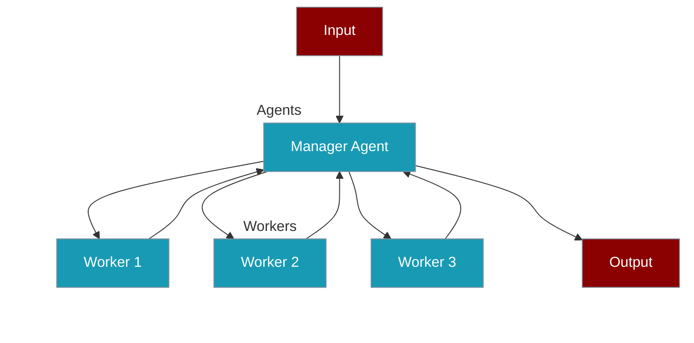

### Workflow Process

Advanced process type supporting complex task relationships and conditional execution.

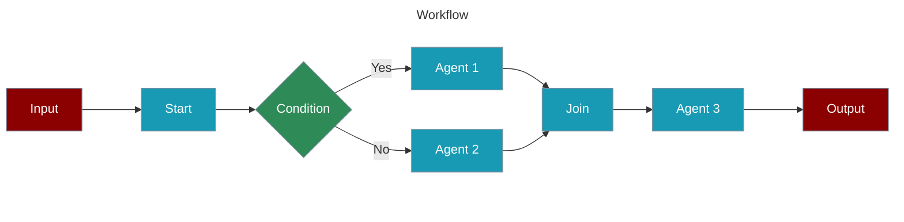

#### Agentic Routing Workflow

Create AI agents that can dynamically route tasks to specialized LLM instances.

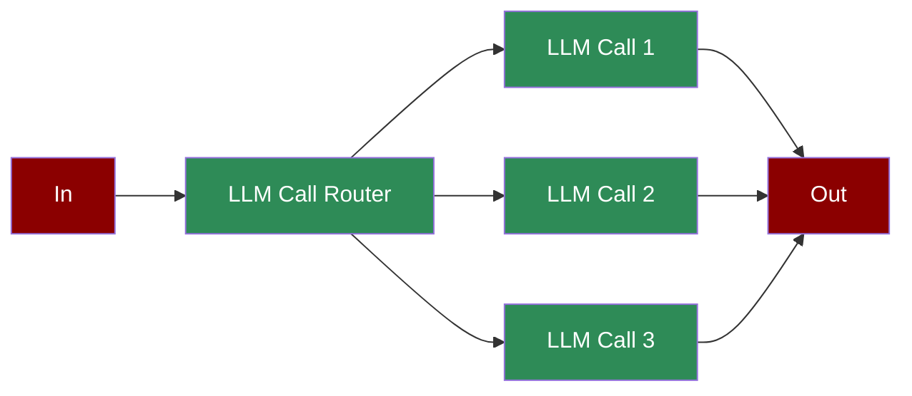

#### Agentic Orchestrator Worker

Create AI agents that orchestrate and distribute tasks among specialized workers.

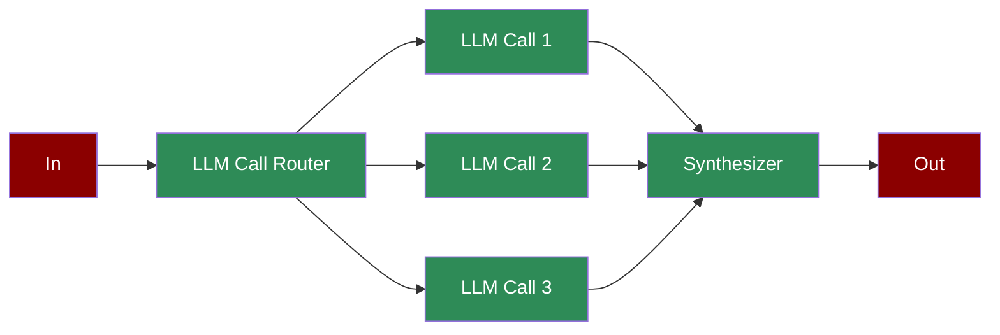

#### Agentic Autonomous Workflow

Create AI agents that can autonomously monitor, act, and adapt based on environment feedback.

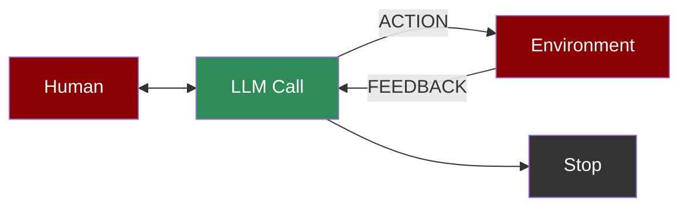

#### Agentic Parallelization

Create AI agents that can execute tasks in parallel for improved performance.

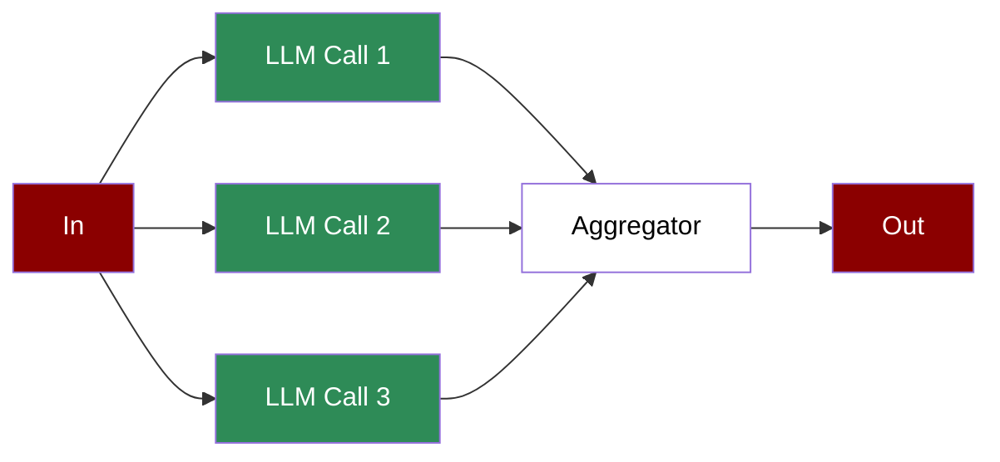

#### Agentic Prompt Chaining

Create AI agents with sequential prompt chaining for complex workflows.

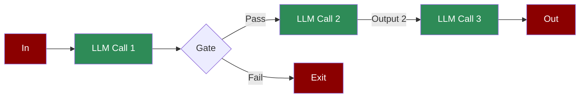

#### Agentic Evaluator Optimizer

Create AI agents that can generate and optimize solutions through iterative feedback.


#### Repetitive Agents

Create AI agents that can efficiently handle repetitive tasks through automated loops.

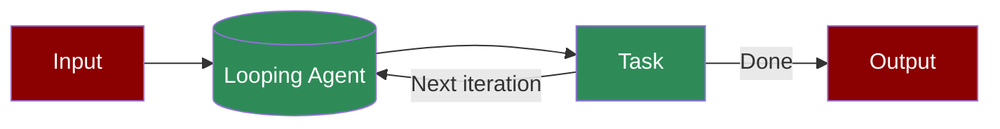

</details>

---

## 🔧 Configuration & Integration

### Ollama Integration

```bash
export OPENAI_BASE_URL=http://localhost:11434/v1
```

### Groq Integration

Replace xxxx with Groq API KEY:

```bash
export OPENAI_API_KEY=xxxxxxxxxxx
export OPENAI_BASE_URL=https://api.groq.com/openai/v1
```

### 100+ Models Support

PraisonAI supports 100+ LLM models from various providers. Visit our [models documentation](https://docs.praison.ai/models/) for the complete list.

<div align="center">
  <a href="https://docs.praison.ai/models">
    <p align="center">
      
    </p>
  </a>
</div>

---

## 📋 Agents Playbook

### Simple Playbook Example

Create `agents.yaml` file and add the code below:

```yaml
framework: praisonai
topic: Artificial Intelligence
agents:  # Canonical: use 'agents' instead of 'roles'
  screenwriter:
    instructions: "Skilled in crafting scripts with engaging dialogue about {topic}."  # Canonical: use 'instructions' instead of 'backstory'
    goal: Create scripts from concepts.
    role: Screenwriter
    tasks:
      scriptwriting_task:
        description: "Develop scripts with compelling characters and dialogue about {topic}."
        expected_output: "Complete script ready for production."
```

*To run the playbook:*
```bash
praisonai agents.yaml
```

---

## 🛠️ Custom Tools / Create Plugins

PraisonAI supports multiple ways to create and integrate custom tools (plugins) into your agents.

### Using `@tool` Decorator

```python
from praisonaiagents import Agent, tool

@tool
def search(query: str) -> str:
    """Search the web for information."""
    return f"Results for: {query}"

@tool
def calculate(expression: str) -> float:
    """Evaluate a math expression."""
    return eval(expression)

agent = Agent(
    instructions="You are a helpful assistant",
    tools=[search, calculate]
)
agent.start("Search for AI news and calculate 15*4")
```

### Using `BaseTool` Class

```python
from praisonaiagents import Agent, BaseTool

class WeatherTool(BaseTool):
    name = "weather"
    description = "Get current weather for a location"
    
    def run(self, location: str) -> str:
        return f"Weather in {location}: 72°F, Sunny"

agent = Agent(
    instructions="You are a weather assistant",
    tools=[WeatherTool()]
)
agent.start("What's the weather in Paris?")
```

### Creating a Tool Package (pip installable)

```toml
# pyproject.toml
[project]
name = "my-praisonai-tools"
version = "1.0.0"
dependencies = ["praisonaiagents"]

[project.entry-points."praisonaiagents.tools"]
my_tool = "my_package:MyTool"
```

```python
# my_package/__init__.py
from praisonaiagents import BaseTool

class MyTool(BaseTool):
    name = "my_tool"
    description = "My custom tool"
    
    def run(self, param: str) -> str:
        return f"Result: {param}"
```

After `pip install`, tools are auto-discovered:
```python
agent = Agent(tools=["my_tool"])  # Works automatically!
```

---

## 🧠 Memory & Context

PraisonAI provides zero-dependency persistent memory for agents. For detailed examples, see [section 6. Agent Memory](#6-agent-memory-zero-dependencies) in the Python Code Examples.

---

## 📚 Knowledge & Retrieval (RAG)

PraisonAI provides a complete knowledge stack for building RAG applications with multiple vector stores, retrieval strategies, rerankers, and query modes.

### RAG Quickstart (Agent-first)

```python
from praisonaiagents import Agent
from praisonaiagents.rag.models import RetrievalStrategy

# Agent with RAG - simplest approach
agent = Agent(
    name="Research Assistant",
    knowledge=["docs/manual.pdf", "data/faq.txt"],
    knowledge_config={"vector_store": {"provider": "chroma"}},
    rag_config={
        "include_citations": True,
        "retrieval_strategy": RetrievalStrategy.HYBRID,  # Dense + BM25
        "rerank": True,
    }
)

# Query with citations
result = agent.rag_query("How do I authenticate?")
print(result.answer)
for citation in result.citations:
    print(f"  [{citation.id}] {citation.source}")
```

### RAG CLI Commands

| Command | Description |
|---------|-------------|
| `praisonai rag query "<question>"` | One-shot question answering with citations |
| `praisonai rag chat` | Interactive RAG chat session |
| `praisonai rag serve` | Start RAG as a microservice API |
| `praisonai rag eval <test_file>` | Evaluate RAG retrieval quality |

### RAG CLI Examples

```bash
# Query with hybrid retrieval (dense + BM25 keyword search)
praisonai rag query "What are the key findings?" --hybrid

# Query with hybrid + reranking for best quality
praisonai rag query "Summarize conclusions" --hybrid --rerank

# Interactive chat with hybrid retrieval
praisonai rag chat --collection research --hybrid --rerank

# Start API server with OpenAI-compatible endpoint
praisonai rag serve --hybrid --rerank --openai-compat --port 8080

# Query with profiling
praisonai rag query "Summary?" --profile --profile-out ./profile.json
```

### Knowledge CLI Commands

| Command | Description |
|---------|-------------|
| `praisonai knowledge index <sources>` | Index documents into knowledge base |
| `praisonai knowledge search <query>` | Search knowledge base (no LLM generation) |
| `praisonai knowledge list` | List indexed documents |

### Knowledge CLI Examples

```bash
# Index documents
praisonai knowledge index ./docs/ --collection myproject

# Search with hybrid retrieval
praisonai knowledge search "authentication" --hybrid --collection myproject

# Index with profiling
praisonai knowledge index ./data --profile --profile-out ./profile.json
```

### Knowledge vs RAG vs AutoRagAgent

- **Knowledge** is the indexing and retrieval substrate - use for indexing and raw search
- **RAG** orchestrates on top - use for question answering with LLM-generated responses and citations
- **AutoRagAgent** wraps an Agent with automatic retrieval decision - use when you want the agent to decide when to retrieve
- All share the same underlying index

### AutoRagAgent (Automatic RAG)

AutoRagAgent automatically decides when to retrieve context from knowledge bases vs direct chat, based on query heuristics.

```python
from praisonaiagents import Agent, AutoRagAgent

# Create agent with knowledge
agent = Agent(
    name="Research Assistant",
    knowledge=["docs/manual.pdf"],
    user_id="user123",  # Required for RAG retrieval
)

# Wrap with AutoRagAgent
auto_rag = AutoRagAgent(
    agent=agent,
    retrieval_policy="auto",  # auto, always, never
    top_k=5,
    hybrid=True,
    rerank=True,
)

# Auto-decides: retrieves for questions, skips for greetings
result = auto_rag.chat("What are the key findings?")  # Retrieves
result = auto_rag.chat("Hello!")  # Skips retrieval

# Force retrieval or skip per-call
result = auto_rag.chat("Hi", force_retrieval=True)
result = auto_rag.chat("Summary?", skip_retrieval=True)
```

**CLI Usage:**
```bash
# Enable auto-rag with default policy (auto)
praisonai --auto-rag "What are the key findings?"

# Always retrieve
praisonai --auto-rag --rag-policy always "Tell me about X"

# With hybrid retrieval and reranking
praisonai --auto-rag --rag-hybrid --rag-rerank "Summarize the document"
```

### Configuration Precedence

Settings are applied in this order (highest priority first):
1. **CLI flags** - `--hybrid`, `--rerank`, `--top-k`
2. **Environment variables** - `PRAISONAI_HYBRID=true`
3. **Config file** - YAML configuration (`--config`)
4. **Defaults**

```bash
# Environment variables
export PRAISONAI_HYBRID=true
export PRAISONAI_RERANK=true
export PRAISONAI_TOP_K=10
```

### Lightweight Installs

```bash
# Base install (minimal, fast imports)
pip install praisonaiagents

# With RAG API server support
pip install "praisonai[rag-api]"
```

### Live Tests (Real API Keys)

Run integration tests with real API keys:

```bash
# Enable live tests
export PRAISONAI_LIVE_TESTS=1
export OPENAI_API_KEY="your-key"

# Run live tests
pytest -m live tests/integration/
```

### Knowledge Stack Features Table

| Feature | Description | SDK Docs | CLI Docs |
|---------|-------------|----------|----------|
| **Hybrid Retrieval** | Dense vectors + BM25 keyword search with RRF fusion | [SDK](/docs/rag/module) | [CLI](/docs/cli/rag) |
| **Reranking** | LLM, Cross-Encoder, Cohere rerankers | [SDK](/docs/rag/module) | [CLI](/docs/cli/rag) |
| **RAG Serve** | Microservice API with OpenAI-compatible mode | [SDK](/docs/rag/module) | [CLI](/docs/cli/rag) |
| **Vector Stores** | ChromaDB, Pinecone, Qdrant, Weaviate, In-Memory | [SDK](/docs/sdk/praisonaiagents/knowledge/protocols) | [CLI](/docs/cli/knowledge) |
| **Data Readers** | Load PDF, Markdown, Text, HTML, URLs | [SDK](/docs/sdk/praisonaiagents/knowledge/protocols) | [CLI](/docs/cli/knowledge) |
| **Profiling** | Performance profiling with `--profile` flag | [SDK](/docs/features/profiling) | [CLI](/docs/cli/rag) |

---

## 🔬 Advanced Features

### Research & Intelligence

- 🔬 **Deep Research Agents** - OpenAI & Gemini support for automated research
- 🔄 **Query Rewriter Agent** - HyDE, Step-back, Multi-query strategies for RAG optimization
- 🌐 **Native Web Search** - Real-time search via OpenAI, Gemini, Anthropic, xAI, Perplexity
- 📥 **Web Fetch** - Retrieve full content from URLs (Anthropic)
- 📝 **Prompt Expander Agent** - Expand short prompts into detailed instructions

### Memory & Caching

- 💾 **Prompt Caching** - Reduce costs & latency (OpenAI, Anthropic, Bedrock, Deepseek)
- 🧠 **Claude Memory Tool** - Persistent cross-conversation memory (Anthropic Beta)
- 💾 **File-Based Memory** - Zero-dependency persistent memory for all agents
- 🔍 **Built-in Search Tools** - Tavily, You.com, Exa for web search, news, content extraction

### Planning & Workflows

- 📋 **Planning Mode** - Plan before execution for agents & multi-agent systems
- 🔧 **Planning Tools** - Research with tools during planning phase
- 🧠 **Planning Reasoning** - Chain-of-thought planning for complex tasks
- ⛓️ **Prompt Chaining** - Sequential prompt workflows with conditional gates
- 🔍 **Evaluator Optimiser** - Generate and optimize through iterative feedback
- 👷 **Orchestrator Workers** - Distribute tasks among specialised workers
- ⚡ **Parallelisation** - Execute tasks in parallel for improved performance
- 🔁 **Repetitive Agents** - Handle repetitive tasks through automated loops
- 🤖 **Autonomous Workflow** - Monitor, act, adapt based on environment feedback

### Specialised Agents

- 🖼️ **Image Generation Agent** - Create images from text descriptions
- 📷 **Image to Text Agent** - Extract text and descriptions from images
- 🎬 **Video Agent** - Analyse and process video content
- 📊 **Data Analyst Agent** - Analyse data and generate insights
- 💰 **Finance Agent** - Financial analysis and recommendations
- 🛒 **Shopping Agent** - Price comparison and shopping assistance
- ⭐ **Recommendation Agent** - Personalised recommendations
- 📖 **Wikipedia Agent** - Search and extract Wikipedia information
- 💻 **Programming Agent** - Code development and analysis
- 📝 **Markdown Agent** - Generate and format Markdown content
- 🔀 **Model Router** - Smart model selection based on task complexity

### MCP Protocol

- 🔌 **MCP Transports** - stdio, Streamable HTTP, WebSocket, SSE (Protocol 2025-11-25)
- 🌐 **WebSocket MCP** - Real-time bidirectional connections with auto-reconnect
- 🔐 **MCP Security** - Origin validation, DNS rebinding prevention, secure sessions
- 🔄 **MCP Resumability** - SSE stream recovery via Last-Event-ID

### A2A & A2UI Protocols

- 🔗 **A2A Protocol** - Agent-to-Agent communication for inter-agent collaboration
- 🖼️ **A2UI Protocol** - Agent-to-User Interface for generating rich UIs from agents
- 📋 **UI Templates** - ChatTemplate, ListTemplate, FormTemplate, DashboardTemplate
- 🔧 **Surface Builder** - Fluent API for building declarative UIs

### Safety & Control

- 🤝 **Agent Handoffs** - Transfer context between specialised agents
- 🛡️ **Guardrails** - Input/output validation and safety checks
- ✅ **Human Approval** - Require human confirmation for critical actions
- 🔐 **Tool Approval CLI** - `--trust` (auto-approve all) and `--approve-level` (risk-based approval)
- 💬 **Sessions Management** - Isolated conversation contexts
- 🔄 **Stateful Agents** - Maintain state across interactions

### Developer Tools

- ⚡ **Fast Context** - Rapid parallel code search (10-20x faster)
- 📜 **Rules & Instructions** - Auto-discover CLAUDE.md, AGENTS.md, GEMINI.md
- 🪝 **Hooks** - Pre/post operation hooks for custom logic
- 📈 **Telemetry** - Track agent performance and usage
- 📹 **Camera Integration** - Capture and analyse camera input

### Other Features

- 🔄 **CrewAI & AG2 Integration** - Use CrewAI or AG2 (Formerly AutoGen) Framework
- 💻 **Codebase Chat** - Chat with entire codebase
- 🎨 **Interactive UIs** - Multiple interactive interfaces
- 📄 **YAML Configuration** - YAML-based agent and workflow configuration
- 🛠️ **Custom Tools** - Easy custom tool integration
- 🔍 **Internet Search** - Multiple providers (Tavily, You.com, Exa, DuckDuckGo, Crawl4AI)
- 🖼️ **VLM Support** - Vision Language Model support
- 🎙️ **Voice Interaction** - Real-time voice interaction

---

## 💾 Persistence (Databases)

Enable automatic conversation persistence with 2 lines of code:

```python
from praisonaiagents import Agent, db

agent = Agent(
    name="Assistant",
    db=db(database_url="postgresql://localhost/mydb"),  # db(...) shortcut
    session_id="my-session"  # Optional: defaults to per-hour ID (YYYYMMDDHH)
)
agent.chat("Hello!")  # Auto-persists messages, runs, traces
```

### Persistence CLI Commands

| Command | Description |
|---------|-------------|
| `praisonai persistence doctor` | Validate DB connectivity |
| `praisonai persistence run` | Run agent with persistence |
| `praisonai persistence resume` | Resume existing session |
| `praisonai persistence export` | Export session to JSONL |
| `praisonai persistence import` | Import session from JSONL |
| `praisonai persistence migrate` | Apply schema migrations |
| `praisonai persistence status` | Show schema status |

> **Note:** See [Knowledge & Retrieval (RAG)](#-knowledge--retrieval-rag) for complete Knowledge CLI documentation.

### Databases Table

| Database | Store Type | Install | Example | Docs |
|----------|------------|---------|---------|------|
| PostgreSQL | Conversation | `pip install "praisonai[tools]"` | [simple_db_agent.py](examples/persistence/simple_db_agent.py) | [docs](https://docs.praison.ai/docs/databases/postgres) |
| MySQL | Conversation | `pip install "praisonai[tools]"` | - | [docs](https://docs.praison.ai/docs/databases/overview) |
| SQLite | Conversation | `pip install "praisonai[tools]"` | - | [docs](https://docs.praison.ai/docs/databases/overview) |
| SingleStore | Conversation | `pip install "praisonai[tools]"` | - | [docs](https://docs.praison.ai/docs/databases/overview) |
| Supabase | Conversation | `pip install "praisonai[tools]"` | - | [docs](https://docs.praison.ai/docs/databases/overview) |
| SurrealDB | Conversation | `pip install "praisonai[tools]"` | - | [docs](https://docs.praison.ai/docs/databases/overview) |
| Qdrant | Knowledge | `pip install "praisonai[tools]"` | [knowledge_qdrant.py](examples/persistence/knowledge_qdrant.py) | [docs](https://docs.praison.ai/docs/databases/qdrant) |
| ChromaDB | Knowledge | `pip install "praisonai[tools]"` | - | [docs](https://docs.praison.ai/docs/databases/overview) |
| Pinecone | Knowledge | `pip install pinecone` | [pinecone_wow.py](examples/vector/pinecone_wow.py) | [docs](https://docs.praison.ai/docs/databases/pinecone) |
| Weaviate | Knowledge | `pip install weaviate-client` | [weaviate_wow.py](examples/vector/weaviate_wow.py) | [docs](https://docs.praison.ai/docs/databases/weaviate) |
| LanceDB | Knowledge | `pip install lancedb` | [lancedb_real_wow.py](examples/vector/lancedb_real_wow.py) | [docs](https://docs.praison.ai/docs/databases/lancedb) |
| Milvus | Knowledge | `pip install "praisonai[tools]"` | - | [docs](https://docs.praison.ai/docs/databases/overview) |
| PGVector | Knowledge | `pip install psycopg2-binary` | [pgvector_real_wow.py](examples/vector/pgvector_real_wow.py) | [docs](https://docs.praison.ai/docs/databases/pgvector) |
| Redis Vector | Knowledge | `pip install "praisonai[tools]"` | - | [docs](https://docs.praison.ai/docs/databases/overview) |
| Cassandra | Knowledge | `pip install "praisonai[tools]"` | - | [docs](https://docs.praison.ai/docs/databases/overview) |
| ClickHouse | Knowledge | `pip install "praisonai[tools]"` | - | [docs](https://docs.praison.ai/docs/databases/overview) |
| Redis | State | `pip install "praisonai[tools]"` | [state_redis.py](examples/persistence/state_redis.py) | [docs](https://docs.praison.ai/docs/databases/redis) |
| MongoDB | State | `pip install "praisonai[tools]"` | - | [docs](https://docs.praison.ai/docs/databases/overview) |
| DynamoDB | State | `pip install "praisonai[tools]"` | - | [docs](https://docs.praison.ai/docs/databases/overview) |
| Firestore | State | `pip install "praisonai[tools]"` | - | [docs](https://docs.praison.ai/docs/databases/overview) |
| Upstash | State | `pip install "praisonai[tools]"` | - | [docs](https://docs.praison.ai/docs/databases/overview) |
| Memory | State | `pip install "praisonai[tools]"` | - | [docs](https://docs.praison.ai/docs/databases/overview) |

---

## 🔧 Tools Table

Install all tools with: `pip install "praisonai[tools]"`

| Tool | Category | Import | Docs |
|------|----------|--------|------|
| Tavily | Web Search | `from praisonai_tools import TavilyTool` | [docs](https://docs.praison.ai/docs/tools/external/tavily) |
| DuckDuckGo | Web Search | `from praisonai_tools import DuckDuckGoTool` | [docs](https://docs.praison.ai/docs/tools/external/duckduckgo) |
| Exa | Web Search | `from praisonai_tools import ExaTool` | [docs](https://docs.praison.ai/docs/tools/external/exa) |
| Serper | Web Search | `from praisonai_tools import SerperTool` | [docs](https://docs.praison.ai/docs/tools/external/serper) |
| Jina | Web Reader | `from praisonai_tools import JinaTool` | [docs](https://docs.praison.ai/docs/tools/external/jina) |
| Firecrawl | Web Scraping | `from praisonai_tools import FirecrawlTool` | [docs](https://docs.praison.ai/docs/tools/external/firecrawl) |
| Crawl4AI | Web Scraping | `from praisonai_tools import Crawl4AITool` | [docs](https://docs.praison.ai/docs/tools/external/crawl4ai) |
| Wikipedia | Knowledge | `from praisonai_tools import WikipediaTool` | [docs](https://docs.praison.ai/docs/tools/external/wikipedia) |
| ArXiv | Research | `from praisonai_tools import ArxivTool` | [docs](https://docs.praison.ai/docs/tools/external/arxiv) |
| HackerNews | News | `from praisonai_tools import HackerNewsTool` | [docs](https://docs.praison.ai/docs/tools/external/hackernews) |
| YouTube | Media | `from praisonai_tools import YouTubeTool` | [docs](https://docs.praison.ai/docs/tools/external/youtube) |
| Weather | Data | `from praisonai_tools import WeatherTool` | [docs](https://docs.praison.ai/docs/tools/external/weather) |
| PostgreSQL | Database | `from praisonai_tools import PostgresTool` | [docs](https://docs.praison.ai/docs/tools/external/postgres) |
| MySQL | Database | `from praisonai_tools import MySQLTool` | [docs](https://docs.praison.ai/docs/tools/external/mysql) |
| SQLite | Database | `from praisonai_tools import SQLiteTool` | [docs](https://docs.praison.ai/docs/tools/external/sqlite) |
| MongoDB | Database | `from praisonai_tools import MongoDBTool` | [docs](https://docs.praison.ai/docs/tools/external/mongodb) |
| Redis | Database | `from praisonai_tools import RedisTool` | [docs](https://docs.praison.ai/docs/tools/external/redis) |
| Qdrant | Vector DB | `from praisonai_tools import QdrantTool` | [docs](https://docs.praison.ai/docs/tools/external/qdrant) |
| GitHub | DevOps | `from praisonai_tools import GitHubTool` | [docs](https://docs.praison.ai/docs/tools/external/github) |
| Slack | Communication | `from praisonai_tools import SlackTool` | [docs](https://docs.praison.ai/docs/tools/external/slack) |
| Discord | Communication | `from praisonai_tools import DiscordTool` | [docs](https://docs.praison.ai/docs/tools/external/discord) |
| Telegram | Communication | `from praisonai_tools import TelegramTool` | [docs](https://docs.praison.ai/docs/tools/external/telegram) |
| Email | Communication | `from praisonai_tools import EmailTool` | [docs](https://docs.praison.ai/docs/tools/external/email) |
| Notion | Productivity | `from praisonai_tools import NotionTool` | [docs](https://docs.praison.ai/docs/tools/external/notion) |
| File | File System | `from praisonai_tools import FileTool` | [docs](https://docs.praison.ai/docs/tools/external/file) |
| Shell | System | `from praisonai_tools import ShellTool` | [docs](https://docs.praison.ai/docs/tools/external/shell) |
| Python | Code | `from praisonai_tools import PythonTool` | [docs](https://docs.praison.ai/docs/tools/external/python) |
| JSON | Data | `from praisonai_tools import JSONTool` | [docs](https://docs.praison.ai/docs/tools/external/json) |
| CSV | Data | `from praisonai_tools import CSVTool` | [docs](https://docs.praison.ai/docs/tools/external/csv) |
| Calculator | Math | `from praisonai_tools import CalculatorTool` | [docs](https://docs.praison.ai/docs/tools/external/calculator) |

> See [full tools documentation](https://docs.praison.ai/docs/tools/tools) for all 100+ available tools.

---

## 🎓 Video Tutorials

Learn PraisonAI through our comprehensive video series:

<details>
<summary><strong>View all 22 video tutorials</strong></summary>

| Topic | Video |
|-------|--------|
| AI Agents with Self Reflection | [](https://www.youtube.com/watch?v=vLXobEN2Vc8) |
| Reasoning Data Generating Agent | [](https://www.youtube.com/watch?v=fUT332Y2zA8) |
| AI Agents with Reasoning | [](https://www.youtube.com/watch?v=KNDVWGN3TpM) |
| Multimodal AI Agents | [](https://www.youtube.com/watch?v=hjAWmUT1qqY) |
| AI Agents Workflow | [](https://www.youtube.com/watch?v=yWTH44QPl2A) |
| Async AI Agents | [](https://www.youtube.com/watch?v=VhVQfgo00LE) |
| Mini AI Agents | [](https://www.youtube.com/watch?v=OkvYp5aAGSg) |
| AI Agents with Memory | [](https://www.youtube.com/watch?v=1hVfVxvPnnQ) |
| Repetitive Agents | [](https://www.youtube.com/watch?v=dAYGxsjDOPg) |
| Introduction | [](https://www.youtube.com/watch?v=Fn1lQjC0GO0) |
| Tools Overview | [](https://www.youtube.com/watch?v=XaQRgRpV7jo) |
| Custom Tools | [](https://www.youtube.com/watch?v=JSU2Rndh06c) |
| Firecrawl Integration | [](https://www.youtube.com/watch?v=UoqUDcLcOYo) |
| User Interface | [](https://www.youtube.com/watch?v=tg-ZjNl3OCg) |
| Crawl4AI Integration | [](https://www.youtube.com/watch?v=KAvuVUh0XU8) |
| Chat Interface | [](https://www.youtube.com/watch?v=sw3uDqn2h1Y) |
| Code Interface | [](https://www.youtube.com/watch?v=_5jQayO-MQY) |
| Mem0 Integration | [](https://www.youtube.com/watch?v=KIGSgRxf1cY) |
| Training | [](https://www.youtube.com/watch?v=aLawE8kwCrI) |
| Realtime Voice Interface | [](https://www.youtube.com/watch?v=frRHfevTCSw) |
| Call Interface | [](https://www.youtube.com/watch?v=m1cwrUG2iAk) |
| Reasoning Extract Agents | [](https://www.youtube.com/watch?v=2PPamsADjJA) |

</details>

---

## 👥 Contributing

We welcome contributions from the community! Here's how you can contribute:

1. **Fork on GitHub** - Use the "Fork" button on the [repository page](https://github.com/MervinPraison/PraisonAI)
2. **Clone your fork** - `git clone https://github.com/yourusername/praisonAI.git`
3. **Create a branch** - `git checkout -b new-feature`
4. **Make changes and commit** - `git commit -am "Add some feature"`
5. **Push to your fork** - `git push origin new-feature`
6. **Submit a pull request** - Via GitHub's web interface
7. **Await feedback** - From project maintainers

---

## 🔧 Development

### Using uv

```bash
# Install uv if you haven't already
pip install uv

# Install from requirements
uv pip install -r pyproject.toml

# Install with extras
uv pip install -r pyproject.toml --extra code
uv pip install -r pyproject.toml --extra "crewai,autogen"
```

### Bump and Release

```bash
# From project root - bumps version and releases in one command
python src/praisonai/scripts/bump_and_release.py 2.2.99

# With praisonaiagents dependency
python src/praisonai/scripts/bump_and_release.py 2.2.99 --agents 0.0.169

# Then publish
cd src/praisonai && uv publish
```

---

## ❓ FAQ & Troubleshooting

<details>
<summary><strong>ModuleNotFoundError: No module named 'praisonaiagents'</strong></summary>

Install the package:
```bash
pip install praisonaiagents
```

</details>

<details>
<summary><strong>API key not found / Authentication error</strong></summary>

Ensure your API key is set:
```bash
export OPENAI_API_KEY=your_key_here
```

For other providers, see [Environment Variables](#environment-variables).

</details>

<details>
<summary><strong>How do I use a local model (Ollama)?</strong></summary>

```bash
# Start Ollama server first
ollama serve

# Set environment variable
export OPENAI_BASE_URL=http://localhost:11434/v1
```

See [Ollama Integration](#ollama-integration) for more details.

</details>

<details>
<summary><strong>How do I persist conversations to a database?</strong></summary>

Use the `db` parameter:
```python
from praisonaiagents import Agent, db

agent = Agent(
    name="Assistant",
    db=db(database_url="postgresql://localhost/mydb"),
    session_id="my-session"
)
```

See [Persistence (Databases)](#-persistence-databases) for supported databases.

</details>

<details>
<summary><strong>How do I enable agent memory?</strong></summary>

```python
from praisonaiagents import Agent

agent = Agent(
    name="Assistant",
    memory=True,  # Enables file-based memory (no extra deps!)
    user_id="user123"
)
```

See [Agent Memory](#6-agent-memory-zero-dependencies) for more options.

</details>

<details>
<summary><strong>How do I run multiple agents together?</strong></summary>

```python
from praisonaiagents import Agent, Agents

agent1 = Agent(instructions="Research topics")
agent2 = Agent(instructions="Summarize findings")
agents = Agents(agents=[agent1, agent2])
agents.start()
```

See [Multi Agents](#2-multi-agents) for more examples.

</details>

<details>
<summary><strong>How do I use MCP tools?</strong></summary>

```python
from praisonaiagents import Agent, MCP

agent = Agent(
    tools=MCP("npx @modelcontextprotocol/server-memory")
)
```

See [MCP Protocol](#19-mcp-model-context-protocol) for all transport options.

</details>

### Getting Help

- 📚 [Full Documentation](https://docs.praison.ai)
- 🐛 [Report Issues](https://github.com/MervinPraison/PraisonAI/issues)
- 💬 [Discussions](https://github.com/MervinPraison/PraisonAI/discussions)

---

<div align="center">
  <p><strong>Made with ❤️ by the PraisonAI Team</strong></p>
  <p>
    <a href="https://docs.praison.ai">Documentation</a> •
    <a href="https://github.com/MervinPraison/PraisonAI">GitHub</a> •
    <a href="https://github.com/MervinPraison/PraisonAI/issues">Issues</a>
  </p>
</div>
