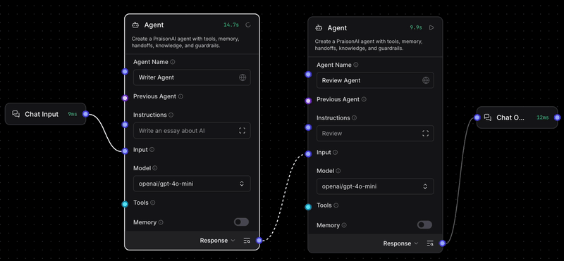
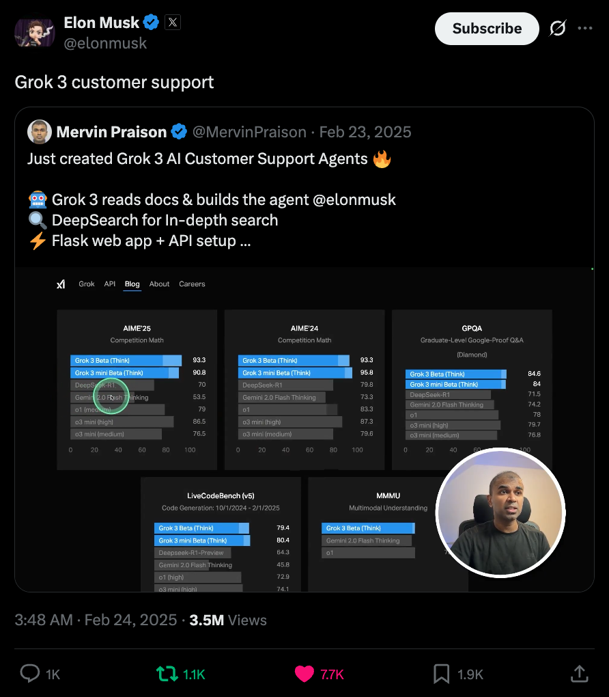

<p align="center">
  <picture>
    <source media="(prefers-color-scheme: dark)" srcset=".github/images/logo_dark.png" />
    <source media="(prefers-color-scheme: light)" srcset=".github/images/logo_light.png" />
    
  </picture>
</p>

<!-- mcp-name: io.github.MervinPraison/praisonai -->

<p align="center">
<a href="https://github.com/MervinPraison/PraisonAI"></a>
<a href="https://github.com/MervinPraison/PraisonAI"></a>
<a href="https://github.com/MervinPraison/PraisonAI"></a>
<a href="https://registry.modelcontextprotocol.io/servers/io.github.MervinPraison/praisonai"></a>
</p>

<div align="center">

# PraisonAI 🦞

<a href="https://trendshift.io/repositories/9130" target="_blank"></a>

</div>

PraisonAI 🦞 — **Hire a 24/7 AI Workforce.** Stop writing boilerplate and start shipping autonomous agents that research, plan, and execute tasks across your apps. From one agent to an entire organization, deployed in 5 lines of code.

<div align="center">
  <br>
  <a href="https://x.com/elonmusk/status/1893870468249141688" target="_blank">
    
  </a>
  <br>
</div>

<p align="center">
  
</p>

<p align="center">
  
</p>

```
 ██████╗ ██████╗  █████╗ ██╗███████╗ ██████╗ ███╗   ██╗     █████╗ ██╗
 ██╔══██╗██╔══██╗██╔══██╗██║██╔════╝██╔═══██╗████╗  ██║    ██╔══██╗██║
 ██████╔╝██████╔╝███████║██║███████╗██║   ██║██╔██╗ ██║    ███████║██║
 ██╔═══╝ ██╔══██╗██╔══██║██║╚════██║██║   ██║██║╚██╗██║    ██╔══██║██║
 ██║     ██║  ██║██║  ██║██║███████║╚██████╔╝██║ ╚████║    ██║  ██║██║
 ╚═╝     ╚═╝  ╚═╝╚═╝  ╚═╝╚═╝╚══════╝ ╚═════╝ ╚═╝  ╚═══╝    ╚═╝  ╚═╝╚═╝

 pip install praisonai
```

<p align="center">
  
</p>

\* `export TAVILY_API_KEY=xxxxx`

<div align="center">
  <a href="https://docs.praison.ai">
    <p align="center">
      
    </p>
  </a>
</div>

---

## 🎯 Use Cases

AI agents solving real-world problems across industries:

| Use Case | Description |
|----------|-------------|
| 🔍 **Research & Analysis** | Conduct deep research, gather information, and generate insights from multiple sources automatically |
| 💻 **Code Generation** | Write, debug, and refactor code with AI agents that understand your codebase and requirements |
| ✍️ **Content Creation** | Generate blog posts, documentation, marketing copy, and technical writing with multi-agent teams |
| 📊 **Data Pipelines** | Extract, transform, and analyze data from APIs, databases, and web sources automatically |
| 🤖 **Customer Support** | Deploy 24/7 support bots on Telegram, Discord, Slack with memory and knowledge-backed responses |
| ⚙️ **Workflow Automation** | Automate multi-step business processes with agents that hand off tasks, verify results, and self-correct |

---

## 🚀 Meet your first Agent (Under 1 Minute)

1. Install the lightweight core SDK:
```bash
pip install praisonaiagents
export OPENAI_API_KEY="your-api-key"
```

2. Run your first autonomous agent:
```python
from praisonaiagents import Agent

# Give your agent a goal, and watch it work.
agent = Agent(instructions="You are a senior data analyst.")
agent.start("Analyze the top 3 tech trends of 2026 and format as a markdown table.")
```

---

## 🌌 The PraisonAI Ecosystem

Start simple with the core SDK, or expand to full visual builders and dashboards when you're ready.

*   **Core SDK (`praisonaiagents`)**: For pure Python development. `pip install praisonaiagents`
*   💻 **PraisonAI CLI (`praisonai`)**: For terminal-based developers. `pip install praisonai`
*   🦞 **Claw Dashboard**: Connect agents directly to Telegram, Slack, or Discord. `pip install "praisonai[claw]"`
*   🔗 **Flow Visual Builder**: Drag-and-drop workflow creation. `pip install "praisonai[flow]"`
*   🤖 **PraisonAI UI**: Clean chat interface. `pip install "praisonai[ui]"`

### JavaScript SDK

```bash
npm install praisonai
```

## 🧠 Supported Providers & Features

Powered by 100+ LLMs (OpenAI, Anthropic, Gemini & local models).

<p align="center">


</p>

<details>
<summary><strong>View all 24 providers with examples</strong></summary>

| Provider | Example |
|----------|:-------:|
| OpenAI | [Example](examples/python/providers/openai/openai_gpt4_example.py) |
| Anthropic | [Example](examples/python/providers/anthropic/anthropic_claude_example.py) |
| Google Gemini | [Example](examples/python/providers/google/google_gemini_example.py) |
| Ollama | [Example](examples/python/providers/ollama/ollama-agents.py) |
| Groq | [Example](examples/python/providers/groq/kimi_with_groq_example.py) |
| DeepSeek | [Example](examples/python/providers/deepseek/deepseek_example.py) |
| xAI Grok | [Example](examples/python/providers/xai/xai_grok_example.py) |
| Mistral | [Example](examples/python/providers/mistral/mistral_example.py) |
| Cohere | [Example](examples/python/providers/cohere/cohere_example.py) |
| Perplexity | [Example](examples/python/providers/perplexity/perplexity_example.py) |
| Fireworks | [Example](examples/python/providers/fireworks/fireworks_example.py) |
| Together AI | [Example](examples/python/providers/together/together_ai_example.py) |
| OpenRouter | [Example](examples/python/providers/openrouter/openrouter_example.py) |
| HuggingFace | [Example](examples/python/providers/huggingface/huggingface_example.py) |
| Azure OpenAI | [Example](examples/python/providers/azure/azure_openai_example.py) |
| AWS Bedrock | [Example](examples/python/providers/aws/aws_bedrock_example.py) |
| Google Vertex | [Example](examples/python/providers/vertex/vertex_example.py) |
| Databricks | [Example](examples/python/providers/databricks/databricks_example.py) |
| Cloudflare | [Example](examples/python/providers/cloudflare/cloudflare_example.py) |
| AI21 | [Example](examples/python/providers/ai21/ai21_example.py) |
| Replicate | [Example](examples/python/providers/replicate/replicate_example.py) |
| SageMaker | [Example](examples/python/providers/sagemaker/sagemaker_example.py) |
| Moonshot | [Example](examples/python/providers/moonshot/moonshot_example.py) |
| vLLM | [Example](examples/python/providers/vllm/vllm_example.py) |

</details>

<div align="center">
  <a href="https://x.com/elonmusk/status/1893870468249141688" target="_blank">
    
  </a>
  <p><em>"Grok 3 customer support" — <a href="https://x.com/elonmusk/status/1893870468249141688">Elon Musk quoting PraisonAI's tutorial</a></em></p>
</div>
<br>

---

## 🌟 Why PraisonAI?

| | Feature | How |
|--|---------|-----|
| 🔌 | **MCP Protocol** — stdio, HTTP, WebSocket, SSE | `tools=MCP("npx ...")` |
| 🧠 | **Planning Mode** — plan → execute → reason | `planning=True` |
| 🔍 | **Deep Research** — multi-step autonomous research | [Docs](https://docs.praison.ai/docs/agents/deep-research) |
| 🤖 | **External Agents** — orchestrate Claude Code, Gemini CLI, Codex | [Docs](https://docs.praison.ai/docs/code/external-agents) |
| 🔄 | **Agent Handoffs** — seamless conversation passing | `handoff=True` |
| 🛡️ | **Guardrails** — input/output validation | [Docs](https://docs.praison.ai/docs/concepts/guardrails) |
|  | **Web Search + Fetch** — native browsing | `web_search=True` |
| 🪞 | **Self Reflection** — agent reviews its own output | [Docs](https://docs.praison.ai/docs/concepts/reflection) |
| 🔀 | **Workflow Patterns** — route, parallel, loop, repeat | [Docs](https://docs.praison.ai/docs/concepts/agentflow) |
| 🧠 | **Memory (zero deps)** — works out of the box | `memory=True` |

<details>
<summary><strong>View all 25 features</strong></summary>

| | Feature | How |
|--|---------|-----|
| 💡 | **Prompt Caching** — reduce latency + cost | `prompt_caching=True` |
| 💾 | **Sessions + Auto-Save** — persistent state across restarts | `auto_save="my-project"` |
| 💭 | **Thinking Budgets** — control reasoning depth | `thinking_budget=1024` |
| 📚 | **RAG + Quality-Based RAG** — auto quality scoring retrieval | [Docs](https://docs.praison.ai/docs/concepts/rag) |
| 📊 | **Model Router** — auto-routes to cheapest capable model | [Docs](https://docs.praison.ai/docs/features/model-router) |
| 🧊 | **Shadow Git Checkpoints** — auto-rollback on failure | [Docs](https://docs.praison.ai/docs/features/checkpoints) |
| 📡 | **A2A Protocol** — agent-to-agent interop | [Docs](https://docs.praison.ai/docs/features/a2a) |
| 📏 | **Context Compaction** — never hit token limits | [Docs](https://docs.praison.ai/docs/features/context-compaction) |
| 📡 | **Telemetry** — OpenTelemetry traces, spans, metrics | [Docs](https://docs.praison.ai/docs/features/telemetry) |
| 📜 | **Policy Engine** — declarative agent behavior control | [Docs](https://docs.praison.ai/docs/features/policy-engine) |
| 🔄 | **Background Tasks** — fire-and-forget agents | [Docs](https://docs.praison.ai/docs/features/background-tasks) |
| 🔁 | **Doom Loop Detection** — auto-recovery from stuck agents | [Docs](https://docs.praison.ai/docs/features/doom-loop-detection) |
| 🕸️ | **Graph Memory** — Neo4j-style relationship tracking | [Docs](https://docs.praison.ai/docs/features/graph-memory) |
| 🏖️ | **Sandbox Execution** — isolated code execution | [Docs](https://docs.praison.ai/docs/features/sandbox) |
| 🖥️ | **Bot Gateway** — multi-agent routing across channels | [Docs](https://docs.praison.ai/docs/features/bot-gateway) |

</details>


---

## 📘 Using Python Code

### 1. Single Agent

```python
from praisonaiagents import Agent
agent = Agent(instructions="You are a helpful AI assistant")
agent.start("Write a movie script about a robot in Mars")
```

### 2. Multi Agents

```python
from praisonaiagents import Agent, Agents

research_agent = Agent(instructions="Research about AI")
summarise_agent = Agent(instructions="Summarise research agent's findings")
agents = Agents(agents=[research_agent, summarise_agent])
agents.start()
```

### 3. MCP (Model Context Protocol)

```python
from praisonaiagents import Agent, MCP

# stdio - Local NPX/Python servers
agent = Agent(tools=MCP("npx @modelcontextprotocol/server-memory"))

# Streamable HTTP - Production servers
agent = Agent(tools=MCP("https://api.example.com/mcp"))

# WebSocket - Real-time bidirectional
agent = Agent(tools=MCP("wss://api.example.com/mcp", auth_token="token"))

# With environment variables
agent = Agent(
    tools=MCP(
        command="npx",
        args=["-y", "@modelcontextprotocol/server-brave-search"],
        env={"BRAVE_API_KEY": "your-key"}
    )
)
```

> 📖 [Full MCP docs](https://docs.praison.ai/docs/mcp/transports) — stdio, HTTP, WebSocket, SSE transports

### 4. Custom Tools

```python
from praisonaiagents import Agent, tool

@tool
def search(query: str) -> str:
    """Search the web for information."""
    return f"Results for: {query}"

@tool
def calculate(expression: str) -> float:
    """Evaluate a math expression."""
    return eval(expression)

agent = Agent(
    instructions="You are a helpful assistant",
    tools=[search, calculate]
)
agent.start("Search for AI news and calculate 15*4")
```

> 📖 [Full tools docs](https://docs.praison.ai/docs/tools/tools) — BaseTool, tool packages, 100+ built-in tools

### 5. Persistence (Databases)

```python
from praisonaiagents import Agent, db

agent = Agent(
    name="Assistant",
    db=db(database_url="postgresql://localhost/mydb"),
    session_id="my-session"
)
agent.chat("Hello!")  # Auto-persists messages, runs, traces
```

> 📖 [Full persistence docs](https://docs.praison.ai/docs/databases/overview) — PostgreSQL, MySQL, SQLite, MongoDB, Redis, and 20+ more

### 6. PraisonAI Claw 🦞 (Dashboard UI)

Connect your AI agents to **Telegram, Discord, Slack, WhatsApp** and more — all from a single command.

```bash
pip install "praisonai[claw]"
praisonai claw
```

Open **http://localhost:8082** — the dashboard comes with 13 built-in pages: Chat, Agents, Memory, Knowledge, Channels, Guardrails, Cron, and more. Add messaging channels directly from the UI.

> 📖 [Full Claw docs](https://docs.praison.ai/docs/concepts/claw) — platform tokens, CLI options, Docker, and YAML agent mode

### 7. Langflow Integration 🔗 (Visual Flow Builder)

Build multi-agent workflows visually with **drag-and-drop** components in Langflow.

```bash
pip install "praisonai[flow]"
praisonai flow
```

Open **http://localhost:7861** — use the **Agent** and **Agent Team** components to create sequential or parallel workflows. Connect Chat Input → Agent Team → Chat Output for instant multi-agent pipelines.

> 📖 [Full Flow docs](https://docs.praison.ai/docs/concepts/flow) — visual agent building, component reference, and deployment

### 8. PraisonAI UI 🤖 (Clean Chat)

Lightweight chat interface for your AI agents.

```bash
pip install "praisonai[ui]"
praisonai ui
```

---

## 📄 Using YAML (No Code)

### Example 1: Two Agents Working Together

Create `agents.yaml`:

```yaml
framework: praisonai
topic: "Write a blog post about AI"

agents:
  researcher:
    role: Research Analyst
    goal: Research AI trends and gather information
    instructions: "Find accurate information about AI trends"
    
  writer:
    role: Content Writer
    goal: Write engaging blog posts
    instructions: "Write clear, engaging content based on research"
```

Run with:
```bash
praisonai agents.yaml
```

> The agents automatically work together sequentially

### Example 2: Agent with Custom Tool

Create two files in the same folder:

**agents.yaml:**
```yaml
framework: praisonai
topic: "Calculate the sum of 25 and 15"

agents:
  calculator_agent:
    role: Calculator
    goal: Perform calculations
    instructions: "Use the add_numbers tool to help with calculations"
    tools:
      - add_numbers
```

**tools.py:**
```python
def add_numbers(a: float, b: float) -> float:
    """
    Add two numbers together.
    
    Args:
        a: First number
        b: Second number
    
    Returns:
        The sum of a and b
    """
    return a + b
```

Run with:
```bash
praisonai agents.yaml
```

> 💡 **Tips:** 
> - Use the function name (e.g., `add_numbers`) in the tools list, not the file name
> - Tools in `tools.py` are automatically discovered
> - The function's docstring helps the AI understand how to use it

---

## 🎯 CLI Quick Reference

| Category | Commands |
|----------|----------|
| **Execution** | `praisonai`, `--auto`, `--interactive`, `--chat` |
| **Research** | `research`, `--query-rewrite`, `--deep-research` |
| **Planning** | `--planning`, `--planning-tools`, `--planning-reasoning` |
| **Workflows** | `workflow run`, `workflow list`, `workflow auto` |
| **Memory** | `memory show`, `memory add`, `memory search`, `memory clear` |
| **Knowledge** | `knowledge add`, `knowledge query`, `knowledge list` |
| **Sessions** | `session list`, `session resume`, `session delete` |
| **Tools** | `tools list`, `tools info`, `tools search` |
| **MCP** | `mcp list`, `mcp create`, `mcp enable` |
| **Development** | `commit`, `docs`, `checkpoint`, `hooks` |
| **Scheduling** | `schedule start`, `schedule list`, `schedule stop` |

> 📖 [Full CLI reference](https://docs.praison.ai/docs/cli/cli-reference)

---

## ✨ Key Features

<details open>
<summary><strong>🤖 Core Agents</strong></summary>

| Feature | Code | Docs |
|---------|:----:|:----:|
| Single Agent | [Example](examples/python/agents/single-agent.py) | [📖](https://docs.praison.ai/docs/agents/single) |
| Multi Agents | [Example](examples/python/general/mini_agents_example.py) | [📖](https://docs.praison.ai/docs/concepts/agents) |
| Auto Agents | [Example](examples/python/general/auto_agents_example.py) | [📖](https://docs.praison.ai/docs/features/autoagents) |
| Self Reflection AI Agents | [Example](examples/python/concepts/self-reflection-details.py) | [📖](https://docs.praison.ai/docs/concepts/reflection) |
| Reasoning AI Agents | [Example](examples/python/concepts/reasoning-extraction.py) | [📖](https://docs.praison.ai/docs/features/reasoning) |
| Multi Modal AI Agents | [Example](examples/python/general/multimodal.py) | [📖](https://docs.praison.ai/docs/features/multimodal) |

</details>

<details>
<summary><strong>🔄 Workflows</strong></summary>

| Feature | Code | Docs |
|---------|:----:|:----:|
| Simple Workflow | [Example](examples/python/workflows/simple_workflow.py) | [📖](https://docs.praison.ai/docs/concepts/agentflow) |
| Workflow with Agents | [Example](examples/python/workflows/workflow_with_agents.py) | [📖](https://docs.praison.ai/docs/concepts/agentflow) |
| Agentic Routing (`route()`) | [Example](examples/python/workflows/workflow_routing.py) | [📖](https://docs.praison.ai/docs/features/routing) |
| Parallel Execution (`parallel()`) | [Example](examples/python/workflows/workflow_parallel.py) | [📖](https://docs.praison.ai/docs/features/parallelisation) |
| Loop over List/CSV (`loop()`) | [Example](examples/python/workflows/workflow_loop_csv.py) | [📖](https://docs.praison.ai/docs/features/repetitive) |
| Evaluator-Optimizer (`repeat()`) | [Example](examples/python/workflows/workflow_repeat.py) | [📖](https://docs.praison.ai/docs/concepts/evaluation) |
| Conditional Steps | [Example](examples/python/workflows/workflow_conditional.py) | [📖](https://docs.praison.ai/docs/concepts/agentflow) |
| Workflow Branching | [Example](examples/python/workflows/workflow_branching.py) | [📖](https://docs.praison.ai/docs/concepts/agentflow) |
| Workflow Early Stop | [Example](examples/python/workflows/workflow_early_stop.py) | [📖](https://docs.praison.ai/docs/concepts/agentflow) |
| Workflow Checkpoints | [Example](examples/python/workflows/workflow_checkpoints.py) | [📖](https://docs.praison.ai/docs/concepts/agentflow) |

</details>

<details>
<summary><strong>💻 Code & Development</strong></summary>

| Feature | Code | Docs |
|---------|:----:|:----:|
| Code Interpreter Agents | [Example](examples/python/agents/code-agent.py) | [📖](https://docs.praison.ai/docs/features/codeagent) |
| AI Code Editing Tools | [Example](examples/python/code/code_editing_example.py) | [📖](https://docs.praison.ai/docs/code/editing) |
| External Agents (All) | [Example](examples/python/code/external_agents_example.py) | [📖](https://docs.praison.ai/docs/code/external-agents) |
| Claude Code CLI | [Example](examples/python/code/claude_code_example.py) | [📖](https://docs.praison.ai/docs/code/claude-code) |
| Gemini CLI | [Example](examples/python/code/gemini_cli_example.py) | [📖](https://docs.praison.ai/docs/code/gemini-cli) |
| Codex CLI | [Example](examples/python/code/codex_cli_example.py) | [📖](https://docs.praison.ai/docs/code/codex-cli) |
| Cursor CLI | [Example](examples/python/code/cursor_cli_example.py) | [📖](https://docs.praison.ai/docs/code/cursor-cli) |

</details>

<details>
<summary><strong>🧠 Memory & Knowledge</strong></summary>

| Feature | Code | Docs |
|---------|:----:|:----:|
| Memory (Short & Long Term) | [Example](examples/python/general/memory_example.py) | [📖](https://docs.praison.ai/docs/concepts/memory) |
| File-Based Memory | [Example](examples/python/general/memory_example.py) | [📖](https://docs.praison.ai/docs/concepts/memory) |
| Claude Memory Tool | [Example](examples/python/memory/claude_memory_example.py) | [📖](https://docs.praison.ai/docs/features/claude-memory-tool) |
| Add Custom Knowledge | [Example](examples/python/concepts/knowledge-agents.py) | [📖](https://docs.praison.ai/docs/concepts/knowledge) |
| RAG Agents | [Example](examples/python/concepts/rag-agents.py) | [📖](https://docs.praison.ai/docs/concepts/rag) |
| Chat with PDF Agents | [Example](examples/python/concepts/chat-with-pdf.py) | [📖](https://docs.praison.ai/docs/features/chat-with-pdf) |
| Data Readers (PDF, DOCX, etc.) | [CLI](https://docs.praison.ai/docs/cli/knowledge) | [📖](https://docs.praison.ai/docs/features/chunking-strategies) |
| Vector Store Selection | [CLI](https://docs.praison.ai/docs/cli/knowledge) | [📖](https://docs.praison.ai/docs/features/knowledge-backends) |
| Retrieval Strategies | [CLI](https://docs.praison.ai/docs/cli/knowledge) | [📖](https://docs.praison.ai/docs/features/retrieval-strategies) |
| Rerankers | [CLI](https://docs.praison.ai/docs/cli/knowledge) | [📖](https://docs.praison.ai/docs/features/smart-retrieval) |
| Index Types (Vector/Keyword/Hybrid) | [CLI](https://docs.praison.ai/docs/cli/knowledge) | [📖](https://docs.praison.ai/docs/features/incremental-indexing) |
| Query Engines (Sub-Question, etc.) | [CLI](https://docs.praison.ai/docs/cli/knowledge) | [📖](https://docs.praison.ai/docs/features/retrieval) |

</details>

<details>
<summary><strong>🔬 Research & Intelligence</strong></summary>

| Feature | Code | Docs |
|---------|:----:|:----:|
| Deep Research Agents | [Example](examples/python/agents/research-agent.py) | [📖](https://docs.praison.ai/docs/agents/deep-research) |
| Query Rewriter Agent | [Example](examples/python/agents/query-rewriter-agent.py) | [📖](https://docs.praison.ai/docs/agents/query-rewriter) |
| Native Web Search | [Example](examples/python/agents/websearch-agent.py) | [📖](https://docs.praison.ai/docs/agents/websearch) |
| Built-in Search Tools | [Example](examples/python/agents/websearch-agent.py) | [📖](https://docs.praison.ai/docs/tools/tavily) |
| Unified Web Search | [Example](src/praisonai-agents/examples/web_search_example.py) | [📖](https://docs.praison.ai/docs/tools/web-search) |
| Web Fetch (Anthropic) | [Example](examples/python/agents/web-fetch-agent.py) | [📖](https://docs.praison.ai/docs/features/model-capabilities) |

</details>

<details>
<summary><strong>📋 Planning & Execution</strong></summary>

| Feature | Code | Docs |
|---------|:----:|:----:|
| Planning Mode | [Example](examples/python/agents/planning-agent.py) | [📖](https://docs.praison.ai/docs/concepts/planning) |
| Planning Tools | [Example](examples/python/agents/planning-agent.py) | [📖](https://docs.praison.ai/docs/concepts/planning) |
| Planning Reasoning | [Example](examples/python/agents/planning-agent.py) | [📖](https://docs.praison.ai/docs/concepts/planning) |
| Prompt Chaining | [Example](examples/python/general/prompt_chaining.py) | [📖](https://docs.praison.ai/docs/features/promptchaining) |
| Evaluator Optimiser | [Example](examples/python/general/evaluator-optimiser.py) | [📖](https://docs.praison.ai/docs/concepts/evaluation) |
| Orchestrator Workers | [Example](examples/python/general/orchestrator-workers.py) | [📖](https://docs.praison.ai/docs/concepts/orchestration) |

</details>

<details>
<summary><strong>👥 Specialized Agents</strong></summary>

| Feature | Code | Docs |
|---------|:----:|:----:|
| Data Analyst Agent | [Example](examples/python/agents/data-analyst-agent.py) | [📖](https://docs.praison.ai/docs/agents/data-analyst) |
| Finance Agent | [Example](examples/python/agents/finance-agent.py) | [📖](https://docs.praison.ai/docs/agents/finance) |
| Shopping Agent | [Example](examples/python/agents/shopping-agent.py) | [📖](https://docs.praison.ai/docs/agents/shopping) |
| Recommendation Agent | [Example](examples/python/agents/recommendation-agent.py) | [📖](https://docs.praison.ai/docs/agents/recommendation) |
| Wikipedia Agent | [Example](examples/python/agents/wikipedia-agent.py) | [📖](https://docs.praison.ai/docs/agents/wikipedia) |
| Programming Agent | [Example](examples/python/agents/programming-agent.py) | [📖](https://docs.praison.ai/docs/agents/programming) |
| Math Agents | [Example](examples/python/agents/math-agent.py) | [📖](https://docs.praison.ai/docs/features/mathagent) |
| Markdown Agent | [Example](examples/python/agents/markdown-agent.py) | [📖](https://docs.praison.ai/docs/agents/markdown) |
| Prompt Expander Agent | [Example](examples/python/agents/prompt-expander-agent.py) | [📖](https://docs.praison.ai/docs/agents/prompt-expander) |

</details>

<details>
<summary><strong>🎨 Media & Multimodal</strong></summary>

| Feature | Code | Docs |
|---------|:----:|:----:|
| Image Generation Agent | [Example](examples/python/image/image-agent.py) | [📖](https://docs.praison.ai/docs/features/image-generation) |
| Image to Text Agent | [Example](examples/python/agents/image-to-text-agent.py) | [📖](https://docs.praison.ai/docs/agents/image-to-text) |
| Video Agent | [Example](examples/python/agents/video-agent.py) | [📖](https://docs.praison.ai/docs/agents/video) |
| Camera Integration | [Example](examples/python/camera/) | [📖](https://docs.praison.ai/docs/features/camera-integration) |

</details>

<details>
<summary><strong>🔌 Protocols & Integration</strong></summary>

| Feature | Code | Docs |
|---------|:----:|:----:|
| MCP Transports | [Example](examples/python/mcp/mcp-transports-overview.py) | [📖](https://docs.praison.ai/docs/mcp/transports) |
| WebSocket MCP | [Example](examples/python/mcp/websocket-mcp.py) | [📖](https://docs.praison.ai/docs/mcp/sse-transport) |
| MCP Security | [Example](examples/python/mcp/mcp-security.py) | [📖](https://docs.praison.ai/docs/mcp/transports) |
| MCP Resumability | [Example](examples/python/mcp/mcp-resumability.py) | [📖](https://docs.praison.ai/docs/mcp/sse-transport) |
| MCP Config Management | [Docs](https://docs.praison.ai/docs/cli/mcp) | [📖](https://docs.praison.ai/docs/cli/mcp) |
| LangChain Integrated Agents | [Example](examples/python/general/langchain_example.py) | [📖](https://docs.praison.ai/docs/features/langchain) |

</details>

<details>
<summary><strong>🛡️ Safety & Control</strong></summary>

| Feature | Code | Docs |
|---------|:----:|:----:|
| Guardrails | [Example](examples/python/guardrails/comprehensive-guardrails-example.py) | [📖](https://docs.praison.ai/docs/concepts/guardrails) |
| Human Approval | [Example](examples/python/general/human_approval_example.py) | [📖](https://docs.praison.ai/docs/concepts/approval) |
| Rules & Instructions | [Docs](https://docs.praison.ai/docs/features/rules) | [📖](https://docs.praison.ai/docs/features/rules) |

</details>

<details>
<summary><strong>⚙️ Advanced Features</strong></summary>

| Feature | Code | Docs |
|---------|:----:|:----:|
| Async & Parallel Processing | [Example](examples/python/general/async_example.py) | [📖](https://docs.praison.ai/docs/features/async) |
| Parallelisation | [Example](examples/python/general/parallelisation.py) | [📖](https://docs.praison.ai/docs/features/parallelisation) |
| Repetitive Agents | [Example](examples/python/concepts/repetitive-agents.py) | [📖](https://docs.praison.ai/docs/features/repetitive) |
| Agent Handoffs | [Example](examples/python/handoff/handoff_basic.py) | [📖](https://docs.praison.ai/docs/concepts/handoffs) |
| Stateful Agents | [Example](examples/python/stateful/workflow-state-example.py) | [📖](https://docs.praison.ai/docs/features/stateful-agents) |
| Autonomous Workflow | [Example](examples/python/general/autonomous-agent.py) | [📖](https://docs.praison.ai/docs/concepts/autonomy) |
| Structured Output Agents | [Example](examples/python/general/structured_agents_example.py) | [📖](https://docs.praison.ai/docs/features/structured) |
| Model Router | [Example](examples/python/agents/router-agent-cost-optimization.py) | [📖](https://docs.praison.ai/docs/features/model-router) |
| Prompt Caching | [Example](examples/python/agents/prompt-caching-agent.py) | [📖](https://docs.praison.ai/docs/features/model-capabilities) |
| Fast Context | [Example](examples/context/00_agent_fast_context_basic.py) | [📖](https://docs.praison.ai/docs/features/fast-context) |

</details>

<details>
<summary><strong>🛠️ Tools & Configuration</strong></summary>

| Feature | Code | Docs |
|---------|:----:|:----:|
| 100+ Custom Tools | [Example](examples/python/general/tools_example.py) | [📖](https://docs.praison.ai/docs/tools/tools) |
| YAML Configuration | [Example](examples/cookbooks/yaml/secondary_market_research_agents.yaml) | [📖](https://docs.praison.ai/docs/developers/agents-playbook) |
| 100+ LLM Support | [Example](examples/python/providers/openai/openai_gpt4_example.py) | [📖](https://docs.praison.ai/docs/models) |
| Callback Agents | [Example](examples/python/general/advanced-callback-systems.py) | [📖](https://docs.praison.ai/docs/concepts/hooks) |
| Hooks | [Example](examples/python/hooks/hooks_example.py) | [📖](https://docs.praison.ai/docs/concepts/hooks) |
| Middleware System | [Example](examples/middleware/basic_middleware.py) | [📖](https://docs.praison.ai/docs/features/middleware) |
| Configurable Model | [Example](examples/middleware/configurable_model.py) | [📖](https://docs.praison.ai/docs/features/configurable-model) |
| Rate Limiter | [Example](examples/middleware/rate_limiter.py) | [📖](https://docs.praison.ai/docs/features/rate-limiter) |
| Injected Tool State | [Example](examples/middleware/injected_state.py) | [📖](https://docs.praison.ai/docs/features/injected-state) |
| Shadow Git Checkpoints | [Example](examples/checkpoints/basic_checkpoint.py) | [📖](https://docs.praison.ai/docs/features/checkpoints) |
| Background Tasks | [Example](examples/background/basic_background.py) | [📖](https://docs.praison.ai/docs/features/background-tasks) |
| Policy Engine | [Example](examples/policy/basic_policy.py) | [📖](https://docs.praison.ai/docs/features/policy-engine) |
| Thinking Budgets | [Example](examples/thinking/basic_thinking.py) | [📖](https://docs.praison.ai/docs/features/thinking-budgets) |
| Output Styles | [Example](examples/output/basic_output.py) | [📖](https://docs.praison.ai/docs/features/output-styles) |
| Context Compaction | [Example](examples/compaction/basic_compaction.py) | [📖](https://docs.praison.ai/docs/features/context-compaction) |

</details>

<details>
<summary><strong>📊 Monitoring & Management</strong></summary>

| Feature | Code | Docs |
|---------|:----:|:----:|
| Sessions Management | [Example](examples/python/sessions/comprehensive-session-management.py) | [📖](https://docs.praison.ai/docs/concepts/session-management) |
| Auto-Save Sessions | [Docs](https://docs.praison.ai/docs/cli/session) | [📖](https://docs.praison.ai/docs/cli/session) |
| History in Context | [Docs](https://docs.praison.ai/docs/cli/session) | [📖](https://docs.praison.ai/docs/cli/session) |
| Telemetry | [Example](examples/python/telemetry/production-telemetry-example.py) | [📖](https://docs.praison.ai/docs/features/telemetry) |
| Project Docs (.praison/docs/) | [Docs](https://docs.praison.ai/docs/cli/docs) | [📖](https://docs.praison.ai/docs/cli/docs) |
| AI Commit Messages | [Docs](https://docs.praison.ai/docs/cli/commit) | [📖](https://docs.praison.ai/docs/cli/commit) |
| @Mentions in Prompts | [Docs](https://docs.praison.ai/docs/cli/mentions) | [📖](https://docs.praison.ai/docs/cli/mentions) |

</details>

<details>
<summary><strong>🖥️ CLI Features</strong></summary>

| Feature | Code | Docs |
|---------|:----:|:----:|
| Slash Commands | [Example](examples/python/cli/slash_commands_example.py) | [📖](https://docs.praison.ai/docs/cli/slash-commands) |
| Autonomy Modes | [Example](examples/python/cli/autonomy_modes_example.py) | [📖](https://docs.praison.ai/docs/cli/autonomy-modes) |
| Cost Tracking | [Example](examples/python/cli/cost_tracking_example.py) | [📖](https://docs.praison.ai/docs/cli/cost-tracking) |
| Repository Map | [Example](examples/python/cli/repo_map_example.py) | [📖](https://docs.praison.ai/docs/cli/repo-map) |
| Interactive TUI | [Example](examples/python/cli/interactive_tui_example.py) | [📖](https://docs.praison.ai/docs/cli/interactive-tui) |
| Git Integration | [Example](examples/python/cli/git_integration_example.py) | [📖](https://docs.praison.ai/docs/cli/git-integration) |
| Sandbox Execution | [Example](examples/python/cli/sandbox_execution_example.py) | [📖](https://docs.praison.ai/docs/cli/sandbox-execution) |
| CLI Compare | [Example](examples/compare/cli_compare_basic.py) | [📖](https://docs.praison.ai/docs/cli/compare) |
| Profile/Benchmark | [Docs](https://docs.praison.ai/docs/cli/profile) | [📖](https://docs.praison.ai/docs/cli/profile) |
| Auto Mode | [Docs](https://docs.praison.ai/docs/cli/auto) | [📖](https://docs.praison.ai/docs/cli/auto) |
| Init | [Docs](https://docs.praison.ai/docs/cli/init) | [📖](https://docs.praison.ai/docs/cli/init) |
| File Input | [Docs](https://docs.praison.ai/docs/cli/file-input) | [📖](https://docs.praison.ai/docs/cli/file-input) |
| Final Agent | [Docs](https://docs.praison.ai/docs/cli/final-agent) | [📖](https://docs.praison.ai/docs/cli/final-agent) |
| Max Tokens | [Docs](https://docs.praison.ai/docs/cli/max-tokens) | [📖](https://docs.praison.ai/docs/cli/max-tokens) |

</details>

<details>
<summary><strong>🧪 Evaluation</strong></summary>

| Feature | Code | Docs |
|---------|:----:|:----:|
| Accuracy Evaluation | [Example](examples/eval/accuracy_example.py) | [📖](https://docs.praison.ai/docs/cli/eval) |
| Performance Evaluation | [Example](examples/eval/performance_example.py) | [📖](https://docs.praison.ai/docs/cli/eval) |
| Reliability Evaluation | [Example](examples/eval/reliability_example.py) | [📖](https://docs.praison.ai/docs/cli/eval) |
| Criteria Evaluation | [Example](examples/eval/criteria_example.py) | [📖](https://docs.praison.ai/docs/cli/eval) |

</details>

<details>
<summary><strong>🎯 Agent Skills</strong></summary>

| Feature | Code | Docs |
|---------|:----:|:----:|
| Skills Management | [Example](examples/skills/basic_skill_usage.py) | [📖](https://docs.praison.ai/docs/concepts/skills) |
| Custom Skills | [Example](examples/skills/custom_skill_example.py) | [📖](https://docs.praison.ai/docs/concepts/skills) |

</details>

<details>
<summary><strong>⏰ 24/7 Scheduling</strong></summary>

| Feature | Code | Docs |
|---------|:----:|:----:|
| Agent Scheduler | [Example](examples/python/scheduled_agents/news_checker_live.py) | [📖](https://docs.praison.ai/docs/cli/scheduler) |

</details>

---

## 💻 Using JavaScript Code

```bash
npm install praisonai
export OPENAI_API_KEY=xxxxxxxxxxxxxxxxxxxxxx
```

```javascript
const { Agent } = require('praisonai');
const agent = new Agent({ instructions: 'You are a helpful AI assistant' });
agent.start('Write a movie script about a robot in Mars');
```

---

## ⚡ Performance

PraisonAI is built for speed, with agent instantiation in under 4μs. This reduces overhead, improves responsiveness, and helps multi-agent systems scale efficiently in real-world production workloads.

| Performance Metric | PraisonAI |
|--------------------|-----------|
| Avg Instantiation Time | **3.77 μs** |

---


---

## ⭐ Star History

[](https://docs.praison.ai)

---

## 🎓 Video Tutorials

Learn PraisonAI through our comprehensive video series:

<details>
<summary><strong>View all 22 video tutorials</strong></summary>

| Topic | Video |
|-------|--------|
| AI Agents with Self Reflection | [](https://www.youtube.com/watch?v=vLXobEN2Vc8) |
| Reasoning Data Generating Agent | [](https://www.youtube.com/watch?v=fUT332Y2zA8) |
| AI Agents with Reasoning | [](https://www.youtube.com/watch?v=KNDVWGN3TpM) |
| Multimodal AI Agents | [](https://www.youtube.com/watch?v=hjAWmUT1qqY) |
| AI Agents Workflow | [](https://www.youtube.com/watch?v=yWTH44QPl2A) |
| Async AI Agents | [](https://www.youtube.com/watch?v=VhVQfgo00LE) |
| Mini AI Agents | [](https://www.youtube.com/watch?v=OkvYp5aAGSg) |
| AI Agents with Memory | [](https://www.youtube.com/watch?v=1hVfVxvPnnQ) |
| Repetitive Agents | [](https://www.youtube.com/watch?v=dAYGxsjDOPg) |
| Introduction | [](https://www.youtube.com/watch?v=Fn1lQjC0GO0) |
| Tools Overview | [](https://www.youtube.com/watch?v=XaQRgRpV7jo) |
| Custom Tools | [](https://www.youtube.com/watch?v=JSU2Rndh06c) |
| Firecrawl Integration | [](https://www.youtube.com/watch?v=UoqUDcLcOYo) |
| User Interface | [](https://www.youtube.com/watch?v=tg-ZjNl3OCg) |
| Crawl4AI Integration | [](https://www.youtube.com/watch?v=KAvuVUh0XU8) |
| Chat Interface | [](https://www.youtube.com/watch?v=sw3uDqn2h1Y) |
| Code Interface | [](https://www.youtube.com/watch?v=_5jQayO-MQY) |
| Mem0 Integration | [](https://www.youtube.com/watch?v=KIGSgRxf1cY) |
| Training | [](https://www.youtube.com/watch?v=aLawE8kwCrI) |
| Realtime Voice Interface | [](https://www.youtube.com/watch?v=frRHfevTCSw) |
| Call Interface | [](https://www.youtube.com/watch?v=m1cwrUG2iAk) |
| Reasoning Extract Agents | [](https://www.youtube.com/watch?v=2PPamsADjJA) |

</details>

---

## 👥 Contributing

We welcome contributions! Fork the repo, create a branch, and submit a PR → [Contributing Guide](https://github.com/MervinPraison/PraisonAI/blob/main/CONTRIBUTING.md).

---

## ❓ FAQ & Troubleshooting

<details>
<summary><strong>ModuleNotFoundError: No module named 'praisonaiagents'</strong></summary>

Install the package:
```bash
pip install praisonaiagents
```

</details>

<details>
<summary><strong>API key not found / Authentication error</strong></summary>

Ensure your API key is set:
```bash
export OPENAI_API_KEY=your_key_here
```

For other providers, see [Models docs](https://docs.praison.ai/docs/models).

</details>

<details>
<summary><strong>How do I use a local model (Ollama)?</strong></summary>

```bash
# Start Ollama server first
ollama serve

# Set environment variable
export OPENAI_BASE_URL=http://localhost:11434/v1
```

See [Models docs](https://docs.praison.ai/docs/models) for more details.

</details>

<details>
<summary><strong>How do I persist conversations to a database?</strong></summary>

Use the `db` parameter:
```python
from praisonaiagents import Agent, db

agent = Agent(
    name="Assistant",
    db=db(database_url="postgresql://localhost/mydb"),
    session_id="my-session"
)
```

See [Persistence docs](https://docs.praison.ai/docs/databases/overview) for supported databases.

</details>

<details>
<summary><strong>How do I enable agent memory?</strong></summary>

```python
from praisonaiagents import Agent

agent = Agent(
    name="Assistant",
    memory=True,  # Enables file-based memory (no extra deps!)
    user_id="user123"
)
```

See [Memory docs](https://docs.praison.ai/docs/concepts/memory) for more options.

</details>

<details>
<summary><strong>How do I run multiple agents together?</strong></summary>

```python
from praisonaiagents import Agent, Agents

agent1 = Agent(instructions="Research topics")
agent2 = Agent(instructions="Summarize findings")
agents = Agents(agents=[agent1, agent2])
agents.start()
```

See [Agents docs](https://docs.praison.ai/docs/concepts/agents) for more examples.

</details>

<details>
<summary><strong>How do I use MCP tools?</strong></summary>

```python
from praisonaiagents import Agent, MCP

agent = Agent(
    tools=MCP("npx @modelcontextprotocol/server-memory")
)
```

See [MCP docs](https://docs.praison.ai/docs/mcp/transports) for all transport options.

</details>

### Getting Help

- 📚 [Full Documentation](https://docs.praison.ai)
- 🐛 [Report Issues](https://github.com/MervinPraison/PraisonAI/issues)
- 💬 [Discussions](https://github.com/MervinPraison/PraisonAI/discussions)

---

<div align="center">
  <p><strong>Made with ❤️ by the PraisonAI Team</strong></p>
  <p>
    <a href="https://docs.praison.ai">📚 Documentation</a> •
    <a href="https://github.com/MervinPraison/PraisonAI">GitHub</a> •
    <a href="https://youtube.com/@MervinPraison">▶️ YouTube</a> •
    <a href="https://x.com/MervinPraison">𝕏 X</a> •
    <a href="https://linkedin.com/in/mervinpraison">💼 LinkedIn</a>
  </p>
</div>
