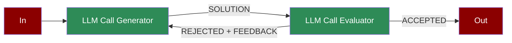

<p align="center">
  <picture>
    <source media="(prefers-color-scheme: dark)" srcset="docs/logo/dark.png" />
    <source media="(prefers-color-scheme: light)" srcset="docs/logo/light.png" />
    
  </picture>
</p>

<p align="center">
<a href="https://github.com/MervinPraison/PraisonAI"></a>
<a href="https://github.com/MervinPraison/PraisonAI"></a>
<a href="https://github.com/MervinPraison/PraisonAI"></a>
</p>

<div align="center">

# Praison AI

<a href="https://trendshift.io/repositories/9130" target="_blank"></a>

</div>

PraisonAI é um fork do projeto original [MervinPraison/PraisonAI](https://github.com/MervinPraison/PraisonAI).
Esta versão é mantida por [Habdel-Edenfield](https://github.com/Habdel-Edenfield) e está sendo reformulada como **laboratório de aprendizado** sobre o desenvolvimento de agentes de IA.
Nosso objetivo é fornecer exemplos claros e documentação prática para a construção de sistemas multiagentes.
O repositório está em constante evolução e novas funcionalidades serão adicionadas ao longo do tempo.

<div align="center">
  <a href="https://docs.praison.ai">
    <p align="center">
      
    </p>
  </a>
</div>

Para mais detalhes, consulte a [documentação em Português](docs/pt-br/README.md).

## Principais Recursos

- 🤖 **Criação Automatizada de Agentes** – [[Guia rápido]](docs/pt-br/03_usando_praisonai/04_criando_seu_primeiro_agente.md)
- 🔄 **Agentes com Auto-Reflexão** – [[Avaliador/Otimizador]](docs/pt-br/04_workflows_avancados/07_avaliador_otimizador_agentico.md)
- 🧠 **Agentes com Raciocínio** – [[Workflows Autônomos]](docs/pt-br/04_workflows_avancados/04_workflow_autonomo_agentico.md)
- 👁️ **Agentes Multimodais** – *em desenvolvimento*
- 🤝 **Colaboração Multiagente** – [[Processos de Colaboração]](docs/pt-br/04_workflows_avancados/01_processos_colaboracao_agentes.md)
- 🎭 **Fluxos de Trabalho para Agentes** – [[Visão geral]](docs/pt-br/04_workflows_avancados/02_workflow_roteamento_agentico.md)
- 📚 **Adicionar Conhecimento Personalizado** – [[RAG e Conhecimento]](docs/pt-br/02_conceitos_fundamentais/06_conhecimento_rag.md)
- 🧠 **Memória de Curto e Longo Prazo** – [[Conceitos de Memória]](docs/pt-br/02_conceitos_fundamentais/05_memoria.md)
- 📄 **Conversar com PDFs** – [[RAG e Conhecimento]](docs/pt-br/02_conceitos_fundamentais/06_conhecimento_rag.md#chat-with-pdf-agents)
- 💻 **Agentes com Code Interpreter** – *em desenvolvimento*
- 📚 **RAG Agents** – [[RAG e Conhecimento]](docs/pt-br/02_conceitos_fundamentais/06_conhecimento_rag.md)
- 🤔 **Processamento Assíncrono e Paralelo** – [[Paralelização]](docs/pt-br/04_workflows_avancados/05_paralelizacao_agentica.md)
- 🔄 **Auto Agents** – [[Uso em Python]](docs/pt-br/03_usando_praisonai/01_usando_com_python.md#explorando-mais-exemplos-python)
- 🔢 **Agentes de Matemática** – *em desenvolvimento*
- 🎯 **Saída Estruturada** – *em desenvolvimento*
- 🔗 **Integração com LangChain** – [[Ferramentas]](docs/pt-br/02_conceitos_fundamentais/04_ferramentas.md#conceito-fundamental-ferramentas-tools)
- 📞 **Agentes com Callback** – *em desenvolvimento*
- 🤏 **Mini Agentes** – *em desenvolvimento*
- 🛠️ **Mais de 100 Ferramentas** – [[Ferramentas]](docs/pt-br/02_conceitos_fundamentais/04_ferramentas.md)
- 📄 **Configuração via YAML** – [[Guia YAML]](docs/pt-br/03_usando_praisonai/02_usando_com_yaml.md)
- 💯 **Suporte a 100+ LLMs** – [[Modelos LLM]](docs/pt-br/06_modelos_llm/00_usando_diferentes_llms.md)

## Usando com Python

Pacote leve dedicado para programação:
```bash
pip install praisonaiagents
```

```bash
export OPENAI_API_KEY=xxxxxxxxxxxxxxxxxxxxxx
```

### 1. Agente Único

Crie o arquivo `app.py` e adicione o código abaixo:
```python
from praisonaiagents import Agent
agent = Agent(instructions="Your are a helpful AI assistant")
agent.start("Write a movie script about a robot in Mars")
```

Execute:
```bash
python app.py
```

### 2. Múltiplos Agentes

Crie o arquivo `app.py` e adicione o código abaixo:
```python
from praisonaiagents import Agent, PraisonAIAgents

research_agent = Agent(instructions="Research about AI")
summarise_agent = Agent(instructions="Summarise research agent's findings")
agents = PraisonAIAgents(agents=[research_agent, summarise_agent])
agents.start()
```

Execute:
```bash
python app.py
```

## Uso Sem Código

### Modo Automático:
```bash
pip install praisonai
export OPENAI_API_KEY=xxxxxxxxxxxxxxxxxxxxxx
praisonai --auto create a movie script about Robots in Mars
```

## Usando com JavaScript

```bash
npm install praisonai
export OPENAI_API_KEY=xxxxxxxxxxxxxxxxxxxxxx
```

```javascript
const { Agent } = require('praisonai');
const agent = new Agent({ instructions: 'You are a helpful AI assistant' });
agent.start('Write a movie script about a robot in Mars');
```


## AI Agents Flow


## AI Agents with Tools

Create AI agents that can use tools to interact with external systems and perform actions.


## AI Agents with Memory

Create AI agents with memory capabilities for maintaining context and information across tasks.


## AI Agents with Different Processes

### Sequential Process

The simplest form of task execution where tasks are performed one after another.


### Hierarchical Process

Uses a manager agent to coordinate task execution and agent assignments.


### Workflow Process

Advanced process type supporting complex task relationships and conditional execution.


#### Agentic Routing Workflow

Create AI agents that can dynamically route tasks to specialized LLM instances.


#### Agentic Orchestrator Worker

Create AI agents that orchestrate and distribute tasks among specialized workers.


#### Agentic Autonomous Workflow

Create AI agents that can autonomously monitor, act, and adapt based on environment feedback.


#### Agentic Parallelization

Create AI agents that can execute tasks in parallel for improved performance.


#### Agentic Prompt Chaining

Create AI agents with sequential prompt chaining for complex workflows.


#### Agentic Evaluator Optimizer

Create AI agents that can generate and optimize solutions through iterative feedback.



#### Repetitive Agents

Create AI agents that can efficiently handle repetitive tasks through automated loops.


## Adding Models

<div align="center">
  <a href="https://docs.praison.ai/models">
    <p align="center">
      
    </p>
  </a>
</div>

## Ollama Integration
```bash
export OPENAI_BASE_URL=http://localhost:11434/v1
```

## Groq Integration
Replace xxxx with Groq API KEY:
```bash
export OPENAI_API_KEY=xxxxxxxxxxx
export OPENAI_BASE_URL=https://api.groq.com/openai/v1
```

## No Code Options

## Agents Playbook

### Simple Playbook Example

Create `agents.yaml` file and add the code below:

```yaml
framework: praisonai
topic: Artificial Intelligence
roles:
  screenwriter:
    backstory: "Skilled in crafting scripts with engaging dialogue about {topic}."
    goal: Create scripts from concepts.
    role: Screenwriter
    tasks:
      scriptwriting_task:
        description: "Develop scripts with compelling characters and dialogue about {topic}."
        expected_output: "Complete script ready for production."
```

*To run the playbook:*
```bash
praisonai agents.yaml
```

## Use 100+ Models

- https://docs.praison.ai/models/
<div align="center">
  <a href="https://docs.praison.ai">
    <p align="center">
      
    </p>
  </a>
</div>

## Development:

Below is used for development only.

### Using uv
```bash
# Install uv if you haven't already
pip install uv

# Install from requirements
uv pip install -r pyproject.toml

# Install with extras
uv pip install -r pyproject.toml --extra code
uv pip install -r pyproject.toml --extra "crewai,autogen"
```

## Contributing

- Fork on GitHub: Use the "Fork" button on the repository page.
- Clone your fork: `git clone https://github.com/yourusername/praisonAI.git`
- Create a branch: `git checkout -b new-feature`
- Make changes and commit: `git commit -am "Add some feature"`
- Push to your fork: `git push origin new-feature`
- Submit a pull request via GitHub's web interface.
- Await feedback from project maintainers.

## Other Features

- 🔄 Use CrewAI or AG2 (Formerly AutoGen) Framework
- 💻 Chat with ENTIRE Codebase
- 🎨 Interactive UIs
- 📄 YAML-based Configuration
- 🛠️ Custom Tool Integration
- 🔍 Internet Search Capability (using Crawl4AI and Tavily)
- 🖼️ Vision Language Model (VLM) Support
- 🎙️ Real-time Voice Interaction

## Star History

[](https://docs.praison.ai)

## Video Tutorials

| Topic | Video |
|-------|--------|
| AI Agents with Self Reflection | [](https://www.youtube.com/watch?v=vLXobEN2Vc8) |
| Reasoning Data Generating Agent | [](https://www.youtube.com/watch?v=fUT332Y2zA8) |
| AI Agents with Reasoning | [](https://www.youtube.com/watch?v=KNDVWGN3TpM) |
| Multimodal AI Agents | [](https://www.youtube.com/watch?v=hjAWmUT1qqY) |
| AI Agents Workflow | [](https://www.youtube.com/watch?v=yWTH44QPl2A) |
| Async AI Agents | [](https://www.youtube.com/watch?v=VhVQfgo00LE) |
| Mini AI Agents | [](https://www.youtube.com/watch?v=OkvYp5aAGSg) |
| AI Agents with Memory | [](https://www.youtube.com/watch?v=1hVfVxvPnnQ) |
| Repetitive Agents | [](https://www.youtube.com/watch?v=dAYGxsjDOPg) |
| Introduction | [](https://www.youtube.com/watch?v=Fn1lQjC0GO0) |
| Tools Overview | [](https://www.youtube.com/watch?v=XaQRgRpV7jo) |
| Custom Tools | [](https://www.youtube.com/watch?v=JSU2Rndh06c) |
| Firecrawl Integration | [](https://www.youtube.com/watch?v=UoqUDcLcOYo) |
| User Interface | [](https://www.youtube.com/watch?v=tg-ZjNl3OCg) |
| Crawl4AI Integration | [](https://www.youtube.com/watch?v=KAvuVUh0XU8) |
| Chat Interface | [](https://www.youtube.com/watch?v=sw3uDqn2h1Y) |
| Code Interface | [](https://www.youtube.com/watch?v=_5jQayO-MQY) |
| Mem0 Integration | [](https://www.youtube.com/watch?v=KIGSgRxf1cY) |
| Training | [](https://www.youtube.com/watch?v=aLawE8kwCrI) |
| Realtime Voice Interface | [](https://www.youtube.com/watch?v=frRHfevTCSw) |
| Call Interface | [](https://www.youtube.com/watch?v=m1cwrUG2iAk) |
| Reasoning Extract Agents | [](https://www.youtube.com/watch?v=2PPamsADjJA) |

