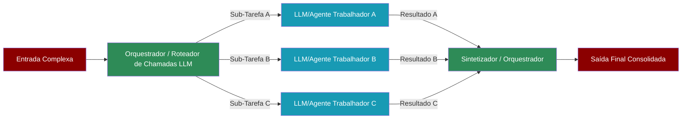

# TODO: Translate this file to English

# Workflows Avançados: Orquestrador-Trabalhador Agêntico (Agentic Orchestrator Worker)

O padrão **Orquestrador-Trabalhador Agêntico (Agentic Orchestrator Worker)** é uma evolução do conceito de [Processo Hierárquico](./01_processos_colaboracao_agentes.md#2-processo-hierárquico-hierarchical-process). Ele envolve um agente **Orquestrador** (semelhante a um gerente) que decompõe uma tarefa complexa, distribui sub-tarefas para múltiplos agentes **Trabalhadores** especializados, e depois um componente (que pode ser o próprio Orquestrador ou um agente **Sintetizador** dedicado) que coleta, analisa e combina os resultados dos trabalhadores para produzir a saída final.

Este padrão é eficaz para problemas que podem ser paralelizados ou que se beneficiam da combinação de múltiplas perspectivas ou especialidades.

## Como Funciona o Padrão Orquestrador-Trabalhador?

1.  **Entrada (Input):** Uma tarefa ou problema complexo é apresentado ao Orquestrador.
2.  **Decomposição e Delegação (Orquestrador):**
    *   O Orquestrador analisa a tarefa principal e a divide em sub-tarefas menores e mais gerenciáveis.
    *   Ele pode usar um [Roteador Agêntico](./02_workflow_roteamento_agentico.md) interno ou sua própria lógica para designar cada sub-tarefa a um agente Trabalhador apropriado (ou a um LLM específico). Múltiplos trabalhadores podem operar em paralelo.
3.  **Processamento (Trabalhadores):**
    *   Cada agente Trabalhador executa sua sub-tarefa designada, possivelmente usando suas próprias ferramentas e conhecimentos especializados.
4.  **Coleta e Síntese (Orquestrador ou Sintetizador):**
    *   Os resultados das sub-tarefas executadas pelos Trabalhadores são retornados.
    *   O Orquestrador (ou um agente Sintetizador dedicado) coleta esses resultados parciais.
    *   Ele então analisa, filtra, combina e/ou resume as informações para construir uma resposta coesa e completa para a tarefa original.
5.  **Saída (Output):** O resultado final consolidado é apresentado.

**Diagrama (do `README.md` do PraisonAI):**

*No diagrama, "Router" e "Orchestrator" podem ser o mesmo agente, e o "Synthesizer" também pode ser uma função do Orquestrador ou um agente separado.*

## Casos de Uso

*   **Relatórios de Pesquisa Abrangentes:** Um Orquestrador pode designar a diferentes Trabalhadores a tarefa de pesquisar diferentes aspectos de um tópico (ex: histórico, aplicações atuais, implicações éticas, futuro). Um Sintetizador então combina essas seções em um relatório coeso.
*   **Análise de Múltiplas Fontes de Dados:** Cada Trabalhador analisa um conjunto de dados diferente; o Sintetizador integra os insights.
*   **Desenvolvimento de Software Modular:** O Orquestrador define módulos de um software; diferentes Trabalhadores implementam cada módulo; o Sintetizador (ou o Orquestrador) lida com a integração.
*   **Planejamento de Eventos Complexos:** Trabalhadores podem cuidar de diferentes partes do planejamento (local, catering, convidados, entretenimento), e o Orquestrador/Sintetizador monta o plano mestre.
*   **Brainstorming e Geração de Ideias:** Múltiplos Trabalhadores geram ideias sobre um problema, e o Sintetizador as agrupa, filtra e prioriza.

## Implementação no PraisonAI (Conceitual)

A implementação deste padrão no PraisonAI geralmente envolve um processo hierárquico ou um workflow customizado:

1.  **Agente Orquestrador:**
    *   **Role/Goal:** "Gerente de Projeto de Pesquisa", "Arquiteto de Soluções". Seu objetivo é decompor o problema, delegar e garantir a qualidade da saída final.
    *   **Instructions:** Devem incluir como analisar a tarefa principal, como dividi-la, a quem delegar (com base nos `roles` dos trabalhadores disponíveis) e como os resultados devem ser sintetizados.
    *   **Pode usar ferramentas:** Para ajudar na decomposição ou para chamar os trabalhadores.

2.  **Agentes Trabalhadores:**
    *   São agentes especializados, cada um com seu `role`, `goal`, `backstory`, `instructions` e `tools` específicos para sua área de especialização.
    *   Ex: "Pesquisador de Dados Históricos", "Analista Financeiro", "Redator Técnico".

3.  **Agente Sintetizador (Opcional, ou função do Orquestrador):**
    *   Se for um agente separado:
        *   **Role/Goal:** "Editor Chefe", "Integrador de Relatórios". Seu objetivo é pegar múltiplos inputs e criar um output unificado e de alta qualidade.
        *   **Instructions:** Como combinar informações de diferentes fontes, resolver conflitos, garantir consistência e formato.

**Exemplo YAML Conceitual:**

```yaml
framework: praisonai
# process: hierarchical # Implícito pela estrutura ou explicitado

# manager_agent: orquestrador_pesquisa (O Orquestrador é o gerente)

roles:
  orquestrador_pesquisa:
    role: "Líder de Pesquisa de Mercado"
    goal: "Produzir um relatório de análise de mercado completo sobre um novo produto."
    instructions: |
      Você recebeu a tarefa de criar um relatório de análise de mercado.
      1. Decomponha a análise em: Análise da Concorrência, Perfil do Público-Alvo, e Análise de Tendências de Mercado.
      2. Delegue cada uma dessas seções para os especialistas apropriados: 'analista_concorrencia', 'especialista_publico', 'analista_tendencias'.
      3. Colete os relatórios parciais de cada especialista.
      4. Sintetize esses relatórios em um documento final coeso, adicionando uma introdução e uma conclusão com recomendações estratégicas.
    tasks:
      gerenciar_relatorio_mercado: # Tarefa principal do orquestrador
        description: "Coordenar a criação do relatório de análise de mercado."
        expected_output: "Relatório de análise de mercado finalizado e abrangente."

  analista_concorrencia:
    role: "Analista de Concorrência"
    goal: "Analisar os principais concorrentes do novo produto."
    # ... instructions, tools ...
    tasks:
      pesquisar_concorrentes:
        description: "Identificar 3 principais concorrentes, seus pontos fortes, fracos e participação de mercado."
        expected_output: "Relatório detalhado sobre a concorrência."

  especialista_publico:
    role: "Especialista em Público-Alvo"
    goal: "Definir e analisar o público-alvo do novo produto."
    # ... instructions, tools ...
    tasks:
      definir_personas:
        description: "Criar 2-3 personas detalhadas para o público-alvo, incluindo dados demográficos, necessidades e comportamentos."
        expected_output: "Documento de personas."

  analista_tendencias:
    role: "Analista de Tendências de Mercado"
    goal: "Identificar as principais tendências de mercado relevantes para o novo produto."
    # ... instructions, tools ...
    tasks:
      analisar_tendencias:
        description: "Pesquisar e resumir as 3 principais tendências de mercado que podem impactar o produto."
        expected_output: "Sumário das tendências de mercado."

# O workflow implícito aqui é que o 'orquestrador_pesquisa' primeiro delega as tarefas
# para os outros três agentes. Depois que eles concluem, o 'orquestrador_pesquisa'
# executa uma etapa final de síntese (que poderia ser uma tarefa separada para ele mesmo,
# usando os resultados dos outros como contexto).
```

## Vantagens do Padrão

*   **Paralelização:** Sub-tarefas podem ser executadas em paralelo, acelerando o tempo total de processamento.
*   **Especialização:** Permite o uso de agentes ou LLMs altamente especializados para cada sub-tarefa, melhorando a qualidade.
*   **Escalabilidade:** Mais trabalhadores podem ser adicionados para lidar com problemas maiores.
*   **Modularidade:** O sistema é mais fácil de entender, manter e atualizar, pois os componentes são especializados.

## Desafios

*   **Decomposição da Tarefa:** A habilidade do Orquestrador em decompor a tarefa principal de forma eficaz é crucial.
*   **Síntese dos Resultados:** Combinar os resultados de múltiplos trabalhadores pode ser complexo, especialmente se houver informações conflitantes ou redundantes. O Sintetizador precisa de boas instruções ou lógica para isso.
*   **Gerenciamento do Fluxo:** Coordenar múltiplos trabalhadores, lidar com possíveis falhas em sub-tarefas e gerenciar o fluxo de dados pode ser desafiador.

O padrão Orquestrador-Trabalhador Agêntico é uma abordagem robusta para resolver problemas complexos que se beneficiam de uma abordagem de "dividir para conquistar" com múltiplos especialistas.

A seguir, exploraremos o **Agentic Autonomous Workflow**, onde os agentes têm mais autonomia para interagir com o ambiente.
