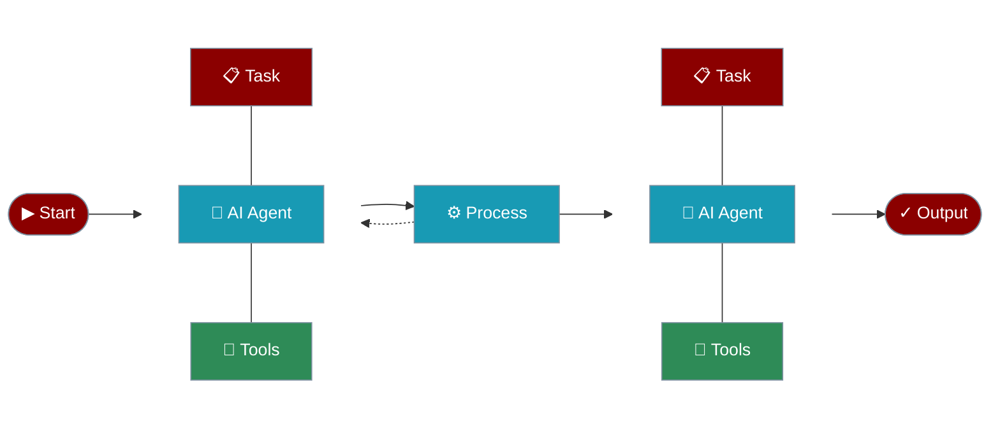

PraisonAI provides a diverse set of specialized agents for various tasks. Each agent is designed with specific capabilities and tools to handle different types of tasks effectively.



## Data & Analysis

<CardGroup cols={2}>
  <Card title="Data Analyst" icon="chart-line" href="/agents/data-analyst">
    Analyze data from various sources, create visualizations, and generate insights.
  </Card>
  <Card title="Finance" icon="money-bill-trend-up" href="/agents/finance">
    Track stocks, analyze financial data, and provide investment recommendations.
  </Card>
  <Card title="Research" icon="magnifying-glass-chart" href="/agents/research">
    Conduct comprehensive research and analysis across various topics.
  </Card>
  <Card title="Wikipedia" icon="book" href="/agents/wikipedia">
    Search and extract information from Wikipedia articles.
  </Card>
</CardGroup>

## Media & Content

<CardGroup cols={2}>
  <Card title="Image Analysis" icon="image" href="/agents/image">
    Analyze and understand visual content from images.
  </Card>
  <Card title="Image to Text" icon="text" href="/agents/image-to-text">
    Convert images to textual descriptions and extract text content.
  </Card>
  <Card title="Video" icon="video" href="/agents/video">
    Analyze video content and extract meaningful information.
  </Card>
  <Card title="Markdown" icon="markdown" href="/agents/markdown">
    Generate and format content in Markdown syntax.
  </Card>
</CardGroup>

## Search & Recommendations

<CardGroup cols={2}>
  <Card title="Web Search" icon="globe" href="/agents/websearch">
    Perform intelligent web searches and gather information.
  </Card>
  <Card title="Recommendation" icon="thumbs-up" href="/agents/recommendation">
    Generate personalized recommendations based on preferences.
  </Card>
  <Card title="Shopping" icon="shop" href="/agents/shopping">
    Compare prices and find the best deals across stores.
  </Card>
  <Card title="Planning" icon="calendar" href="/agents/planning">
    Create travel plans and detailed itineraries.
  </Card>
</CardGroup>

## Development

<CardGroup cols={2}>
  <Card title="Programming" icon="code" href="/agents/programming">
    Write, analyze, and debug code across multiple languages.
  </Card>
  <Card title="Single Agent" icon="circle-1" href="/agents/single">
    Simple, focused agent for basic tasks without external tools.
  </Card>
</CardGroup>

## Getting Started

Each agent can be easily initialized and customized for your specific needs. Here's a basic example:

```python
from praisonaiagents import Agent

# Create an agent with specific instructions
agent = Agent(instructions="Your task-specific instructions")

# Start the agent with a task
response = agent.start("Your task description")
```

For more detailed information about each agent, click on the respective cards above.