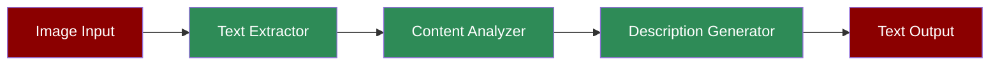

A workflow demonstrating how the Image-to-Text Agent can extract text from images and generate comprehensive descriptions.

## Quick Start

<Steps>
    <Step title="Install Package">
        First, install the PraisonAI Agents package:
        ```bash
        pip install praisonaiagents
        ```
    </Step>

    <Step title="Set API Key">
        Set your OpenAI API key as an environment variable:
        ```bash
        export OPENAI_API_KEY=your_api_key_here
        ```
    </Step>

    <Step title="Create Script">
        Create a new file `image_to_text.py`:
        ```python
        from praisonaiagents import Agent, Task, PraisonAIAgents

        # Create Image-to-Text Agent
        image_text_agent = Agent(
            name="ImageTextConverter",
            role="Image Text Extraction Specialist",
            goal="Convert image content to textual descriptions and extract text",
            backstory="""You are an expert in OCR and image understanding.
            You excel at extracting text from images and generating detailed descriptions.""",
            llm="gpt-4o-mini",
            self_reflect=False
        )

        # Create text extraction task
        extraction_task = Task(
            name="extract_text",
            description="Extract all text from this image and describe its layout.",
            expected_output="Extracted text and layout description",
            agent=image_text_agent,
            images=["document.jpg"]
        )

        # Create description task
        description_task = Task(
            name="generate_description",
            description="Generate a detailed description of the image content.",
            expected_output="Comprehensive description of visual elements",
            agent=image_text_agent,
            images=["scene.jpg"]
        )

        # Create PraisonAIAgents instance
        agents = PraisonAIAgents(
            agents=[image_text_agent],
            tasks=[extraction_task, description_task],
            process="sequential",
            verbose=1
        )

        # Run analysis
        agents.start()
        ```
    </Step>
</Steps>

## Understanding Image-to-Text Conversion

The Image-to-Text Agent combines multiple capabilities to convert visual content into textual form:

1. **OCR Processing**: Extracts text from images using optical character recognition
2. **Layout Analysis**: Understands the spatial arrangement of text and visual elements
3. **Content Description**: Generates natural language descriptions of image content
4. **Text Formatting**: Preserves text formatting and structure where possible

## Features

<CardGroup cols={2}>
  <Card title="Text Extraction" icon="text">
    Advanced OCR capabilities for text extraction.
  </Card>
  <Card title="Layout Understanding" icon="table-layout">
    Analysis of text and content layout.
  </Card>
  <Card title="Content Description" icon="pen-to-square">
    Detailed descriptions of visual content.
  </Card>
  <Card title="Format Preservation" icon="paragraph">
    Maintains text formatting and structure.
  </Card>
</CardGroup>

## Example Usage

```python
# Example: Processing a document image
document_task = Task(
    name="process_document",
    description="Extract text and analyze document layout",
    expected_output="Extracted text with layout information",
    agent=image_text_agent,
    images=["business_document.jpg"]
)

# Run single task
agents = PraisonAIAgents(
    agents=[image_text_agent],
    tasks=[document_task],
    process="sequential"
)
agents.start()
```

## Next Steps

- Learn about [Prompt Chaining](/features/promptchaining) for complex document processing
- Explore [Evaluator Optimizer](/features/evaluator-optimiser) for improving text extraction accuracy
- Check out the [Image Agent](/agents/image) for pure image analysis capabilities
