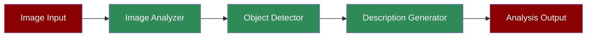

A workflow demonstrating how the Image Analysis Agent can process and analyze visual content, detect objects, and generate detailed descriptions.

## Quick Start

<Steps>
    <Step title="Install Package">
        First, install the PraisonAI Agents package:
        ```bash
        pip install praisonaiagents
        ```
    </Step>

    <Step title="Set API Key">
        Set your OpenAI API key as an environment variable:
        ```bash
        export OPENAI_API_KEY=your_api_key_here
        ```
    </Step>

    <Step title="Create Script">
        Create a new file `image_analysis.py`:
        ```python
        from praisonaiagents import Agent, Task, PraisonAIAgents

        # Create Image Analysis Agent
        image_agent = Agent(
            name="ImageAnalyst",
            role="Image Analysis Specialist",
            goal="Analyze images and videos to extract meaningful information",
            backstory="""You are an expert in computer vision and image analysis.
            You excel at describing images, detecting objects, and understanding visual content.""",
            llm="gpt-4o-mini",
            self_reflect=False
        )

        # Create tasks for different types of analysis
        task1 = Task(
            name="analyze_landmark",
            description="Describe this famous landmark and its architectural features.",
            expected_output="Detailed description of the landmark's architecture and significance",
            agent=image_agent,
            images=["https://example.com/landmark.jpg"]
        )

        task2 = Task(
            name="analyze_local_image",
            description="What objects can you see in this image? Describe their arrangement.",
            expected_output="Detailed description of objects and their spatial relationships",
            agent=image_agent,
            images=["local_image.jpg"]
        )

        # Create PraisonAIAgents instance
        agents = PraisonAIAgents(
            agents=[image_agent],
            tasks=[task1, task2],
            process="sequential",
            verbose=1
        )

        # Run analysis
        agents.start()
        ```
    </Step>
</Steps>

## Understanding Image Analysis

The Image Analysis Agent is designed to process and understand visual content through several key capabilities:

1. **Image Input**: Supports both URL and local file inputs
2. **Object Detection**: Identifies and locates objects within images
3. **Architectural Analysis**: Specialized in analyzing architectural features
4. **Spatial Understanding**: Describes spatial relationships between objects

## Features

<CardGroup cols={2}>
  <Card title="Multiple Input Sources" icon="images">
    Support for both URL and local image files.
  </Card>
  <Card title="Object Detection" icon="magnifying-glass">
    Advanced object detection and recognition.
  </Card>
  <Card title="Architectural Analysis" icon="building">
    Specialized analysis of architectural features.
  </Card>
  <Card title="Detailed Descriptions" icon="pen">
    Generation of comprehensive visual descriptions.
  </Card>
</CardGroup>

## Example Usage

```python
# Example: Analyzing a landmark image
landmark_task = Task(
    name="analyze_famous_landmark",
    description="Analyze this historical landmark",
    expected_output="Architectural details and historical significance",
    agent=image_agent,
    images=["https://example.com/landmark.jpg"]
)

# Run single task
agents = PraisonAIAgents(
    agents=[image_agent],
    tasks=[landmark_task],
    process="sequential"
)
agents.start()
```

## Next Steps

- Learn about [Prompt Chaining](/features/promptchaining) for complex image analysis workflows
- Explore [Evaluator Optimizer](/features/evaluator-optimiser) for improving analysis accuracy
- Check out the [Video Agent](/agents/video) for video content analysis
