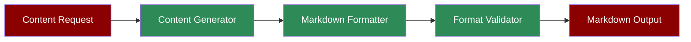

A workflow demonstrating how the Markdown Agent can generate and format content in Markdown syntax.

## Quick Start

<Steps>
    <Step title="Install Package">
        First, install the PraisonAI Agents package:
        ```bash
        pip install praisonaiagents
        ```
    </Step>

    <Step title="Set API Key">
        Set your OpenAI API key as an environment variable:
        ```bash
        export OPENAI_API_KEY=your_api_key_here
        ```
    </Step>

    <Step title="Create Script">
        Create a new file `markdown_generator.py`:
        ```python
        from praisonaiagents import Agent

        # Create Markdown Agent
        markdown_agent = Agent(
            name="MarkdownWriter",
            role="Markdown Content Specialist",
            goal="Generate well-formatted content in Markdown syntax",
            instructions="You are a Markdown Agent, output in markdown format",
            llm="gpt-4o-mini",
            self_reflect=False
        )

        # Generate content
        response = markdown_agent.start(
            "Write a blog post about artificial intelligence"
        )
        
        # Save to file
        with open('blog_post.md', 'w') as f:
            f.write(response)
        ```
    </Step>
</Steps>

## Understanding Markdown Generation

The Markdown Agent specializes in creating properly formatted Markdown content:

1. **Content Generation**: Creates original content based on prompts
2. **Markdown Formatting**: Applies proper Markdown syntax
3. **Structure Validation**: Ensures correct formatting
4. **Document Organization**: Creates well-structured documents

## Features

<CardGroup cols={2}>
  <Card title="Content Creation" icon="pen-to-square">
    Generates original, well-structured content.
  </Card>
  <Card title="Markdown Syntax" icon="code">
    Proper implementation of Markdown formatting.
  </Card>
  <Card title="Document Structure" icon="sitemap">
    Organized document hierarchy and sections.
  </Card>
  <Card title="Format Validation" icon="check">
    Ensures correct Markdown syntax usage.
  </Card>
</CardGroup>

## Example Usage

```python
# Example: Generate a technical documentation
agent = Agent(
    instructions="You are a Markdown Agent, output in markdown format"
)

# Generate API documentation
response = agent.start("""
    Create technical documentation for a REST API with:
    - Introduction
    - Authentication
    - Endpoints
    - Examples
""")

# Save documentation
with open('api_docs.md', 'w') as f:
    f.write(response)
```

## Next Steps

- Learn about [Prompt Chaining](/features/promptchaining) for complex document generation
- Explore [Evaluator Optimizer](/features/evaluator-optimiser) for improving content quality
- Check out the [Documentation Agent](/agents/documentation) for specialized documentation generation
