<Note>
  PraisonAI is a powerful framework for building and deploying AI agents that can understand, reason, and execute complex tasks autonomously.
</Note>

# What is PraisonAI?

```mermaid
graph LR
    %% Define the main flow
    Start([▶ Start]) --> Agent1
    Agent1 --> Process[⚙ Process]
    Process --> Agent2
    Agent2 --> Output([✓ Output])
    Process -.-> Agent1
    
    %% Styling for main elements
    style Start fill:#2D3047,stroke:#7C90A0,color:#fff
    style Output fill:#2D3047,stroke:#7C90A0,color:#fff
    style Process fill:#5C80BC,stroke:#7C90A0,color:#fff
    
    %% Define subgraphs for agents and their tasks
    subgraph Agent1[" "]
        Task1[📋 Task]
        AgentIcon1[🤖 AI Agent]
        Tools1[🔧 Tools]
        
        Task1 --- AgentIcon1
        AgentIcon1 --- Tools1
        
        style Task1 fill:#2D3047,stroke:#7C90A0,color:#fff
        style AgentIcon1 fill:#5C80BC,stroke:#7C90A0,color:#fff
        style Tools1 fill:#2D3047,stroke:#7C90A0,color:#fff
    end
    
    subgraph Agent2[" "]
        Task2[📋 Task]
        AgentIcon2[🤖 AI Agent]
        Tools2[🔧 Tools]
        
        Task2 --- AgentIcon2
        AgentIcon2 --- Tools2
        
        style Task2 fill:#2D3047,stroke:#7C90A0,color:#fff
        style AgentIcon2 fill:#5C80BC,stroke:#7C90A0,color:#fff
        style Tools2 fill:#2D3047,stroke:#7C90A0,color:#fff
    end
    
    %% Style for agent containers
    style Agent1 fill:#1B1F3B,stroke:#7C90A0,color:#fff
    style Agent2 fill:#1B1F3B,stroke:#7C90A0,color:#fff
    
    %% Global styles
    classDef default fill:#2D3047,stroke:#7C90A0,color:#fff
    linkStyle default stroke:#7C90A0,stroke-width:2px
```



## Core Components

<CardGroup cols={2}>
  <Card title="Agents" icon="user-robot">
    Autonomous AI entities that can understand context and execute tasks
  </Card>
  <Card title="Tasks" icon="list-check">
    Units of work that agents can execute independently or collaboratively
  </Card>
  <Card title="Process" icon="diagram-project">
    Workflow management for coordinating agent activities
  </Card>
  <Card title="Tools" icon="toolbox">
    Extensible capabilities that agents can leverage
  </Card>
</CardGroup>

## Key Features

<Steps>
  <Step title="Autonomous Agents">
    Create intelligent agents that can:
    - Understand natural language instructions
    - Make decisions based on context
    - Execute complex tasks autonomously
  </Step>
  <Step title="Flexible Architecture">
    Build with:
    - Modular components
    - Extensible tools
    - Customizable workflows
  </Step>
  <Step title="Advanced Capabilities">
    Leverage:
    - Multi-agent collaboration
    - Memory and context management
    - Tool integration
  </Step>
</Steps>

## Use Cases

<CardGroup cols={2}>
  <Card title="Customer Service" icon="headset">
    Build intelligent support agents that can handle customer inquiries and resolve issues autonomously.
  </Card>
  <Card title="Data Analysis" icon="chart-line">
    Create agents that can process, analyze, and derive insights from complex datasets.
  </Card>
  <Card title="Content Creation" icon="pen-nib">
    Deploy agents that can generate, edit, and optimize content across various formats.
  </Card>
  <Card title="Process Automation" icon="gears">
    Automate complex workflows with intelligent agents that can coordinate and execute tasks.
  </Card>
</CardGroup>

## Getting Started

<Warning>
  Before proceeding, ensure you have Python 3.9+ installed on your system.
</Warning>

### Quick Setup

<CodeGroup>
  ```bash pip
  pip install praisonai
  ```
</CodeGroup>

### Basic Example

```python
from praisonaiagents import Agent, Task, PraisonAIAgents

# Create an agent
researcher = Agent(
    name="Researcher",
    role="Senior Research Analyst",
    goal="Uncover cutting-edge developments in AI",
    backstory="You are an expert at a technology research group",
    verbose=True,
    llm="gpt-4o"
)

# Define a task
task = Task(
    name="research_task",
    description="Analyze 2024's AI advancements",
    expected_output="A detailed report",
    agent=researcher
)

# Run the agents
agents = PraisonAIAgents(
    agents=[researcher],
    tasks=[task],
    verbose=False
)

result = agents.start()
```

## Next Steps

<CardGroup cols={2}>
  <Card
    title="Installation"
    icon="download"
    href="/code/installation"
  >
    Complete installation guide and setup instructions
  </Card>
  <Card
    title="Quick Start"
    icon="play"
    href="/code/quickstart"
  >
    Build your first AI agent in minutes
  </Card>
</CardGroup>

<Tip>
  Join our community on [Discord](https://www.youtube.com/redirect?event=channel_description&redir_token=QUFFLUhqbUpiZE00YlF1MjB1LVNIeTFxTnV6MWRRc18wZ3xBQ3Jtc0ttQVZ0aFJ4RXRDanlBQU1Vd3lHU3BBcml3bzhoek1pTmlkZkFkWjlNVDBpRkxZd1dTOWhPc20xbHJOb1NibmNYeTEydklJT0pZOVJFQW93MmJOQXU0WkJNVzNsd29SZ3FBNFVwMTFGNThNSHBWVUhjSQ&q=https%3A%2F%2Fdiscord.gg%2FnNZu5gGT59) to connect with other developers and get help!
</Tip> 