<Note>
  Agents are the core building blocks of PraisonAI. Each agent is an autonomous AI entity with specific roles, goals, and capabilities.
</Note>

# Understanding Agents

```mermaid
graph LR
    %% Define the main flow
    Start([▶ Start]) --> Agent1
    Agent1 --> Process[⚙ Process]
    Process --> Agent2
    Agent2 --> Output([✓ Output])
    Process -.-> Agent1
    
    %% Styling for main elements
    style Start fill:#2D3047,stroke:#7C90A0,color:#fff
    style Output fill:#2D3047,stroke:#7C90A0,color:#fff
    style Process fill:#5C80BC,stroke:#7C90A0,color:#fff
    
    %% Define subgraphs for agents and their tasks
    subgraph Agent1[" "]
        Task1[📋 Task]
        AgentIcon1[🤖 AI Agent]
        Tools1[🔧 Tools]
        
        Task1 --- AgentIcon1
        AgentIcon1 --- Tools1
        
        style Task1 fill:#2D3047,stroke:#7C90A0,color:#fff
        style AgentIcon1 fill:#5C80BC,stroke:#7C90A0,color:#fff
        style Tools1 fill:#2D3047,stroke:#7C90A0,color:#fff
    end
    
    subgraph Agent2[" "]
        Task2[📋 Task]
        AgentIcon2[🤖 AI Agent]
        Tools2[🔧 Tools]
        
        Task2 --- AgentIcon2
        AgentIcon2 --- Tools2
        
        style Task2 fill:#2D3047,stroke:#7C90A0,color:#fff
        style AgentIcon2 fill:#5C80BC,stroke:#7C90A0,color:#fff
        style Tools2 fill:#2D3047,stroke:#7C90A0,color:#fff
    end
    
    %% Style for agent containers
    style Agent1 fill:#1B1F3B,stroke:#7C90A0,color:#fff
    style Agent2 fill:#1B1F3B,stroke:#7C90A0,color:#fff
    
    %% Global styles
    classDef default fill:#2D3047,stroke:#7C90A0,color:#fff
    linkStyle default stroke:#7C90A0,stroke-width:2px
```



## Key Components

<CardGroup cols={2}>
  <Card title="Role & Goal" icon="target">
    Defines the agent's purpose and objectives through role definition and specific goals
  </Card>
  <Card title="Capabilities" icon="toolbox">
    Tools and functions available to the agent for task execution
  </Card>
  <Card title="Memory" icon="brain">
    Context retention and learning capabilities across interactions
  </Card>
  <Card title="Language Model" icon="microchip">
    The underlying AI model powering the agent's intelligence
  </Card>
</CardGroup>

## Component Details

### Role and Goal
<Tip>
  Clear role and goal definitions are crucial for optimal agent performance.
</Tip>

| Component | Description | Example |
|:----------|:------------|:--------|
| **Role** | Agent's function and expertise | Research Analyst, Code Developer |
| **Goal** | Specific objectives to achieve | Analyze market trends, Generate reports |
| **Backstory** | Contextual background | Expert with 10 years of experience |

### Capabilities
<CodeGroup>
  ```python Basic
  agent = Agent(
      name="Researcher",
      role="Senior Research Analyst",
      goal="Uncover cutting-edge developments in AI",
      backstory="You are an expert at a technology research group",
      verbose=True,
      llm="gpt-4o",
      markdown=True
  )
  ```
</CodeGroup>

## Agent Types

<Steps>
  <Step title="Basic Agent">
    - Single-purpose focus
    - Direct user interaction
    - Limited tool set
  </Step>
  <Step title="Specialized Agent">
    - Domain expertise
    - Advanced capabilities
    - Custom tools
  </Step>
  <Step title="Collaborative Agent">
    - Team interaction
    - Task delegation
    - Shared context
  </Step>
</Steps>

## Best Practices

<Warning>
  Always implement proper error handling and resource management in your agent configurations.
</Warning>

### Agent Design
1. Clear role definition
2. Specific, measurable goals
3. Relevant tool selection
4. Appropriate memory configuration

### Agent Interaction
1. Clear communication protocols
2. Defined delegation rules
3. Error handling mechanisms
4. Resource management

## Advanced Features

<CardGroup cols={2}>
  <Card title="Memory Management" icon="brain">
    - Short-term conversation memory
    - Long-term knowledge retention
    - Context preservation
  </Card>
  <Card title="Tool Integration" icon="plug">
    - Custom tool development
    - External API integration
    - Resource access control
  </Card>
</CardGroup>

## Next Steps

<CardGroup cols={2}>
  <Card
    title="Create Your First Agent"
    icon="code"
    href="/code/quickstart"
  >
    Follow our quickstart guide to create your first agent
  </Card>
  <Card
    title="API Reference"
    icon="book"
    href="/api/praisonaiagents/agent/agent"
  >
    Explore the complete Agent API documentation
  </Card>
</CardGroup> 