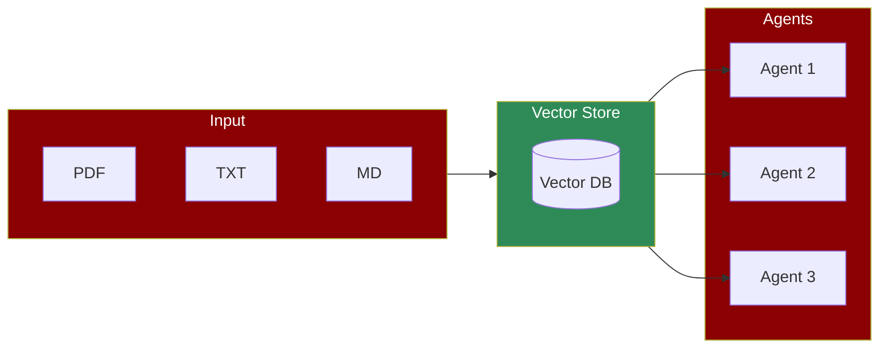

| Feature | [Knowledge](/concepts/knowledge) | [Memory](/concepts/memory) |
|---------|--------------------------------|---------------------------|
| When Used | Pre-loaded before agent execution | Created and updated during runtime |
| Purpose | Provide static reference information | Store dynamic context and interactions |
| Storage | Read-only knowledge base | Read-write memory store |
| Persistence | Permanent until explicitly changed | Can be temporary (STM) or persistent (LTM) |
| Updates | Manual updates through knowledge files | Automatic updates during agent execution |

## Quick Start

<Steps>
  <Step title="Install Package">
    Install PraisonAI Agents with knowledge support:
    ```bash
    pip install "praisonaiagents[knowledge]"
    ```
  </Step>

  <Step title="Set API Key">
    Set your OpenAI API key:
    ```bash
    export OPENAI_API_KEY=xxxxx
    ```
  </Step>

  <Step title="Create Script">
    Create a new file `app.py`:
    ```python
    from praisonaiagents import Agent

    agent = Agent(
        name="Knowledge Agent",
        instructions="You answer questions based on the provided knowledge.",
        knowledge=["small.pdf"]
    )

    agent.start("What is KAG in one line?")
    ```
  </Step>
</Steps>

## Basic Usage

The simplest way to create a knowledge-based agent is without any configuration:

```python
from praisonaiagents import Agent

agent = Agent(
    name="Knowledge Agent",
    instructions="You answer questions based on the provided knowledge.",
    knowledge=["small.pdf"]
)

agent.start("What is KAG in one line?")
```

## Advanced Configuration

For more control over the knowledge base, you can specify a configuration:

```python
from praisonaiagents import Agent

config = {
    "vector_store": {
        "provider": "chroma",
        "config": {
            "collection_name": "custom_knowledge",
            "path": ".praison",
        }
    }
}

agent = Agent(
    name="Knowledge Agent",
    instructions="You answer questions based on the provided knowledge.",
    knowledge=["small.pdf"],
    knowledge_config=config
)

agent.start("What is KAG in one line?")
```

## Multi-Agent Knowledge System

For more complex scenarios, you can create a knowledge-based system with multiple agents:

```python
from praisonaiagents import Agent, Task, PraisonAIAgents
import logging
import os

# Configure logging
logging.basicConfig(level=logging.INFO, format='%(asctime)s - %(levelname)s - %(message)s')
logger = logging.getLogger(__name__)

# Define the configuration for the Knowledge instance
config = {
    "vector_store": {
        "provider": "chroma",
        "config": {
            "collection_name": "knowledge_test",
            "path": ".praison",
        }
    }
}

# Create an agent with knowledge capabilities
knowledge_agent = Agent(
    name="KnowledgeAgent",
    role="Information Specialist",
    goal="Store and retrieve knowledge efficiently",
    backstory="Expert in managing and utilizing stored knowledge",
    knowledge=["sample.pdf"],
    knowledge_config=config,
    verbose=True
)

# Define a task for the agent
knowledge_task = Task(
    name="knowledge_task",
    description="Who is Mervin Praison?",
    expected_output="Answer to the question",
    agent=knowledge_agent
)

# Create and start the agents
agents = PraisonAIAgents(
    agents=[knowledge_agent],
    tasks=[knowledge_task],
    process="sequential",
    user_id="user1"
)

# Start execution
result = agents.start()
```

## Understanding Knowledge Configuration

<AccordionGroup>
  <Accordion title="Vector Store Options">
    - **Provider**: Choose between different vector store backends (e.g., "chroma")
    - **Collection Name**: Name for your knowledge collection
    - **Path**: Location to store the vector database
  </Accordion>
  
  <Accordion title="Supported File Types">
    - PDF documents (*.pdf)
    - Text files (*.txt)
    - Markdown files (*.md, *.mdx)
    - And more...
  </Accordion>

  <Accordion title="Multi-Agent Setup">
    - **Role**: Define specialized roles for knowledge agents
    - **Goal**: Set specific knowledge management objectives
    - **Process**: Choose between sequential or parallel execution
  </Accordion>
</AccordionGroup>

## Features

<CardGroup cols={2}>
  <Card title="Custom Knowledge" icon="book">
    Import your own documents and data as knowledge sources
  </Card>
  <Card title="Vector Storage" icon="database">
    Efficient storage and retrieval of knowledge embeddings
  </Card>
  <Card title="Multiple Sources" icon="layer-group">
    Combine multiple documents and file types
  </Card>
  <Card title="Persistent Storage" icon="hard-drive">
    Save and reuse knowledge bases across sessions
  </Card>
</CardGroup>

## Best Practices

1. **Document Preparation**
   - Clean and well-formatted documents work best
   - Break large documents into smaller chunks
   - Use consistent formatting

2. **Knowledge Organization**
   - Group related documents together
   - Use meaningful file names
   - Keep knowledge bases focused and relevant

3. **Performance Optimization**
   - Monitor vector store size
   - Clean up unused collections
   - Use appropriate chunk sizes

4. **Multi-Agent Coordination**
   - Define clear roles and responsibilities
   - Set appropriate logging levels for debugging
   - Use unique collection names for different agent groups

## Next Steps

- Learn about [Memory Management](/concepts/memory) for long-term recall
- Explore [Tool Integration](/concepts/tools) for enhanced capabilities
- Check out [Examples](/examples) for implementation ideas