<Note>
  Tasks are the fundamental units of work in PraisonAI, defining what needs to be done, how it should be done, and who should do it.
</Note>

## Core Components

<CardGroup cols={2}>
  <Card title="Task Definition" icon="file-lines">
    Clear description of work to be done and expected outputs
  </Card>
  <Card title="Agent Assignment" icon="user-check">
    Matching tasks with capable agents
  </Card>
  <Card title="Tool Access" icon="toolbox">
    Resources available for task completion
  </Card>
  <Card title="Output Handling" icon="file-export">
    Managing and formatting task results
  </Card>
</CardGroup>

## Task Configuration

<CodeGroup>
  ```python Basic
  task = Task(
      description="Research AI trends",
      expected_output="Summary report",
      agent=research_agent
  )
  ```
  ```python Advanced
  task = Task(
      description="Analyze market data",
      expected_output="Detailed analysis",
      agent=analyst_agent,
      tools=[AnalysisTool()],
      output_file="analysis.md",
      async_execution=True
  )
  ```
</CodeGroup>

# Understanding Tasks

```mermaid
graph LR
    %% Task Flow Steps
    Start([▶ Start]) --> TaskDef
    TaskDef --> AgentAssign
    AgentAssign --> Exec
    Exec --> Output([✓ Output])
    
    %% Define subgraphs for each step
    subgraph TaskDef[" "]
        TD_Icon[📋 Task Definition]
        TD_Desc[Description & Requirements]
        
        TD_Icon --- TD_Desc
        
        style TD_Icon fill:#2D3047,stroke:#7C90A0,color:#fff
        style TD_Desc fill:#5C80BC,stroke:#7C90A0,color:#fff
    end
    
    subgraph AgentAssign[" "]
        AA_Icon[🤖 Agent Assignment]
        AA_Desc[Matching & Delegation]
        
        AA_Icon --- AA_Desc
        
        style AA_Icon fill:#2D3047,stroke:#7C90A0,color:#fff
        style AA_Desc fill:#5C80BC,stroke:#7C90A0,color:#fff
    end
    
    subgraph Exec[" "]
        E_Icon[⚙️ Execution]
        E_Desc[Processing & Tools]
        
        E_Icon --- E_Desc
        
        style E_Icon fill:#2D3047,stroke:#7C90A0,color:#fff
        style E_Desc fill:#5C80BC,stroke:#7C90A0,color:#fff
    end
    
    %% Styling for main elements
    style Start fill:#2D3047,stroke:#7C90A0,color:#fff
    style Output fill:#2D3047,stroke:#7C90A0,color:#fff
    
    %% Style for containers
    style TaskDef fill:#1B1F3B,stroke:#7C90A0,color:#fff
    style AgentAssign fill:#1B1F3B,stroke:#7C90A0,color:#fff
    style Exec fill:#1B1F3B,stroke:#7C90A0,color:#fff
    
    %% Global styles
    classDef default fill:#2D3047,stroke:#7C90A0,color:#fff
    linkStyle default stroke:#7C90A0,stroke-width:2px
```

<br />

<br /><br />


```mermaid
graph LR
    %% Task States
    Pending([📥 Pending]) --> InProgress([⚡ In Progress])
    InProgress --> Completed([✅ Completed])
    InProgress --> Failed([❌ Failed])
    
    %% Styling
    style Pending fill:#2D3047,stroke:#7C90A0,color:#fff
    style InProgress fill:#5C80BC,stroke:#7C90A0,color:#fff
    style Completed fill:#2D3047,stroke:#7C90A0,color:#fff
    style Failed fill:#2D3047,stroke:#7C90A0,color:#fff
    
    %% Global styles
    classDef default fill:#2D3047,stroke:#7C90A0,color:#fff
    linkStyle default stroke:#7C90A0,stroke-width:2px
```

## Task Types

<Steps>
  <Step title="Basic Task">
    Simple, single-operation tasks with clear inputs and outputs
  </Step>
  <Step title="Decision Task">
    Tasks involving choices and conditional paths
    ```python
    decision_task = Task(
        type="decision",
        conditions={
            "success": ["next_task"],
            "failure": ["error_task"]
        }
    )
    ```
  </Step>
  <Step title="Loop Task">
    Repetitive operations over collections
    ```python
    loop_task = Task(
        type="loop",
        items=data_list,
        operation="process_item"
    )
    ```
  </Step>
</Steps>

## Task Relationships

<Warning>
  Properly managing task dependencies is crucial for complex workflows. Always ensure proper context sharing and error handling.
</Warning>

### Context Sharing
```python
task_a = Task(name="research")
task_b = Task(
    name="analyze",
    context=[task_a]  # Uses task_a's output
)
```

### Task Dependencies

| Relationship | Description | Example |
|:-------------|:------------|:--------|
| **Sequential** | Tasks run one after another | Research → Analysis → Report |
| **Parallel** | Independent tasks run simultaneously | Data Collection + Processing |
| **Conditional** | Tasks depend on previous results | Success → Next Task, Failure → Retry |

## Advanced Features

<CardGroup cols={2}>
  <Card title="Output Handling" icon="file-code">
    - Multiple output formats
    - Structured data validation
    - File system integration
  </Card>
  <Card title="Task Control" icon="sliders">
    - Execution flow control
    - Error recovery
    - Progress tracking
  </Card>
</CardGroup>

## Getting Started

<Steps>

  <Step title="Install PraisonAI">
    Install the core package:
    ```bash Terminal
    pip install praisonaiagents
    ```
  </Step>

  <Step title="Configure Environment">
    ```bash Terminal
    export OPENAI_API_KEY=your_openai_key
    ```
    Generate your OpenAI API key from [OpenAI](https://platform.openai.com/api-keys)
    Use other LLM providers like Ollama, Anthropic, Groq, Google, etc. Please refer to the [Models](/models) for more information.
  </Step>

  <Step title="Create Agent">
    Create `app.py`:
<CodeGroup>
  ```python Single Agent
  from praisonaiagents import Agent, Task, PraisonAIAgents

  # Create an agent
  researcher = Agent(
      name="Researcher",
      role="Senior Research Analyst",
      goal="Uncover cutting-edge developments in AI",
      backstory="You are an expert at a technology research group",
      verbose=True,
      llm="gpt-4o"
  )

  # Define a task
  task = Task(
      name="research_task",
      description="Analyze 2024's AI advancements",
      expected_output="A detailed report",
      agent=researcher
  )

  # Run the agents
  agents = PraisonAIAgents(
      agents=[researcher],
      tasks=[task],
      verbose=False
  )

  result = agents.start()
  ```

  ```python Multiple Agents
  from praisonaiagents import Agent, Task, PraisonAIAgents

  # Create multiple agents
  researcher = Agent(
      name="Researcher",
      role="Senior Research Analyst",
      goal="Uncover cutting-edge developments in AI",
      backstory="You are an expert at a technology research group",
      verbose=True,
      llm="gpt-4o",
      markdown=True
  )

  writer = Agent(
      name="Writer",
      role="Tech Content Strategist",
      goal="Craft compelling content on tech advancements",
      backstory="You are a content strategist",
      llm="gpt-4o",
      markdown=True
  )

  # Define multiple tasks
  task1 = Task(
      name="research_task",
      description="Analyze 2024's AI advancements",
      expected_output="A detailed report",
      agent=researcher
  )

  task2 = Task(
      name="writing_task",
      description="Create a blog post about AI advancements",
      expected_output="A blog post",
      agent=writer
  )

  # Run with hierarchical process
  agents = PraisonAIAgents(
      agents=[researcher, writer],
      tasks=[task1, task2],
      verbose=False,
      process="hierarchical",
      manager_llm="gpt-4o"
  )

  result = agents.start()
  ```
</CodeGroup>
  </Step>
</Steps>

## Best Practices

<Note>
Design tasks to be atomic and focused. Each task should have a single, clear responsibility.
</Note>

<CardGroup cols={2}>
  <Card title="Task Design Principles" icon="compass-drafting" iconType="solid">
    <AccordionGroup>
      <Accordion title="Clear Task Descriptions">
        Write precise, unambiguous task descriptions that clearly state the task's purpose and requirements.
        ```python
        task = Task(
            description=(
                "Analyze Q4 2024 sales data "
                "and generate growth metrics"
            ),
            expected_output="Sales growth report"
        )
        ```
      </Accordion>

      <Accordion title="Success Criteria">
        Define measurable success criteria to ensure task completion can be properly evaluated.
        ```python
        task = Task(
            success_criteria={
                "format": "markdown",
                "metrics": [
                    "growth_rate",
                    "revenue_change"
                ],
                "min_confidence": 0.95
            }
        )
        ```
      </Accordion>

      <Accordion title="Task Dependencies">
        Specify any dependencies or prerequisites for the task.
        ```python
        task = Task(
            description="Generate final report",
            dependencies=[
                data_collection_task,
                analysis_task
            ],
            wait_for_dependencies=True
        )
        ```
      </Accordion>
    </AccordionGroup>
  </Card>

  <Card title="Resource Management" icon="server" iconType="solid">
    <AccordionGroup>
      <Accordion title="Tool Selection">
        Choose appropriate tools that match your task's requirements.
        ```python
        task = Task(
            tools=[
                DataAnalyzer(),
                ReportGenerator(),
                MetricsCalculator()
            ],
            tool_config={
                "timeout": 30,
                "retry": True
            }
        )
        ```
      </Accordion>

      <Accordion title="Error Handling">
        Implement comprehensive error management strategies.
        ```python
        task = Task(
            error_strategy="retry",
            max_retries=3,
            fallback_handler=handler,
            error_callbacks=[
                log_error,
                notify_admin
            ]
        )
        ```
      </Accordion>

      <Accordion title="Resource Limits">
        Set appropriate resource constraints for optimal performance.
        ```python
        task = Task(
            memory_limit="2GB",
            timeout=300,
            max_concurrent=5,
            cpu_priority="high",
            auto_scale=True
        )
        ```
      </Accordion>

      <Accordion title="Performance Monitoring">
        Configure monitoring and logging for task execution.
        ```python
        task = Task(
            monitoring={
                "metrics": ["duration", "memory", "cpu"],
                "log_level": "INFO",
                "trace_enabled": True,
                "alert_threshold": 0.85
            }
        )
        ```
      </Accordion>
    </AccordionGroup>
  </Card>
</CardGroup>

## Async Task Execution

<CardGroup cols={1}>
  <Card title="Async Task Features" icon="bolt" iconType="solid">
    <Tabs>
      <Tab title="Basic Configuration">
        ```python
        async_task = Task(
            description="Perform async operation",
            expected_output="Async result",
            agent=async_agent,
            async_execution=True,  # Enable async execution
            callback=async_callback  # Optional async callback
        )
        ```
        - Enable async execution with `async_execution=True`
        - Perfect for I/O-heavy operations
        - Supports parallel task execution
      </Tab>
      
      <Tab title="Async Callbacks">
        ```python
        async def async_callback(output: TaskOutput):
            await asyncio.sleep(1)  # Simulate async operation
            print(f"Processed output: {output.raw}")

        task = Task(
            description="Task with async callback",
            expected_output="Result",
            agent=agent,
            async_execution=True,
            callback=async_callback
        )
        ```
        - Support for async callbacks
        - Process results asynchronously
        - Handle task completion events
      </Tab>
      
      <Tab title="Mixed Execution">
        ```python
        # Create mixed task types
        sync_task = Task(
            description="Synchronous operation",
            async_execution=False
        )

        async_task = Task(
            description="Asynchronous operation",
            async_execution=True
        )

        # Run with mixed execution
        agents = PraisonAIAgents(
            agents=[sync_agent, async_agent],
            tasks=[sync_task, async_task]
        )
        result = await agents.astart()
        ```
        - Mix sync and async tasks
        - Flexible execution patterns
        - Optimal resource utilization
      </Tab>
    </Tabs>
  </Card>
</CardGroup>

<Tip>
**Pro Tip**: Use async execution for tasks that involve I/O operations (like API calls or file operations) to improve overall performance. Keep CPU-intensive tasks synchronous.
</Tip>

## Next Steps

<CardGroup cols={2}>
  <Card
    title="Create Tasks"
    icon="plus"
    href="/code/quickstart"
  >
    Learn how to create and configure tasks
  </Card>
  <Card
    title="Task API"
    icon="code"
    href="/api/praisonaiagents/task/task"
  >
    Explore the complete Task API documentation
  </Card>
</CardGroup>