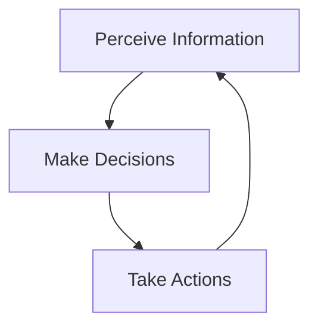

# Introduction to AI Agents

Welcome to the beginners' course on AI Agents! This course is designed to help you understand and build your own AI agents, even if you have little to no programming experience.

## What Are AI Agents?

An AI agent is a software program that can:
- Understand information from its environment
- Make decisions based on that information
- Take actions to achieve specific goals

Think of an AI agent like a helpful assistant that can perform tasks for you automatically.

## Examples in Daily Life

You might already be using AI agents without realizing it:

- **Virtual Assistants**: Siri, Alexa, and Google Assistant are AI agents that respond to your voice commands
- **Recommendation Systems**: Netflix, YouTube, and Amazon use AI agents to suggest content you might like
- **Smart Home Devices**: Devices that adjust temperature or lighting based on your preferences

## What You'll Learn in This Course

Throughout this course, you will:

1. Understand the basic concepts of AI agents
2. Learn about different types of AI agents
3. Explore how AI agents make decisions
4. Discover how to build simple AI agents without complex programming
5. Create your own functional AI agents

## Who This Course Is For

This course is perfect for:
- Complete beginners with no prior knowledge of AI
- Non-technical professionals interested in how AI can solve problems
- Students curious about artificial intelligence
- Anyone who wants to understand and use AI agents in practical ways

Let's begin our journey into the fascinating world of AI agents!
<iframe 
  id="codeExecutionFrame"
  src="https://code-execution-server-praisonai.replit.app/?code=import%20openai%0A%0Aclient%20%3D%20openai.OpenAI()%0Aresult%20%3D%20client.chat.completions.create(%0A%20%20%20%20model%3D%22gpt-3.5-turbo%22%2C%0A%20%20%20%20messages%3D%5B%0A%20%20%20%20%20%20%20%20%7B%22role%22%3A%20%22user%22%2C%20%22content%22%3A%20%22Hello%20World%22%7D%0A%20%20%20%20%5D%0A)%0A%0Aprint(result.choices%5B0%5D.message.content)" 
  width="100%" 
  height="600px" 
  frameborder="0"
  allow="clipboard-read; clipboard-write"
  scrolling="yes"
  onload="resizeIframe(this)"
></iframe>

<IframeWithAutoHeight />

<CardGroup cols={1}>
  <Card title="Ready to Start?" icon="rocket">
    Continue to the next lesson to learn about the different types of AI agents.
  </Card>
</CardGroup>
