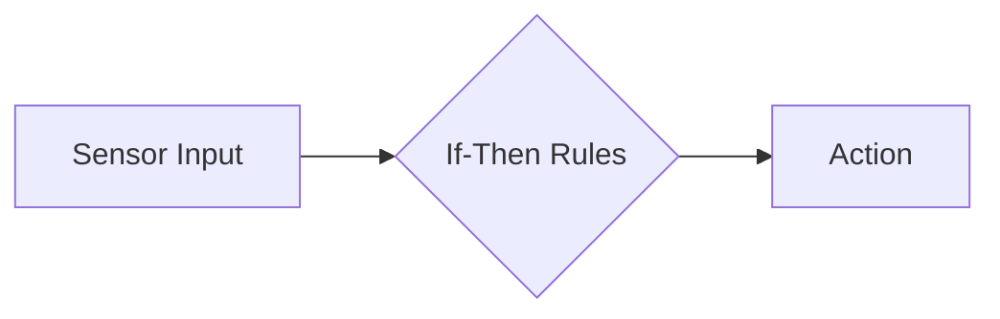

# Types of AI Agents

AI agents come in different forms, each designed for specific purposes and with varying levels of complexity. Understanding these types will help you choose the right approach for your needs.

## Simple Reflex Agents

These are the most basic type of AI agents that operate using simple if-then rules.

<CardGroup cols={1}>
  <Card title="Key Characteristics" icon="lightbulb">
    - React directly to current input only
    - No memory of past events
    - No prediction of future states
    - Use predefined rules to determine actions
  </Card>
</CardGroup>

**Real-world example**: A basic thermostat that turns heating on when temperature drops below a set point.

## Model-Based Agents

These agents maintain an internal model of their environment to make better decisions.

<CardGroup cols={1}>
  <Card title="Key Characteristics" icon="brain">
    - Build and maintain an internal representation of the world
    - Can work with partial information
    - Can consider "what if" scenarios
    - Make decisions based on their understanding of how the world works
  </Card>
</CardGroup>

**Real-world example**: A GPS navigation system that models roads and traffic conditions.

## Goal-Based Agents

These agents make decisions based on how their actions will help achieve specific goals.

<CardGroup cols={1}>
  <Card title="Key Characteristics" icon="bullseye">
    - Consider future consequences of actions
    - Evaluate which actions will lead toward goals
    - Can plan sequences of actions
    - Choose actions that maximize goal attainment
  </Card>
</CardGroup>

**Real-world example**: A chess-playing AI that plans moves to achieve checkmate.

## Utility-Based Agents

These agents choose actions that maximize a specific utility (or happiness) function.

<CardGroup cols={1}>
  <Card title="Key Characteristics" icon="chart-line">
    - Assign a utility value to different possible outcomes
    - Consider probability and risk
    - Choose actions that maximize expected utility
    - Can balance competing objectives
  </Card>
</CardGroup>

**Real-world example**: An investment robo-advisor that balances risk and return.

## Learning Agents

These agents improve their performance over time through experience.

<CardGroup cols={1}>
  <Card title="Key Characteristics" icon="graduation-cap">
    - Learn from past experiences
    - Adapt to changing environments
    - Improve decision-making over time
    - Can discover new strategies
  </Card>
</CardGroup>

**Real-world example**: Recommendation systems that learn your preferences over time.

## Understanding Agent Complexity

<Tip>
As you move from Simple Reflex Agents toward Learning Agents, both capability and complexity increase. For beginners, starting with simpler agent types is often best.
</Tip>

## Which Agent Type Should You Build?

The best type of agent for your project depends on:

1. **The problem complexity**: Simple problems may only need reflex agents
2. **Available data**: Learning agents need training data
3. **Required adaptability**: Will your agent need to adapt to new situations?
4. **Available resources**: More complex agents require more computational power

In this course, we'll focus primarily on goal-based and simple learning agents as they provide a good balance of capability and complexity for beginners.

<CardGroup cols={1}>
  <Card title="Next Steps" icon="arrow-right">
    In the next lesson, we'll explore how agents process information and make decisions.
  </Card>
</CardGroup>
