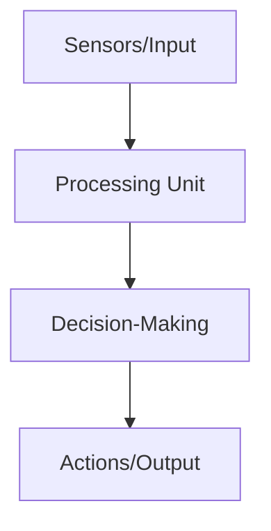
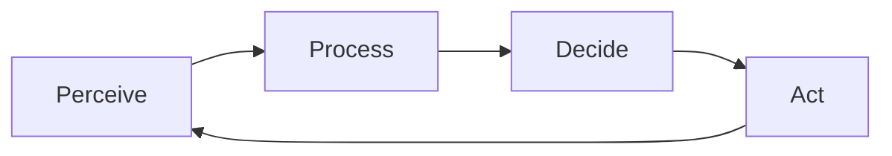
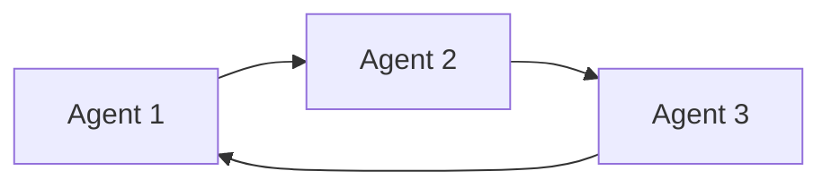

# Agent Architecture

Understanding how AI agents are structured will help you build more effective agents. This lesson covers the fundamental components of an agent's architecture.

## Basic Components of an AI Agent

Every AI agent, regardless of complexity, has these basic components:



### 1. Input (Sensors)

This is how agents receive information from their environment.

<CardGroup cols={1}>
  <Card title="Examples of Input" icon="eye">
    - Text input from users
    - Data from databases
    - Image or audio input
    - API responses
    - Sensor readings (in physical agents)
  </Card>
</CardGroup>

### 2. Processing Unit

This component processes information and converts it into a format the agent can understand.

<CardGroup cols={1}>
  <Card title="Processing Functions" icon="gears">
    - Data cleaning and transformation
    - Feature extraction
    - Context building
    - Information retrieval
    - Pattern recognition
  </Card>
</CardGroup>

### 3. Decision-Making Core

The "brain" of the agent that determines what actions to take.

<CardGroup cols={1}>
  <Card title="Decision Components" icon="brain">
    - Language models (like GPT-4)
    - Rule systems
    - Planning algorithms
    - Knowledge base
    - Memory systems
  </Card>
</CardGroup>

### 4. Output (Actions)

The actions the agent can perform to achieve its goals.

<CardGroup cols={1}>
  <Card title="Action Examples" icon="hand">
    - Generating text responses
    - Creating visual content
    - Making API calls
    - Controlling other systems
    - Updating databases
  </Card>
</CardGroup>

## The Agent Loop

Agents operate in a continuous loop:



This cycle allows agents to continuously:
1. Gather information
2. Update their understanding
3. Make new decisions
4. Take appropriate actions

## PraisonAI Agent Architecture

In the PraisonAI framework, agents follow a specific architecture:

<CardGroup cols={1}>
  <Card title="PraisonAI Agent Components" icon="puzzle-piece">
    - **Instructions**: Defines the agent's purpose and behavior
    - **Language Model**: Powers the agent's intelligence (e.g., GPT-4)
    - **Memory**: Stores context and previous interactions
    - **Tools**: Specialized capabilities an agent can use
  </Card>
</CardGroup>

### Simple Agent Structure

```python
from praisonaiagents import Agent

# Create a simple agent
research_agent = Agent(
    instructions="Research the latest developments in renewable energy",
    name="ResearchAgent"
)

# Start the agent
research_agent.start()
```

## Understanding Agent Communication

Multi-agent systems allow agents to communicate with each other:



Each agent can:
- Pass information to other agents
- Request assistance from specialized agents
- Collaborate on complex tasks

## Key Takeaways

<CardGroup cols={2}>
  <Card title="Component Importance" icon="check">
    Each component plays a vital role in the agent's functionality
  </Card>
  <Card title="Agent Customization" icon="gear">
    You can customize each component based on your specific needs
  </Card>
  <Card title="Component Balance" icon="scale-balanced">
    A well-designed agent balances all components effectively
  </Card>
  <Card title="Continuous Improvement" icon="arrow-trend-up">
    Agents can be improved by enhancing individual components
  </Card>
</CardGroup>

In the next lesson, we'll explore how to define effective instructions for your AI agents.
