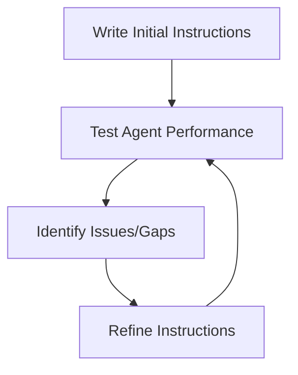

# Creating Effective Agent Instructions

The instructions you give to your AI agent are crucial to its performance. Well-crafted instructions lead to agents that understand their purpose and execute tasks effectively.

## Why Instructions Matter

Instructions serve as the agent's "job description" and guide its behavior:

<CardGroup cols={2}>
  <Card title="Clarity" icon="glasses">
    Clear instructions reduce confusion and misinterpretation
  </Card>
  <Card title="Focus" icon="bullseye">
    Specific instructions keep the agent on task
  </Card>
  <Card title="Boundaries" icon="border-all">
    Good instructions define what an agent should and shouldn't do
  </Card>
  <Card title="Personality" icon="face-smile">
    Instructions can shape how an agent communicates
  </Card>
</CardGroup>

## Elements of Effective Instructions

### 1. Role Definition

Tell the agent who it is and what its expertise should be.

<CodeGroup>
```text Good Example
You are a financial analyst with expertise in market trends and investment strategies.
```

```text Weak Example
You are a helper.
```
</CodeGroup>

### 2. Purpose and Goals

Clearly state what the agent should accomplish.

<CodeGroup>
```text Good Example
Your goal is to analyze company quarterly reports and provide actionable investment insights.
```

```text Weak Example
Help with finance stuff.
```
</CodeGroup>

### 3. Process Guidelines

Explain how the agent should approach tasks.

<CodeGroup>
```text Good Example
First analyze the data trends, then identify key risk factors, and finally make recommendations based on the client's risk tolerance.
```

```text Weak Example
Just do a good analysis.
```
</CodeGroup>

### 4. Response Format

Specify how you want information presented.

<CodeGroup>
```text Good Example
Present your analysis in a structured format with: Summary, Key Findings, Risk Assessment, and Recommendations.
```

```text Weak Example
Tell me what you find.
```
</CodeGroup>

## Instructions Template

Here's a template you can use to create effective agent instructions:

```
You are a [ROLE] specializing in [EXPERTISE AREAS].

Your goal is to [MAIN OBJECTIVE].

When approaching tasks:
1. [FIRST STEP/APPROACH]
2. [SECOND STEP/APPROACH]
3. [THIRD STEP/APPROACH]

Present your results in [FORMAT PREFERENCES].

Additional guidelines:
- [SPECIFIC BEHAVIOR 1]
- [SPECIFIC BEHAVIOR 2]
- [SPECIFIC BEHAVIOR 3]
```

## Examples in PraisonAI

Let's look at how instructions are implemented in PraisonAI:

<CodeGroup>
```python Simple Example
from praisonaiagents import Agent

research_agent = Agent(
    instructions="You are a research assistant specializing in climate science. Your goal is to find the latest research on rising sea levels and summarize key findings in bullet points."
)

research_agent.start()
```

```python Detailed Example
from praisonaiagents import Agent

content_agent = Agent(
    name="ContentCreator",
    instructions="""
    You are a content creation specialist with expertise in digital marketing.
    
    Your goal is to create engaging blog content that drives traffic and conversions.
    
    When creating content:
    1. Research the target keyword thoroughly
    2. Create an attention-grabbing headline
    3. Develop well-structured content with clear sections
    4. Include actionable takeaways for readers
    
    Present content in markdown format with proper headings, bullet points, and emphasis where appropriate.
    
    Additional guidelines:
    - Maintain a conversational but professional tone
    - Include 2-3 relevant statistics to support key points
    - Add a call-to-action at the end of each piece
    """
)

content_agent.start("Create a blog post about sustainable living tips")
```
</CodeGroup>

## Common Instruction Mistakes

<CardGroup cols={2}>
  <Card title="Being Too Vague" icon="cloud">
    Vague instructions lead to unpredictable outputs
  </Card>
  <Card title="Information Overload" icon="bomb">
    Too many details can confuse the agent's priorities
  </Card>
  <Card title="Contradictory Guidelines" icon="arrows-split-up-and-left">
    Conflicting instructions create confusion
  </Card>
  <Card title="Missing Context" icon="puzzle-piece-missing">
    Insufficient background information leads to generic outputs
  </Card>
</CardGroup>

## Refining Your Instructions

<Tip>
Good instructions often require iteration. Start with basic instructions, review the agent's performance, and refine as needed.
</Tip>

Effective instruction improvement follows this cycle:



In the next lesson, we'll explore how agents use tools to extend their capabilities.
