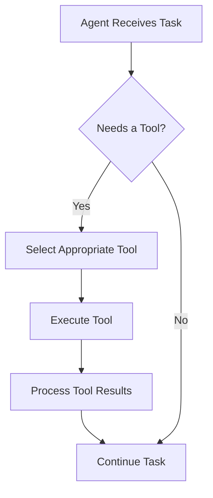

# Agent Tools

Tools allow AI agents to interact with the world and perform specific actions. Think of tools as the "hands" of your agent that let it accomplish tasks beyond just generating text.

## What Are Agent Tools?

<CardGroup cols={1}>
  <Card title="Definition" icon="toolbox">
    Tools are functions or capabilities that agents can access to perform specific actions, retrieve information, or interact with external systems.
  </Card>
</CardGroup>

Just as humans use tools to extend their physical abilities, AI agents use digital tools to extend their capabilities.

## Why Tools Matter

Tools transform agents from simple chat interfaces into powerful assistants that can:

<CardGroup cols={2}>
  <Card title="Access Information" icon="database">
    Retrieve data from various sources
  </Card>
  <Card title="Perform Calculations" icon="calculator">
    Analyze numbers and data accurately
  </Card>
  <Card title="Create Content" icon="pen-to-square">
    Generate images, code, or other media
  </Card>
  <Card title="Control Systems" icon="gears">
    Interact with other software or hardware
  </Card>
</CardGroup>

## Common Types of Tools

### 1. Information Retrieval Tools

These tools help agents access information beyond their training data.

**Examples:**
- Web search tools
- Database query tools
- Document retrieval tools

```python
# Example of a simple web search tool
from praisonaiagents import Agent

def web_search(query):
    # Simplified example
    return f"Results for: {query}"

agent = Agent(
    instructions="Research assistant",
    tools=[web_search]
)
```

### 2. Computation Tools

These tools perform calculations or data processing.

**Examples:**
- Calculator tools
- Data analysis tools
- Conversion tools

### 3. Content Creation Tools

These tools help generate or modify various types of content.

**Examples:**
- Image generation tools
- Code writing tools
- Document formatting tools

### 4. External API Tools

These tools connect to third-party services.

**Examples:**
- Weather API tools
- Translation API tools
- E-commerce API tools

## How Tools Work in PraisonAI

In the PraisonAI framework, tools follow a simple pattern:

1. Tools are defined as functions
2. Tools are registered with an agent
3. The agent decides when to use appropriate tools
4. Tool results are incorporated into the agent's reasoning



## Creating Basic Tools

Here's a simple example of creating and using tools in PraisonAI:

```python
from praisonaiagents import Agent

# Define a simple calculator tool
def calculator(expression):
    try:
        return str(eval(expression))
    except:
        return "Error: Could not calculate"

# Create an agent with the tool
math_agent = Agent(
    instructions="You are a math tutor helping students solve problems",
    tools=[calculator]
)

# Use the agent
math_agent.start("Calculate 24 * 17 and explain the steps")
```

## Tool Best Practices

<CardGroup cols={2}>
  <Card title="Clear Descriptions" icon="comment">
    Provide detailed descriptions so the agent knows when to use each tool
  </Card>
  <Card title="Error Handling" icon="shield">
    Make tools robust with proper error handling
  </Card>
  <Card title="Focused Purpose" icon="bullseye">
    Each tool should do one thing well
  </Card>
  <Card title="Input Validation" icon="check-double">
    Validate inputs to prevent misuse
  </Card>
</CardGroup>

## Building a Toolbox

As you advance, you'll want to create a collection of tools your agent can use:

```python
from praisonaiagents import Agent, Tool

# Define multiple tools
def weather(location):
    return f"Weather in {location}: Sunny, 75°F"

def translator(text, target_language):
    return f"Translated to {target_language}: {text} (placeholder)"

def reminder(message, time):
    return f"Reminder set for {time}: {message}"

# Create tool collection
tools = [
    Tool(name="weather", function=weather, description="Get weather for a location"),
    Tool(name="translator", function=translator, description="Translate text"),
    Tool(name="reminder", function=reminder, description="Set a reminder")
]

# Create agent with multiple tools
assistant = Agent(
    instructions="You are a helpful personal assistant",
    tools=tools
)
```

In the next lesson, we'll explore how agents use memory to maintain context across interactions.
