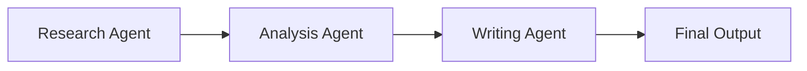
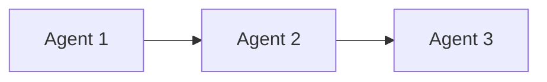
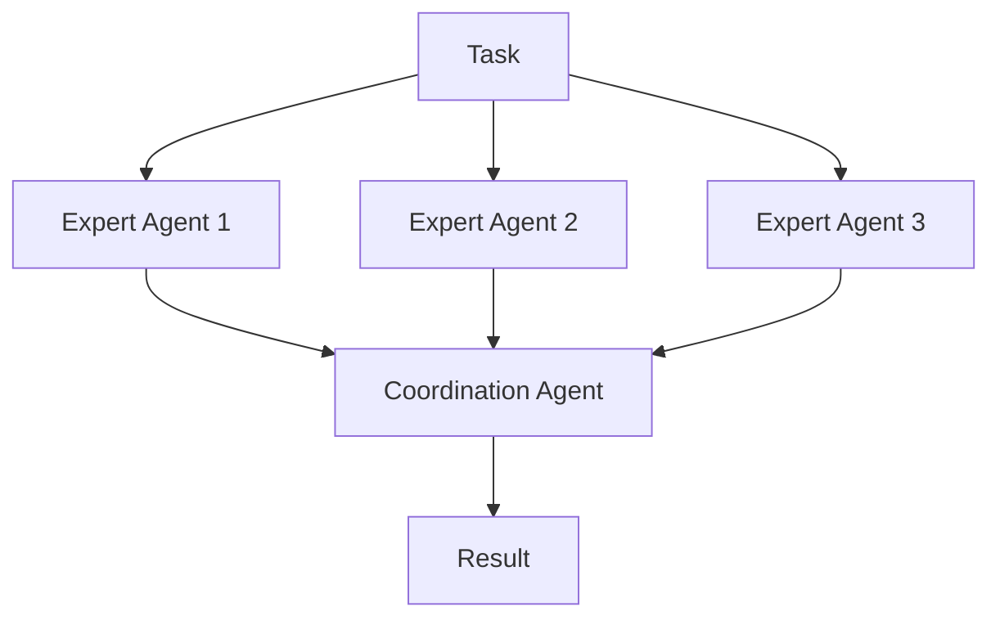
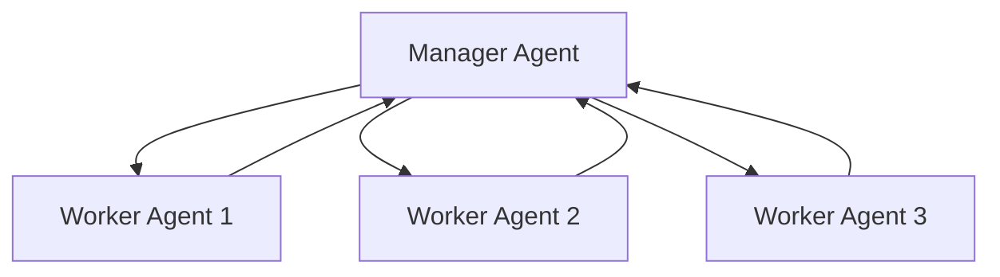

# Multi-Agent Systems

Multi-agent systems allow multiple AI agents to work together, each handling different parts of a complex task. This approach mirrors how human teams collaborate, with each member contributing their specialized skills.

## Why Use Multiple Agents?

<CardGroup cols={2}>
  <Card title="Specialization" icon="star">
    Each agent can focus on its area of expertise
  </Card>
  <Card title="Complex Tasks" icon="puzzle-piece">
    Break down difficult problems into manageable pieces
  </Card>
  <Card title="Scalability" icon="arrows-up-down">
    Add more agents as tasks become more complex
  </Card>
  <Card title="Diverse Perspectives" icon="lightbulb">
    Different agents can approach problems differently
  </Card>
</CardGroup>

## Basic Multi-Agent Architecture



In this example:
1. The Research Agent gathers information
2. The Analysis Agent processes and interprets the data
3. The Writing Agent creates the final content

## Multi-Agent Patterns

### 1. Pipeline Pattern

Agents work in sequence, with each agent handling a specific stage of the process.



**Example Use Case**: Content creation where one agent researches, another drafts, and a third edits.

### 2. Expert Panel Pattern

Multiple specialist agents work in parallel on the same problem, then their outputs are combined.



**Example Use Case**: Financial analysis where different experts analyze market trends, economic indicators, and company performance.

### 3. Hierarchical Pattern

A manager agent delegates tasks to worker agents and coordinates their efforts.



**Example Use Case**: Project management where a coordinator assigns tasks and integrates results.

## Implementing Multi-Agent Systems in PraisonAI

Here's a simple example of creating a multi-agent system:

```python
from praisonaiagents import Agent, PraisonAIAgents

# Create individual agents
research_agent = Agent(
    name="Researcher",
    instructions="Research the latest trends in renewable energy"
)

analysis_agent = Agent(
    name="Analyst",
    instructions="Analyze the research findings and identify key insights"
)

writing_agent = Agent(
    name="Writer", 
    instructions="Create a clear, engaging report based on the analysis"
)

# Create a multi-agent system
agents = PraisonAIAgents(
    agents=[research_agent, analysis_agent, writing_agent]
)

# Start the agents
agents.start()
```

## Agent Communication

For agents to work together effectively, they need to communicate. This happens through:

<CardGroup cols={2}>
  <Card title="Output Passing" icon="arrow-right">
    One agent's output becomes another's input
  </Card>
  <Card title="Shared Memory" icon="database">
    Agents can access common information
  </Card>
  <Card title="Message Exchange" icon="comments">
    Agents can send specific messages to each other
  </Card>
  <Card title="Coordination Protocols" icon="traffic-light">
    Rules that determine how agents interact
  </Card>
</CardGroup>

## Challenges in Multi-Agent Systems

<CardGroup cols={2}>
  <Card title="Coordination" icon="shuffle">
    Ensuring agents work together smoothly
  </Card>
  <Card title="Conflicting Goals" icon="arrows-split-up-and-left">
    Managing agents with different objectives
  </Card>
  <Card title="Information Transfer" icon="exchange">
    Passing information effectively between agents
  </Card>
  <Card title="Resource Management" icon="microchip">
    Allocating computational resources efficiently
  </Card>
</CardGroup>

## Designing Effective Multi-Agent Systems

<Tip>
Start simple with just 2-3 agents and a clear workflow before scaling to more complex systems.
</Tip>

Key principles for effective design:

1. **Clear Role Definition**: Each agent should have a specific and well-defined role
2. **Minimized Dependencies**: Reduce complex interdependencies between agents
3. **Standardized Communication**: Use consistent formats for information exchange
4. **Failure Handling**: Plan for cases where an agent fails to complete its task
5. **Performance Monitoring**: Track how well each agent and the overall system performs

In the next lesson, we'll explore how to create effective agent workflows using the Process component.
