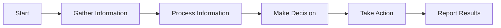
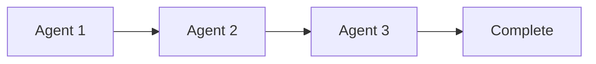
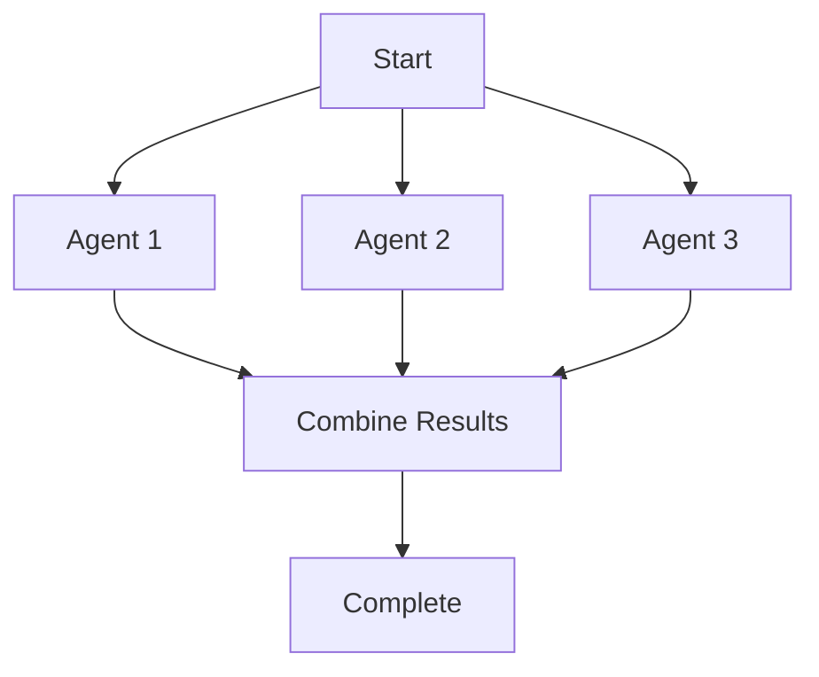
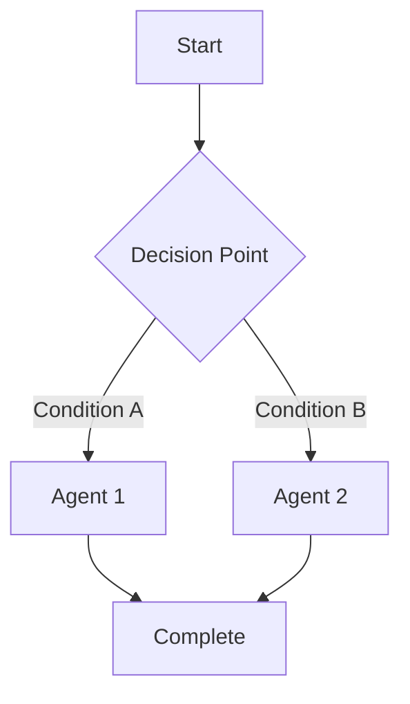

# Agent Process

The Process component in AI agent systems defines how agents work together and the flow of information between them. Think of it as the "playbook" that coordinates how agents complete tasks.

## What is an Agent Process?

<CardGroup cols={1}>
  <Card title="Definition" icon="route">
    A process is a structured workflow that defines the sequence of steps, decision points, and information flow between agents to complete a task.
  </Card>
</CardGroup>

## Process Flow Basics

A simple process flow might look like this:



Each step could be handled by a different agent or by the same agent in different stages.

## Types of Process Flows

### 1. Sequential Process

Agents work in a straight line, one after another.



**Best for**: Tasks with clear, linear stages

### 2. Parallel Process

Multiple agents work simultaneously on different parts of a task.



**Best for**: Tasks that can be broken into independent pieces

### 3. Conditional Process

The workflow changes based on decisions or conditions.



**Best for**: Tasks requiring different approaches based on circumstances

## Implementing Process in PraisonAI

Here's a simple example of creating a process in PraisonAI:

```python
from praisonaiagents import Agent, Process, PraisonAIAgents

# Create agents
research_agent = Agent(
    name="Researcher",
    instructions="Research the topic and gather key information about AI"
)

writing_agent = Agent(
    name="Writer",
    instructions="Create content based on the research"
)

editing_agent = Agent(
    name="Editor",
    instructions="Review and improve the content"
)

# Create the multi-agent system with the process
agents = PraisonAIAgents(
    agents=[research_agent, writing_agent, editing_agent],
    process="hierarchical"
)

# Start the process
agents.start()
```

## Process Best Practices

<CardGroup cols={2}>
  <Card title="Clear Step Definitions" icon="list-check">
    Define exactly what each step should accomplish
  </Card>
  <Card title="Error Handling" icon="bug">
    Include steps for handling unexpected situations
  </Card>
  <Card title="Feedback Loops" icon="repeat">
    Allow agents to request clarification when needed
  </Card>
  <Card title="Modular Design" icon="cubes">
    Create reusable process components
  </Card>
</CardGroup>

<Tip>
Start with simple processes and gradually add complexity as you become more comfortable with the system.
</Tip>

## Monitoring Process Execution

It's important to track how your processes are running:

```python
agents = PraisonAIAgents(
    agents=[research_agent, writing_agent, editing_agent],
    process=content_process,
    verbose=True  # Enables detailed logging
)
```

This will provide information about:
- Which step is currently running
- The inputs and outputs of each step
- Any errors or issues encountered

In the next lesson, we'll explore how to use knowledge bases to enhance agent capabilities.
