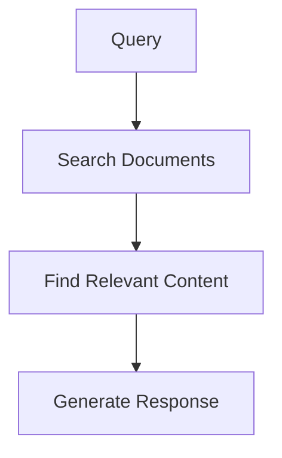
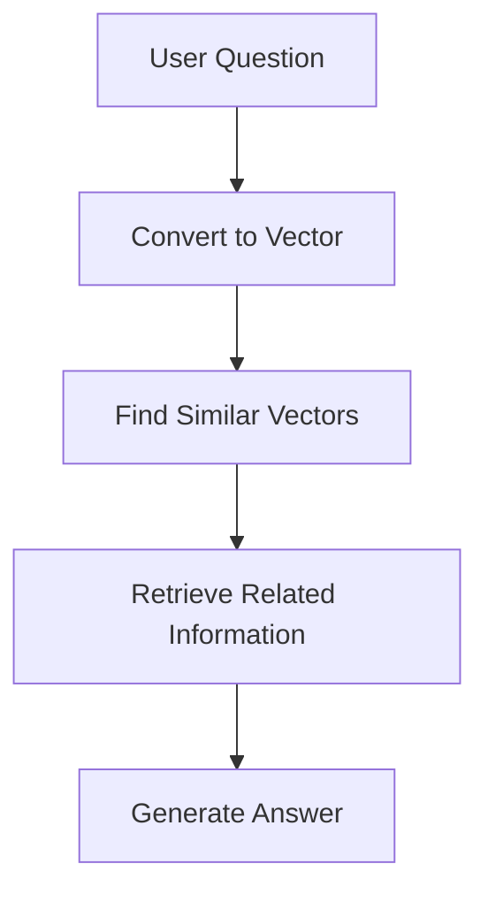
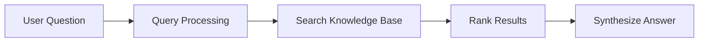

# Knowledge Bases

Knowledge bases provide agents with specialized information beyond their training data. They help agents answer specific questions, follow guidelines, or work within defined domains.

## What is a Knowledge Base?

<CardGroup cols={1}>
  <Card title="Definition" icon="database">
    A knowledge base is a structured collection of information that an agent can access to answer questions or make decisions.
  </Card>
</CardGroup>

Think of a knowledge base as a specialized reference library for your agent.

## Why Use Knowledge Bases?

<CardGroup cols={2}>
  <Card title="Domain Expertise" icon="user-graduate">
    Provide specialized information for specific fields
  </Card>
  <Card title="Current Information" icon="clock">
    Include data beyond the agent's training cutoff
  </Card>
  <Card title="Custom Guidelines" icon="list">
    Define rules and policies for the agent to follow
  </Card>
  <Card title="Consistent Responses" icon="equals">
    Ensure agents provide standardized answers
  </Card>
</CardGroup>

## Types of Knowledge Bases

### 1. Document Collections

Text documents, articles, guides, or manuals that agents can reference.



### 2. Structured Data

Databases, tables, or other structured formats that organize information systematically.

<CardGroup cols={1}>
  <Card title="Examples" icon="table">
    - Product catalogs with specifications
    - Customer information databases
    - Statistical data collections
    - Reference tables for compliance information
  </Card>
</CardGroup>

### 3. Vector Databases

Special databases that store information as numerical representations (vectors) for semantic search.



## Implementing Knowledge Bases in PraisonAI

Here's an example of how to use a knowledge base with an agent:

```python
from praisonaiagents import Agent

agent = Agent(
    name="Knowledge Agent",
    instructions="You answer questions based on the provided knowledge.",
    knowledge=["small.pdf"]
)

agent.start("What is KAG in one line?")
```

## Advanced Configuration

For more control over the knowledge base, you can specify a configuration:

```python
from praisonaiagents import Agent

config = {
    "vector_store": {
        "provider": "chroma",
        "config": {
            "collection_name": "custom_knowledge",
            "path": ".praison",
        }
    }
}

agent = Agent(
    name="Knowledge Agent",
    instructions="You answer questions based on the provided knowledge.",
    knowledge=["small.pdf"],
    knowledge_config=config
)

agent.start("What is KAG in one line?")
```

## Knowledge Retrieval Process

When an agent uses a knowledge base, this typical process occurs:



1. **Query Processing**: The user's question is analyzed
2. **Search**: The system searches the knowledge base for relevant information
3. **Ranking**: Results are ranked by relevance
4. **Synthesis**: The agent creates an answer using the retrieved information

## Best Practices for Knowledge Bases

<CardGroup cols={2}>
  <Card title="Keep Information Current" icon="arrows-rotate">
    Regularly update your knowledge base
  </Card>
  <Card title="Organize Logically" icon="folder-tree">
    Structure information in intuitive categories
  </Card>
  <Card title="Prioritize Quality" icon="star">
    Focus on accurate, high-quality information
  </Card>
  <Card title="Include Examples" icon="list">
    Add examples to illustrate complex concepts
  </Card>
</CardGroup>

## When to Use Knowledge Bases

Knowledge bases are particularly valuable when:

1. Your agent needs to reference specific information that may change over time
2. You need to ensure consistent answers to common questions
3. Your agent needs to follow specific guidelines or protocols
4. You want to provide expertise in specialized domains

<Tip>
Start with a small knowledge base focusing on the most important information, then expand as needed.
</Tip>

## Creating a Simple Knowledge Base

For beginners, you can start with a simple text-based knowledge base:

```
# Company FAQ Knowledge Base

## Return Policy
Our return policy allows customers to return products within 30 days of purchase for a full refund.

## Shipping Information
Standard shipping takes 3-5 business days. Express shipping takes 1-2 business days.

## Product Warranty
All products come with a 1-year limited warranty covering manufacturing defects.
```

Save this as a text file and add it to your knowledge base:

```python
kb = KnowledgeBase()
kb.add_document("company_faq.txt")
```

In the next lesson, we'll explore how agents handle tasks and the task management process.
