```mermaid
graph LR
    %% Task States
    Pending([📥 Pending]) --> InProgress([⚡ In Progress])
    InProgress --> Completed([✅ Completed])
    InProgress --> Failed([❌ Failed])
    
    %% Styling
    style Pending fill:#2D3047,stroke:#7C90A0,color:#fff
    style InProgress fill:#5C80BC,stroke:#7C90A0,color:#fff
    style Completed fill:#2D3047,stroke:#7C90A0,color:#fff
    style Failed fill:#2D3047,stroke:#7C90A0,color:#fff
    
    %% Global styles
    classDef default fill:#2D3047,stroke:#7C90A0,color:#fff
    linkStyle default stroke:#7C90A0,stroke-width:2px
```

# Agent Tasks

Tasks are the specific units of work that AI agents perform. Understanding how to define and manage tasks is essential for creating effective agent systems.

## What is an Agent Task?

<CardGroup cols={1}>
  <Card title="Definition" icon="list-check">
    A task is a specific, well-defined piece of work assigned to an agent with clear inputs, expected outputs, and success criteria.
  </Card>
</CardGroup>

Just as human jobs are broken into specific responsibilities, agent systems work best when complex goals are divided into manageable tasks.

## Anatomy of a Task

A well-defined task includes:

<CardGroup cols={2}>
  <Card title="Objective" icon="bullseye">
    What the task should accomplish
  </Card>
  <Card title="Inputs" icon="arrow-right-to-bracket">
    Information provided to complete the task
  </Card>
  <Card title="Process" icon="gears">
    Steps to follow or approach to take
  </Card>
  <Card title="Outputs" icon="arrow-right-from-bracket">
    Expected results or deliverables
  </Card>
</CardGroup>

## Task Types

### 1. Information Tasks

These tasks involve finding, analyzing, or summarizing information.

**Examples:**
- Research a topic
- Summarize a document
- Extract data from text
- Answer questions

### 2. Creation Tasks

These tasks involve generating new content.

**Examples:**
- Write an article
- Create a marketing plan
- Generate images (with appropriate tools)
- Design a workflow

### 3. Analysis Tasks

These tasks involve evaluating information and drawing conclusions.

**Examples:**
- Analyze data trends
- Review content for quality
- Evaluate options
- Identify patterns

### 4. Interaction Tasks

These tasks involve communicating or working with users or other systems.

**Examples:**
- Answer customer questions
- Guide users through processes
- Collect information from users
- Notify about events

## Creating Tasks in PraisonAI

### Task Flow

The typical lifecycle of a task follows this pattern:


### Task Configuration

<CodeGroup>
  ```python Basic
  task = Task(
      description="Research AI trends",
      expected_output="Summary report",
      agent=research_agent
  )
  ```
  ```python Advanced
  task = Task(
      description="Analyze market data",
      expected_output="Detailed analysis",
      agent=analyst_agent,
      tools=[AnalysisTool()],
      output_file="analysis.md",
      async_execution=True
  )
  ```
</CodeGroup>

# Understanding Tasks

```mermaid
graph LR
    %% Task Flow Steps
    Start([▶ Start]) --> TaskDef
    TaskDef --> AgentAssign
    AgentAssign --> Exec
    Exec --> Output([✓ Output])
    
    %% Define subgraphs for each step
    subgraph TaskDef[" "]
        TD_Icon[📋 Task Definition]
        TD_Desc[Description & Requirements]
        
        TD_Icon --- TD_Desc
        
        style TD_Icon fill:#2D3047,stroke:#7C90A0,color:#fff
        style TD_Desc fill:#5C80BC,stroke:#7C90A0,color:#fff
    end
    
    subgraph AgentAssign[" "]
        AA_Icon[🤖 Agent Assignment]
        AA_Desc[Matching & Delegation]
        
        AA_Icon --- AA_Desc
        
        style AA_Icon fill:#2D3047,stroke:#7C90A0,color:#fff
        style AA_Desc fill:#5C80BC,stroke:#7C90A0,color:#fff
    end
    
    subgraph Exec[" "]
        E_Icon[⚙️ Execution]
        E_Desc[Processing & Tools]
        
        E_Icon --- E_Desc
        
        style E_Icon fill:#2D3047,stroke:#7C90A0,color:#fff
        style E_Desc fill:#5C80BC,stroke:#7C90A0,color:#fff
    end
    
    %% Styling for main elements
    style Start fill:#2D3047,stroke:#7C90A0,color:#fff
    style Output fill:#2D3047,stroke:#7C90A0,color:#fff
    
    %% Style for containers
    style TaskDef fill:#1B1F3B,stroke:#7C90A0,color:#fff
    style AgentAssign fill:#1B1F3B,stroke:#7C90A0,color:#fff
    style Exec fill:#1B1F3B,stroke:#7C90A0,color:#fff
    
    %% Global styles
    classDef default fill:#2D3047,stroke:#7C90A0,color:#fff
    linkStyle default stroke:#7C90A0,stroke-width:2px
```

<br />

<br /><br />


## Task Types

<Steps>
  <Step title="Basic Task">
    Simple, single-operation tasks with clear inputs and outputs
  </Step>
  <Step title="Decision Task">
    Tasks involving choices and conditional paths
    ```python
    decision_task = Task(
        type="decision",
        conditions={
            "success": ["next_task"],
            "failure": ["error_task"]
        }
    )
    ```
  </Step>
  <Step title="Loop Task">
    Repetitive operations over collections
    ```python
    loop_task = Task(
        type="loop",
        items=data_list,
        operation="process_item"
    )
    ```
  </Step>
</Steps>

## Task Relationships

<Warning>
  Properly managing task dependencies is crucial for complex workflows. Always ensure proper context sharing and error handling.
</Warning>

### Context Sharing
```python
task_a = Task(name="research")
task_b = Task(
    name="analyze",
    context=[task_a]  # Uses task_a's output
)
```

## Task Best Practices

<CardGroup cols={2}>
  <Card title="Be Specific" icon="magnifying-glass">
    Clearly define what the task should accomplish
  </Card>
  <Card title="One Goal Per Task" icon="check-double">
    Each task should focus on a single objective
  </Card>
  <Card title="Provide Context" icon="circle-info">
    Include necessary background information
  </Card>
  <Card title="Define Success" icon="trophy">
    Specify what a successful outcome looks like
  </Card>
</CardGroup>

<Tip>
Break complex goals into multiple smaller tasks rather than creating one large, complex task.
</Tip>

## Common Task Mistakes

<CardGroup cols={2}>
  <Card title="Vague Instructions" icon="question">
    Unclear about what the agent should do
  </Card>
  <Card title="Too Many Objectives" icon="list-ol">
    Asking for too many things in one task
  </Card>
  <Card title="Missing Context" icon="puzzle-piece-missing">
    Not providing necessary background information
  </Card>
  <Card title="Unrealistic Expectations" icon="mountain-sun">
    Asking for tasks beyond agent capabilities
  </Card>
</CardGroup>

In the next lesson, we'll learn about creating your first complete agent application.
