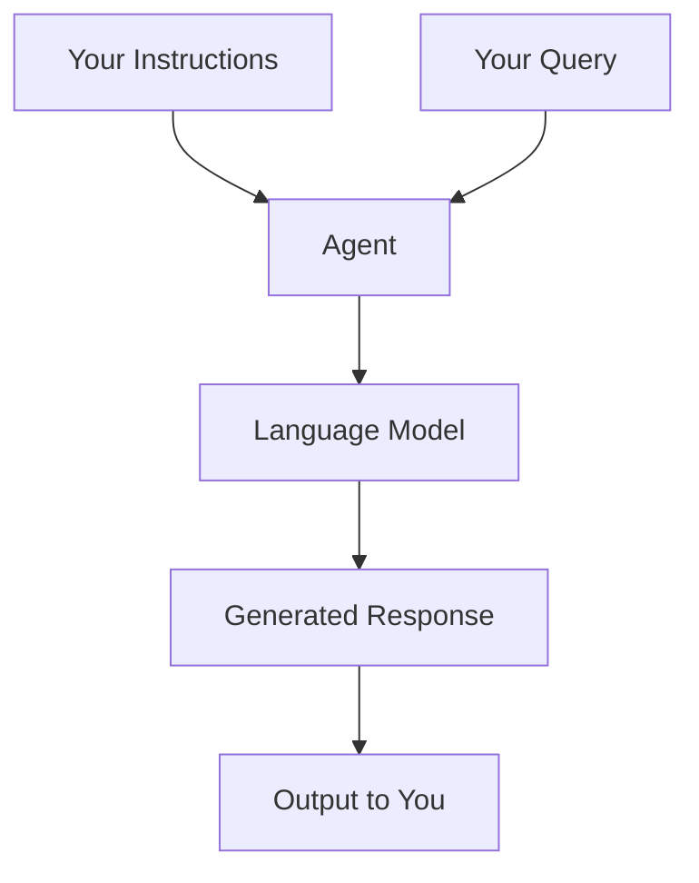

# Creating Your First Agent

In this lesson, we'll walk through the process of building a simple AI agent. We'll focus on practical implementation without complex programming.

## What We'll Build

We'll create a basic research assistant agent that can:
- Understand simple instructions
- Respond to questions
- Provide helpful information

## Prerequisites

Before you begin, make sure you have:

1. A basic understanding of the concepts from previous lessons
2. Python installed on your computer (if following the code examples)
3. An OpenAI API key (or access to another supported language model)

## Step 1: Installation

First, install the PraisonAI package:

```bash
pip install praisonaiagents
```

## Step 2: Setup Your Environment

Create a file called `first_agent.py` and set up your API key:

```python
import os
from praisonaiagents import Agent

# Set your API key
# Option 1: Set it in your environment (recommended)
# export OPENAI_API_KEY=your_key_here

# Option 2: Set it in your code (not recommended for production)
# os.environ["OPENAI_API_KEY"] = "your_key_here"
```

## Step 3: Define Your Agent

Now, let's create a simple agent:

```python
# Create a research assistant agent
research_assistant = Agent(
    name="ResearchAssistant",
    instructions="""
    You are a helpful research assistant that provides clear, 
    accurate information on various topics. When answering:
    
    1. Be concise and to the point
    2. Explain complex concepts in simple terms
    3. When appropriate, organize information with bullet points
    4. If you don't know something, admit it instead of guessing
    """
)
```

## Step 4: Start Your Agent

Now let's use our agent to answer a question:

```python
# Start the agent with a specific query
response = research_assistant.start("Explain how solar panels work in simple terms")

# Print the response
print(response)
```

## Step 5: Run Your Agent

Save the file and run it from your terminal:

```bash
python first_agent.py
```

You should see the agent's response explaining how solar panels work in simple terms.

## Experimenting with Your Agent

Try changing the question to see how your agent responds to different topics:

```python
# Try different questions
response = research_assistant.start("What are the benefits of exercise?")
# or
response = research_assistant.start("How does artificial intelligence work?")
```

## Modifying Agent Behavior

You can change how your agent behaves by adjusting its instructions:

```python
# Create an agent with different instructions
creative_writer = Agent(
    name="CreativeWriter",
    instructions="""
    You are a creative writer that specializes in short, engaging stories.
    Your writing should:
    
    1. Include vivid descriptions
    2. Have interesting characters
    3. Include some dialogue
    4. Have a clear beginning, middle, and end
    """
)

# Ask for a story
story = creative_writer.start("Write a short story about a lost dog finding its way home")
print(story)
```

## Examining How It Works

What's happening behind the scenes:

1. The agent receives your instructions and query
2. The language model (like GPT-4) processes the information
3. The model generates a response based on the instructions and query
4. The response is returned to you



## Common Challenges

If you encounter issues, check these common problems:

<CardGroup cols={2}>
  <Card title="API Key Issues" icon="key">
    Make sure your API key is set correctly
  </Card>
  <Card title="Connection Problems" icon="wifi">
    Check your internet connection
  </Card>
  <Card title="Unclear Instructions" icon="circle-question">
    Try making your instructions more specific
  </Card>
  <Card title="Rate Limits" icon="hand">
    You might be making too many API calls
  </Card>
</CardGroup>

## Next Steps

Now that you've created your first agent, you can:
- Experiment with different instructions
- Try more complex queries
- Add specialized capabilities (we'll cover this in upcoming lessons)
- Create agents for specific use cases

Congratulations on creating your first AI agent! In the next lesson, we'll explore how to add tools to enhance your agent's capabilities.
