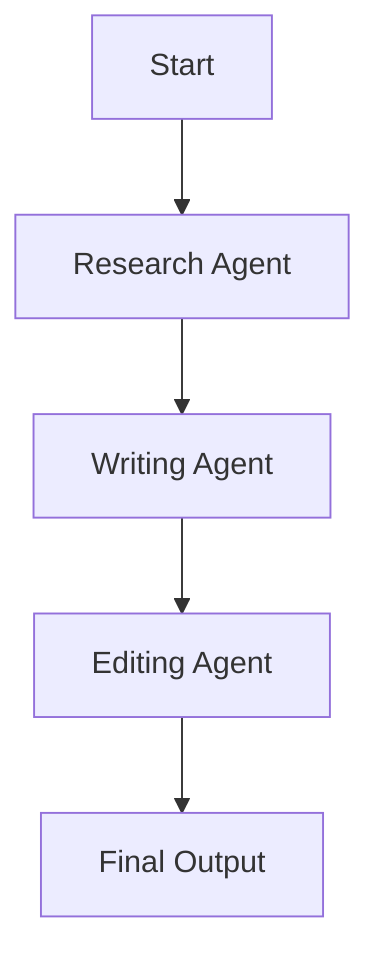

# Building a Multi-Agent System

In this lesson, we'll create a simple multi-agent system where several agents work together to accomplish a task. This approach allows you to divide complex problems into smaller, more manageable pieces.

## What We'll Build

We'll create a content creation system with three specialized agents:
1. A research agent to gather information
2. A writing agent to create content
3. An editing agent to improve and refine the content

## Step 1: Setting Up

First, let's import the necessary modules and set up our environment:

```python
from praisonaiagents import Agent, PraisonAIAgents

# Make sure your API key is set in your environment:
# export OPENAI_API_KEY=your_openai_key
```

## Step 2: Creating Specialized Agents

Now, let's create our three specialized agents:

```python
# Research Agent
research_agent = Agent(
    name="Researcher",
    instructions="""
    You are a research specialist who excels at finding relevant information.
    Your job is to:
    1. Thoroughly research the given topic
    2. Identify key facts, statistics, and insights
    3. Organize the information in a clear, structured format
    4. Provide accurate information with no fabrications
    5. Focus on the most relevant and current information
    """
)

# Writing Agent
writing_agent = Agent(
    name="Writer",
    instructions="""
    You are a content writer who creates engaging, reader-friendly content.
    Your job is to:
    1. Use the research provided to create well-structured content
    2. Write in a clear, engaging style
    3. Include an attention-grabbing introduction
    4. Organize the content with appropriate headings
    5. Conclude with a summary and call-to-action when appropriate
    """
)

# Editing Agent
editing_agent = Agent(
    name="Editor",
    instructions="""
    You are an editor who refines and improves content.
    Your job is to:
    1. Correct any grammatical or spelling errors
    2. Improve clarity and flow
    3. Ensure consistency in tone and style
    4. Check for logical structure and organization
    5. Enhance readability for the target audience
    """
)
```

## Step 3: Creating the Multi-Agent System

Now, let's combine these agents into a multi-agent system:

```python
# Create a multi-agent system
content_team = PraisonAIAgents(
    agents=[research_agent, writing_agent, editing_agent]
)
```

## Step 4: Setting Up the Workflow

Next, we need to define how our agents will work together:

```python
# Define a topic
topic = "The Benefits of Regular Exercise"

# Start the multi-agent process
results = content_team.start(
    f"""
    Task: Create a comprehensive blog post about {topic}
    
    Process:
    1. Researcher: Research {topic} and provide key information including:
       - Main benefits of exercise (physical and mental)
       - Recommended exercise guidelines
       - Scientific studies supporting the benefits
       - Common misconceptions
    
    2. Writer: Use the research to create a 500-word blog post about {topic} with:
       - An engaging introduction
       - Clear sections with headings
       - Practical advice for readers
       - A compelling conclusion
    
    3. Editor: Review and improve the blog post by:
       - Correcting any errors
       - Enhancing clarity and flow
       - Ensuring a consistent tone
       - Making the content more engaging
    """
)

# Print the final result
print(results)
```

## Understanding the Workflow

Let's examine how the multi-agent system works:



1. The research agent gathers and organizes relevant information
2. The writing agent uses that research to create the initial content
3. The editing agent refines and improves the content
4. The final polished content is returned

## Customizing Agent Interactions

You can customize how agents interact by modifying the process instructions. For example, you could add feedback loops:

```python
process_with_feedback = """
Task: Create a comprehensive blog post about {topic}

Process:
1. Researcher: Research {topic} and provide key information

2. Writer: Use the research to create a blog post

3. Editor: Review the blog post and provide feedback

4. Writer: Revise the blog post based on the editor's feedback

5. Editor: Make final improvements to the revised blog post
"""
```

## Alternative Agent Configurations

You can organize multi-agent systems in different ways:

### Parallel Processing

```python
parallel_process = """
Task: Create a marketing campaign for a new product

Process:
1. Market Researcher: Research the target market and competitors
   Content Researcher: Research the product features and benefits
   [These tasks happen in parallel]

2. Strategy Agent: Use both research results to create a marketing strategy

3. Content Creator: Create the marketing materials based on the strategy
"""
```

### Expert Panel

```python
expert_panel = """
Task: Evaluate a business idea

Process:
1. Financial Expert: Analyze financial viability
   Market Expert: Analyze market potential
   Technical Expert: Analyze technical feasibility
   [These assessments happen in parallel]

2. Coordinator: Compile all expert opinions into a final recommendation
"""
```

## Best Practices for Multi-Agent Systems

<CardGroup cols={2}>
  <Card title="Clear Role Definition" icon="user-tag">
    Define exactly what each agent is responsible for
  </Card>
  <Card title="Explicit Handoffs" icon="arrow-right-arrow-left">
    Specify how information passes between agents
  </Card>
  <Card title="Avoid Redundancy" icon="copy">
    Don't have multiple agents do the same work
  </Card>
  <Card title="Include Error Handling" icon="triangle-exclamation">
    Plan for cases where an agent might fail
  </Card>
</CardGroup>

In the next lesson, we'll learn how to create a conversational agent that can maintain context across multiple interactions.
