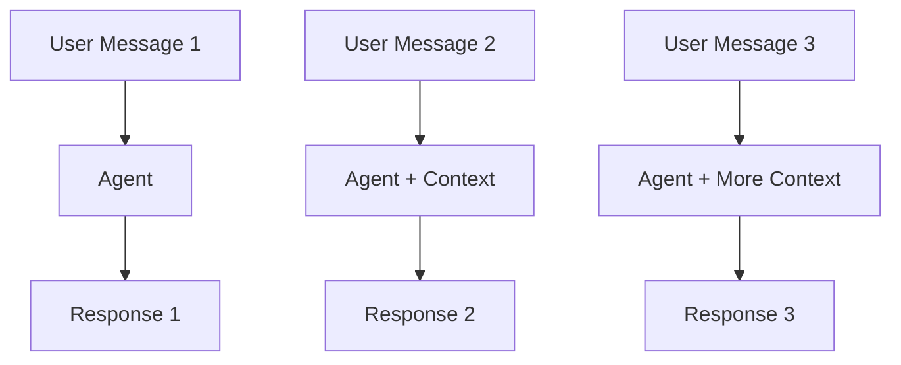

# Building Conversational Agents

In this lesson, we'll learn how to create conversational agents that can maintain context across multiple interactions. This is essential for creating assistants that feel natural to interact with.

## What Makes a Good Conversational Agent?

A good conversational agent should:
- Remember previous parts of the conversation
- Understand context and references
- Provide coherent, relevant responses
- Maintain a consistent personality

## Creating a Simple Conversational Agent

Let's build a basic conversational agent:

```python
# Note: TODO: This Feature yet to be developed
from praisonaiagents import Agent

# Create a conversational agent
chat_agent = Agent(
    name="Conversational Assistant",
    instructions="""
    You are a friendly, helpful conversational assistant.
    
    When chatting with users:
    1. Maintain a warm, friendly tone
    2. Remember information shared earlier in the conversation
    3. Ask clarifying questions when needed
    4. Keep responses concise but informative
    5. Be helpful while respecting boundaries
    """
)

# Start a conversation
response = chat_agent.start("Hi there! My name is Jamie.")
print(response)

# Continue the conversation
response = chat_agent.continue("What can you help me with today?")
print(response)

# The agent should remember the user's name
response = chat_agent.continue("Can you remember my name?")
print(response)
```

## How Context Works

PraisonAI automatically manages conversation context for you:



The agent maintains a memory of the conversation, allowing it to refer back to previous messages.

## Conversation Settings

You can customize how your conversational agent behaves:

```python
# Create an agent with specific conversation settings
custom_chat_agent = Agent(
    name="Custom Chat Assistant",
    instructions="You are a helpful assistant",
    memory_size=10,  # Remember the last 10 messages
    temperature=0.7  # Slightly more creative in responses
)
```

## Handling Different Types of Conversations

Different use cases require different conversation styles:

<CardGroup cols={2}>
  <Card title="Customer Support" icon="headset">
    - Professional and helpful tone
    - Focus on problem resolution
    - Remember customer details
  </Card>
  <Card title="Educational Tutor" icon="graduation-cap">
    - Patient and explanatory
    - Builds on previous lessons
    - Adjusts to learning pace
  </Card>
  <Card title="Personal Assistant" icon="calendar">
    - Remembers preferences
    - Provides reminders
    - Handles scheduling
  </Card>
  <Card title="Companion Chat" icon="user-group">
    - More casual tone
    - Focuses on engagement
    - Shows personality
  </Card>
</CardGroup>

## Example: Customer Support Agent

Let's create a specialized customer support agent:

```python
support_agent = Agent(
    name="Support Agent",
    instructions="""
    You are a customer support specialist for a tech company.
    
    When helping customers:
    1. Greet them professionally
    2. Show empathy for their issues
    3. Ask for necessary information to troubleshoot
    4. Provide clear step-by-step solutions
    5. Confirm if the issue is resolved
    6. End with an offer for additional help
    
    Remember product details and customer information throughout the conversation.
    """
)

# Example conversation
print(support_agent.start("Hi, I'm having trouble logging into my account."))
print(support_agent.continue("My username is user123."))
print(support_agent.continue("I've tried resetting my password but I'm not receiving the email."))
```

## Building Multi-Turn Conversations

To create engaging multi-turn conversations, consider:

1. **Appropriate follow-up questions**: Keep the conversation flowing
2. **Acknowledgment**: Reference what the user has said
3. **Progressive disclosure**: Don't overwhelm with information at once
4. **Conversation repair**: Gracefully handle misunderstandings

## Example: Multi-Turn Educational Conversation

```python
tutor_agent = Agent(
    name="Math Tutor",
    instructions="""
    You are a patient, encouraging math tutor.
    
    When teaching:
    1. Gauge the student's current understanding
    2. Explain concepts using clear, simple language
    3. Provide examples to illustrate points
    4. Ask questions to check understanding
    5. Give positive reinforcement for progress
    
    Adapt your explanations based on the student's responses.
    """
)

# Example tutoring session
print(tutor_agent.start("Can you help me understand algebra?"))
print(tutor_agent.continue("I'm struggling with equations like 2x + 5 = 13"))
print(tutor_agent.continue("So I subtract 5 from both sides first?"))
print(tutor_agent.continue("Then I divide by 2 to get x = 4?"))
print(tutor_agent.continue("Could you give me another example to practice?"))
```

## Conversation Best Practices

<CardGroup cols={2}>
  <Card title="Clear Transitions" icon="arrow-right">
    Signal when changing topics
  </Card>
  <Card title="Manageable Chunks" icon="layer-group">
    Break complex information into smaller pieces
  </Card>
  <Card title="Engagement Checks" icon="hand">
    Periodically confirm understanding
  </Card>
  <Card title="Personality Consistency" icon="masks-theater">
    Maintain a consistent tone and style
  </Card>
</CardGroup>

In the next lesson, we'll explore how to build agents that can search and retrieve information from external sources.
