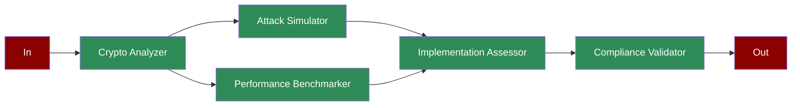

## What is Post-Quantum Cryptography?

Post-quantum cryptography focuses on developing cryptographic systems that are secure against both quantum and classical computers. This involves analyzing cryptographic schemes, simulating quantum attacks, and ensuring compliance with security standards.

## Features

<CardGroup cols={2}>
  <Card title="Cryptographic Analysis" icon="shield-check">
    Analyze quantum-resistant cryptographic schemes including lattice-based encryption and multivariate signatures.
  </Card>
  <Card title="Attack Simulation" icon="bug">
    Test resistance against quantum attacks including Grover's algorithm and Shor's algorithm.
  </Card>
  <Card title="Performance Testing" icon="gauge-high">
    Benchmark key generation, encryption/decryption speeds, and throughput metrics.
  </Card>
  <Card title="Security Assessment" icon="lock">
    Evaluate implementation security including side-channel resistance and hardening measures.
  </Card>
  <Card title="Compliance Validation" icon="certificate">
    Verify compliance with NIST PQC, Common Criteria, and FIPS standards.
  </Card>
</CardGroup>

## Quick Start

<Steps>
    <Step title="Install Package">
        First, install the PraisonAI Agents package:
        ```bash
        pip install praisonaiagents
        ```
    </Step>

    <Step title="Set API Key">
        Set your OpenAI API key as an environment variable in your terminal:
        ```bash
        export OPENAI_API_KEY=your_api_key_here
        ```
    </Step>

    <Step title="Create a file">
        Create a new file `app.py` with the basic setup:
```python
from praisonaiagents import Agent, Task, PraisonAIAgents
import time
from typing import Dict, List
import asyncio

def analyze_cryptographic_scheme():
    """Simulates cryptographic scheme analysis"""
    schemes = [
        {
            "name": "lattice_based",
            "type": "encryption",
            "key_size": 2048,
            "security_level": "AES-256 equivalent",
            "parameters": {
                "lattice_dimension": 1024,
                "modulus": "q = 2^32 - 1",
                "error_distribution": "discrete_gaussian"
            }
        },
        {
            "name": "multivariate",
            "type": "signature",
            "key_size": 4096,
            "security_level": "SHA-384 equivalent",
            "parameters": {
                "variables": 128,
                "equations": 128,
                "field_size": "2^8"
            }
        }
    ]
    return schemes[int(time.time()) % 2]

def simulate_quantum_attacks(scheme: Dict):
    """Simulates quantum attack scenarios"""
    attacks = {
        "grover_search": {
            "effectiveness": "reduced",
            "quantum_speedup": "quadratic",
            "estimated_qubits": 2048,
            "time_complexity": "O(2^n/2)"
        },
        "shor_algorithm": {
            "effectiveness": "ineffective",
            "quantum_speedup": "none",
            "vulnerability": "resistant",
            "classical_hardness": "maintained"
        },
        "quantum_hidden_subgroup": {
            "effectiveness": "partial",
            "applicability": "limited",
            "mitigation": "parameter_adjustment"
        }
    }
    return attacks

def benchmark_performance(scheme: Dict):
    """Benchmarks cryptographic performance"""
    benchmarks = {
        "key_generation": {
            "time": 0.5 + (time.time() % 1) / 10,  # seconds
            "memory": 128 + (int(time.time()) % 64)  # MB
        },
        "encryption_speed": {
            "small_message": 0.001 + (time.time() % 1) / 1000,  # seconds
            "large_message": 0.1 + (time.time() % 1) / 10  # seconds
        },
        "decryption_speed": {
            "small_message": 0.002 + (time.time() % 1) / 1000,
            "large_message": 0.15 + (time.time() % 1) / 10
        },
        "throughput": {
            "encryption": 100 + (int(time.time()) % 50),  # MB/s
            "decryption": 80 + (int(time.time()) % 40)   # MB/s
        }
    }
    return benchmarks

def assess_implementation(scheme: Dict, benchmarks: Dict):
    """Assesses implementation security"""
    assessment = {
        "side_channel_resistance": {
            "timing_attacks": "protected",
            "power_analysis": "partial_vulnerability",
            "cache_attacks": "mitigated"
        },
        "implementation_hardening": {
            "constant_time": True,
            "memory_protection": True,
            "error_handling": "secure"
        },
        "compiler_optimizations": {
            "safety": "verified",
            "performance_impact": -0.05 + (time.time() % 1) / 10
        }
    }
    return assessment

def validate_compliance(scheme: Dict, assessment: Dict):
    """Validates compliance and standards"""
    compliance = {
        "nist_pqc": {
            "status": "submitted",
            "round": 3,
            "requirements_met": True
        },
        "common_criteria": {
            "evaluation_level": "EAL4+",
            "protection_profile": "compliant"
        },
        "fips_140_3": {
            "security_level": 3,
            "validation_status": "in_process"
        }
    }
    return compliance

# Create specialized agents
crypto_analyzer = Agent(
    name="Crypto Analyzer",
    role="Cryptographic Analysis",
    goal="Analyze cryptographic schemes",
    instructions="Evaluate quantum-resistant cryptographic schemes",
    tools=[analyze_cryptographic_scheme]
)

attack_simulator = Agent(
    name="Attack Simulator",
    role="Attack Simulation",
    goal="Simulate quantum attacks",
    instructions="Test resistance against quantum attacks",
    tools=[simulate_quantum_attacks]
)

performance_benchmarker = Agent(
    name="Performance Benchmarker",
    role="Performance Testing",
    goal="Benchmark cryptographic performance",
    instructions="Measure performance metrics",
    tools=[benchmark_performance]
)

implementation_assessor = Agent(
    name="Implementation Assessor",
    role="Implementation Assessment",
    goal="Assess implementation security",
    instructions="Evaluate implementation security",
    tools=[assess_implementation]
)

compliance_validator = Agent(
    name="Compliance Validator",
    role="Compliance Validation",
    goal="Validate standards compliance",
    instructions="Verify compliance with standards",
    tools=[validate_compliance]
)

# Create workflow tasks
analysis_task = Task(
    name="analyze_crypto",
    description="Analyze cryptographic scheme",
    expected_output="Cryptographic analysis",
    agent=crypto_analyzer,
    is_start=True,
    next_tasks=["simulate_attacks", "benchmark_performance"]
)

attack_task = Task(
    name="simulate_attacks",
    description="Simulate quantum attacks",
    expected_output="Attack simulation results",
    agent=attack_simulator,
    next_tasks=["assess_implementation"]
)

benchmark_task = Task(
    name="benchmark_performance",
    description="Benchmark performance",
    expected_output="Performance benchmarks",
    agent=performance_benchmarker,
    next_tasks=["assess_implementation"]
)

assessment_task = Task(
    name="assess_implementation",
    description="Assess implementation",
    expected_output="Implementation assessment",
    agent=implementation_assessor,
    context=[attack_task, benchmark_task],
    next_tasks=["validate_compliance"]
)

compliance_task = Task(
    name="validate_compliance",
    description="Validate compliance",
    expected_output="Compliance validation",
    agent=compliance_validator,
    task_type="decision",
    condition={
        "compliant": "",  # End workflow if compliant
        "non_compliant": ["assess_implementation"]  # Reassess if non-compliant
    }
)

# Create workflow
workflow = PraisonAIAgents(
    agents=[crypto_analyzer, attack_simulator, performance_benchmarker,
            implementation_assessor, compliance_validator],
    tasks=[analysis_task, attack_task, benchmark_task,
           assessment_task, compliance_task],
    process="workflow",
    verbose=True
)

async def main():
    print("\nStarting Quantum-Resistant Cryptography Validation Workflow...")
    print("=" * 50)
    
    # Run workflow
    results = await workflow.astart()
    
    # Print results
    print("\nCryptography Validation Results:")
    print("=" * 50)
    for task_id, result in results["task_results"].items():
        if result:
            print(f"\nTask: {task_id}")
            print(f"Result: {result.raw}")
            print("-" * 50)

if __name__ == "__main__":
    asyncio.run(main())
```
    </Step>
</Steps>

## Next Steps

<CardGroup>
  <Card title="Introduction" icon="book" href="/introduction">
    Learn more about PraisonAI and its core concepts
  </Card>
  <Card title="Quick Start" icon="bolt" href="/quickstart">
    Get started with the basics of PraisonAI
  </Card>
</CardGroup>
