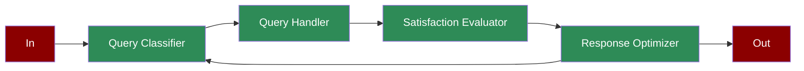

Learn how to create AI agents for automated customer service and response optimization.

## Quick Start

1. Install the PraisonAI Agents package:
```bash
pip install praisonaiagents
```

2. Set your OpenAI API key:
```bash
export OPENAI_API_KEY=your_api_key_here
```

3. Create a file named `app.py`:
```python
from praisonaiagents import Agent, Task, PraisonAIAgents
import time
from typing import Dict, List

def classify_query():
    """Simulates query classification"""
    query_types = [
        {"type": "technical", "priority": "high", "complexity": "complex"},
        {"type": "billing", "priority": "medium", "complexity": "simple"},
        {"type": "general", "priority": "low", "complexity": "simple"}
    ]
    return query_types[int(time.time()) % 3]

def handle_query(query: Dict):
    """Simulates query handling"""
    responses = {
        "technical": "Technical support solution provided",
        "billing": "Billing inquiry resolved",
        "general": "General information provided"
    }
    return responses.get(query["type"], "Query forwarded to specialist")

def evaluate_satisfaction():
    """Simulates satisfaction evaluation"""
    scores = ["satisfied", "neutral", "unsatisfied"]
    return scores[int(time.time()) % 3]

def optimize_response(satisfaction: str):
    """Simulates response optimization"""
    optimizations = {
        "satisfied": "maintain_approach",
        "neutral": "minor_adjustments",
        "unsatisfied": "major_revision"
    }
    return optimizations.get(satisfaction, "review_process")

# Create specialized agents
classifier = Agent(
    name="Query Classifier",
    role="Query Classification",
    goal="Classify incoming customer queries",
    instructions="Analyze and categorize customer queries",
    tools=[classify_query]
)

handler = Agent(
    name="Query Handler",
    role="Query Resolution",
    goal="Handle customer queries appropriately",
    instructions="Provide appropriate responses to queries",
    tools=[handle_query]
)

evaluator = Agent(
    name="Satisfaction Evaluator",
    role="Satisfaction Assessment",
    goal="Evaluate customer satisfaction",
    instructions="Assess response effectiveness",
    tools=[evaluate_satisfaction]
)

optimizer = Agent(
    name="Response Optimizer",
    role="Service Optimization",
    goal="Optimize service based on feedback",
    instructions="Improve response strategies",
    tools=[optimize_response]
)

# Create workflow tasks
classification_task = Task(
    name="classify_query",
    description="Classify customer query",
    expected_output="Query classification",
    agent=classifier,
    is_start=True,
    task_type="decision",
    condition={
        "high": ["handle_query", "evaluate_satisfaction"],
        "medium": ["handle_query", "evaluate_satisfaction"],
        "low": ["handle_query"]
    }
)

handling_task = Task(
    name="handle_query",
    description="Handle customer query",
    expected_output="Query response",
    agent=handler,
    next_tasks=["evaluate_satisfaction"]
)

evaluation_task = Task(
    name="evaluate_satisfaction",
    description="Evaluate customer satisfaction",
    expected_output="Satisfaction level",
    agent=evaluator,
    next_tasks=["optimize_response"]
)

optimization_task = Task(
    name="optimize_response",
    description="Optimize response strategy",
    expected_output="Optimization recommendations",
    agent=optimizer,
    task_type="decision",
    condition={
        "major_revision": ["classify_query"],
        "minor_adjustments": "",
        "maintain_approach": ""
    }
)

# Create workflow
workflow = PraisonAIAgents(
    agents=[classifier, handler, evaluator, optimizer],
    tasks=[classification_task, handling_task, evaluation_task, optimization_task],
    process="workflow",
    verbose=True
)

def main():
    print("\nStarting Customer Service Optimization Workflow...")
    print("=" * 50)
    
    # Run workflow
    results = workflow.start()
    
    # Print results
    print("\nCustomer Service Results:")
    print("=" * 50)
    for task_id, result in results["task_results"].items():
        if result:
            print(f"\nTask: {task_id}")
            print(f"Result: {result.raw}")
            print("-" * 50)

if __name__ == "__main__":
    main()
```

4. Run the system:
```bash
python app.py
```

<Note>
**Requirements**
- Python 3.10 or higher
- OpenAI API key
</Note>

## Understanding Customer Service

The customer service workflow demonstrates how AI agents can automate and optimize customer support operations. The system uses specialized agents to classify queries, handle responses, evaluate satisfaction, and continuously improve service quality through feedback-driven optimization.

## Features

- **Query Classification**: Automatically categorizes customer inquiries based on type, priority, and complexity
- **Intelligent Response Handling**: Provides appropriate responses based on query classification
- **Satisfaction Evaluation**: Assesses customer satisfaction with provided solutions
- **Response Optimization**: Continuously improves service quality through feedback analysis

## Next Steps

- Learn about [Prompt Chaining](/features/promptchaining)
- Explore [Evaluator Optimizer](/features/evaluator-optimiser) 