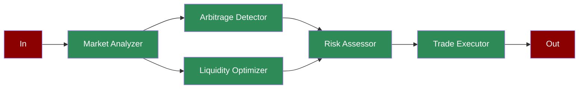

## What is DeFi Market Making?

Decentralized Finance (DeFi) market making involves providing liquidity to decentralized exchanges and automatically executing trades to capture arbitrage opportunities. This requires real-time analysis of market conditions, optimization of liquidity positions, and risk management.

## Features

<CardGroup cols={2}>
  <Card title="Market Analysis" icon="chart-candlestick">
    Real-time analysis of liquidity pools, market volatility, trading volumes, and gas prices.
  </Card>
  <Card title="Arbitrage Detection" icon="magnifying-glass-dollar">
    Identification of profitable trading opportunities across different liquidity pools.
  </Card>
  <Card title="Liquidity Optimization" icon="water">
    Optimization of liquidity distribution and pool ratios for maximum efficiency.
  </Card>
  <Card title="Risk Assessment" icon="shield-halved">
    Comprehensive risk analysis including impermanent loss and smart contract risks.
  </Card>
  <Card title="Trade Execution" icon="money-bill-transfer">
    Automated execution of optimized trades with performance monitoring.
  </Card>
</CardGroup>

## Quick Start

<Steps>
    <Step title="Install Package">
        First, install the PraisonAI Agents package:
        ```bash
        pip install praisonaiagents
        ```
    </Step>

    <Step title="Set API Key">
        Set your OpenAI API key as an environment variable in your terminal:
        ```bash
        export OPENAI_API_KEY=your_api_key_here
        ```
    </Step>

    <Step title="Create a file">
        Create a new file `app.py` with the basic setup:
```python
from praisonaiagents import Agent, Task, PraisonAIAgents
import time
from typing import Dict, List
import asyncio

def analyze_market_conditions():
    """Simulates market analysis"""
    conditions = {
        "liquidity_pools": {
            "pool_A": {
                "token_0": {"balance": 1000000, "price": 1.0},
                "token_1": {"balance": 500000, "price": 2.0},
                "total_value_locked": 2000000
            },
            "pool_B": {
                "token_0": {"balance": 800000, "price": 1.0},
                "token_1": {"balance": 400000, "price": 2.0},
                "total_value_locked": 1600000
            }
        },
        "market_volatility": 0.15 + (time.time() % 10) / 100,
        "trading_volume_24h": 5000000 + (time.time() % 1000000),
        "gas_prices": 50 + (time.time() % 30)
    }
    return conditions

def detect_arbitrage():
    """Simulates arbitrage opportunity detection"""
    opportunities = [
        {
            "path": ["pool_A", "pool_B"],
            "profit_potential": 0.02 + (time.time() % 5) / 100,
            "required_capital": 10000,
            "execution_cost": 50,
            "risk_level": "low"
        },
        {
            "path": ["pool_B", "pool_C"],
            "profit_potential": 0.03 + (time.time() % 5) / 100,
            "required_capital": 20000,
            "execution_cost": 75,
            "risk_level": "medium"
        }
    ]
    return opportunities[int(time.time()) % 2]

def optimize_liquidity(market_conditions: Dict):
    """Optimizes liquidity distribution"""
    optimizations = {
        "pool_A": {
            "target_ratio": 2.0,
            "suggested_actions": [
                {
                    "action": "rebalance",
                    "token": "token_1",
                    "amount": 10000,
                    "direction": "add"
                }
            ],
            "expected_improvement": 0.05
        },
        "pool_B": {
            "target_ratio": 1.8,
            "suggested_actions": [
                {
                    "action": "rebalance",
                    "token": "token_0",
                    "amount": 5000,
                    "direction": "remove"
                }
            ],
            "expected_improvement": 0.03
        }
    }
    return optimizations

def assess_risks(arbitrage: Dict, optimizations: Dict):
    """Assesses potential risks"""
    risk_assessment = {
        "impermanent_loss_risk": 0.1 + (time.time() % 5) / 100,
        "smart_contract_risk": "low",
        "market_manipulation_risk": "medium" if arbitrage["profit_potential"] > 0.025 else "low",
        "gas_price_risk": "high" if arbitrage["execution_cost"] > 60 else "medium",
        "mitigation_strategies": [
            "implement_slippage_protection",
            "set_maximum_gas_price",
            "use_multiple_liquidity_sources"
        ]
    }
    return risk_assessment

def execute_trades(arbitrage: Dict, risks: Dict):
    """Simulates trade execution"""
    execution_results = {
        "status": "success" if time.time() % 2 == 0 else "failed",
        "executed_volume": arbitrage["required_capital"] * 0.95,
        "actual_profit": arbitrage["profit_potential"] * 0.9,
        "gas_used": arbitrage["execution_cost"] * 1.1,
        "timestamp": time.time()
    }
    return execution_results

# Create specialized agents
market_analyzer = Agent(
    name="Market Analyzer",
    role="Market Analysis",
    goal="Analyze market conditions",
    instructions="Monitor and analyze DeFi market conditions",
    tools=[analyze_market_conditions]
)

arbitrage_detector = Agent(
    name="Arbitrage Detector",
    role="Arbitrage Detection",
    goal="Detect arbitrage opportunities",
    instructions="Identify profitable trading opportunities",
    tools=[detect_arbitrage]
)

liquidity_optimizer = Agent(
    name="Liquidity Optimizer",
    role="Liquidity Optimization",
    goal="Optimize liquidity distribution",
    instructions="Optimize pool liquidity ratios",
    tools=[optimize_liquidity]
)

risk_assessor = Agent(
    name="Risk Assessor",
    role="Risk Assessment",
    goal="Assess trading risks",
    instructions="Evaluate potential risks and mitigation strategies",
    tools=[assess_risks]
)

trade_executor = Agent(
    name="Trade Executor",
    role="Trade Execution",
    goal="Execute optimized trades",
    instructions="Execute trades based on analysis",
    tools=[execute_trades]
)

# Create workflow tasks
market_task = Task(
    name="analyze_market",
    description="Analyze market conditions",
    expected_output="Market analysis",
    agent=market_analyzer,
    is_start=True,
    next_tasks=["detect_arbitrage", "optimize_liquidity"]
)

arbitrage_task = Task(
    name="detect_arbitrage",
    description="Detect arbitrage opportunities",
    expected_output="Arbitrage opportunities",
    agent=arbitrage_detector,
    next_tasks=["assess_risks"]
)

liquidity_task = Task(
    name="optimize_liquidity",
    description="Optimize liquidity",
    expected_output="Liquidity optimization",
    agent=liquidity_optimizer,
    context=[market_task],
    next_tasks=["assess_risks"]
)

risk_task = Task(
    name="assess_risks",
    description="Assess trading risks",
    expected_output="Risk assessment",
    agent=risk_assessor,
    context=[arbitrage_task, liquidity_task],
    next_tasks=["execute_trades"]
)

execution_task = Task(
    name="execute_trades",
    description="Execute trades",
    expected_output="Trade execution results",
    agent=trade_executor,
    task_type="decision",
    condition={
        "success": ["analyze_market"],  # Continue monitoring if successful
        "failed": ["optimize_liquidity"]  # Reoptimize if failed
    }
)

# Create workflow
workflow = PraisonAIAgents(
    agents=[market_analyzer, arbitrage_detector, liquidity_optimizer,
            risk_assessor, trade_executor],
    tasks=[market_task, arbitrage_task, liquidity_task,
           risk_task, execution_task],
    process="workflow",
    verbose=True
)

async def main():
    print("\nStarting DeFi Market Making Workflow...")
    print("=" * 50)
    
    # Run workflow
    results = await workflow.astart()
    
    # Print results
    print("\nMarket Making Results:")
    print("=" * 50)
    for task_id, result in results["task_results"].items():
        if result:
            print(f"\nTask: {task_id}")
            print(f"Result: {result.raw}")
            print("-" * 50)

if __name__ == "__main__":
    asyncio.run(main())
```
    </Step>
</Steps>

## Next Steps

<CardGroup>
  <Card title="Introduction" icon="book" href="/introduction">
    Learn more about PraisonAI and its core concepts
  </Card>
  <Card title="Quick Start" icon="bolt" href="/quickstart">
    Get started with the basics of PraisonAI
  </Card>
</CardGroup>
