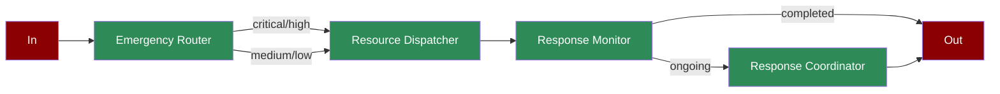

A workflow demonstrating how AI agents can coordinate emergency response, from initial assessment through resource dispatch and response monitoring.

## Quick Start

<Steps>
    <Step title="Install Package">
        First, install the PraisonAI Agents package:
        ```bash
        pip install praisonaiagents
        ```
    </Step>

    <Step title="Set API Key">
        Set your OpenAI API key as an environment variable in your terminal:
        ```bash
        export OPENAI_API_KEY=your_api_key_here
        ```
    </Step>

    <Step title="Create a file">
        Create a new file `app.py` with the basic setup:
        ```python
        from praisonaiagents import Agent, Task, PraisonAIAgents
        import time
        from typing import Dict, List

        def assess_emergency(incident: Dict):
            """Simulates emergency assessment"""
            severity_levels = ["low", "medium", "high", "critical"]
            current_time = int(time.time())
            severity = severity_levels[current_time % 4]
            print(f"Incident assessed with {severity} severity")
            return severity

        def dispatch_resources(severity: str):
            """Simulates resource dispatch"""
            resources = {
                "low": ["local_police"],
                "medium": ["local_police", "ambulance"],
                "high": ["local_police", "ambulance", "fire"],
                "critical": ["local_police", "ambulance", "fire", "special_units"]
            }
            dispatched = resources.get(severity, ["local_police"])
            print(f"Dispatching resources: {dispatched}")
            return dispatched

        def monitor_response():
            """Simulates response monitoring"""
            current_time = int(time.time())
            status = "completed" if current_time % 3 == 0 else "ongoing"
            return status

        # Create specialized agents
        router = Agent(
            name="Emergency Router",
            role="Emergency Assessment",
            goal="Evaluate emergency severity and type",
            instructions="Assess incident and determine required response",
            tools=[assess_emergency]
        )

        dispatcher = Agent(
            name="Resource Dispatcher",
            role="Resource Management",
            goal="Coordinate and dispatch appropriate resources",
            instructions="Deploy resources based on emergency assessment",
            tools=[dispatch_resources]
        )

        monitor = Agent(
            name="Response Monitor",
            role="Response Tracking",
            goal="Track response progress and effectiveness",
            instructions="Monitor ongoing response and provide status updates",
            tools=[monitor_response]
        )

        synthesizer = Agent(
            name="Response Coordinator",
            role="Response Synthesis",
            goal="Coordinate multi-agency response",
            instructions="Synthesize information and coordinate overall response"
        )

        # Create workflow tasks
        assessment_task = Task(
            name="assess_emergency",
            description="Evaluate emergency severity and type",
            expected_output="Emergency severity level",
            agent=router,
            is_start=True,
            task_type="decision",
            condition={
                "critical": ["dispatch_resources", "monitor_response"],
                "high": ["dispatch_resources", "monitor_response"],
                "medium": ["dispatch_resources"],
                "low": ["dispatch_resources"]
            }
        )

        dispatch_task = Task(
            name="dispatch_resources",
            description="Deploy appropriate emergency resources",
            expected_output="List of dispatched resources",
            agent=dispatcher,
            next_tasks=["monitor_response"]
        )

        monitor_task = Task(
            name="monitor_response",
            description="Track response progress",
            expected_output="Response status",
            agent=monitor,
            task_type="decision",
            condition={
                "ongoing": ["coordinate_response"],
                "completed": ""
            }
        )

        coordinate_task = Task(
            name="coordinate_response",
            description="Coordinate overall emergency response",
            expected_output="Coordinated response plan",
            agent=synthesizer,
            context=[assessment_task, dispatch_task, monitor_task]
        )

        # Create workflow
        workflow = PraisonAIAgents(
            agents=[router, dispatcher, monitor, synthesizer],
            tasks=[assessment_task, dispatch_task, monitor_task, coordinate_task],
            process="workflow",
            verbose=True
        )

        def main():
            # Simulate emergency incident
            incident = {
                "type": "fire",
                "location": "123 Main St",
                "reported_time": time.time()
            }
            
            print("\nStarting Emergency Response Workflow...")
            print("=" * 50)
            
            # Run workflow
            results = workflow.start(initial_input=incident)
            
            # Print results
            print("\nEmergency Response Results:")
            print("=" * 50)
            for task_id, result in results["task_results"].items():
                if result:
                    print(f"\nTask: {task_id}")
                    print(f"Result: {result.raw}")
                    print("-" * 50)

        if __name__ == "__main__":
            main()
        ```
    </Step>

    <Step title="Start Agents">
        Type this in your terminal to run your agents:
        ```bash
        python app.py
        ```
    </Step>
</Steps>

<Note>
  **Requirements**
  - Python 3.10 or higher
  - OpenAI API key. Generate OpenAI API key [here](https://platform.openai.com/api-keys). Use Other models using [this guide](/models).   
  - Basic understanding of Python
</Note>

## Understanding Emergency Response

<Card title="What is Emergency Response?" icon="question">
  Emergency response workflow enables:
  - Dynamic severity assessment
  - Automated resource dispatch
  - Real-time response monitoring
  - Multi-agency coordination
</Card>

## Features

<CardGroup cols={2}>
  <Card title="Severity Assessment" icon="gauge-high">
    Automatically evaluate incident severity and type.
  </Card>
  <Card title="Resource Management" icon="truck">
    Dispatch appropriate resources based on severity.
  </Card>
  <Card title="Response Monitoring" icon="eye">
    Track response progress and effectiveness.
  </Card>
  <Card title="Response Coordination" icon="people-group">
    Coordinate multi-agency response efforts.
  </Card>
</CardGroup>

## Next Steps

<CardGroup cols={2}>
  <Card title="Prompt Chaining" icon="link" href="/features/promptchaining">
    Learn about sequential prompt execution
  </Card>
  <Card title="Evaluator Optimizer" icon="magnifying-glass-chart" href="/features/evaluator-optimiser">
    Explore optimization techniques
  </Card>
</CardGroup> 