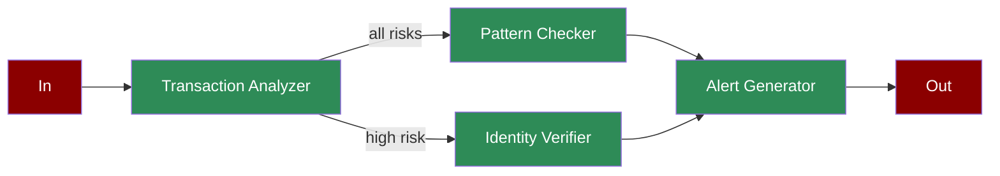

A workflow demonstrating how AI agents can detect fraud in real-time, from transaction analysis through alert generation.

## Quick Start

<Steps>
    <Step title="Install Package">
        First, install the PraisonAI Agents package:
        ```bash
        pip install praisonaiagents
        ```
    </Step>

    <Step title="Set API Key">
        Set your OpenAI API key as an environment variable in your terminal:
        ```bash
        export OPENAI_API_KEY=your_api_key_here
        ```
    </Step>

    <Step title="Create a file">
        Create a new file `app.py` with the basic setup:
        ```python
        from praisonaiagents import Agent, Task, PraisonAIAgents
        import time
        from typing import Dict, List
        import asyncio

        def analyze_transaction():
            """Simulates transaction analysis"""
            transactions = [
                {"type": "credit_card", "amount": 5000, "location": "foreign", "risk": "high"},
                {"type": "wire", "amount": 2000, "location": "domestic", "risk": "medium"},
                {"type": "online", "amount": 500, "location": "domestic", "risk": "low"}
            ]
            return transactions[int(time.time()) % 3]

        def check_patterns(transaction: Dict):
            """Simulates pattern checking"""
            patterns = {
                "high": ["unusual_location", "large_amount"],
                "medium": ["frequency_anomaly"],
                "low": ["within_normal_limits"]
            }
            return patterns.get(transaction["risk"], ["unknown"])

        def verify_identity():
            """Simulates identity verification"""
            results = ["verified", "suspicious", "failed"]
            return results[int(time.time()) % 3]

        def generate_alert(verification: str, patterns: List[str]):
            """Simulates alert generation"""
            if verification == "failed" or "unusual_location" in patterns:
                return "high_priority_alert"
            elif verification == "suspicious":
                return "medium_priority_alert"
            return "low_priority_alert"

        # Create specialized agents
        transaction_analyzer = Agent(
            name="Transaction Analyzer",
            role="Transaction Analysis",
            goal="Analyze transactions for suspicious patterns",
            instructions="Monitor and analyze financial transactions",
            tools=[analyze_transaction]
        )

        pattern_checker = Agent(
            name="Pattern Checker",
            role="Pattern Detection",
            goal="Identify suspicious patterns",
            instructions="Check for known fraud patterns",
            tools=[check_patterns]
        )

        identity_verifier = Agent(
            name="Identity Verifier",
            role="Identity Verification",
            goal="Verify transaction identities",
            instructions="Perform identity verification checks",
            tools=[verify_identity]
        )

        alert_generator = Agent(
            name="Alert Generator",
            role="Alert Management",
            goal="Generate appropriate alerts",
            instructions="Create and prioritize alerts",
            tools=[generate_alert]
        )

        # Create workflow tasks
        analysis_task = Task(
            name="analyze_transaction",
            description="Analyze transaction details",
            expected_output="Transaction analysis",
            agent=transaction_analyzer,
            is_start=True,
            task_type="decision",
            condition={
                "high": ["check_patterns", "verify_identity"],
                "medium": ["check_patterns"],
                "low": ["check_patterns"]
            }
        )

        pattern_task = Task(
            name="check_patterns",
            description="Check for suspicious patterns",
            expected_output="Identified patterns",
            agent=pattern_checker,
            next_tasks=["generate_alert"],
            async_execution=True
        )

        verification_task = Task(
            name="verify_identity",
            description="Verify transaction identity",
            expected_output="Verification result",
            agent=identity_verifier,
            next_tasks=["generate_alert"],
            async_execution=True
        )

        alert_task = Task(
            name="generate_alert",
            description="Generate fraud alert",
            expected_output="Alert priority",
            agent=alert_generator,
            context=[pattern_task, verification_task]
        )

        # Create workflow
        workflow = PraisonAIAgents(
            agents=[transaction_analyzer, pattern_checker, identity_verifier, alert_generator],
            tasks=[analysis_task, pattern_task, verification_task, alert_task],
            process="workflow",
            verbose=True
        )

        async def main():
            print("\nStarting Fraud Detection Workflow...")
            print("=" * 50)
            
            # Run workflow
            results = await workflow.astart()
            
            # Print results
            print("\nFraud Detection Results:")
            print("=" * 50)
            for task_id, result in results["task_results"].items():
                if result:
                    print(f"\nTask: {task_id}")
                    print(f"Result: {result.raw}")
                    print("-" * 50)

        if __name__ == "__main__":
            asyncio.run(main())
        ```
    </Step>

    <Step title="Start Agents">
        Type this in your terminal to run your agents:
        ```bash
        python app.py
        ```
    </Step>
</Steps>

<Note>
  **Requirements**
  - Python 3.10 or higher
  - OpenAI API key. Generate OpenAI API key [here](https://platform.openai.com/api-keys). Use Other models using [this guide](/models).   
  - Basic understanding of Python
</Note>

## Understanding Fraud Detection

<Card title="What is Fraud Detection?" icon="question">
  Automated fraud detection workflow enables:
  - Real-time transaction monitoring
  - Pattern-based detection
  - Identity verification
  - Prioritized alert generation
</Card>

## Features

<CardGroup cols={2}>
  <Card title="Transaction Analysis" icon="magnifying-glass">
    Analyze transactions for risk levels and suspicious patterns.
  </Card>
  <Card title="Pattern Detection" icon="chart-line">
    Identify known fraud patterns and anomalies.
  </Card>
  <Card title="Identity Verification" icon="user-check">
    Verify transaction identities for high-risk cases.
  </Card>
  <Card title="Alert Management" icon="bell">
    Generate and prioritize fraud alerts.
  </Card>
</CardGroup>

## Next Steps

<CardGroup cols={2}>
  <Card title="Prompt Chaining" icon="link" href="/features/promptchaining">
    Learn about sequential prompt execution
  </Card>
  <Card title="Evaluator Optimizer" icon="magnifying-glass-chart" href="/features/evaluator-optimiser">
    Explore optimization techniques
  </Card>
</CardGroup> 