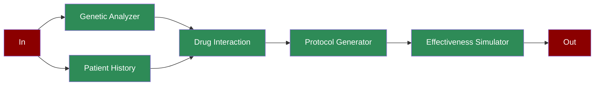

## What is Personalized Medicine?

Personalized medicine is an approach that tailors medical treatment to individual characteristics of each patient. It involves analyzing genetic markers, patient history, and drug interactions to create optimized treatment protocols.

## Features

<CardGroup cols={2}>
  <Card title="Genetic Analysis" icon="dna">
    Deep analysis of genetic markers including metabolism genes, risk factors, and drug response markers.
  </Card>
  <Card title="Patient History" icon="notes-medical">
    Comprehensive evaluation of medical conditions, medications, allergies, and family history.
  </Card>
  <Card title="Drug Interaction" icon="pills">
    Analysis of potential drug interactions based on genetic data and patient history.
  </Card>
  <Card title="Protocol Generation" icon="file-medical">
    Creation of personalized treatment protocols with dosage adjustments and monitoring plans.
  </Card>
  <Card title="Treatment Simulation" icon="chart-line">
    Prediction of treatment effectiveness, side effects, and adherence probability.
  </Card>
</CardGroup>

## Quick Start

<Steps>
    <Step title="Install Package">
        First, install the PraisonAI Agents package:
        ```bash
        pip install praisonaiagents
        ```
    </Step>

    <Step title="Set API Key">
        Set your OpenAI API key as an environment variable in your terminal:
        ```bash
        export OPENAI_API_KEY=your_api_key_here
        ```
    </Step>

    <Step title="Create a file">
        Create a new file `app.py` with the basic setup:
```python
from praisonaiagents import Agent, Task, PraisonAIAgents
import time
from typing import Dict, List
import asyncio

def analyze_genetic_markers():
    """Simulates genetic marker analysis"""
    markers = {
        "metabolism_genes": {
            "CYP2D6": "rapid_metabolizer",
            "CYP2C19": "normal_metabolizer",
            "DPYD": "poor_metabolizer"
        },
        "risk_factors": {
            "cardiovascular": "elevated",
            "diabetes": "low",
            "autoimmune": "moderate"
        },
        "drug_response_markers": {
            "TPMT": "high_sensitivity",
            "HLA-B*5701": "negative",
            "UGT1A1": "normal"
        }
    }
    return markers

def evaluate_patient_history():
    """Simulates patient history evaluation"""
    history = {
        "conditions": [
            {"name": "hypertension", "duration": "5_years", "severity": "moderate"},
            {"name": "arthritis", "duration": "2_years", "severity": "mild"}
        ],
        "medications": [
            {"name": "lisinopril", "response": "good", "side_effects": "minimal"},
            {"name": "methotrexate", "response": "moderate", "side_effects": "mild"}
        ],
        "allergies": ["penicillin", "sulfa"],
        "family_history": ["diabetes", "heart_disease"]
    }
    return history

def analyze_drug_interactions(genetic_data: Dict, patient_history: Dict):
    """Analyzes potential drug interactions"""
    interactions = []
    medications = [med["name"] for med in patient_history["medications"]]
    
    for med in medications:
        interactions.append({
            "medication": med,
            "genetic_impact": "significant" if genetic_data["metabolism_genes"]["CYP2D6"] == "rapid_metabolizer" else "normal",
            "risk_level": "high" if med in patient_history["allergies"] else "low",
            "monitoring_needed": True if genetic_data["metabolism_genes"]["DPYD"] == "poor_metabolizer" else False
        })
    return interactions

def generate_protocol(genetic_data: Dict, interactions: List[Dict]):
    """Generates treatment protocol"""
    protocol = {
        "primary_treatment": {
            "medication": "custom_formulation_A",
            "dosage": "adjusted_based_on_metabolism",
            "frequency": "twice_daily",
            "monitoring": {
                "type": "blood_levels",
                "frequency": "weekly"
            }
        },
        "alternatives": [
            {
                "medication": "custom_formulation_B",
                "conditions": ["genetic_compatibility", "no_interactions"]
            }
        ],
        "precautions": []
    }
    
    if genetic_data["metabolism_genes"]["CYP2D6"] == "rapid_metabolizer":
        protocol["precautions"].append("increase_monitoring_frequency")
    
    if any(i["risk_level"] == "high" for i in interactions):
        protocol["precautions"].append("alternative_medication_needed")
    
    return protocol

def simulate_effectiveness(protocol: Dict):
    """Simulates treatment effectiveness"""
    simulation = {
        "efficacy_prediction": 0.85 + (time.time() % 2) / 10,
        "side_effect_risk": 0.15 + (time.time() % 1) / 10,
        "adherence_probability": 0.9 + (time.time() % 1) / 10,
        "expected_outcomes": [
            "symptom_reduction_80_percent",
            "minimal_side_effects",
            "good_tolerance"
        ]
    }
    return simulation

# Create specialized agents
genetic_analyzer = Agent(
    name="Genetic Analyzer",
    role="Genetic Analysis",
    goal="Analyze genetic markers",
    instructions="Evaluate genetic markers and variants",
    tools=[analyze_genetic_markers]
)

history_analyzer = Agent(
    name="History Analyzer",
    role="History Analysis",
    goal="Analyze patient history",
    instructions="Evaluate medical history and conditions",
    tools=[evaluate_patient_history]
)

interaction_analyzer = Agent(
    name="Interaction Analyzer",
    role="Drug Interaction",
    goal="Analyze drug interactions",
    instructions="Evaluate potential drug interactions",
    tools=[analyze_drug_interactions]
)

protocol_generator = Agent(
    name="Protocol Generator",
    role="Protocol Generation",
    goal="Generate treatment protocol",
    instructions="Create personalized treatment protocol",
    tools=[generate_protocol]
)

effectiveness_simulator = Agent(
    name="Effectiveness Simulator",
    role="Treatment Simulation",
    goal="Simulate treatment effectiveness",
    instructions="Predict treatment outcomes",
    tools=[simulate_effectiveness]
)

# Create workflow tasks
genetic_task = Task(
    name="analyze_genetics",
    description="Analyze genetic markers",
    expected_output="Genetic analysis",
    agent=genetic_analyzer,
    is_start=True,
    next_tasks=["analyze_history"]
)

history_task = Task(
    name="analyze_history",
    description="Analyze patient history",
    expected_output="History analysis",
    agent=history_analyzer,
    next_tasks=["analyze_interactions"]
)

interaction_task = Task(
    name="analyze_interactions",
    description="Analyze drug interactions",
    expected_output="Interaction analysis",
    agent=interaction_analyzer,
    context=[genetic_task, history_task],
    next_tasks=["generate_protocol"]
)

protocol_task = Task(
    name="generate_protocol",
    description="Generate treatment protocol",
    expected_output="Treatment protocol",
    agent=protocol_generator,
    context=[genetic_task, interaction_task],
    next_tasks=["simulate_effectiveness"]
)

simulation_task = Task(
    name="simulate_effectiveness",
    description="Simulate treatment effectiveness",
    expected_output="Effectiveness simulation",
    agent=effectiveness_simulator,
    task_type="decision",
    condition={
        "high": "",  # End workflow if high effectiveness
        "medium": ["generate_protocol"],  # Adjust protocol if medium
        "low": ["analyze_interactions"]  # Reanalyze if low
    }
)

# Create workflow
workflow = PraisonAIAgents(
    agents=[genetic_analyzer, history_analyzer, interaction_analyzer,
            protocol_generator, effectiveness_simulator],
    tasks=[genetic_task, history_task, interaction_task,
           protocol_task, simulation_task],
    process="workflow",
    verbose=True
)

async def main():
    print("\nStarting Personalized Medicine Protocol Generation...")
    print("=" * 50)
    
    # Run workflow
    results = await workflow.astart()
    
    # Print results
    print("\nProtocol Generation Results:")
    print("=" * 50)
    for task_id, result in results["task_results"].items():
        if result:
            print(f"\nTask: {task_id}")
            print(f"Result: {result.raw}")
            print("-" * 50)

if __name__ == "__main__":
    asyncio.run(main())
```
    </Step>
</Steps>

## Next Steps

<CardGroup>
  <Card title="Introduction" icon="book" href="/introduction">
    Learn more about PraisonAI and its core concepts
  </Card>
  <Card title="Quick Start" icon="bolt" href="/quickstart">
    Get started with the basics of PraisonAI
  </Card>
</CardGroup>
