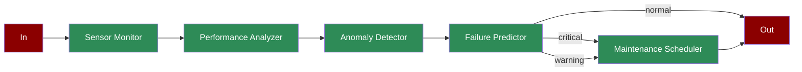

Learn how to implement a predictive maintenance system using AI agents for real-time equipment monitoring and maintenance scheduling.

## Quick Start

<Steps>
    <Step title="Install Package">
        First, install the PraisonAI Agents package:
        ```bash
        pip install praisonaiagents
        ```
    </Step>

    <Step title="Set API Key">
        Set your OpenAI API key as an environment variable in your terminal:
        ```bash
        export OPENAI_API_KEY=your_api_key_here
        ```
    </Step>

    <Step title="Create a file">
        Create a new file `predictive_maintenance.py` with the basic setup:
```python
from praisonaiagents import Agent, Task, PraisonAIAgents
import time
from typing import Dict, List
import asyncio

def collect_sensor_data():
    """Simulates sensor data collection"""
    sensor_readings = {
        "temperature": 75 + (int(time.time()) % 20),
        "vibration": 0.5 + (int(time.time()) % 10) / 10,
        "pressure": 100 + (int(time.time()) % 50),
        "noise_level": 60 + (int(time.time()) % 30)
    }
    return sensor_readings

def analyze_performance():
    """Simulates performance analysis"""
    metrics = {
        "efficiency": 0.8 + (int(time.time()) % 20) / 100,
        "uptime": 0.95 + (int(time.time()) % 5) / 100,
        "output_quality": 0.9 + (int(time.time()) % 10) / 100
    }
    return metrics

def detect_anomalies(sensor_data: Dict, performance: Dict):
    """Simulates anomaly detection"""
    anomalies = []
    if sensor_data["temperature"] > 90:
        anomalies.append({"type": "temperature_high", "severity": "critical"})
    if sensor_data["vibration"] > 1.2:
        anomalies.append({"type": "vibration_excess", "severity": "warning"})
    if performance["efficiency"] < 0.85:
        anomalies.append({"type": "efficiency_low", "severity": "warning"})
    return anomalies

def predict_failures(anomalies: List[Dict]):
    """Simulates failure prediction"""
    predictions = []
    severity_scores = {"critical": 0.9, "warning": 0.6}
    
    for anomaly in anomalies:
        predictions.append({
            "component": anomaly["type"].split("_")[0],
            "probability": severity_scores[anomaly["severity"]],
            "timeframe": "24_hours" if anomaly["severity"] == "critical" else "7_days"
        })
    return predictions

def schedule_maintenance(predictions: List[Dict]):
    """Simulates maintenance scheduling"""
    schedule = []
    for pred in predictions:
        schedule.append({
            "component": pred["component"],
            "priority": "immediate" if pred["timeframe"] == "24_hours" else "planned",
            "estimated_duration": "2_hours",
            "required_parts": ["replacement_" + pred["component"]]
        })
    return schedule

# Create specialized agents
sensor_monitor = Agent(
    name="Sensor Monitor",
    role="Data Collection",
    goal="Collect sensor data",
    instructions="Monitor and collect sensor readings",
    tools=[collect_sensor_data]
)

performance_analyzer = Agent(
    name="Performance Analyzer",
    role="Performance Analysis",
    goal="Analyze equipment performance",
    instructions="Analyze operational metrics",
    tools=[analyze_performance]
)

anomaly_detector = Agent(
    name="Anomaly Detector",
    role="Anomaly Detection",
    goal="Detect operational anomalies",
    instructions="Identify abnormal patterns",
    tools=[detect_anomalies]
)

failure_predictor = Agent(
    name="Failure Predictor",
    role="Failure Prediction",
    goal="Predict potential failures",
    instructions="Predict equipment failures",
    tools=[predict_failures]
)

maintenance_scheduler = Agent(
    name="Maintenance Scheduler",
    role="Maintenance Planning",
    goal="Schedule maintenance activities",
    instructions="Plan and schedule maintenance",
    tools=[schedule_maintenance]
)

# Create workflow tasks
sensor_task = Task(
    name="collect_data",
    description="Collect sensor data",
    expected_output="Sensor readings",
    agent=sensor_monitor,
    is_start=True,
    next_tasks=["analyze_performance"],
    async_execution=True
)

performance_task = Task(
    name="analyze_performance",
    description="Analyze performance metrics",
    expected_output="Performance analysis",
    agent=performance_analyzer,
    next_tasks=["detect_anomalies"],
    async_execution=True
)

anomaly_task = Task(
    name="detect_anomalies",
    description="Detect operational anomalies",
    expected_output="Detected anomalies",
    agent=anomaly_detector,
    next_tasks=["predict_failures"],
    context=[sensor_task, performance_task]
)

prediction_task = Task(
    name="predict_failures",
    description="Predict potential failures",
    expected_output="Failure predictions",
    agent=failure_predictor,
    next_tasks=["schedule_maintenance"],
    task_type="decision",
    condition={
        "critical": ["schedule_maintenance"],
        "warning": ["schedule_maintenance"],
        "normal": ""
    }
)

scheduling_task = Task(
    name="schedule_maintenance",
    description="Schedule maintenance activities",
    expected_output="Maintenance schedule",
    agent=maintenance_scheduler,
    context=[prediction_task]
)

# Create workflow
workflow = PraisonAIAgents(
    agents=[sensor_monitor, performance_analyzer, anomaly_detector,
            failure_predictor, maintenance_scheduler],
    tasks=[sensor_task, performance_task, anomaly_task,
           prediction_task, scheduling_task],
    process="workflow",
    verbose=True
)

async def main():
    print("\nStarting Predictive Maintenance Workflow...")
    print("=" * 50)
    
    # Run workflow
    results = await workflow.astart()
    
    # Print results
    print("\nMaintenance Planning Results:")
    print("=" * 50)
    for task_id, result in results["task_results"].items():
        if result:
            print(f"\nTask: {task_id}")
            print(f"Result: {result.raw}")
            print("-" * 50)

if __name__ == "__main__":
    asyncio.run(main())
```
    </Step>

    <Step title="Start Agents">
        Run your predictive maintenance system:
        ```bash
        python predictive_maintenance.py
        ```
    </Step>
</Steps>

<Note>
  **Requirements**
  - Python 3.10 or higher
  - OpenAI API key. Generate OpenAI API key [here](https://platform.openai.com/api-keys). Use Other models using [this guide](/models).   
</Note>

## Understanding Predictive Maintenance

<Card title="What is Predictive Maintenance?" icon="question">
  Predictive maintenance using AI agents enables:
  - Real-time equipment monitoring
  - Performance analysis and anomaly detection
  - Failure prediction and prevention
  - Automated maintenance scheduling
  - Optimized resource allocation
</Card>

## Features

<CardGroup cols={2}>
  <Card title="Real-time Monitoring" icon="gauge-high">
    Continuous monitoring of equipment sensors and performance metrics.
  </Card>
  <Card title="Anomaly Detection" icon="triangle-exclamation">
    Automated detection of abnormal patterns and potential issues.
  </Card>
  <Card title="Failure Prediction" icon="chart-line">
    Advanced analytics to predict potential equipment failures.
  </Card>
  <Card title="Maintenance Planning" icon="calendar">
    Automated scheduling of maintenance activities based on predictions.
  </Card>
</CardGroup>

## Next Steps

<CardGroup cols={2}>
  <Card title="Prompt Chaining" icon="link" href="/features/promptchaining">
    Learn about sequential prompt chaining for complex workflows
  </Card>
  <Card title="Evaluator Optimizer" icon="magnifying-glass" href="/features/evaluator-optimiser">
    Explore how to optimize agent outputs through evaluation
  </Card>
</CardGroup>

<Note>
  For optimal results, ensure your sensor data collection and analysis parameters are properly configured for your specific equipment.
</Note> 