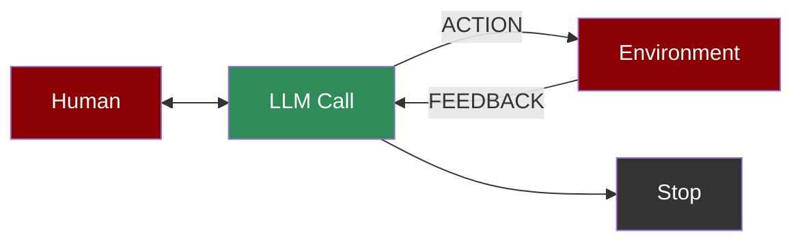

An agent-based workflow where LLMs act autonomously within a loop, interacting with their environment and receiving feedback to refine their actions and decisions.

## Quick Start

<Steps>
    <Step title="Install Package">
        First, install the PraisonAI Agents package:
        ```bash
        pip install praisonaiagents
        ```
    </Step>

    <Step title="Set API Key">
        Set your OpenAI API key as an environment variable in your terminal:
        ```bash
        export OPENAI_API_KEY=your_api_key_here
        ```
    </Step>

    <Step title="Create a file">
        Create a new file `app.py` with the basic setup:
        ```python
        from praisonaiagents import Agent, Task, PraisonAIAgents
        import time

        def get_environment_state():
            """Simulates getting current environment state"""
            current_time = int(time.time())
            states = ["normal", "critical", "optimal"]
            state = states[current_time % 3]
            print(f"Environment state: {state}")
            return state

        def perform_action(state: str):
            """Simulates performing an action based on state"""
            actions = {
                "normal": "maintain",
                "critical": "fix",
                "optimal": "enhance"
            }
            action = actions.get(state, "observe")
            print(f"Performing action: {action} for state: {state}")
            return action

        def get_feedback():
            """Simulates environment feedback"""
            current_time = int(time.time())
            feedback = "positive" if current_time % 2 == 0 else "negative"
            print(f"Feedback received: {feedback}")
            return feedback

        # Create specialized agents
        llm_caller = Agent(
            name="Environment Monitor",
            role="State analyzer",
            goal="Monitor environment and analyze state",
            instructions="Check environment state and provide analysis",
            tools=[get_environment_state]
        )

        action_agent = Agent(
            name="Action Executor",
            role="Action performer",
            goal="Execute appropriate actions based on state",
            instructions="Determine and perform actions based on environment state",
            tools=[perform_action]
        )

        feedback_agent = Agent(
            name="Feedback Processor",
            role="Feedback analyzer",
            goal="Process environment feedback and adapt strategy",
            instructions="Analyze feedback and provide adaptation recommendations",
            tools=[get_feedback]
        )

        # Create tasks for autonomous workflow
        monitor_task = Task(
            name="monitor_environment",
            description="Monitor and analyze environment state",
            expected_output="Current environment state analysis",
            agent=llm_caller,
            is_start=True,
            task_type="decision",
            next_tasks=["execute_action"],
            condition={
                "normal": ["execute_action"],
                "critical": ["execute_action"],
                "optimal": "exit"
            }
        )

        action_task = Task(
            name="execute_action",
            description="Execute appropriate action based on state",
            expected_output="Action execution result",
            agent=action_agent,
            next_tasks=["process_feedback"]
        )

        feedback_task = Task(
            name="process_feedback",
            description="Process feedback and adapt strategy",
            expected_output="Strategy adaptation based on feedback",
            agent=feedback_agent,
            next_tasks=["monitor_environment"],  # Create feedback loop
            context=[monitor_task, action_task]  # Access to previous states and actions
        )

        # Create workflow manager
        workflow = PraisonAIAgents(
            agents=[llm_caller, action_agent, feedback_agent],
            tasks=[monitor_task, action_task, feedback_task],
            process="workflow",
            verbose=True
        )

        def main():
            print("\nStarting Autonomous Agent Workflow...")
            print("=" * 50)
            
            # Run autonomous workflow
            results = workflow.start()
            
            # Print results
            print("\nAutonomous Agent Results:")
            print("=" * 50)
            for task_id, result in results["task_results"].items():
                if result:
                    task_name = result.description
                    print(f"\nTask: {task_name}")
                    print(f"Result: {result.raw}")
                    print("-" * 50)

        if __name__ == "__main__":
            main()
        ```
    </Step>

    <Step title="Start Agents">
        Type this in your terminal to run your agents:
        ```bash
        python app.py
        ```
    </Step>
</Steps>

<Note>
  **Requirements**
  - Python 3.10 or higher
  - OpenAI API key. Generate OpenAI API key [here](https://platform.openai.com/api-keys). Use Other models using [this guide](/models).   
  - Basic understanding of Python
</Note>

## Understanding Autonomous Workflow

<Card title="What is Autonomous Workflow?" icon="question">
  Autonomous Workflow enables:
  - Continuous environment monitoring
  - Automated decision-making and action execution
  - Real-time feedback processing
  - Self-adapting behavior based on outcomes
</Card>

## Features

<CardGroup cols={2}>
  <Card title="Environment Monitoring" icon="eye">
    Continuously monitor and analyze environment state.
  </Card>
  <Card title="Adaptive Actions" icon="gears">
    Execute context-aware actions based on state analysis.
  </Card>
  <Card title="Feedback Processing" icon="rotate">
    Process and learn from action outcomes.
  </Card>
  <Card title="Self-Optimization" icon="arrow-trend-up">
    Improve performance through continuous learning.
  </Card>
</CardGroup>

## Configuration Options

```python
# Create a monitor agent
monitor = Agent(
    name="Environment Monitor",
    role="State analyzer",
    goal="Monitor and analyze state",
    tools=[get_environment_state],  # Environment monitoring tools
    verbose=True  # Enable detailed logging
)

# Create an action agent
action = Agent(
    name="Action Executor",
    role="Action performer",
    goal="Execute appropriate actions",
    tools=[perform_action]  # Action execution tools
)

# Create monitoring task
monitor_task = Task(
    name="monitor_environment",
    description="Monitor environment state",
    agent=monitor,
    is_start=True,
    task_type="decision",
    condition={
        "normal": ["execute_action"],
        "critical": ["execute_action"],
        "optimal": "exit"
    }
)

# Create feedback loop task
feedback_task = Task(
    name="process_feedback",
    description="Process and adapt",
    agent=feedback_agent,
    next_tasks=["monitor_environment"],  # Create feedback loop
    context=[monitor_task, action_task]  # Access history
)
```

## Troubleshooting

<CardGroup cols={2}>
  <Card title="Monitoring Issues" icon="triangle-exclamation">
    If monitoring fails:
    - Check environment access
    - Verify state detection
    - Enable verbose mode for debugging
  </Card>

  <Card title="Adaptation Flow" icon="diagram-project">
    If adaptation is incorrect:
    - Review feedback processing
    - Check action outcomes
    - Verify learning loop
  </Card>
</CardGroup>

## Next Steps

<CardGroup cols={2}>
  <Card title="AutoAgents" icon="robot" href="./autoagents">
    Learn about automatically created and managed AI agents
  </Card>
  <Card title="Mini Agents" icon="microchip" href="./mini">
    Explore lightweight, focused AI agents
  </Card>
</CardGroup>

<Note>
  For optimal results, ensure your environment monitoring is reliable and your feedback processing logic is properly configured for effective adaptation.
</Note>
