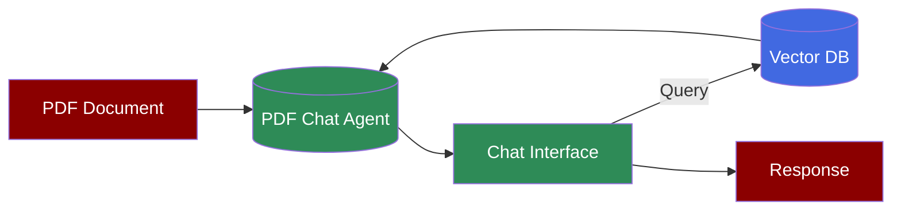
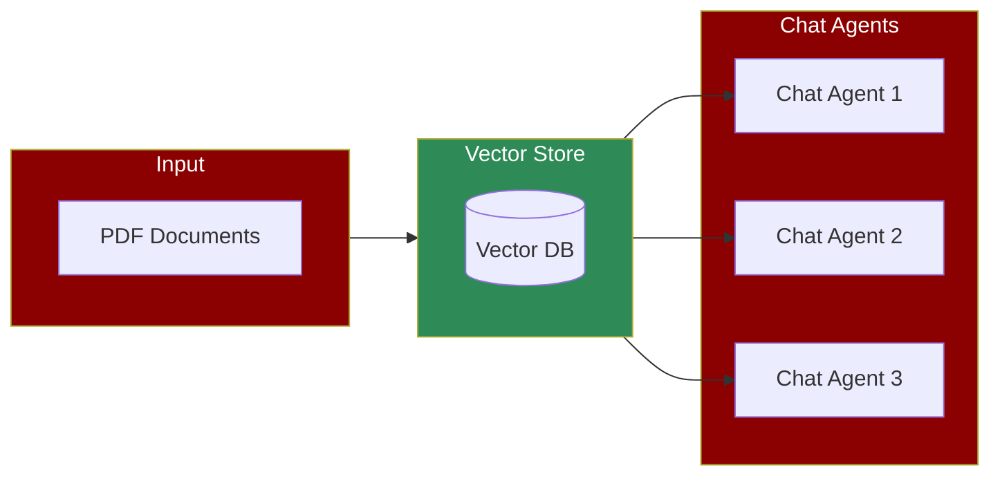

A PDF-centric workflow where Chat agents interact with vector databases to store and retrieve information from PDF documents, enabling natural conversations and intelligent question-answering capabilities.

## Quick Start

<Steps>
  <Step title="Install Package">
    Install PraisonAI Agents with PDF chat support:
    ```bash
    pip install "praisonaiagents[knowledge]"
    ```
  </Step>

  <Step title="Set API Key">
    Set your OpenAI API key:
    ```bash
    export OPENAI_API_KEY=xxxxx
    ```
  </Step>

  <Step title="Create Script">
    Create a new file `chat_with_pdf.py`:
```python
from praisonaiagents import Agent

agent = Agent(
    name="PDF Chat Agent",
    instructions="You answer questions based on the provided PDF document.",
    knowledge=["document.pdf"], # PDF Indexing
)

agent.start("What is the main topic of this PDF?") # Chat Query
```
  </Step>
</Steps>

## PDF Processing and Chat Agents 

<Note>
  PDF processing involves indexing the document content for efficient retrieval during chat.
</Note>



The simplest way to create a PDF chat agent is without any configuration:

```python
from praisonaiagents import Agent

agent = Agent(
    name="PDF Chat Agent",
    instructions="You answer questions based on the provided PDF document.",
    knowledge=["document.pdf"] # PDF Indexing
)

agent.start("What are the key points in this document?") # Chat Query
```

### Advanced Configuration

For more control over the knowledge base, you can specify a configuration:

```python
from praisonaiagents import Agent

config = {
    "vector_store": {
        "provider": "chroma",
        "config": {
            "collection_name": "praison",
            "path": ".praison",
        }
    }
}

agent = Agent(
    name="PDF Chat Agent",
    instructions="You answer questions based on the provided PDF document.",
    knowledge=["document.pdf"], # PDF Indexing
    knowledge_config=config # Configuration
)

agent.start("What is the main topic of this PDF?") # Chat Query
```

### Multi-Agent Knowledge System

For more complex scenarios, you can create a knowledge-based system with multiple agents:

```python
from praisonaiagents import Agent, Task, PraisonAIAgents
import logging
import os

# Configure logging
logging.basicConfig(level=logging.INFO, format='%(asctime)s - %(levelname)s - %(message)s')
logger = logging.getLogger(__name__)

# Define the configuration for the Knowledge instance
config = {
    "vector_store": {
        "provider": "chroma",
        "config": {
            "collection_name": "praison",
            "path": ".praison",
        }
    }
}

# Create an agent with knowledge capabilities
knowledge_agent = Agent(
    name="KnowledgeAgent",
    role="Information Specialist",
    goal="Store and retrieve knowledge efficiently",
    backstory="Expert in managing and utilizing stored knowledge",
    knowledge=["sample.pdf"], # Indexing
    knowledge_config=config, # Configuration
    verbose=True
)

# Define a task for the agent
knowledge_task = Task(
    name="knowledge_task",
    description="Who is Mervin Praison?",
    expected_output="Answer to the question",
    agent=knowledge_agent # Agent
)

# Create and start the agents
agents = PraisonAIAgents(
    agents=[knowledge_agent],
    tasks=[knowledge_task],
    process="sequential",
    user_id="user1" # User ID
)

# Start execution
result = agents.start() # Retrieval
```

## Understanding PDF Chat Agents

<Card title="What are PDF Chat Agents?" icon="question">
  PDF Chat agents enable:
  - Natural conversation with PDF documents
  - Intelligent information extraction
  - Context-aware document understanding
  - Quick answers to document-specific questions
</Card>

## Features

<CardGroup cols={2}>
  <Card title="PDF Processing" icon="file-pdf">
    Process and index PDF documents efficiently.
  </Card>
  <Card title="Natural Chat" icon="comments">
    Have natural conversations about PDF content.
  </Card>
  <Card title="Smart Retrieval" icon="brain">
    Intelligently retrieve relevant information from PDFs.
  </Card>
  <Card title="Context Awareness" icon="layer-group">
    Maintain context throughout the conversation.
  </Card>
</CardGroup>

## Troubleshooting

<CardGroup cols={2}>
  <Card title="PDF Issues" icon="triangle-exclamation">
    If PDF processing isn't working:
    - Check PDF file format and encoding
    - Verify document accessibility
    - Enable verbose mode for debugging
  </Card>

  <Card title="Chat Issues" icon="gauge-high">
    If chat responses aren't accurate:
    - Check PDF indexing quality
    - Verify question clarity
    - Monitor context retention
  </Card>
</CardGroup>

## Next Steps

<CardGroup cols={2}>
  <Card title="AutoAgents" icon="robot" href="./autoagents">
    Learn about automatically created and managed AI agents
  </Card>
  <Card title="Mini Agents" icon="microchip" href="./mini">
    Explore lightweight, focused AI agents
  </Card>
</CardGroup>

<Note>
  For optimal chat experience, ensure your PDFs are properly formatted and text-searchable.
</Note>
