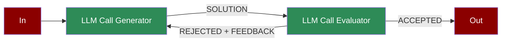

A feedback loop workflow where LLM-generated outputs are evaluated, refined, and optimized iteratively to improve accuracy and relevance.

## Quick Start

<Steps>
    <Step title="Install Package">
        First, install the PraisonAI Agents package:
        ```bash
        pip install praisonaiagents
        ```
    </Step>

    <Step title="Set API Key">
        Set your OpenAI API key as an environment variable in your terminal:
        ```bash
        export OPENAI_API_KEY=your_api_key_here
        ```
    </Step>

    <Step title="Create a file">
        Create a new file `app.py` with the basic setup:
        ```python
        from praisonaiagents import Agent, Task, PraisonAIAgents

        # Create generator and evaluator agents
        generator = Agent(
            name="Generator",
            role="Solution generator",
            goal="Generate initial solutions and incorporate feedback",
            instructions=(
                "1. Look at the context from previous tasks.\n"
                "2. If you see that you have already produced 2 points, then add another 2 new points "
                "   so that the total becomes 10.\n"
                "3. Otherwise, just produce the first 2 points.\n"
                "4. Return only the final list of points, with no extra explanation."
            )
        )

        evaluator = Agent(
            name="Evaluator",
            role="Solution evaluator",
            goal="Evaluate solutions and provide improvement feedback",
            instructions=(
                "1. Count how many lines in the response start with a number and a period (like '1. ' or '2. ').\n"
                "2. If there are 10 or more, respond with 'done'.\n"
                "3. Otherwise, respond with 'more'.\n"
                "4. Return only the single word: 'done' or 'more'."
            )
        )

        # Create tasks for the feedback loop
        generate_task = Task(
            name="generate",
            description="Write 2 points about AI incuding if anything exiting from previous points",
            expected_output="2 points",
            agent=generator,
            is_start=True,
            task_type="decision",
            next_tasks=["evaluate"]
        )

        evaluate_task = Task(
            name="evaluate",
            description="Check if there are 10 points about AI",
            expected_output="more or done",
            agent=evaluator,
            next_tasks=["generate"],
            context=[generate_task],
            task_type="decision",
            condition={
                "more": ["generate"],  # Continue to generate
                "done": [""]  # Exit when optimization complete
            }
        )

        # Create workflow manager
        workflow = PraisonAIAgents(
            agents=[generator, evaluator],
            tasks=[generate_task, evaluate_task],
            process="workflow",
            verbose=True
        )

        # Run optimization workflow
        results = workflow.start()

        # Print results
        print("\nEvaluator-Optimizer Results:")
        for task_id, result in results["task_results"].items():
            if result:
                print(f"Task {task_id}: {result.raw}")
        ```
    </Step>

    <Step title="Start Agents">
        Type this in your terminal to run your agents:
        ```bash
        python app.py
        ```
    </Step>
</Steps>

<Note>
  **Requirements**
  - Python 3.10 or higher
  - OpenAI API key. Generate OpenAI API key [here](https://platform.openai.com/api-keys). Use Other models using [this guide](/models).   
  - Basic understanding of Python
</Note>

## Understanding Evaluator-Optimizer

<Card title="What is Evaluator-Optimizer?" icon="question">
  Evaluator-Optimizer pattern enables:
  - Iterative solution generation and refinement
  - Automated quality evaluation
  - Feedback-driven optimization
  - Continuous improvement loops
</Card>

## Features

<CardGroup cols={2}>
  <Card title="Solution Generation" icon="wand-magic-sparkles">
    Generate solutions based on requirements and feedback.
  </Card>
  <Card title="Quality Evaluation" icon="magnifying-glass-chart">
    Automatically assess solution quality and completeness.
  </Card>
  <Card title="Feedback Loop" icon="rotate">
    Implement iterative improvement through feedback cycles.
  </Card>
  <Card title="Process Control" icon="sliders">
    Monitor and control the optimization process.
  </Card>
</CardGroup>

## Configuration Options

```python
# Create a generator agent
generator = Agent(
    name="Generator",
    role="Solution generator",
    goal="Generate and improve solutions",
    instructions="Step-by-step instructions for generation",
    verbose=True  # Enable detailed logging
)

# Create an evaluator agent
evaluator = Agent(
    name="Evaluator",
    role="Solution evaluator",
    goal="Evaluate and provide feedback",
    instructions="Evaluation criteria and feedback format"
)

# Create tasks with feedback loop
generate_task = Task(
    name="generate",
    description="Generate solution",
    agent=generator,
    is_start=True,
    task_type="decision",
    next_tasks=["evaluate"]
)

evaluate_task = Task(
    name="evaluate",
    description="Evaluate solution",
    agent=evaluator,
    context=[generate_task],
    task_type="decision",
    condition={
        "more": ["generate"],  # Continue optimization
        "done": [""]  # Exit when complete
    }
)
```

## Troubleshooting

<CardGroup cols={2}>
  <Card title="Generation Issues" icon="triangle-exclamation">
    If generation is not improving:
    - Review generator instructions
    - Check feedback integration
    - Enable verbose mode for debugging
  </Card>

  <Card title="Evaluation Flow" icon="diagram-project">
    If evaluation cycle is incorrect:
    - Verify evaluation criteria
    - Check condition mappings
    - Review feedback loop connections
  </Card>
</CardGroup>

## Next Steps

<CardGroup cols={2}>
  <Card title="AutoAgents" icon="robot" href="./autoagents">
    Learn about automatically created and managed AI agents
  </Card>
  <Card title="Mini Agents" icon="microchip" href="./mini">
    Explore lightweight, focused AI agents
  </Card>
</CardGroup>

<Note>
  For optimal results, ensure your generator instructions and evaluation criteria are clear and well-defined to achieve the desired optimization outcomes.
</Note>
