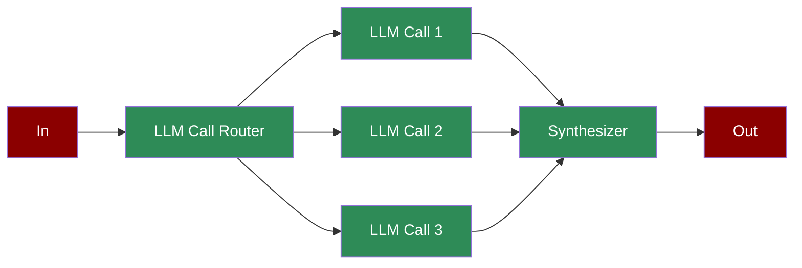

A workflow with a central orchestrator directing multiple worker LLMs to perform subtasks, synthesizing their outputs for complex, coordinated operations.

## Quick Start

<Steps>
    <Step title="Install Package">
        First, install the PraisonAI Agents package:
        ```bash
        pip install praisonaiagents
        ```
    </Step>

    <Step title="Set API Key">
        Set your OpenAI API key as an environment variable in your terminal:
        ```bash
        export OPENAI_API_KEY=your_api_key_here
        ```
    </Step>

    <Step title="Create a file">
        Create a new file `app.py` with the basic setup:
        ```python
        from praisonaiagents import Agent, Task, PraisonAIAgents
        import time

        def get_time_check():
            current_time = int(time.time())
            if current_time % 3 == 0:
                result = 1
            elif current_time % 3 == 1:
                result = 2
            else:
                result = 3
            print(f"Time: {current_time}, Result: {result}")
            return result

        # Create orchestrator and worker agents
        router = Agent(
            name="Router",
            role="Task router",
            goal="Distribute tasks to based on response from get_time_check",
            tools=[get_time_check]
        )

        worker1 = Agent(
            name="Worker 1",
            role="Specialized worker",
            goal="Handle specific subtask type 1",
        )

        worker2 = Agent(
            name="Worker 2",
            role="Specialized worker",
            goal="Handle specific subtask type 2",
        )

        worker3 = Agent(
            name="Worker 3",
            role="Specialized worker",
            goal="Handle specific subtask type 3",
        )

        synthesizer = Agent(
            name="Synthesizer",
            role="Result synthesizer",
            goal="Combine and synthesize worker outputs",
        )

        # Create orchestrated workflow tasks
        router_task = Task(
            name="route_task",
            description="Analyze input from get_time_check and route to appropriate workers",
            expected_output="Task routing decision, 1 , 2 or 3",
            agent=router,
            is_start=True,
            task_type="decision",
            next_tasks=["worker1_task", "worker2_task", "worker3_task"],
            condition={
                "1": ["worker1_task"],
                "2": ["worker2_task"],
                "3": ["worker3_task"]
            }
        )

        worker1_task = Task(
            name="worker1_task",
            description="Process type 1 operation",
            expected_output="Worker 1 result",
            agent=worker1,
            next_tasks=["synthesize_task"]
        )

        worker2_task = Task(
            name="worker2_task",
            description="Process type 2 operation",
            expected_output="Worker 2 result",
            agent=worker2,
            next_tasks=["synthesize_task"]
        )

        worker3_task = Task(
            name="worker3_task",
            description="Process type 3 operation",
            expected_output="Worker 3 result",
            agent=worker3,
            next_tasks=["synthesize_task"]
        )

        synthesize_task = Task(
            name="synthesize_task",
            description="Synthesize worker results into final output",
            expected_output="Final synthesized result",
            agent=synthesizer,
            context=[worker1_task, worker2_task, worker3_task]
        )

        # Create workflow manager
        workflow = PraisonAIAgents(
            agents=[router, worker1, worker2, worker3, synthesizer],
            tasks=[router_task, worker1_task, worker2_task, worker3_task, synthesize_task],
            process="workflow",
            verbose=True
        )

        # Run orchestrated workflow
        results = workflow.start()

        # Print results
        print("\nOrchestrator-Workers Results:")
        for task_id, result in results["task_results"].items():
            if result:
                print(f"Task {task_id}: {result.raw}")
        ```
    </Step>

    <Step title="Start Agents">
        Type this in your terminal to run your agents:
        ```bash
        python app.py
        ```
    </Step>
</Steps>

<Note>
  **Requirements**
  - Python 3.10 or higher
  - OpenAI API key. Generate OpenAI API key [here](https://platform.openai.com/api-keys). Use Other models using [this guide](/models).   
  - Basic understanding of Python
</Note>

## Understanding Orchestrator-Worker Pattern

<Card title="What is Orchestrator-Worker?" icon="question">
  Orchestrator-Worker pattern enables:
  - Dynamic task distribution and routing
  - Specialized worker execution
  - Result synthesis and aggregation
  - Coordinated workflow management
</Card>

## Features

<CardGroup cols={2}>
  <Card title="Task Routing" icon="route">
    Intelligently distribute tasks to specialized workers.
  </Card>
  <Card title="Worker Specialization" icon="user-gear">
    Dedicated agents for specific task types.
  </Card>
  <Card title="Result Synthesis" icon="object-group">
    Combine and process worker outputs effectively.
  </Card>
  <Card title="Process Control" icon="sliders">
    Monitor and manage the orchestrated workflow.
  </Card>
</CardGroup>

## Configuration Options

```python
# Create an orchestrator agent
router = Agent(
    name="Router",
    role="Task router",
    goal="Distribute tasks based on conditions",
    tools=[get_time_check],  # Tools for routing decisions
    verbose=True  # Enable detailed logging
)

# Create a worker agent
worker = Agent(
    name="Worker",
    role="Specialized worker",
    goal="Handle specific task type",
    instructions="Processing instructions"
)

# Create routing task
router_task = Task(
    name="route_task",
    description="Route tasks to workers",
    agent=router,
    is_start=True,
    task_type="decision",
    condition={
        "1": ["worker1_task"],
        "2": ["worker2_task"]
    }
)

# Create synthesis task
synthesis_task = Task(
    name="synthesize",
    description="Combine worker results",
    agent=synthesizer,
    context=[worker1_task, worker2_task]  # Reference worker tasks
)
```

## Troubleshooting

<CardGroup cols={2}>
  <Card title="Routing Issues" icon="triangle-exclamation">
    If task routing fails:
    - Check routing conditions
    - Verify worker availability
    - Enable verbose mode for debugging
  </Card>

  <Card title="Synthesis Flow" icon="diagram-project">
    If result synthesis is incorrect:
    - Review worker outputs
    - Check context connections
    - Verify synthesis logic
  </Card>
</CardGroup>

## Next Steps

<CardGroup cols={2}>
  <Card title="AutoAgents" icon="robot" href="./autoagents">
    Learn about automatically created and managed AI agents
  </Card>
  <Card title="Mini Agents" icon="microchip" href="./mini">
    Explore lightweight, focused AI agents
  </Card>
</CardGroup>

<Note>
  For optimal results, ensure your routing logic is well-defined and your workers are properly configured for their specialized tasks.
</Note>
