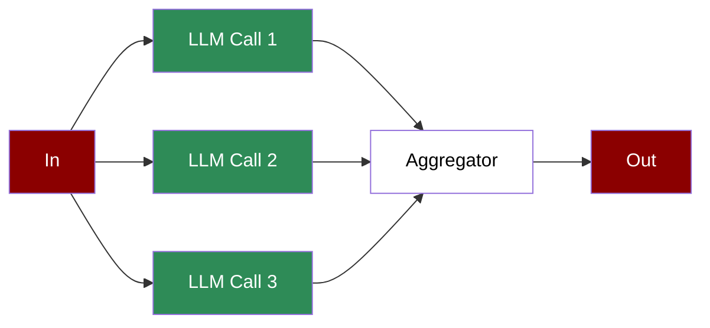

A workflow that distributes tasks across multiple LLM calls simultaneously, aggregating results to handle complex or large-scale operations efficiently.

## Quick Start

<Steps>
    <Step title="Install Package">
        First, install the PraisonAI Agents package:
        ```bash
        pip install praisonaiagents
        ```
    </Step>

    <Step title="Set API Key">
        Set your OpenAI API key as an environment variable in your terminal:
        ```bash
        export OPENAI_API_KEY=your_api_key_here
        ```
    </Step>

    <Step title="Create a file">
        Create a new file `app.py` with the basic setup:
        ```python
        from praisonaiagents import Agent, Task, PraisonAIAgents
        from datetime import datetime
        import asyncio

        def process_time():
            """Simulate processing"""
            current_time = datetime.now().strftime("%Y-%m-%d %H:%M:%S")
            print(f"Processing at: {current_time}")
            return f"Processed at {current_time}"

        # Create parallel processing agents
        agent1 = Agent(
            name="Processor 1",
            role="Time collector",
            goal="Get the time and return it",
            tools=[process_time]
        )

        agent2 = Agent(
            name="Processor 2",
            role="Time collector",
            goal="Get the time and return it",
            tools=[process_time]
        )

        agent3 = Agent(
            name="Processor 3",
            role="Time collector",
            goal="Get the time and return it",
            tools=[process_time]
        )

        aggregator = Agent(
            name="Aggregator",
            role="Result aggregator",
            goal="Collect all the processed time from all tasks"
        )

        # Create parallel tasks with memory disabled
        task1 = Task(
            name="process_1",
            description="Use process_time tool to get the time",
            expected_output="processed time",
            agent=agent1,
            is_start=True,
            async_execution=True
        )

        task2 = Task(
            name="process_2",
            description="Use process_time tool to get the time",
            expected_output="processed time",
            agent=agent2,
            is_start=True,
            async_execution=True
        )

        task3 = Task(
            name="process_3",
            description="Use process_time tool to get the time",
            expected_output="processed time",
            agent=agent3,
            is_start=True,
            async_execution=True
        )

        aggregate_task = Task(
            name="aggregate",
            description="Collect all the processed time from all tasks",
            expected_output="Output all the processed time from all tasks and just the time",
            agent=aggregator,
            context=[task1, task2, task3]
        )

        async def main():

            # Create workflow manager
            workflow = PraisonAIAgents(
                agents=[agent1, agent2, agent3, aggregator],
                tasks=[task1, task2, task3, aggregate_task],
                process="workflow"
            )

            # Run parallel workflow
            results = await workflow.astart()

            # Print results
            print("\nParallel Processing Results:")
            for task_id, result in results["task_results"].items():
                if result:
                    print(f"Task {task_id}: {result.raw}")

        # Run the async main function
        if __name__ == "__main__":
            asyncio.run(main())
        ```
    </Step>

    <Step title="Start Agents">
        Type this in your terminal to run your agents:
        ```bash
        python app.py
        ```
    </Step>
</Steps>

<Note>
  **Requirements**
  - Python 3.10 or higher
  - OpenAI API key. Generate OpenAI API key [here](https://platform.openai.com/api-keys). Use Other models using [this guide](/models).   
  - Basic understanding of Python and async programming
</Note>

## Understanding Parallelisation

<Card title="What is Parallelisation?" icon="question">
  Parallelisation enables:
  - Concurrent execution of multiple tasks
  - Improved performance through parallel processing
  - Efficient handling of independent operations
  - Aggregation of parallel task results
</Card>

## Features

<CardGroup cols={2}>
  <Card title="Parallel Execution" icon="arrows-split-up-and-left">
    Run multiple tasks simultaneously for improved performance.
  </Card>
  <Card title="Async Support" icon="bolt">
    Built-in support for asynchronous execution.
  </Card>
  <Card title="Result Aggregation" icon="layer-group">
    Combine results from parallel tasks efficiently.
  </Card>
  <Card title="Process Control" icon="sliders">
    Monitor and manage parallel task execution.
  </Card>
</CardGroup>

## Configuration Options

```python
# Create a parallel task
task = Task(
    name="parallel_task",
    description="Task to run in parallel",
    expected_output="Task result",
    agent=agent,
    is_start=True,
    async_execution=True  # Enable parallel execution
)

# Create an aggregator task
aggregator_task = Task(
    name="aggregate",
    description="Aggregate results from parallel tasks",
    expected_output="Combined results",
    agent=aggregator,
    context=[task1, task2, task3]  # Reference parallel tasks
)

# Async workflow execution
async def run_workflow():
    workflow = PraisonAIAgents(
        agents=[agent1, agent2, aggregator],
        tasks=[task1, task2, aggregator_task],
        process="workflow",
        verbose=True
    )
    results = await workflow.astart()
```

## Troubleshooting

<CardGroup cols={2}>
  <Card title="Execution Issues" icon="triangle-exclamation">
    If parallel execution fails:
    - Check async configuration
    - Verify task independence
    - Monitor resource usage
  </Card>

  <Card title="Result Aggregation" icon="diagram-project">
    If aggregation is incorrect:
    - Review task outputs
    - Check context connections
    - Verify aggregator logic
  </Card>
</CardGroup>

## Next Steps

<CardGroup cols={2}>
  <Card title="AutoAgents" icon="robot" href="./autoagents">
    Learn about automatically created and managed AI agents
  </Card>
  <Card title="Mini Agents" icon="microchip" href="./mini">
    Explore lightweight, focused AI agents
  </Card>
</CardGroup>

<Note>
  For optimal results, ensure your parallel tasks are truly independent and your system has sufficient resources to handle concurrent execution.
</Note>
