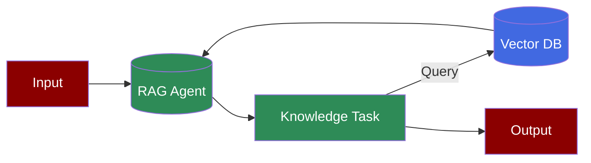
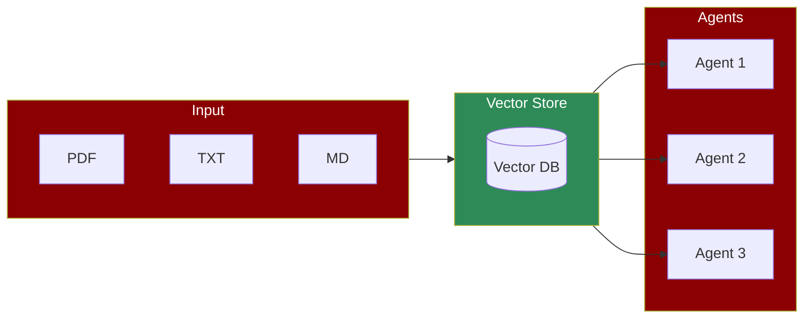

A knowledge-centric workflow where RAG (Retrieval Augmented Generation) agents interact with vector databases to store and retrieve information efficiently, enabling sophisticated question-answering and information retrieval capabilities.

## Quick Start

<Steps>
  <Step title="Install Package">
    Install PraisonAI Agents with knowledge support:
    ```bash
    pip install "praisonaiagents[knowledge]"
    ```
  </Step>

  <Step title="Set API Key">
    Set your OpenAI API key:
    ```bash
    export OPENAI_API_KEY=xxxxx
    ```
  </Step>

  <Step title="Create Script">
    Create a new file `app.py`:
```python
from praisonaiagents import Agent

agent = Agent(
    name="Knowledge Agent",
    instructions="You answer questions based on the provided knowledge.",
    knowledge=["small.pdf"], # Indexing
)

agent.start("What is KAG in one line?") # Retrieval
```
  </Step>
</Steps>

## Data Indexing and Retrieval Agents 

<Note>
  Indexing and Ingestion are relatively the same.
</Note>



The simplest way to create a knowledge-based agent is without any configuration:

```python
from praisonaiagents import Agent

agent = Agent(
    name="Knowledge Agent",
    instructions="You answer questions based on the provided knowledge.",
    knowledge=["small.pdf"] # Indexing
)

agent.start("What is KAG in one line?") # Retrieval
```

### Advanced Configuration

For more control over the knowledge base, you can specify a configuration:

```python
from praisonaiagents import Agent

config = {
    "vector_store": {
        "provider": "chroma",
        "config": {
            "collection_name": "praison",
            "path": ".praison",
        }
    }
}

agent = Agent(
    name="Knowledge Agent",
    instructions="You answer questions based on the provided knowledge.",
    knowledge=["small.pdf"], # Indexing
    knowledge_config=config # Configuration
)

agent.start("What is KAG in one line?") # Retrieval
```

### Multi-Agent Knowledge System

For more complex scenarios, you can create a knowledge-based system with multiple agents:

```python
from praisonaiagents import Agent, Task, PraisonAIAgents
import logging
import os

# Configure logging
logging.basicConfig(level=logging.INFO, format='%(asctime)s - %(levelname)s - %(message)s')
logger = logging.getLogger(__name__)

# Define the configuration for the Knowledge instance
config = {
    "vector_store": {
        "provider": "chroma",
        "config": {
            "collection_name": "praison",
            "path": ".praison",
        }
    }
}

# Create an agent with knowledge capabilities
knowledge_agent = Agent(
    name="KnowledgeAgent",
    role="Information Specialist",
    goal="Store and retrieve knowledge efficiently",
    backstory="Expert in managing and utilizing stored knowledge",
    knowledge=["sample.pdf"], # Indexing
    knowledge_config=config, # Configuration
    verbose=True
)

# Define a task for the agent
knowledge_task = Task(
    name="knowledge_task",
    description="Who is Mervin Praison?",
    expected_output="Answer to the question",
    agent=knowledge_agent # Agent
)

# Create and start the agents
agents = PraisonAIAgents(
    agents=[knowledge_agent],
    tasks=[knowledge_task],
    process="sequential",
    user_id="user1" # User ID
)

# Start execution
result = agents.start() # Retrieval
```

## Retrieval Agents

<Note>
  Retrieval is the process of querying the vector database for information.
  Considering there is data already in the Vector Database.
</Note>

<Steps>
    <Step title="Install Package">
        First, install the PraisonAI Agents package:
        ```bash
        pip install praisonaiagents
        ```
    </Step>

    <Step title="Set API Key">
        Set your OpenAI API key as an environment variable in your terminal:
        ```bash
        export OPENAI_API_KEY=your_api_key_here
        ```
    </Step>

    <Step title="Create a file">
        Create a new file `rag_agent.py` with the basic setup:
```python
from praisonaiagents import Agent, Task, PraisonAIAgents

# Define the configuration for the Knowledge instance
config = {
    "vector_store": {
        "provider": "chroma",
        "config": {
            "collection_name": "praison",
            "path": ".praison"
        }
    }
}

# Create an agent
rag_agent = Agent(
    name="RAG Agent",
    role="Information Specialist",
    goal="Retrieve knowledge efficiently",
    llm="gpt-4o-mini"
)

# Define a task for the agent
rag_task = Task(
    name="RAG Task",
    description="What is KAG?",
    expected_output="Answer to the question",
    agent=rag_agent,
    context=[config] # Retrieval : Vector Database provided as context
)

# Build Agents
agents = PraisonAIAgents(
    agents=[rag_agent],
    tasks=[rag_task],
    user_id="user1"
)

# Start Agents
agents.start()
```
    </Step>

    <Step title="Start Agents">
        Type this in your terminal to run your agents:
        ```bash
        python rag_agent.py
        ```
    </Step>
</Steps>

<Note>
  **Requirements**
  - Python 3.10 or higher
  - OpenAI API key. Generate OpenAI API key [here](https://platform.openai.com/api-keys). Use Other models using [this guide](/models).   
  - ChromaDB or other supported vector database
</Note>

### Adding Knowledge to RAG Agents

```python
from praisonaiagents import Agent

config = {
    "vector_store": {
        "provider": "chroma",
        "config": {
            "collection_name": "praison",
            "path": ".praison",
        }
    }
}

agent = Agent(
    name="Knowledge Agent",
    instructions="You answer questions based on the provided knowledge.",
    knowledge=["small.pdf"], # Indexing
    knowledge_config=config # Configuration
)

agent.start("What is KAG in one line?") # Retrieval
```

## Understanding RAG Agents

<Card title="What are RAG Agents?" icon="question">
  RAG (Retrieval Augmented Generation) agents enable:
  - Efficient knowledge retrieval
  - Semantic search capabilities
  - Persistent knowledge storage
  - Context-aware responses
</Card>

## Features

<CardGroup cols={2}>
  <Card title="RAG Architecture" icon="database">
    Store and manage vector embeddings efficiently.
  </Card>
  <Card title="Semantic Search" icon="magnifying-glass">
    Find relevant information using semantic similarity.
  </Card>
  <Card title="Knowledge Integration" icon="brain">
    Seamlessly integrate with existing knowledge bases.
  </Card>
  <Card title="Context Management" icon="layer-group">
    Handle complex contextual queries and responses.
  </Card>
</CardGroup>

## Troubleshooting

<CardGroup cols={2}>
  <Card title="RAG Issues" icon="triangle-exclamation">
    If RAG system isn't working:
    - Check database configuration
    - Verify connection settings
    - Enable verbose mode for debugging
  </Card>

  <Card title="Query Issues" icon="gauge-high">
    If queries aren't returning expected results:
    - Check embedding quality
    - Verify search parameters
    - Monitor similarity thresholds
  </Card>
</CardGroup>

## Next Steps

<CardGroup cols={2}>
  <Card title="AutoAgents" icon="robot" href="./autoagents">
    Learn about automatically created and managed AI agents
  </Card>
  <Card title="Mini Agents" icon="microchip" href="./mini">
    Explore lightweight, focused AI agents
  </Card>
</CardGroup>

<Note>
  For optimal results, ensure your vector database is properly configured and indexed for your specific use case.
</Note>
