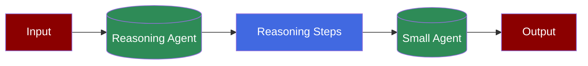

A workflow where a reasoning agent breaks down complex problems into steps, followed by a smaller agent that processes these steps to provide concise answers.

## Prerequisites

<Steps>
    <Step title="Install Package">
        Install required packages:
        ```bash
        pip install "praisonaiagents[llm]"
        ```

        <Note>
        praisonaiagents[llm] includes all necessary dependencies for reasoning agents
        </Note>
    </Step>

    <Step title="Set API Key">
        Configure your API key:
        ```bash
        export OPENAI_API_KEY=your_api_key_here
        ```
    </Step>

    <Step title="Create File">
        Create a new file called `app.py` and add the following code:
    </Step>

    <Step title="Run Application">
        Execute the script:
        ```bash
        python app.py
        ```
    </Step>
</Steps>

## Code

```python
from praisonaiagents import Agent, Task, PraisonAIAgents

reasoning_agent = Agent(
    role="Helpful Assistant", 
    reasoning_steps=True, 
    llm="deepseek/deepseek-reasoner"
)

small_agent = Agent(
    role="Helpful Assistant", 
    llm="gpt-3.5-turbo"
)

reasoning_task = Task(
    description="How many r's in the word 'Strawberry'?", 
    agent=reasoning_agent
)

small_task = Task(
    description="With the provided reasoning tell me how many r's in the word 'Strawberry'?", 
    agent=small_agent
)

agents = PraisonAIAgents(
    agents=[reasoning_agent, small_agent],
    tasks=[reasoning_task, small_task]
)

agents.start()
```

## Features

<CardGroup cols={2}>
  <Card title="Step-by-Step Reasoning" icon="list-check">
    Break down complex problems into logical steps.
  </Card>
  <Card title="Multi-Agent Collaboration" icon="users">
    Combine reasoning and processing agents.
  </Card>
  <Card title="Flexible Models" icon="arrows-split-up-and-left">
    Use different models for reasoning and processing.
  </Card>
  <Card title="Task Chaining" icon="link">
    Connect reasoning output to processing tasks.
  </Card>
</CardGroup>

## Understanding Reasoning Agents

<Card title="What are Reasoning Agents?" icon="question">
  Reasoning agents enable:
  - Detailed step-by-step analysis
  - Logical problem decomposition
  - Clear reasoning paths
  - Enhanced decision making
</Card>

## Troubleshooting

<CardGroup cols={2}>
  <Card title="Reasoning Issues" icon="triangle-exclamation">
    If reasoning steps aren't clear:
    - Check reasoning_steps parameter
    - Verify model compatibility
    - Review task descriptions
  </Card>

  <Card title="Agent Communication" icon="messages">
    If agents aren't coordinating:
    - Ensure task order is correct
    - Check task dependencies
    - Verify agent configurations
  </Card>
</CardGroup>

<Note>
  The reasoning agent uses a specialized model (deepseek-reasoner) optimized for step-by-step analysis, while the small agent can use a more general-purpose model for processing the reasoning output.
</Note>