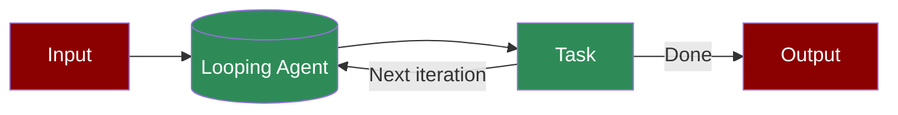

A workflow optimization pattern where agents handle repetitive tasks through automated loops, processing multiple instances efficiently while maintaining consistency.

## Quick Start

<Steps>
    <Step title="Install Package">
        First, install the PraisonAI Agents package:
        ```bash
        pip install praisonaiagents
        ```
    </Step>

    <Step title="Set API Key">
        Set your OpenAI API key as an environment variable in your terminal:
        ```bash
        export OPENAI_API_KEY=your_api_key_here
        ```
    </Step>

    <Step title="Create a file">
        Create a new file `repetitive_agent.py` with the basic setup:
        ```python
        from praisonaiagents import Agent, Task, PraisonAIAgents

        agent = Agent(
            instructions="You are a loop agent that creating a loop of tasks."
        )

        task = Task(
            description="Create the list of tasks to be looped through.",
            agent=agent,
            task_type="loop",
            input_file="tasks.csv"
        )

        agents = PraisonAIAgents(
            agents=[agent],
            tasks=[task],
            process="workflow",
            max_iter=30
        )

        agents.start()
        ```
    </Step>

    <Step title="Start Agents">
        Type this in your terminal to run your agents:
        ```bash
        python repetitive_agent.py
        ```
    </Step>
</Steps>

<Note>
  **Requirements**
  - Python 3.10 or higher
  - OpenAI API key. Generate OpenAI API key [here](https://platform.openai.com/api-keys). Use Other models using [this guide](/models).   
</Note>

## Understanding Repetitive Agents

<Card title="What are Repetitive Agents?" icon="question">
  Repetitive agents enable:
  - Automated task loops
  - Batch processing
  - Consistent task execution
  - Efficient handling of multiple similar tasks
</Card>

## Features

<CardGroup cols={2}>
  <Card title="Task Looping" icon="repeat">
    Process multiple tasks through automated loops.
  </Card>
  <Card title="Batch Processing" icon="layer-group">
    Handle multiple similar tasks efficiently.
  </Card>
  <Card title="Input Management" icon="file-csv">
    Process tasks from structured input files.
  </Card>
  <Card title="Progress Tracking" icon="chart-line">
    Monitor task completion and progress.
  </Card>
</CardGroup>

## Troubleshooting

<CardGroup cols={2}>
  <Card title="Loop Issues" icon="triangle-exclamation">
    If loops aren't working as expected:
    - Verify input file format
    - Check task configurations
    - Enable verbose mode for debugging
  </Card>

  <Card title="Performance Issues" icon="gauge-high">
    If processing is slow:
    - Check batch sizes
    - Verify resource allocation
    - Monitor memory usage
  </Card>
</CardGroup>

## Next Steps

<CardGroup cols={2}>
  <Card title="AutoAgents" icon="robot" href="./autoagents">
    Learn about automatically created and managed AI agents
  </Card>
  <Card title="Mini Agents" icon="microchip" href="./mini">
    Explore lightweight, focused AI agents
  </Card>
</CardGroup>

<Note>
  For optimal results, ensure your input files are properly formatted and your task configurations are appropriate for your use case.
</Note>
