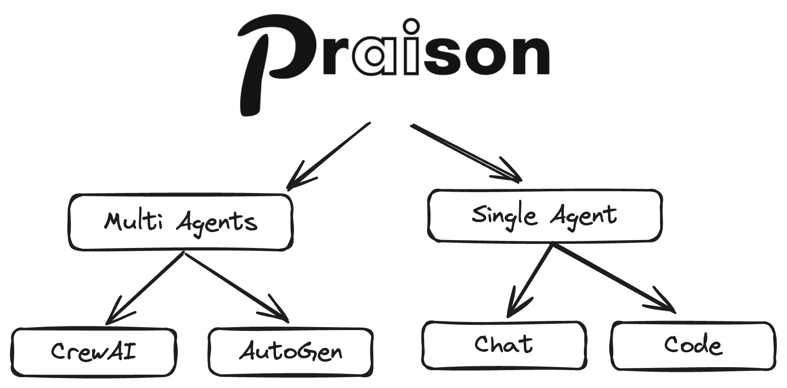
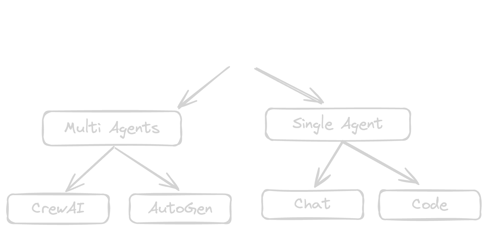

<Note>
  Welcome to PraisonAI - Your comprehensive solution for building and managing multi-agent LLM systems with self-reflection capabilities.
</Note>
<div className="flex justify-start w-full max-w-xs sm:max-w-sm md:max-w-md">
  
  
</div>
<div className="flex flex-wrap gap-4 my-8">
  <div className="hover:opacity-80 transition-opacity">
    
  </div>
  <div className="hover:opacity-80 transition-opacity">
    
  </div>
  <div className="hover:opacity-80 transition-opacity">
    
  </div>
  <div className="hover:opacity-80 transition-opacity">
    
  </div>
  <div className="hover:opacity-80 transition-opacity">
    
  </div>
</div>

<Tip>
  PraisonAI combines PraisonAI Agents, AutoGen, and CrewAI into a low-code solution for building and managing multi-agent LLM systems, focusing on simplicity, customization, and efficient human-agent collaboration.
</Tip>

## Key Features

<CardGroup cols={2}>
  <Card title="AI Agents Creation" icon="robot">
    Automated creation and management of AI agents with self-reflection capabilities
  </Card>
  <Card title="Framework Integration" icon="puzzle-piece">
    Seamless integration with CrewAI and AutoGen frameworks
  </Card>
  <Card title="LLM Support" icon="brain">
    Support for 100+ Language Learning Models
  </Card>
  <Card title="Code Integration" icon="code">
    Chat with your entire codebase using advanced context understanding
  </Card>
  <Card title="Interactive UI" icon="desktop">
    Rich, interactive user interfaces for better control and monitoring
  </Card>
  <Card title="Configuration" icon="gear">
    YAML-based configuration for easy setup and customization
  </Card>
  <Card title="Tool Integration" icon="screwdriver-wrench">
    Custom tool integration for extended functionality
  </Card>
  <Card title="Search Capability" icon="magnifying-glass">
    Internet search using Crawl4AI and Tavily
  </Card>
</CardGroup>
<br />
<div className="relative w-full aspect-video overflow-hidden rounded-lg shadow-lg mb-8">
  <iframe
    className="absolute top-0 left-0 w-full h-full border-0"
    src="https://www.youtube.com/embed/Fn1lQjC0GO0"
    title="YouTube video player"
    allow="accelerometer; autoplay; clipboard-write; encrypted-media; gyroscope; picture-in-picture"
    allowFullScreen
    style={{
      maxWidth: '100vw',
      margin: '0 auto'
    }}
  ></iframe>
</div>

## Installation Options

<Tabs>
  <Tab title="No Code">
    <Steps>
      <Step title="Install Package">
        ```bash
        pip install praisonai
        ```
      </Step>
      <Step title="Set API Key">
        ```bash
        export OPENAI_API_KEY=xxxxxxxxxxxxxxxxxxxxxx
        ```
      </Step>
      <Step title="Auto Mode">
        ```bash
        praisonai --auto create a movie script about Robots in Mars
        ```

        This will automatically create required agents and complete the task

      </Step>
    </Steps>
  </Tab>
  <Tab title="Code">
    <Steps>
      <Step title="Install Package">
        ```bash
        pip install praisonaiagents
        ```
      </Step>
      <Step title="Set API Key">
        ```bash
        export OPENAI_API_KEY=xxxxxxxxxxxxxxxxxxxxxx
        ```
      </Step>
      <Step title="Create File">
        Create `app.py` file

        ## Code Example

<CodeGroup>
  ```python Basic
  from praisonaiagents import Agent, Task, PraisonAIAgents

  # Create an agent
  researcher = Agent(
      name="Researcher",
      role="Senior Research Analyst",
      goal="Uncover cutting-edge developments in AI",
      backstory="You are an expert at a technology research group",
      verbose=True,
      llm="gpt-4o"
  )

  # Define a task
  task = Task(
      name="research_task",
      description="Analyze 2024's AI advancements",
      expected_output="A detailed report",
      agent=researcher
  )

  # Run the agents
  agents = PraisonAIAgents(
      agents=[researcher],
      tasks=[task],
      verbose=False
  )

  result = agents.start()
  ```

  ```python Advanced
  from praisonaiagents import Agent, Task, PraisonAIAgents

  # Create multiple agents
  researcher = Agent(
      name="Researcher",
      role="Senior Research Analyst",
      goal="Uncover cutting-edge developments in AI",
      backstory="You are an expert at a technology research group",
      verbose=True,
      llm="gpt-4o",
      markdown=True
  )

  writer = Agent(
      name="Writer",
      role="Tech Content Strategist",
      goal="Craft compelling content on tech advancements",
      backstory="You are a content strategist",
      llm="gpt-4o",
      markdown=True
  )

  # Define multiple tasks
  task1 = Task(
      name="research_task",
      description="Analyze 2024's AI advancements",
      expected_output="A detailed report",
      agent=researcher
  )

  task2 = Task(
      name="writing_task",
      description="Create a blog post about AI advancements",
      expected_output="A blog post",
      agent=writer
  )

  # Run with hierarchical process
  agents = PraisonAIAgents(
      agents=[researcher, writer],
      tasks=[task1, task2],
      verbose=False,
      process="hierarchical",
      manager_llm="gpt-4o"
  )

  result = agents.start()
  ```
</CodeGroup>
      </Step>
      <Step title="Run Script">
        ```bash
        python app.py
        ```
      </Step>
    </Steps>
  </Tab>
</Tabs>

## Integration Options

<AccordionGroup>
  <Accordion title="Ollama Integration">
    ```bash
    export OPENAI_BASE_URL=http://localhost:11434/v1
    ```
  </Accordion>
  <Accordion title="Groq Integration">
    ```bash
    export OPENAI_API_KEY=xxxxxxxxxxx
    export OPENAI_BASE_URL=https://api.groq.com/openai/v1
    ```
  </Accordion>
  <Accordion title="Logging Configuration">
    ```bash
    # Basic logging
    export LOGLEVEL=info
    
    # Advanced logging
    export LOGLEVEL=debug
    ```
  </Accordion>
</AccordionGroup>

## Use Cases

<CardGroup cols={2}>
  <Card title="Customer Service" icon="headset">
    Build intelligent support agents that can handle customer inquiries and resolve issues autonomously.
  </Card>
  <Card title="Data Analysis" icon="chart-line">
    Create agents that can process, analyze, and derive insights from complex datasets.
  </Card>
  <Card title="Content Creation" icon="pen-nib">
    Deploy agents that can generate, edit, and optimize content across various formats.
  </Card>
  <Card title="Process Automation" icon="gears">
    Automate complex workflows with intelligent agents that can coordinate and execute tasks.
  </Card>
</CardGroup>

## Praison AI Package Overall Features

<Frame caption="PraisonAI Features Overview">
  <div className="w-full max-w-4xl mx-auto">
    
    
  </div>
</Frame>

## Features

<CardGroup cols={3}>
  <Card title="Self-Reflection" icon="brain-circuit" href="/features/selfreflection">
    Agents that evaluate and improve their own responses for higher accuracy
  </Card>
  <Card title="Reasoning" icon="gears" href="/features/reasoning">
    Multi-step logical reasoning and autonomous problem solving
  </Card>
  <Card title="CrewAI Framework" icon="users-gear" href="/framework/crewai">
    Build collaborative AI teams with CrewAI integration
  </Card>
  <Card title="AutoGen Framework" icon="robot" href="/framework/autogen">
    Create autonomous agent networks using AutoGen
  </Card>
  <Card title="Multimodal Agents" icon="icons" href="/framework/multimodalagents">
    Work with agents that can process text, images, and other data types
  </Card>
  <Card title="Train" icon="graduation-cap" href="/train">
    Train and fine-tune your LLMs for specific tasks and domains. Then use it as an AI Agent.
  </Card>
</CardGroup>

## User Interfaces

<CardGroup cols={3}>
  <Card title="Multi Agents UI" icon="users" href="/ui/ui">
    Work with CrewAI or AutoGen multi-agent systems
  </Card>
  <Card title="Chat Interface" icon="comments" href="/ui/chat">
    Chat with 100+ LLMs using a single AI Agent
  </Card>
  <Card title="Code Interface" icon="code" href="/ui/code">
    Interact with your entire codebase
  </Card>
</CardGroup>
