<div className="flex justify-start w-full max-w-xs sm:max-w-sm md:max-w-md">
  
  
</div>
<div style={{ display: 'flex', flexWrap: 'wrap', gap: '1rem' }}>
  <div className="hover:opacity-80 transition-opacity">
    
  </div>
  <div className="hover:opacity-80 transition-opacity">
    
  </div>
  <div className="hover:opacity-80 transition-opacity">
    
  </div>
</div>
<a href="https://trendshift.io/repositories/9130" target="_blank">
  
</a>
## Key Features

<CardGroup cols={2}>
  <Card title="AI Agents Creation" icon="robot">
    Automated creation and management of AI agents with self-reflection capabilities
  </Card>
  <Card title="Framework Integration" icon="puzzle-piece">
    Seamless integration with CrewAI and AutoGen frameworks
  </Card>
  <Card title="LLM Support" icon="brain">
    Support for 100+ Language Learning Models
  </Card>
  <Card title="Code Integration" icon="code">
    Chat with your entire codebase using advanced context understanding
  </Card>
  <Card title="Interactive UI" icon="desktop">
    Rich, interactive user interfaces for better control and monitoring
  </Card>
  <Card title="Configuration" icon="gear">
    YAML-based configuration for easy setup and customization
  </Card>
  <Card title="Tool Integration" icon="screwdriver-wrench">
    Custom tool integration for extended functionality
  </Card>
  <Card title="Search Capability" icon="magnifying-glass">
    Internet search using Crawl4AI and Tavily
  </Card>
</CardGroup>

## Install

<Tabs>
  <Tab title="Code">
    <Steps>
      <Step title="Install Package">
        ```bash
        pip install praisonaiagents
        ```
      </Step>
      <Step title="Set API Key">
        ```bash
        export OPENAI_API_KEY=xxxxxxxxxxxxxxxxxxxxxx
        ```
      </Step>
      <Step title="Create File">
        Create `app.py` file

        ## Code Example

<CodeGroup>
```python Single Agent
from praisonaiagents import Agent

agent = Agent(instructions="Your are a helpful AI assistant")
agent.start("Write a movie script about a robot in Mars")
```

```python Multi Agents
from praisonaiagents import Agent, PraisonAIAgents

research_agent = Agent(instructions="Research about AI")
summarise_agent = Agent(instructions="Summarise research agent's findings")

agents = PraisonAIAgents(agents=[research_agent, summarise_agent])
agents.start()
```
</CodeGroup>
      </Step>
      <Step title="Run Script">
        ```bash
        python app.py
        ```
      </Step>
    </Steps>
  </Tab>
  <Tab title="No Code">
    <Tip>
        PraisonAI combines PraisonAI Agents, AutoGen, and CrewAI into a low-code solution for building and managing multi-agent LLM systems, focusing on simplicity, customization, and efficient human-agent collaboration.
    </Tip>
    <Steps>
      <Step title="Install Package">
        ```bash
        pip install praisonai
        ```
      </Step>
      <Step title="Set API Key">
        ```bash
        export OPENAI_API_KEY=xxxxxxxxxxxxxxxxxxxxxx
        ```
      </Step>
      <Step title="Auto Mode">
        ```bash
        praisonai --auto create a movie script about Robots in Mars
        ```

        This will automatically create required agents and complete the task

      </Step>
    </Steps>
  </Tab>
</Tabs>

## AI Agents Flow

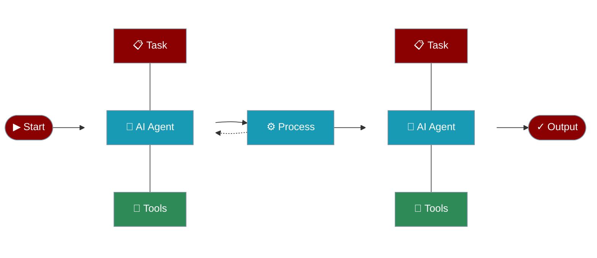

## AI Agents with Tools

Create AI agents that can use tools to interact with external systems and perform actions.

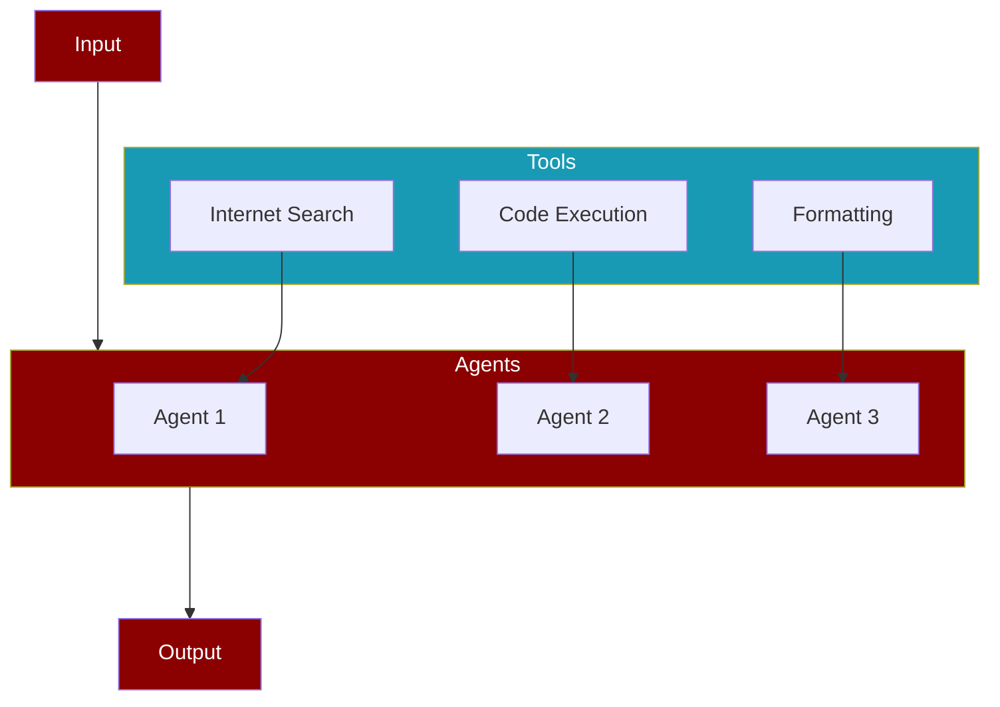

## AI Agents with Memory

Create AI agents with memory capabilities for maintaining context and information across tasks.

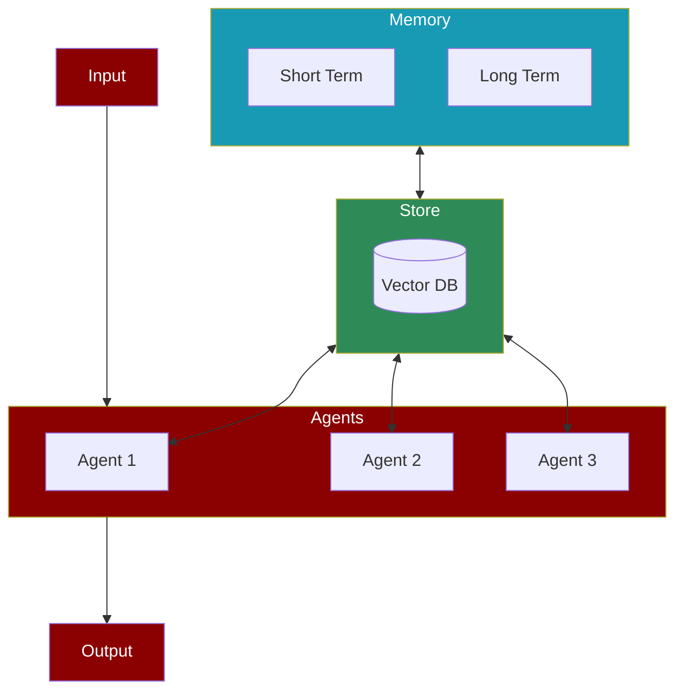

## AI Agents with Different Processes

### Sequential Process

The simplest form of task execution where tasks are performed one after another.

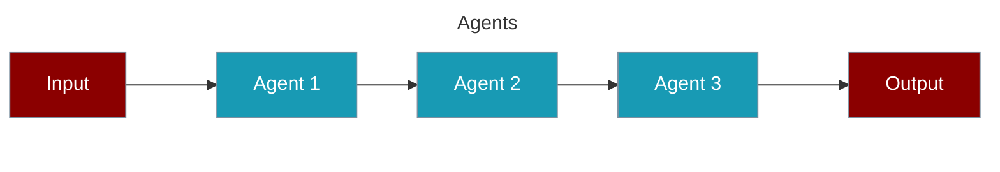

### Hierarchical Process

Uses a manager agent to coordinate task execution and agent assignments.

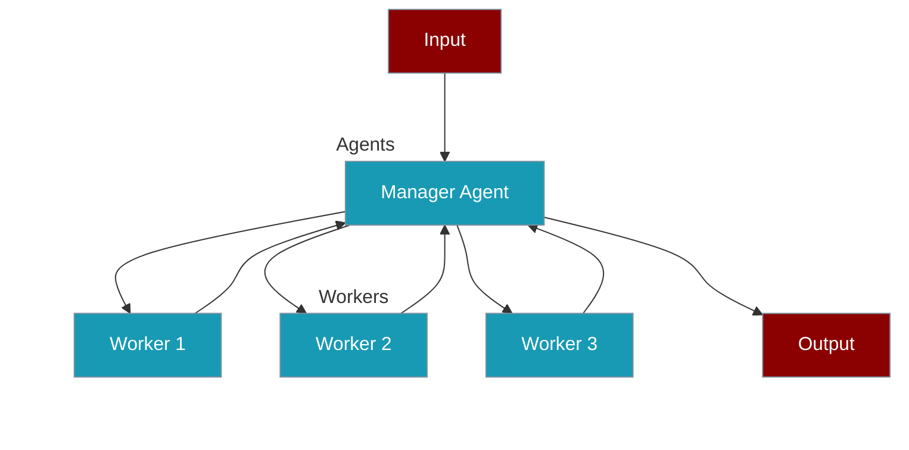

### Workflow Process

Advanced process type supporting complex task relationships and conditional execution.

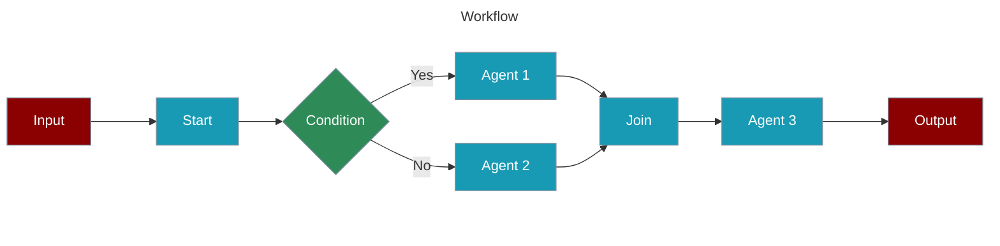

#### Agentic Routing Workflow

Create AI agents that can dynamically route tasks to specialized LLM instances.

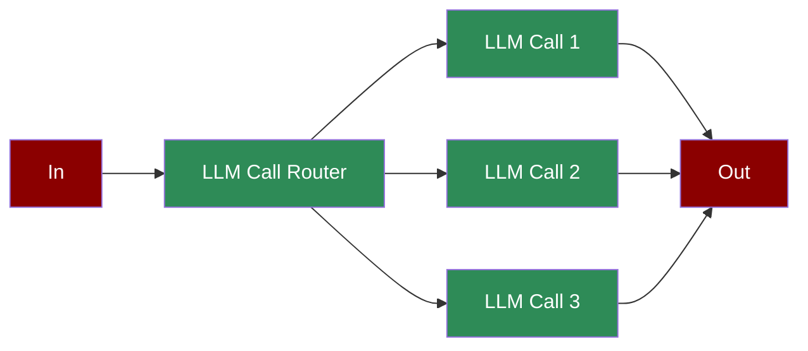

#### Agentic Orchestrator Worker

Create AI agents that orchestrate and distribute tasks among specialized workers.

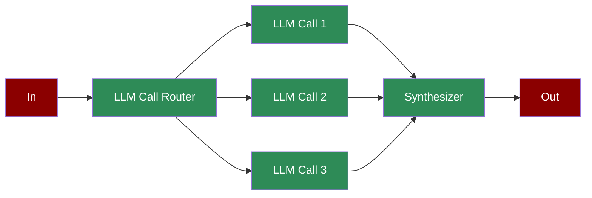

#### Agentic Autonomous Workflow

Create AI agents that can autonomously monitor, act, and adapt based on environment feedback.

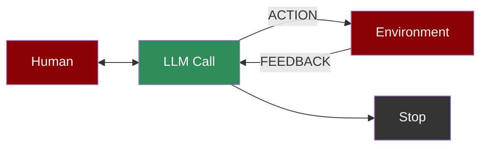

#### Agentic Parallelization

Create AI agents that can execute tasks in parallel for improved performance.

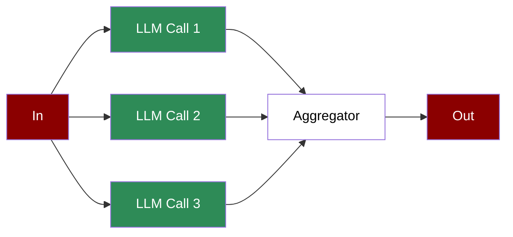

#### Agentic Prompt Chaining

Create AI agents with sequential prompt chaining for complex workflows.

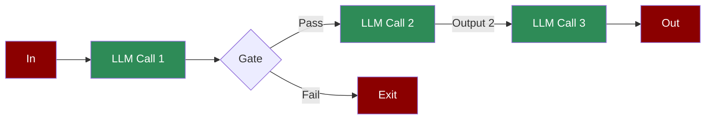

#### Agentic Evaluator Optimizer

Create AI agents that can generate and optimize solutions through iterative feedback.

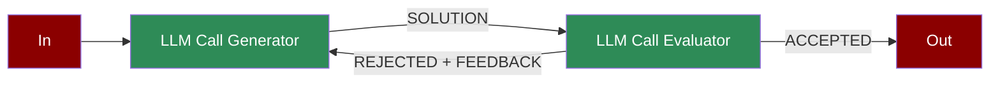

#### Repetitive Agents

Create AI agents that can efficiently handle repetitive tasks through automated loops.

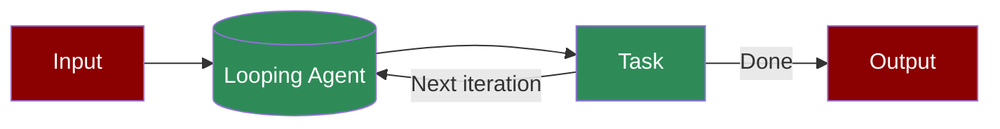
<br />
<div className="relative w-full aspect-video overflow-hidden rounded-lg shadow-lg mb-8">
  <iframe
    className="absolute top-0 left-0 w-full h-full border-0"
    src="https://www.youtube.com/embed/Fn1lQjC0GO0"
    title="YouTube video player"
    allow="accelerometer; autoplay; clipboard-write; encrypted-media; gyroscope; picture-in-picture"
    allowFullScreen
    style={{
      maxWidth: '100vw',
      margin: '0 auto'
    }}
  ></iframe>
</div>

## Integration Options

<AccordionGroup>
  <Accordion title="Ollama Integration">
    ```bash
    export OPENAI_BASE_URL=http://localhost:11434/v1
    ```
  </Accordion>
  <Accordion title="Groq Integration">
    ```bash
    export OPENAI_API_KEY=xxxxxxxxxxx
    export OPENAI_BASE_URL=https://api.groq.com/openai/v1
    ```
  </Accordion>
  <Accordion title="Logging Configuration">
    ```bash
    # Basic logging
    export LOGLEVEL=info
    
    # Advanced logging
    export LOGLEVEL=debug
    ```
  </Accordion>
</AccordionGroup>

## Use Cases

<CardGroup cols={2}>
  <Card title="Customer Service" icon="headset">
    Build intelligent support agents that can handle customer inquiries and resolve issues autonomously.
  </Card>
  <Card title="Data Analysis" icon="chart-line">
    Create agents that can process, analyze, and derive insights from complex datasets.
  </Card>
  <Card title="Content Creation" icon="pen-nib">
    Deploy agents that can generate, edit, and optimize content across various formats.
  </Card>
  <Card title="Process Automation" icon="gears">
    Automate complex workflows with intelligent agents that can coordinate and execute tasks.
  </Card>
</CardGroup>

## Praison AI Package Overall Features

<Frame caption="PraisonAI Features Overview">
  <div className="w-full max-w-4xl mx-auto">
    
    
  </div>
</Frame>

## Features

<CardGroup cols={3}>
  <Card title="Self-Reflection" icon="brain-circuit" href="/features/selfreflection">
    Agents that evaluate and improve their own responses for higher accuracy
  </Card>
  <Card title="Reasoning" icon="gears" href="/features/reasoning">
    Multi-step logical reasoning and autonomous problem solving
  </Card>
  <Card title="CrewAI Framework" icon="users-gear" href="/framework/crewai">
    Build collaborative AI teams with CrewAI integration
  </Card>
  <Card title="AutoGen Framework" icon="robot" href="/framework/autogen">
    Create autonomous agent networks using AutoGen
  </Card>
  <Card title="Multimodal Agents" icon="icons" href="/framework/multimodalagents">
    Work with agents that can process text, images, and other data types
  </Card>
  <Card title="Train" icon="graduation-cap" href="/train">
    Train and fine-tune your LLMs for specific tasks and domains. Then use it as an AI Agent.
  </Card>
</CardGroup>

## User Interfaces

<CardGroup cols={3}>
  <Card title="Multi Agents UI" icon="users" href="/ui/ui">
    Work with CrewAI or AutoGen multi-agent systems
  </Card>
  <Card title="Chat Interface" icon="comments" href="/ui/chat">
    Chat with 100+ LLMs using a single AI Agent
  </Card>
  <Card title="Code Interface" icon="code" href="/ui/code">
    Interact with your entire codebase
  </Card>
</CardGroup>

<Note>
  Welcome to PraisonAI - Your comprehensive solution for building and managing multi-agent LLM systems with self-reflection capabilities.
</Note>

<div style={{ display: 'flex', flexWrap: 'wrap', gap: '1rem' }}>
  <div className="hover:opacity-80 transition-opacity">
    
  </div>
  <div className="hover:opacity-80 transition-opacity">
    
  </div>
  <div className="hover:opacity-80 transition-opacity">
    
  </div>
  <div className="hover:opacity-80 transition-opacity">
    
  </div>
  <div className="hover:opacity-80 transition-opacity">
    
  </div>
</div>

## Video Tutorials

| Topic | Video |
|-------|--------|
| AI Agents with Self Reflection | [](https://www.youtube.com/watch?v=vLXobEN2Vc8) |
| AI Agents with Reasoning | [](https://www.youtube.com/watch?v=KNDVWGN3TpM) |
| Multimodal AI Agents | [](https://www.youtube.com/watch?v=hjAWmUT1qqY) |
| AI Agents Workflow | [](https://www.youtube.com/watch?v=yWTH44QPl2A) |
| Async AI Agents | [](https://www.youtube.com/watch?v=VhVQfgo00LE) |
| Mini AI Agents | [](https://www.youtube.com/watch?v=OkvYp5aAGSg) |
| AI Agents with Memory | [](https://www.youtube.com/watch?v=1hVfVxvPnnQ) |
| Repetitive Agents | [](https://www.youtube.com/watch?v=dAYGxsjDOPg) |
| Introduction | [](https://www.youtube.com/watch?v=Fn1lQjC0GO0) |
| Tools Overview | [](https://www.youtube.com/watch?v=XaQRgRpV7jo) |
| Custom Tools | [](https://www.youtube.com/watch?v=JSU2Rndh06c) |
| Firecrawl Integration | [](https://www.youtube.com/watch?v=UoqUDcLcOYo) |
| User Interface | [](https://www.youtube.com/watch?v=tg-ZjNl3OCg) |
| Crawl4AI Integration | [](https://www.youtube.com/watch?v=KAvuVUh0XU8) |
| Chat Interface | [](https://www.youtube.com/watch?v=sw3uDqn2h1Y) |
| Code Interface | [](https://www.youtube.com/watch?v=_5jQayO-MQY) |
| Mem0 Integration | [](https://www.youtube.com/watch?v=KIGSgRxf1cY) |
| Training | [](https://www.youtube.com/watch?v=aLawE8kwCrI) |
| Realtime Voice Interface | [](https://www.youtube.com/watch?v=frRHfevTCSw) |
| Call Interface | [](https://www.youtube.com/watch?v=m1cwrUG2iAk) |
