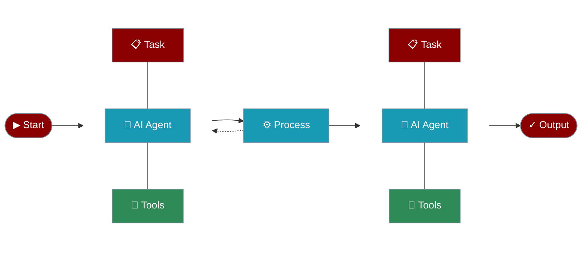

## What is PraisonAI?

PraisonAI is a powerful Multi-Agent Framework for building and deploying AI agents that can understand, reason, and execute complex tasks autonomously.
<CardGroup cols={1}>
  <Card title="Welcome to PraisonAI" icon="wand-magic-sparkles">
    Build powerful autonomous agents that understand, decide, and execute with unprecedented capability.
  </Card>
</CardGroup>

# Core Components
<br />

<br />
<CardGroup cols={2}>
  <Card title="Agents" icon="user-robot">
    Autonomous AI entities that can understand context and execute tasks
  </Card>
  <Card title="Tasks" icon="list-check">
    Units of work that agents can execute independently or collaboratively
  </Card>
  <Card title="Process" icon="diagram-project">
    Workflow management for coordinating agent activities
  </Card>
  <Card title="Tools" icon="toolbox">
    Extensible capabilities that agents can leverage
  </Card>
</CardGroup>

## Use Cases

<CardGroup cols={2}>
  <Card title="Customer Service" icon="headset">
    Build intelligent support agents that can handle customer inquiries and resolve issues autonomously.
  </Card>
  <Card title="Data Analysis" icon="chart-line">
    Create agents that can process, analyze, and derive insights from complex datasets.
  </Card>
  <Card title="Content Creation" icon="pen-nib">
    Deploy agents that can generate, edit, and optimize content across various formats.
  </Card>
  <Card title="Process Automation" icon="gears">
    Automate complex workflows with intelligent agents that can coordinate and execute tasks.
  </Card>
</CardGroup>

## Getting Started is Easy
<Tabs>
  <Tab title="Code">
    <Steps>
      <Step title="Install Package">
        Install the PraisonAI Agents package:
        ```bash
        pip install praisonaiagents
        ```
      </Step>

      <Step title="Set API Key">
        ```bash
        export OPENAI_API_KEY=your_openai_key
        ```
        Generate your OpenAI API key from [OpenAI](https://platform.openai.com/api-keys).
        Use other LLM providers like Ollama, Anthropic, Groq, Google, etc. Please refer to the [Models](/models) for more information.
      </Step>

      <Step title="Create Agents">
        Create `app.py`:
    <CodeGroup>
      ```python Single Agent
      from praisonaiagents import Agent, PraisonAIAgents

      # Create a simple agent
      summarise_agent = Agent(instructions="Summarise Photosynthesis")

      # Run the agent
      agents = PraisonAIAgents(agents=[summarise_agent])
      agents.start()
      ```

      ```python Multiple Agents
      from praisonaiagents import Agent, PraisonAIAgents

      # Create agents with specific roles
      diet_agent = Agent(
          instructions="Give me 5 healthy food recipes",
      )

      blog_agent = Agent(
          instructions="Write a blog post about the food recipes",
      )

      # Run multiple agents
      agents = PraisonAIAgents(agents=[diet_agent, blog_agent])
      agents.start()
      ```
    </CodeGroup>
      </Step>

      <Step title="Run Agents">
        Execute your script:
        ```bash
        python app.py
        ```

        You'll see:
        - Agent initialization
        - Task execution progress
        - Final results

        <Tip>
        You have successfully CreatedAI Agents and made them work for you!
        </Tip>
      </Step>
    </Steps>
  </Tab>
  <Tab title="No Code">
    <Steps>
      <Step title="Install Package">
        Install the No Code PraisonAI Package:
        ```bash
        pip install praisonaiagents
        ```
      </Step>

      <Step title="Set API Key">
        ```bash
        export OPENAI_API_KEY=your_openai_key
        ```
      </Step>

      <Step title="Create Config">
        Create `agents.yaml`:

    <CodeGroup>
      ```yaml Single Agent
      roles:
        summarise_agent:
          instructions: Summarise Photosynthesis
      ```

      ```yaml Multiple Agents
      roles:
        diet_agent:
          instructions: Give me 5 healthy food recipes
        blog_agent:
          instructions: Write a blog post about the food recipes
      ```
    </CodeGroup>

<Note>
You can automatically create `agents.yaml` using:
```bash
praisonai --init "your task description"
```
</Note>

      </Step>

      <Step title="Run Agents">
        Execute your config:
        ```bash
        praisonai agents.yaml
        ```
      </Step>
    </Steps>
  </Tab>
</Tabs>

## Key Features

<CardGroup cols={3}>
  <Card title="Autonomous Agents" icon="robot">
    Create intelligent agents that can:
    
    - Understand natural language instructions
    - Make decisions based on context
    - Execute complex tasks autonomously
  </Card>

  <Card title="Flexible Architecture" icon="cubes">
    Build with:
    
    - Modular components
    - Extensible tools
    - Customizable workflows
  </Card>

  <Card title="Advanced Capabilities" icon="wand-sparkles">
    Leverage:
    
    - Multi-agent collaboration
    - Memory and context management
    - Tool integration
  </Card>
</CardGroup>


  <Card title="Why Choose PraisonAI?" icon="stars">
    <CardGroup cols={2}>
## Developer First
Build with modern tools and frameworks you already love. Our SDK is designed to be intuitive and powerful.

## Production Ready
Enterprise-grade reliability with built-in security features and scalable architecture.

## Open Source
PraisonAI is open source and available on [GitHub](https://github.com/MervinPraison/PraisonAI).

## Low Code User Friendly
PraisonAI is designed to be easy to learn and use for non technical users.
    </CardGroup>
  </Card>

## Chat with One Agent

<Tabs>
<Tab title="Basic Agent">
<Steps>
  <Step title="Install PraisonAI">
    Get started with a simple pip install:
    ```bash
    pip install praisonaiagents
    ```
  </Step>
  <Step title="Initialize Your Agent">
    Create your first autonomous agent in just a few lines:
    ```python
    from praisonaiagents import Agent
    agent = Agent(instructions="Your are a helpful AI assistant")
    agent.chat("Write a movie script about a robot in Mars")
    ```
  </Step>
  <Step title="Build Amazing Things">
    Start building powerful AI applications with autonomous capabilities!
  </Step>
</Steps>
</Tab>

<Tab title="Agent with Tools">
<Steps>
  <Step title="Install PraisonAI">
    Get started with a simple pip install:
    ```bash
    pip install praisonaiagents duckduckgo_search
    ```
  </Step>
  <Step title="Initialize Your Agent">

    Create your first autonomous agent in just a few lines:
```python
from praisonaiagents import Agent, Tools
agent = Agent(instructions="Your are a helpful AI assistant", tools=[Tools.internet_search])
agent.chat("Write a movie script about a robot in Mars")
```
  </Step>
  <Step title="Build Amazing Things">
    Start building powerful AI applications with autonomous capabilities!
  </Step>
</Steps>
</Tab>
</Tabs>

## Next Steps

<CardGroup cols={2}>
  <Card
    title="Installation"
    icon="download"
    href="/code/installation"
  >
    Complete installation guide and setup instructions
  </Card>
  <Card
    title="Quick Start"
    icon="play"
    href="/code/quickstart"
  >
    Build your first AI agent in minutes
  </Card>
</CardGroup>

<Tip>
  Join our community on [Discord](https://www.youtube.com/redirect?event=channel_description&redir_token=QUFFLUhqbUpiZE00YlF1MjB1LVNIeTFxTnV6MWRRc18wZ3xBQ3Jtc0ttQVZ0aFJ4RXRDanlBQU1Vd3lHU3BBcml3bzhoek1pTmlkZkFkWjlNVDBpRkxZd1dTOWhPc20xbHJOb1NibmNYeTEydklJT0pZOVJFQW93MmJOQXU0WkJNVzNsd29SZ3FBNFVwMTFGNThNSHBWVUhjSQ&q=https%3A%2F%2Fdiscord.gg%2FnNZu5gGT59) to connect with other developers and get help!
</Tip> 