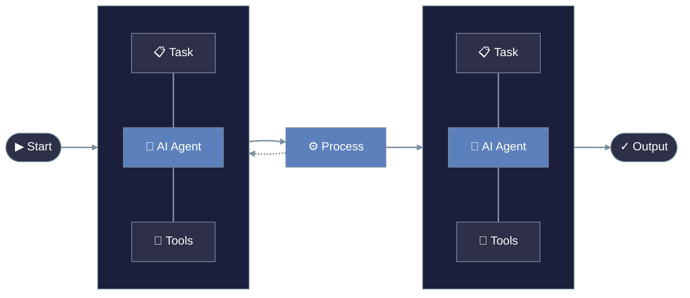

<Note>
  PraisonAI is a low-code, centralized framework designed to simplify the creation and orchestration of multi-agent systems for various LLM applications.
</Note>

# Welcome to PraisonAI

## Core Features

<CardGroup cols={2}>
  <Card title="Multi-Agent Systems" icon="users">
    Create and orchestrate sophisticated multi-agent systems with ease
  </Card>
  <Card title="Framework Integration" icon="puzzle-piece">
    Seamlessly integrates AutoGen and CrewAI capabilities
  </Card>
  <Card title="Low-Code Design" icon="code">
    Build complex AI systems with minimal coding required
  </Card>
  <Card title="Human-AI Interaction" icon="people-arrows">
    Enhanced support for human-agent collaboration
  </Card>
</CardGroup>

## Getting Started

<Steps>
  <Step title="Installation">
    Follow our [Installation Guide](./installation) to set up PraisonAI
  </Step>
  <Step title="Quick Overview">
    Check out our [TL;DR](./tldr) for a rapid introduction
  </Step>
  <Step title="First Project">
    Create your first project following our [Quick Start](./quickstart) guide
  </Step>
</Steps>

## Key Components

| Component | Description | Benefits |
|:----------|:------------|:---------|
| **UI Tools** | Intuitive interface components | Easy system interaction and monitoring |
| **Model Integration** | Support for various LLM models | Flexibility in AI model selection |
| **Tool System** | Extensible tool framework | Custom capability integration |
| **API Layer** | Comprehensive API access | Full programmatic control |

## Explore Further

<CardGroup cols={2}>
  <Card title="User Interface" icon="desktop" href="./ui/ui">
    Learn about our intuitive UI components
  </Card>
  <Card title="Models" icon="robot" href="./models">
    Explore supported AI models
  </Card>
  <Card title="Tools" icon="wrench" href="./tools">
    Discover available tools and integrations
  </Card>
  <Card title="API Reference" icon="code" href="./api-reference">
    Access comprehensive API documentation
  </Card>
</CardGroup>

<Tip>
  Start with our no-code interface to learn the basics, then transition to code-based development for more advanced use cases.
</Tip>
