## What is PraisonAI?

<Note>
  PraisonAI is a powerful Multi-Agent Framework for building and deploying AI agents that can understand, reason, and execute complex tasks autonomously.
</Note>
<CardGroup cols={1}>
  <Card title="Welcome to PraisonAI" icon="wand-magic-sparkles">
    Build powerful autonomous agents that understand, decide, and execute with unprecedented capability.
  </Card>
</CardGroup>

# Core Components

```mermaid
graph LR
    %% Define the main flow
    Start([▶ Start]) --> Agent1
    Agent1 --> Process[⚙ Process]
    Process --> Agent2
    Agent2 --> Output([✓ Output])
    Process -.-> Agent1
    
    %% Styling for main elements
    style Start fill:#2D3047,stroke:#7C90A0,color:#fff
    style Output fill:#2D3047,stroke:#7C90A0,color:#fff
    style Process fill:#5C80BC,stroke:#7C90A0,color:#fff
    
    %% Define subgraphs for agents and their tasks
    subgraph Agent1[" "]
        Task1[📋 Task]
        AgentIcon1[🤖 AI Agent]
        Tools1[🔧 Tools]
        
        Task1 --- AgentIcon1
        AgentIcon1 --- Tools1
        
        style Task1 fill:#2D3047,stroke:#7C90A0,color:#fff
        style AgentIcon1 fill:#5C80BC,stroke:#7C90A0,color:#fff
        style Tools1 fill:#2D3047,stroke:#7C90A0,color:#fff
    end
    
    subgraph Agent2[" "]
        Task2[📋 Task]
        AgentIcon2[🤖 AI Agent]
        Tools2[🔧 Tools]
        
        Task2 --- AgentIcon2
        AgentIcon2 --- Tools2
        
        style Task2 fill:#2D3047,stroke:#7C90A0,color:#fff
        style AgentIcon2 fill:#5C80BC,stroke:#7C90A0,color:#fff
        style Tools2 fill:#2D3047,stroke:#7C90A0,color:#fff
    end
    
    %% Style for agent containers
    style Agent1 fill:#1B1F3B,stroke:#7C90A0,color:#fff
    style Agent2 fill:#1B1F3B,stroke:#7C90A0,color:#fff
    
    %% Global styles
    classDef default fill:#2D3047,stroke:#7C90A0,color:#fff
    linkStyle default stroke:#7C90A0,stroke-width:2px
```

<br />

<br />
<CardGroup cols={2}>
  <Card title="Agents" icon="user-robot">
    Autonomous AI entities that can understand context and execute tasks
  </Card>
  <Card title="Tasks" icon="list-check">
    Units of work that agents can execute independently or collaboratively
  </Card>
  <Card title="Process" icon="diagram-project">
    Workflow management for coordinating agent activities
  </Card>
  <Card title="Tools" icon="toolbox">
    Extensible capabilities that agents can leverage
  </Card>
</CardGroup>

## Use Cases

<CardGroup cols={2}>
  <Card title="Customer Service" icon="headset">
    Build intelligent support agents that can handle customer inquiries and resolve issues autonomously.
  </Card>
  <Card title="Data Analysis" icon="chart-line">
    Create agents that can process, analyze, and derive insights from complex datasets.
  </Card>
  <Card title="Content Creation" icon="pen-nib">
    Deploy agents that can generate, edit, and optimize content across various formats.
  </Card>
  <Card title="Process Automation" icon="gears">
    Automate complex workflows with intelligent agents that can coordinate and execute tasks.
  </Card>
</CardGroup>

## Getting Started is Easy
<Tabs>
  <Tab title="Code">
<Steps>

  <Step title="Install PraisonAI">
    Install the core package:
    ```bash Terminal
    pip install praisonaiagents
    ```
  </Step>

  <Step title="Configure Environment">
    ```bash Terminal
    export OPENAI_API_KEY=your_openai_key
    ```
    Generate your OpenAI API key from [OpenAI](https://platform.openai.com/api-keys)
    Use other LLM providers like Ollama, Anthropic, Groq, Google, etc. Please refer to the [Models](/models) for more information.
  </Step>

  <Step title="Create Agent">
    Create `app.py`:
<CodeGroup>
  ```python Single Agent
  from praisonaiagents import Agent, Task, PraisonAIAgents

  # Create an agent
  researcher = Agent(
      name="Researcher",
      role="Senior Research Analyst",
      goal="Uncover cutting-edge developments in AI",
      backstory="You are an expert at a technology research group",
      verbose=True,
      llm="gpt-4o"
  )

  # Define a task
  task = Task(
      name="research_task",
      description="Analyze 2024's AI advancements",
      expected_output="A detailed report",
      agent=researcher
  )

  # Run the agents
  agents = PraisonAIAgents(
      agents=[researcher],
      tasks=[task],
      verbose=False
  )

  result = agents.start()
  ```

  ```python Multiple Agents
  from praisonaiagents import Agent, Task, PraisonAIAgents

  # Create multiple agents
  researcher = Agent(
      name="Researcher",
      role="Senior Research Analyst",
      goal="Uncover cutting-edge developments in AI",
      backstory="You are an expert at a technology research group",
      verbose=True,
      llm="gpt-4o",
      markdown=True
  )

  writer = Agent(
      name="Writer",
      role="Tech Content Strategist",
      goal="Craft compelling content on tech advancements",
      backstory="You are a content strategist",
      llm="gpt-4o",
      markdown=True
  )

  # Define multiple tasks
  task1 = Task(
      name="research_task",
      description="Analyze 2024's AI advancements",
      expected_output="A detailed report",
      agent=researcher
  )

  task2 = Task(
      name="writing_task",
      description="Create a blog post about AI advancements",
      expected_output="A blog post",
      agent=writer
  )

  # Run with hierarchical process
  agents = PraisonAIAgents(
      agents=[researcher, writer],
      tasks=[task1, task2],
      verbose=False,
      process="hierarchical",
      manager_llm="gpt-4o"
  )

  result = agents.start()
  ```
</CodeGroup>
  </Step>

  <Step title="Start Agents">
    Execute your script:
    ```bash Terminal
    python app.py
    ```
  </Step>
</Steps>
</Tab>

  <Tab title="No Code">
    <Steps>

        <Step title="Install PraisonAI">
            Install the PraisonAI package:
            ```bash
            pip install praisonai
            ```
        </Step>

        <Step title="Set API Key">
            Set your OpenAI API key as an environment variable in your terminal:
            ```bash Terminal
            export OPENAI_API_KEY=your_openai_key
            ```
            Generate your OpenAI API key from [OpenAI](https://platform.openai.com/api-keys)
            Use other LLM providers like Ollama, Anthropic, Groq, Google, etc. Please refer to the [Models](/models) for more information.
        </Step>

        <Step title="Start AutoAgents">    
            Run your AutoAgents:
            ```bash
            praisonai --auto "Create a movie script about a robot in Mars"
            ```
        </Step>
    </Steps>
  </Tab>
</Tabs>

## Key Features

<CardGroup cols={3}>
  <Card title="Autonomous Agents" icon="robot">
    Create intelligent agents that can:
    
    - Understand natural language instructions
    - Make decisions based on context
    - Execute complex tasks autonomously
  </Card>

  <Card title="Flexible Architecture" icon="cubes">
    Build with:
    
    - Modular components
    - Extensible tools
    - Customizable workflows
  </Card>

  <Card title="Advanced Capabilities" icon="wand-sparkles">
    Leverage:
    
    - Multi-agent collaboration
    - Memory and context management
    - Tool integration
  </Card>
</CardGroup>


  <Card title="Why Choose PraisonAI?" icon="stars">
    <CardGroup cols={2}>
## Developer First
Build with modern tools and frameworks you already love. Our SDK is designed to be intuitive and powerful.

## Production Ready
Enterprise-grade reliability with built-in security features and scalable architecture.

## Open Source
PraisonAI is open source and available on [GitHub](https://github.com/MervinPraison/PraisonAI).

## Low Code User Friendly
PraisonAI is designed to be easy to learn and use for non technical users.
    </CardGroup>
  </Card>

## Chat with One Agent

<Tabs>
<Tab title="Basic Agent">
<Steps>
  <Step title="Install PraisonAI">
    Get started with a simple pip install:
    ```bash
    pip install praisonaiagents
    ```
  </Step>
  <Step title="Initialize Your Agent">
    Create your first autonomous agent in just a few lines:
    ```python
    from praisonaiagents import Agent
    agent = Agent(instructions="Your are a helpful AI assistant")
    agent.chat("Write a movie script about a robot in Mars")
    ```
  </Step>
  <Step title="Build Amazing Things">
    Start building powerful AI applications with autonomous capabilities!
  </Step>
</Steps>
</Tab>

<Tab title="Agent with Tools">
<Steps>
  <Step title="Install PraisonAI">
    Get started with a simple pip install:
    ```bash
    pip install praisonaiagents duckduckgo_search
    ```
  </Step>
  <Step title="Initialize Your Agent">

    Create your first autonomous agent in just a few lines:
```python
from praisonaiagents import Agent, Tools
agent = Agent(instructions="Your are a helpful AI assistant", tools=[Tools.internet_search])
agent.chat("Write a movie script about a robot in Mars")
```
  </Step>
  <Step title="Build Amazing Things">
    Start building powerful AI applications with autonomous capabilities!
  </Step>
</Steps>
</Tab>
</Tabs>

## Next Steps

<CardGroup cols={2}>
  <Card
    title="Installation"
    icon="download"
    href="/code/installation"
  >
    Complete installation guide and setup instructions
  </Card>
  <Card
    title="Quick Start"
    icon="play"
    href="/code/quickstart"
  >
    Build your first AI agent in minutes
  </Card>
</CardGroup>

<Tip>
  Join our community on [Discord](https://www.youtube.com/redirect?event=channel_description&redir_token=QUFFLUhqbUpiZE00YlF1MjB1LVNIeTFxTnV6MWRRc18wZ3xBQ3Jtc0ttQVZ0aFJ4RXRDanlBQU1Vd3lHU3BBcml3bzhoek1pTmlkZkFkWjlNVDBpRkxZd1dTOWhPc20xbHJOb1NibmNYeTEydklJT0pZOVJFQW93MmJOQXU0WkJNVzNsd29SZ3FBNFVwMTFGNThNSHBWVUhjSQ&q=https%3A%2F%2Fdiscord.gg%2FnNZu5gGT59) to connect with other developers and get help!
</Tip> 