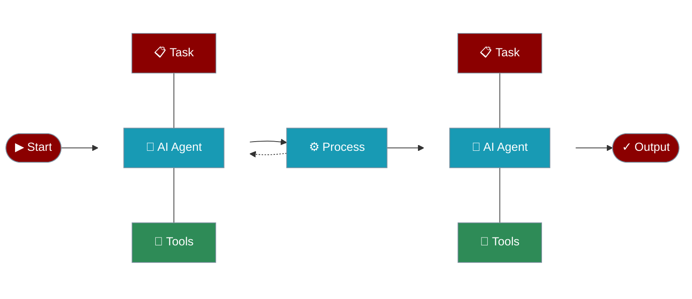

PraisonAI is a production-ready Multi AI Agents framework for JavaScript, designed to create AI Agents to automate and solve problems ranging from simple tasks to complex challenges. It provides a low-code solution to streamline the building and management of multi-agent LLM systems, emphasising simplicity, customisation, and effective human-agent collaboration.



## Installation

<CodeGroup>
```bash npm
npm install praisonai
```

```bash yarn
yarn add praisonai
```
</CodeGroup>

## Usage Examples

<AccordionGroup>
  <Accordion title="Single Agent Example" icon="user" defaultOpen>
    Create and run a single agent to perform a specific task:

```javascript
const { Agent } = require('praisonai');

// Create a simple science explainer agent
const agent = new Agent({
  instructions: "You are a science expert who explains complex phenomena in simple terms.",
  name: "ScienceExplainer",
  verbose: true
});

// Ask a question
agent.start("Why is the sky blue?")
  .then(response => {
    console.log('\nExplanation:');
    console.log(response);
  })
  .catch(error => console.error('Error:', error));

```
  </Accordion>

  <Accordion title="Multi-Agent Example" icon="users" defaultOpen>
    Create and run multiple agents working together:

```javascript
const { PraisonAIAgents, Agent } = require('praisonai');

// Create a story agent and a summary agent
const storyAgent = new Agent({
  instructions: "You are a creative storyteller. Create engaging stories.",
  name: "Storyteller"
});

const summaryAgent = new Agent({
  instructions: "You summarize stories into brief, engaging summaries.",
  name: "Summarizer"
});

// Create multi-agent system
const agents = new PraisonAIAgents({
  agents: [storyAgent, summaryAgent],
  tasks: [
    "Create a short story about a magical forest",
    "Summarize the story in 2 sentences"
  ]
});

// Run the agents
agents.start()
  .then(responses => {
    console.log('\nStory:');
    console.log(responses[0]);
    console.log('\nSummary:');
    console.log(responses[1]);
  })
  .catch(error => console.error('Error:', error));
```
  </Accordion>

  <Accordion title="Task-Based Agent Example" icon="list-check" defaultOpen>
    Create agents with specific tasks and dependencies:

```javascript
const { Agent, Task } = require('praisonai');

// Create a task-based agent
const agent = new Agent({
  name: "TaskMaster",
  role: "Assistant",
  goal: "Complete tasks efficiently",
  backstory: "You are an AI assistant that helps complete tasks step by step."
});

// Create a task with dependencies
const mainTask = new Task({
  name: "Write Blog Post",
  description: "Write a blog post about artificial intelligence",
  expected_output: "A complete blog post",
  dependencies: []
});

// Execute the task
agent.execute(mainTask)
  .then(response => {
    console.log('\nBlog Post:');
    console.log(response);
  })
  .catch(error => console.error('Error:', error));
```
  </Accordion>
</AccordionGroup>

## Running the Examples

<Steps>
  <Step title="Set Environment Variables">
    ```bash
    export OPENAI_API_KEY='your-api-key'
    ```
  </Step>

  <Step title="Create Example File">
    Create a new JavaScript file (e.g., `app.js`) with any of the above examples.
  </Step>

  <Step title="Run the Example">
    ```bash
    node app.js
    ```
  </Step>
</Steps>