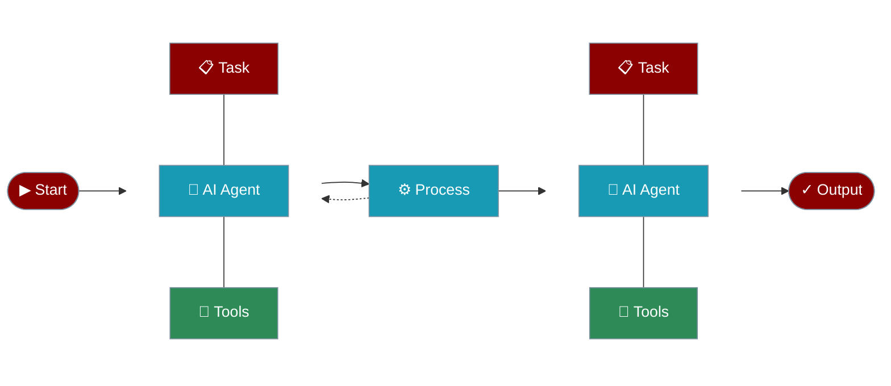

PraisonAI is a production-ready Multi AI Agents framework for Node.js, designed to create AI Agents to automate and solve problems ranging from simple tasks to complex challenges. It provides a low-code solution to streamline the building and management of multi-agent LLM systems, emphasising simplicity, customisation, and effective human-agent collaboration.



## Installation

<CodeGroup>
```bash npm
npm install praisonai
```

```bash yarn
yarn add praisonai
```
</CodeGroup>

## Usage Examples

<AccordionGroup>
  <Accordion title="Single Agent Example" icon="user" defaultOpen>
    Create and run a single agent to perform a specific task:

```typescript
import { Agent } from 'praisonai';

// Single agent example - Science Explainer
const agent = new Agent({ 
  instructions: `You are a science expert who explains complex phenomena in simple terms.
Provide clear, accurate, and easy-to-understand explanations.`,
  name: "ScienceExplainer",
  verbose: true
});

agent.start("Why is the sky blue?")
  .then(response => {
    console.log('\nExplanation:');
    console.log(response);
  })
  .catch(error => {
    console.error('Error:', error);
  });

```
  </Accordion>

  <Accordion title="Multi-Agent Example" icon="users" defaultOpen>
    Create and run multiple agents working together:

```typescript
import { Agent, PraisonAIAgents } from 'praisonai';

// Create story agent
const storyAgent = new Agent({
  instructions: "You are a storyteller. Write a very short story (2-3 sentences) about a given topic.",
  name: "StoryAgent",
  verbose: true
});

// Create summary agent
const summaryAgent = new Agent({
  instructions: "You are an editor. Create a one-sentence summary of the given story.",
  name: "SummaryAgent",
  verbose: true
});

// Create and start agents
const agents = new PraisonAIAgents({
  agents: [storyAgent, summaryAgent],
  tasks: [
    "Write a short story about a cat",
    "{previous_result}"  // This will be replaced with the story
  ],
  verbose: true
});

agents.start()
  .then(results => {
    console.log('\nStory:', results[0]);
    console.log('\nSummary:', results[1]);
  })
  .catch(error => console.error('Error:', error));
```
  </Accordion>

  <Accordion title="Task-Based Agent Example" icon="list-check" defaultOpen>
    Create agents with specific tasks and dependencies:

```typescript
import { Agent, PraisonAIAgents } from 'praisonai';

// Create recipe agent
const recipeAgent = new Agent({
  instructions: `You are a professional chef and nutritionist. Create 5 healthy food recipes that are both nutritious and delicious.
Each recipe should include:
1. Recipe name
2. List of ingredients with quantities
3. Step-by-step cooking instructions
4. Nutritional information
5. Health benefits

Format your response in markdown.`,
  name: "RecipeAgent",
  verbose: true
});

// Create blog agent
const blogAgent = new Agent({
  instructions: `You are a food and health blogger. Write an engaging blog post about the provided recipes.
The blog post should:
1. Have an engaging title
2. Include an introduction about healthy eating
3. Discuss each recipe and its unique health benefits
4. Include tips for meal planning and preparation
5. End with a conclusion encouraging healthy eating habits

Here are the recipes to write about:
{previous_result}

Format your response in markdown.`,
  name: "BlogAgent",
  verbose: true
});

// Create PraisonAIAgents instance with tasks
const agents = new PraisonAIAgents({
  agents: [recipeAgent, blogAgent],
  tasks: [
    "Create 5 healthy and delicious recipes",
    "Write a blog post about the recipes"
  ],
  verbose: true
});

// Start the agents
agents.start()
  .then(results => {
    console.log('\nFinal Results:');
    console.log('\nRecipe Task Results:');
    console.log(results[0]);
    console.log('\nBlog Task Results:');
    console.log(results[1]);
  })
  .catch(error => {
    console.error('Error:', error);
  });

```
  </Accordion>
</AccordionGroup>

## Running the Examples

<Steps>
  <Step title="Set Environment Variables">
    ```bash
    export OPENAI_API_KEY='your-api-key'
    ```
  </Step>

  <Step title="Create Example File">
    Create a new TypeScript file (e.g., `app.ts`) with any of the above examples.
  </Step>

  <Step title="Run the Example">
    ```bash
    npx ts-node app.ts
    ```
  </Step>
</Steps>