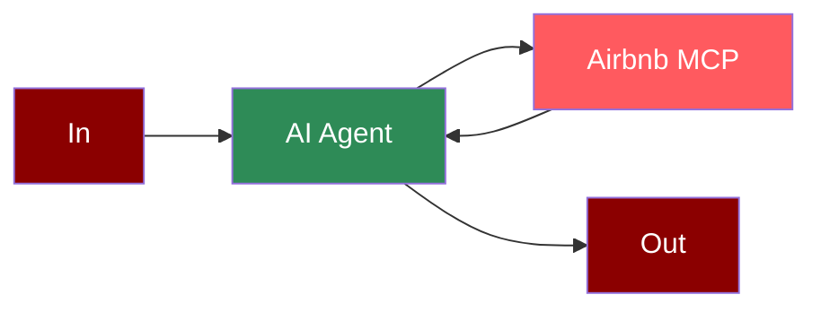

# Airbnb MCP Integration



## Quick Start

<Steps>
    <Step title="Set API Key">
        Set your OpenAI API key as an environment variable in your terminal:
        ```bash
        export OPENAI_API_KEY=your_openai_api_key_here
        ```
    </Step>

    <Step title="Create a file">
        Create a new file `airbnb_search.py` with the following code:
        ```python
        from praisonaiagents import Agent, MCP

        search_agent = Agent(
            instructions="""You help book apartments on Airbnb.""",
            llm="gpt-4o-mini",
            tools=MCP("npx -y @openbnb/mcp-server-airbnb --ignore-robots-txt")
        )

        search_agent.start("I want to book an apartment in Paris for 2 nights. 03/28 - 03/30 for 2 adults")
        ```
    </Step>

    <Step title="Install Dependencies">
        Make sure you have Node.js installed, as the MCP server requires it:
        ```bash
        pip install praisonaiagents
        ```
    </Step>

    <Step title="Run the Agent">
        Execute your script:
        ```bash
        python airbnb_search.py
        ```
    </Step>
</Steps>

<Note>
  **Requirements**
  - Python 3.10 or higher
  - Node.js installed on your system
  - OpenAI API key (for the agent's LLM)
</Note>

## Features

<CardGroup cols={2}>
  <Card title="Accommodation Search" icon="hotel">
    Search for accommodations on Airbnb with natural language queries.
  </Card>
  <Card title="MCP Integration" icon="plug">
    Seamless integration with Model Context Protocol.
  </Card>
  <Card title="Booking Details" icon="calendar">
    Specify dates, guests, and location preferences in natural language.
  </Card>
  <Card title="NPM Package" icon="js">
    Leverages the official Airbnb MCP server package.
  </Card>
</CardGroup>
