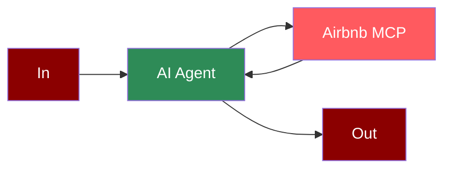

## Add Anthropic Tool to AI Agent



## Quick Start

<Steps>
    <Step title="Set API Key">
        Set your Anthropic API key as an environment variable in your terminal:
        ```zsh
        export ANTHROPIC_API_KEY=your_anthropic_api_key_here
        ```
    </Step>

    <Step title="Create a file">
        Create a new file `anthropic_airbnb.py` with the following code:
        ```python
        from praisonaiagents import Agent, MCP
        import os

        # Get API key from environment variable
        anthropic_api_key = os.environ.get("ANTHROPIC_API_KEY")

        search_agent = Agent(
            instructions="""You help book apartments on Airbnb.""",
            llm="anthropic/claude-3-7-sonnet-20250219",
            tools=MCP(
                command="npx",
                args=["-y", "@openbnb/mcp-server-airbnb", "--ignore-robots-txt"],
                env={"ANTHROPIC_API_KEY": anthropic_api_key}
            )
        )

        search_agent.start("MUST USE airbnb_search Tool to Search. Search for Apartments in Paris for 2 nights. 04/28 - 04/30 for 2 adults. All Your Preference")
        ```
    </Step>

    <Step title="Install Dependencies">
        Make sure you have Node.js installed, as the MCP server requires it:
        ```bash
        pip install "praisonaiagents[llm]"
        ```
    </Step>

    <Step title="Run the Agent">
        Execute your script:
        ```bash
        python anthropic_airbnb.py
        ```
    </Step>
</Steps>

<Note>
  **Requirements**
  - Python 3.10 or higher
  - Node.js installed on your system
  - Anthropic API key
</Note>

## Features

<CardGroup cols={2}>
  <Card title="Claude 3.7 Sonnet" icon="brain">
    Leverage Anthropic's powerful Claude 3.7 Sonnet model.
  </Card>
  <Card title="MCP Integration" icon="plug">
    Seamless integration with Model Context Protocol.
  </Card>
  <Card title="Airbnb Search" icon="hotel">
    Search for accommodations on Airbnb with natural language queries.
  </Card>
  <Card title="Environment Variables" icon="key">
    Securely pass API keys using environment variables.
  </Card>
</CardGroup>
