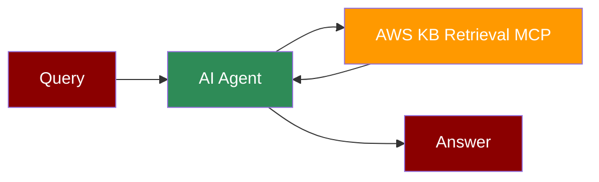

## Add AWS KB Retrieval Tool to AI Agent



## Quick Start

<Steps>
    <Step title="Install Dependencies">
        Make sure you have Node.js installed, as the MCP server requires it:
        ```bash
        pip install praisonaiagents mcp
        ```
    </Step>
    <Step title="Set API Keys">
        Set your AWS credentials as environment variables in your terminal:
        ```bash
        export AWS_ACCESS_KEY_ID=your_aws_access_key_id_here
        export AWS_SECRET_ACCESS_KEY=your_aws_secret_access_key_here
        export AWS_REGION=your_aws_region_here
        export OPENAI_API_KEY=your_openai_api_key_here
        ```
    </Step>

    <Step title="Create a file">
        Create a new file `aws_kb_retrieval.py` with the following code:
        ```python
        from praisonaiagents import Agent, MCP
        import os

        # Get AWS credentials from environment
        aws_access_key = os.getenv("AWS_ACCESS_KEY_ID")
        aws_secret_key = os.getenv("AWS_SECRET_ACCESS_KEY")
        aws_region = os.getenv("AWS_REGION")

        # Use a single string command with AWS KB Retrieval configuration
        aws_kb_agent = Agent(
            instructions="""You are a helpful assistant that can interact with AWS Knowledge Base.
            Use the available tools when relevant to retrieve and process AWS information.""",
            llm="gpt-4o-mini",
            tools=MCP("npx -y @modelcontextprotocol/server-aws-kb-retrieval",
                    env={
                        "AWS_ACCESS_KEY_ID": aws_access_key,
                        "AWS_SECRET_ACCESS_KEY": aws_secret_key,
                        "AWS_REGION": aws_region
                    })
        )

        aws_kb_agent.start("Search AWS documentation about EC2 instances")
        ```
    </Step>

    <Step title="Run the Agent">
        Execute your script:
        ```bash
        python aws_kb_retrieval.py
        ```
    </Step>
</Steps>

<Note>
  **Requirements**
  - Python 3.10 or higher
  - Node.js installed on your system
  - AWS credentials (Access Key ID, Secret Access Key, and Region)
  - OpenAI API key (for the agent's LLM)
</Note>
